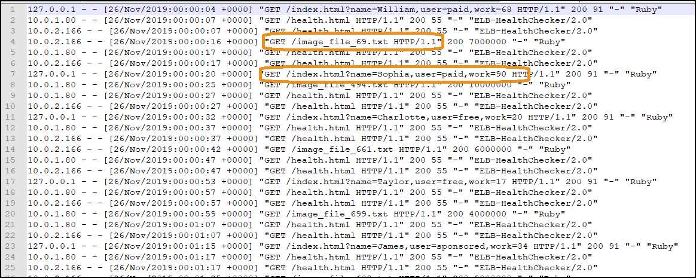
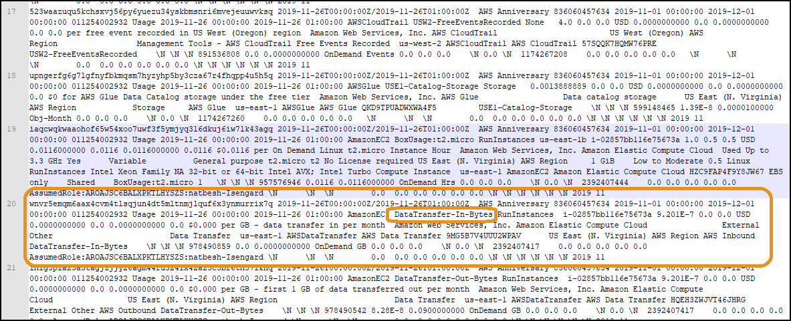

# Environment Setup

## Authors
- Nathan Besh, Cost Lead Well-Architected

## Feedback
If you wish to provide feedback on this lab, there is an error, or you want to make a suggestion, please email: costoptimization@amazon.com

## 1 View our application log files
Lets look at our application log files from our web servers.

1. Download the sample log file to your local PC and open it in a text editor:
    - [Step1_access_log](Code/Step1AccessLog)

2. You can see the various columns in the file and the many requests:
 

3. You can see the health checks:
 

4. Scroll through and look for application requests, there should be two different types of requests, for **index** and **image**:
 

6. Look at the components of the log lines, there are 9 components to each line:

    - Client IP
    - Ident
    - Auth
    - HTTP Timestamp*
    - Request
    - Response
    - Bytes
    - Referrer
    - Agent

7. When it is loaded for analysis we have created 11 comonents by splitting the **Timestamp** into **Date**, **Time** and **Timezone**:

    - Client IP
    - Ident
    - Auth
    - Date*
    - Time*
    - Timezone*
    - Request
    - Response
    - Bytes
    - Referrer
    - Agent

## 2 View our cost files
To measure efficiency we need to know the cost of the workload, so we will use the Cost and Usage Report.

1. Download the sample log file to your local PC and open it in a text editor:
    - [Step1CUR](Code/Step1CUR)

2. You can see the various columns in the file:
 

3. Scroll down and you can see the EC2 usage:
 

4. You can see the DataTransfer usage.
 

5. Open up a spreadsheet application and copy 30 lines into a spreadsheet, it is a CSV and the columns are separated by space characters:
 

6. Scroll across and see the different columns available

7. Scroll and see some of the data available

8. View the columns and some sample values here: https://docs.aws.amazon.com/awsaccountbilling/latest/aboutv2/enhanced-product-columns.html

