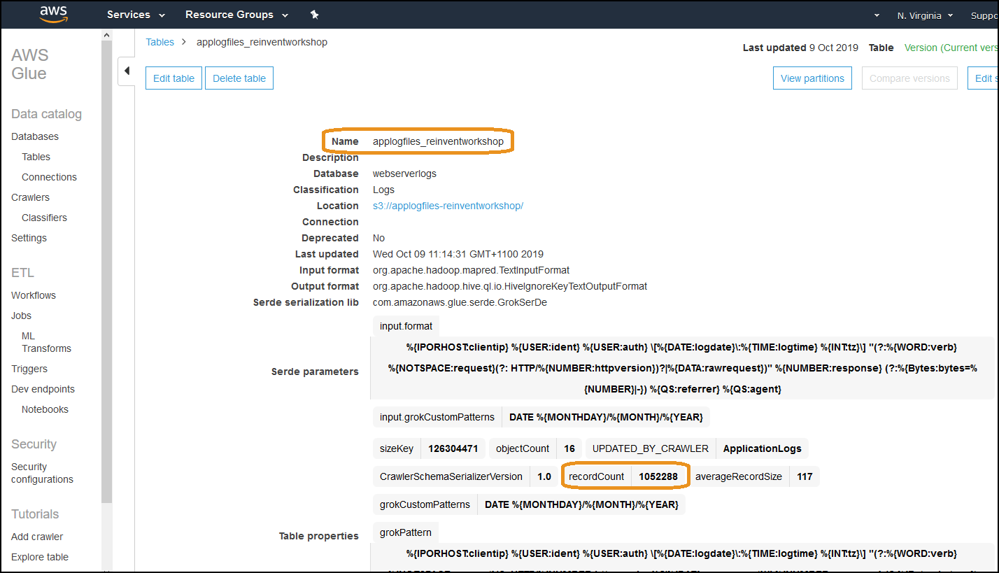
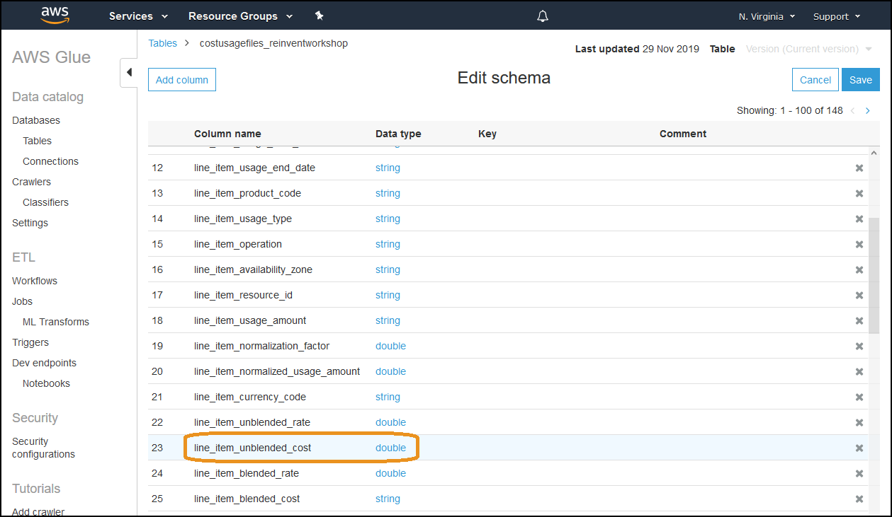
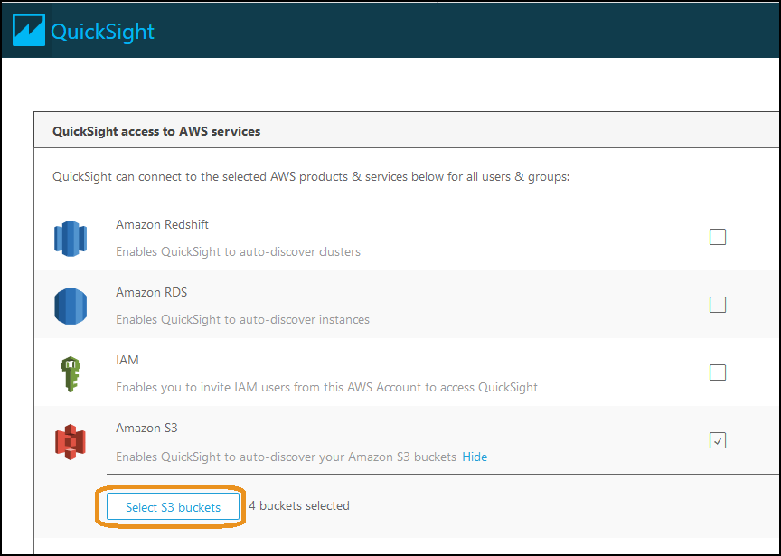
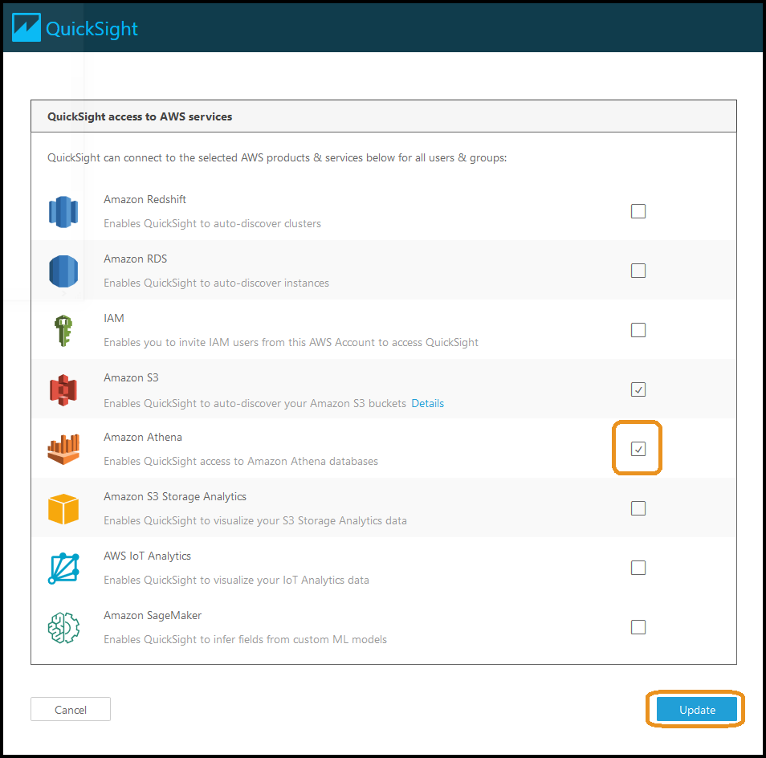
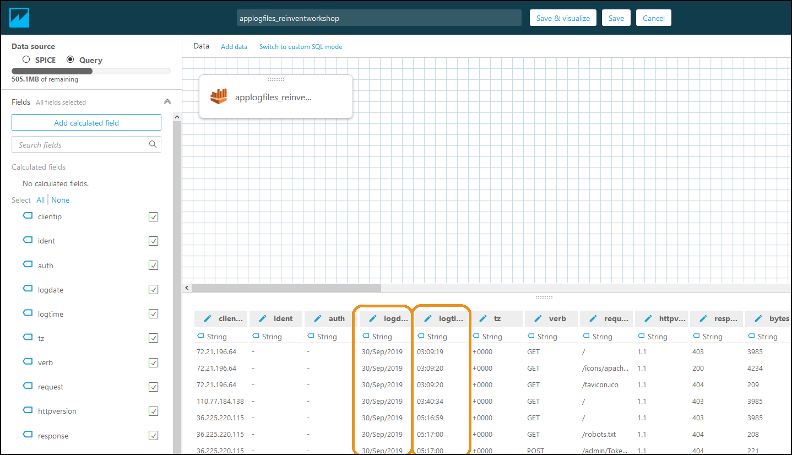
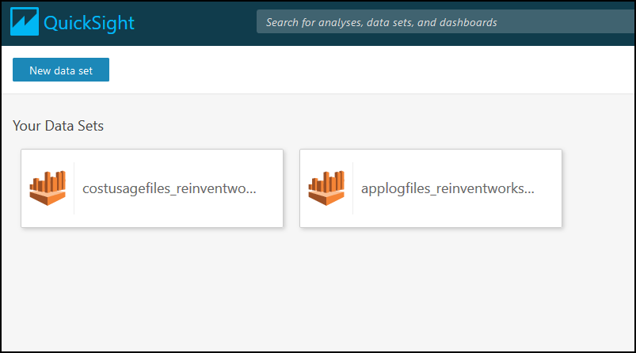

# Environment Setup

## Authors
- Nathan Besh, Cost Lead Well-Architected

## Feedback
If you wish to provide feedback on this lab, there is an error, or you want to make a suggestion, please email: costoptimization@amazon.com

## Goals
- Setup a data source for your application log files
- Setup a data source with your Cost and Usage Reports

# Table of Contents
1. [Setup Athena](#setup_data)
2. [Setup QuickSight](#setup_quicksight)
3. [Tear Down](#tear_down)
4. [Rate Lab](#rate_lab) 

## 1. Setup Athena data sources 
We need to setup our data sources in Athena. This will allow us to query and analyze our application log files and Cost and Usage reports. To set up our data sources, we place our application log files into S3 and then we use Glue to crawl them and create a database. Athena can then be used to run queries against them.

**Perform all steps in us-east-1 N. Virginia**

### 1.1 Copy application log files into S3
The first step is to get the application log files into Athena to be analyzed. For the provided files, you will copy the sample files to your S3 bucket.

**NOTE** Please read the steps carefully, as the naming is critical and any mistakes will require you to rebuild the lab.

1. Log into the AWS console as an IAM user with the required permissions:

2. Make sure you are in **us-east-1**

3. Create a new **S3 Bucket** - it can have any name

4. Create a folder in the new bucket with a name: **applogfiles_reinventworkshop**. **NOTE**: You MUST name the folder **applogfiles_reinventworkshop**

5. Upload the first application log file to the folder:
    - [Step1_access_log.gz](Code/Step1AccessLog.gz)

6. **READ ONLY** If you will be using your own application log files, systems manager can be used to run commands across your environment and copy files from multiple servers to S3. This lab will be re-written with full instructions post re:invent.
    

7. **READ ONLY** Depending on your operating system, you can execute some CLI on your application servers to copy the **application log files** to your **S3 bucket**. The following Linux sample will copy all access logs from the httpd log directory to the s3 bucket created above using the hostname to separate each servers logs:

        HOSTNAME=$(hostname)
        aws s3 cp --recursive /var/log/httpd/ s3://applogfiles-reinventworkshop/$HOSTNAME --exclude "*" --include "access_log*"

### 1.2 Crawl log files with Glue
We will create a database with the uploaded log file with AWS Glue. We show you how to write a custom classifier, so you can handle **any** log file format.

For our sample Apache web server log files, the in-bulit AWS Glue classifier **COMBINEDAPACHELOG** will recognize the timestamp as a single string. We will customize the interpreter to break this up into a date column, timestamp column and timezone column. This will demonstrate how to write a customer classifier. The reference for classifiers is here: https://docs.aws.amazon.com/glue/latest/dg/custom-classifier.html

A sample log file line is:

        10.0.1.80 - - [26/Nov/2019:00:00:07 +0000] "GET /health.html HTTP/1.1" 200 55 "-" "ELB-HealthChecker/2.0"

The columns would usually be:

    - Client IP
    - Ident
    - Auth
    - HTTP Timestamp*
    - Request
    - Response
    - Bytes
    - Referrer
    - Agent

We will make it build the following columns

    - Client IP
    - Ident
    - Auth
    - Date*
    - Time*
    - Timezone*
    - Request
    - Response
    - Bytes
    - Referrer
    - Agent

1. Go to the **Glue console** and click **Classifiers**:

2. Click **Add classifier** and create it with the following details:
    - Classifier name: WebLogs
    - Classifier type: Grok
    - Classification: Logs
    - Grok pattern: 

            %{IPORHOST:clientip} %{USER:ident} %{USER:auth} \[%{DATE:logdate}\:%{TIME:logtime} %{INT:tz}\] "(?:%{WORD:verb} %{NOTSPACE:request}(?: HTTP/%{NUMBER:httpversion})?|%{DATA:rawrequest})" %{NUMBER:response} (?:%{Bytes:bytes=%{NUMBER}|-}) %{QS:referrer} %{QS:agent}

    - Custom patterns:
 
            DATE %{MONTHDAY}/%{MONTH}/%{YEAR}

3. Click **Create**

    A classifier tells Glue how to interpret the log file lines, and how to create columns.  Each column is contained within %{}, and has the **pattern**, the **separator ':'**, and the **column name**.

    By using the custom classifier, we have separated the single column timestamp into 3 columns of logdate, logtime and tz. You can compare the custom classifier we wrote with the COMBINEDAPACHELOG classifier:

        Custom - %{IPORHOST:clientip} %{USER:ident} %{USER:auth} \[%{DATE:logdate}\:%{TIME:logtime} %{INT:tz}\] "(?:%{WORD:verb} %{NOTSPACE:request}(?: HTTP/%{NUMBER:httpversion})?|%{DATA:rawrequest})" %{NUMBER:response} (?:%{Bytes:bytes=%{NUMBER}|-}) %{QS:referrer} %{QS:agent}

        Builtin - %{IPORHOST:clientip} %{USER:ident} %{USER:auth} \[%{HTTPDATE:timestamp}\] "(?:%{WORD:verb} %{NOTSPACE:request}(?: HTTP/%{NUMBER:httpversion})?|%{DATA:rawrequest})" %{NUMBER:response} (?:%{Bytes:bytes=%{NUMBER}|-}) %{QS:referrer} %{QS:agent}

4. Next we will create a crawler to read the log files, and build a database. Click on **Crawlers** and click **Add crawler**:

5. **Crawler name** will be **ApplicationLogs**, expand **Tags, description..** next to our **Weblogs** classifier, cilck **Add**, then click **Next**:

6. **Crawler source type** is Data stores, click **Next**:

7. Click the **folder icon** and expand your bucket created above, select the radio button next to the **applogfiles_reinventworkshop**.  Do **NOT** select the actual file or bucket, select the folder.  Click **Select**.

8. Click **Next**

10. Select **No** to not add another data store, click **Next**

11. **Create an IAM role** named AWSGlueServiceRole-**WebLogs** and click **Next**:

12. **Frequency** will be run on demand, click **Next**

13. Click **Add database**, you MUST name it **webserverlogs**, click **Create**.

14. Click **Next**:

15. Click **Finish**

16. Select and **Run crawler**, this will create a single database and table with our log files, lets confirm. We need to **wait until** the crawler has **finished**, this will take 1-2 minutes. Click refresh to check if it has finished.

17. Click **Databases** on the left, and click on the database **webserverlogs**, you may need to click **refresh**:

18. Click **Tables in webserverlogs**, and click the table **applogfiles_reinventworkshop**

19. You can see the table is created, the **Name**, the **Location**, and the **recordCount** has a large number of records in it (the number may be different to the image below):

20. Scroll down and you can see the columns, and that they are all **string**. This will be a small hurdle for columns like bytes if you want to perform a function on it:

21. Go to the **Athena** service console, and select the **webserverlogs** database:

22. Click the **three dots** next to the table **applogfiles_reinventworkshop**, and click **Preview table**:

23. View the results which will show 10 lines of your log. Note how there are separate columns **logdate** **logtime** and **tz** that we created. The default classifier would have had a single column of text for the timestamp.

### 1.3 Create a database of your cost files
To measure efficiency we need to know the cost of the workload, so we will use the Cost and Usage Report.

If you are using your own Cost and Usage Reports, you will need to have them already configured and delivered as per this lab: https://wellarchitectedlabs.com/Cost/Cost_Fundamentals/100_1_AWS_Account_Setup/Lab_Guide.html#CUR

To use the files from this lab, follow the steps below:

1. Go to the S3 Console and create a folder named **costusagefiles-reinventworkshop** inside the bucket you created above. You MUST name the folder **costusagefiles_reinventworkshop**, this will make pasting the code faster.

2. Copy the sample file to your bucket:
    - [Step1CUR.gz](Code/Step1CUR.gz)

3. Go into the **Glue** console, and click **Add crawler**

4. Use the crawler name **CostUsage** and click **Next**
 
5. Select **Data stores** as the crawler source type, click **Next**

6. Click the **folder icon**, Select the **S3 folder** created above **costusagefiles-reinventworkshop** as the data store, make sure you dont select the bucket or file.

7. Click **Select**, then click **Next**

7. Select **No** do not another data store, click **Next**

8. Create an **IAM role** named AWSGlueServiceRole-**costusage**, click **Next**

9. Set the frequency to **run on demand**, click **Next**

10. Cilck **Add database**, it MUST be named **CostUsage**, and click **Create**

11. click **Next**

11. Review and click **Finish**

12. Run the crawler, then check the database was created and has records in it as per the previous step.

13. Go into **Databases**, select the **costusage** database, and then select the table **costusagefiles_reinventworkshop**.  Click **Edit Schema**:

14. Make sure the column **line_item_unblended_cost** has a data type of **double**, you may need to change it from string:

15. Also change or confirm the following columns:
    - line_item_usage_start_date: timestamp
    - line_item_usage_end_date: timestamp
    - line_item_usage_amount: double

16. Click on **save**, and confirm it is of the correct type.

## 2 Setup QuickSight - Optional for Visualization
We will use QuickSight as the analysis tool to visualize data. You could query the data in Athena and export the results to be used in a spreadsheet application for graphs, however QuickSight offers the advantages of being the specific tool for the job, and you can easily create additional data fields from existing fields for analysis.

### 2.1 Application files
We will create a data set from the application log files.

1. Go into **QuickSight**

2. Click on your user in the top right, and click **Manage QuickSight**:

3. Click on **Security and permissions** and click **Add or remove**:

4. Under **Amazon S3** click **Details**:

5. Click **Select S3 buckets**:

6. Select the buckets that have the application log files and the cost and usage files, click **Select buckets**

7. Select **Amazon Athena** and click **Update**:

8. From the **QuickSight home page**, click **Manage data**:

9. Click **New data set**:

10. Click **Athena**:

12. Enter the **Data source name** AppLogs and click **Create data source**

13. Select the **WebserverLogs Database** and the **Table** and click **Select**

14. Select **Directly query your data** and click **Edit/Preview data**

15. Make sure there is data in the bottom pane. You can see that we have separated our date and time and they are in separate columns with a string data type. What we will now do is create a custom datetime column with the right data type, this will show how you can build custom fields and types for your log files:

16. First we will combine the **logdate** and **logtime** columns into a single value separated by a space. Click **Add calculated field**: 

17. To do this we will use the **concat** function. Lets call the field **DateTime**, click **Create**:

        concat({logdate}, ' ', {logtime})

18. You will now see a new column with the correct text on the far right:

19. Next we will convert it into the right data type so we can treat it like a timestamp in QuickSight. We will use the **parseDate** function, on the output of the concatenate function. So we will put the concatenate function inside the parseDate function.  Select the **down arrow** next to the calculated field, and select **Edit DateTime**:

20. Change the formula to the one below. It puts the parseDate function around the concatenate and we specify the date format so that it is correctly recognized. Click **Apply changes**:

        parseDate(concat({logdate}, ' ', {logtime}), 'dd/MMM/yyyy HH:mm:ss')

           

21. You should see the column on the far right is now of the **Date** data type.  You can do this with any field, for example converting the bytes column to a number by removing and replacing the '-' character with a '0' using the if function.
  

22. Click **Save & visualize**:
       

### 2.1 Cost and Usage data

1. From the **QuickSight homepage**, click **Manage data**:
  

2. Click **New data set**

3. Select **Athena**

4. Name the datasource **WorkloadCost**, click **Create**

5. Select the **costusage database** and **table** that contains your cost data you setup in Glue, and click **Edit/Preview data**:

6. Verify you have cost data, click **Save**, and you will see your new data set next to the existing one:
  

## 3. Tear down
Complete the teardown only after you have finished all steps in this lab
1. Remove the Data Sets in QuickSIght
2. Delete cost and application log databases in Glue
3. Delete S3 buckets containing the application and CUR files
4. Delete the IAM roles that were created to allow Glue access to S3
 
 

