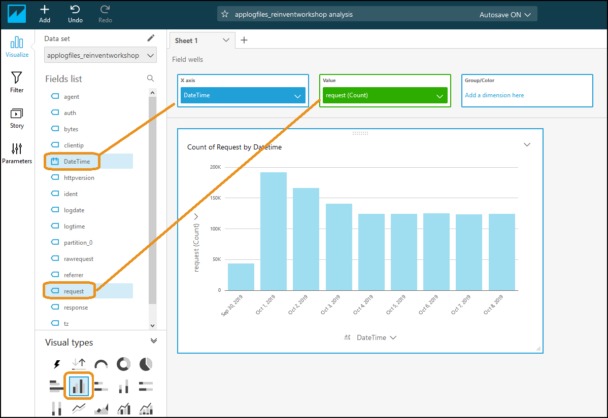
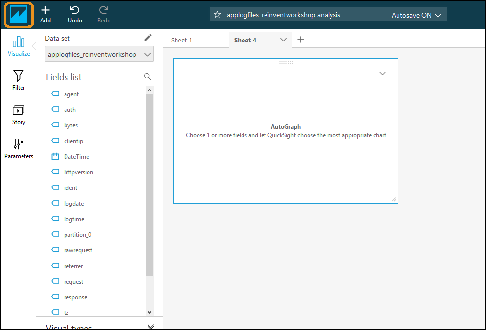
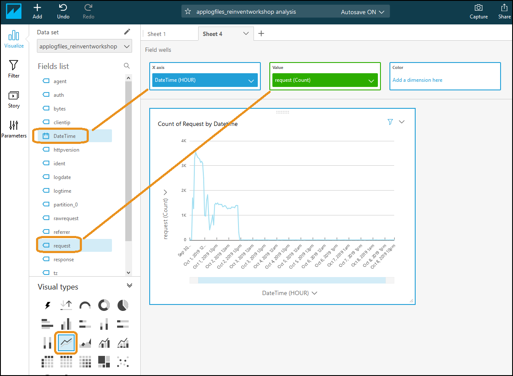
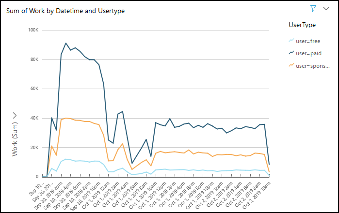
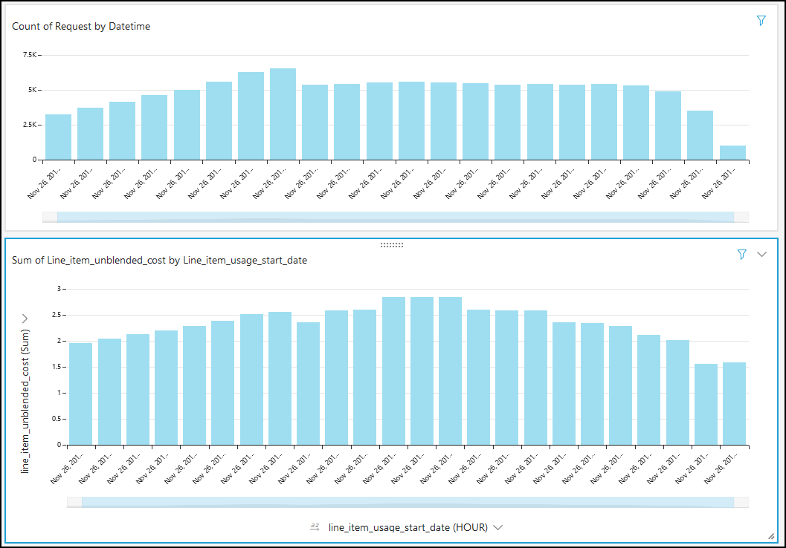
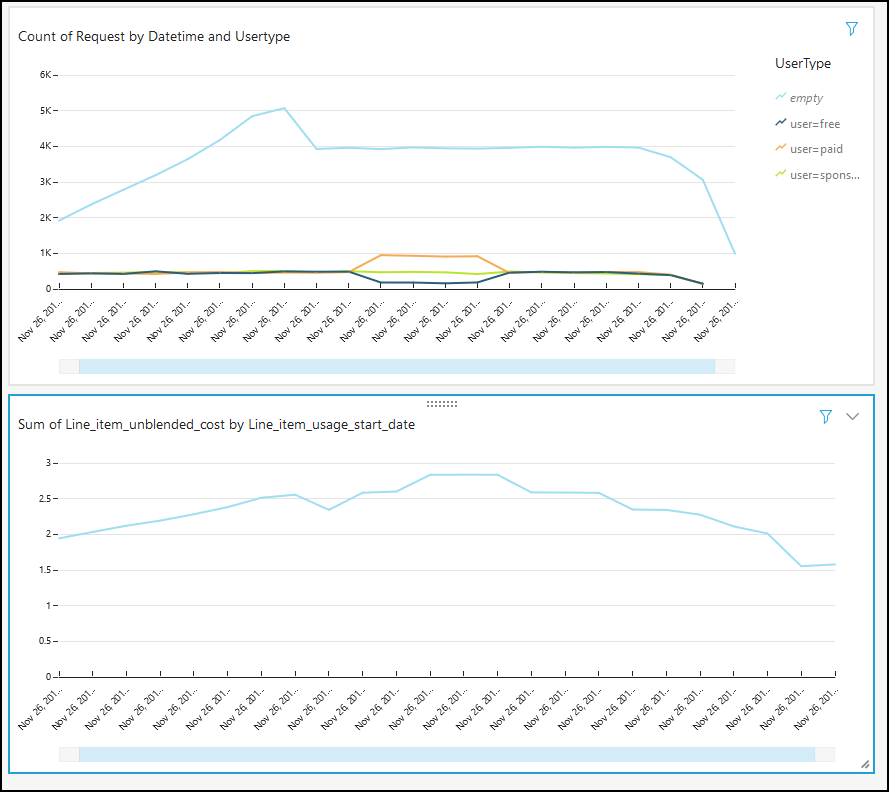

# Baseline Environment

## Authors
- Nathan Besh, Cost Lead Well-Architected

## Feedback
If you wish to provide feedback on this lab, there is an error, or you want to make a suggestion, please email: costoptimization@amazon.com

## Goals
- Understand and measure your workload demand
- Understand and measure your workload cost
- Understand and measure your workload efficiency

# Table of Contents
1. [Workload Demand and Cost](#workload_demand_cost)
2. [Workload Demand Visualization](#workload_demand)

## 1 Workload Demand and Cost
We will now go deeper into the workload demand and cost, and discover exactly what comprises the demand and cost of the workload. For this we will use SQL queries in Athena against our cost database and a spreadsheet application.

**NOTE**: You may need to change the name of the database and table in the SQL code from **webserverlogs.applogfiles_reinventworkshop** to your database name and table name if you didnt use the correct folder names, do this for all pasted code.

### 1.1 Workload demand components

1. Go into the Athena console

2. Select the **webserverlogs** database, which should have 1 table **applogfiles..**

3. Run the following query to return all the columns, with 10 rows of data from the application logs. 

    **Note** you may need to change the name of the database and table below webserverlogs.applogfiles_reinventworkshop**:

        SELECT * FROM "webserverlogs"."applogfiles_reinventworkshop" limit 10;

4. Review the data and look at the columns and sample data available in your log file.

5. We will now look at the most popular requests by size, run the following query. Inside the query we convert the column **bytes** from a string into a number, which we then divide by 1048576 to get MBytes instead of bytes:

        select distinct request, verb, response, (sum(cast(bytes as bigint)))/1048576 as Mbytes, count(*) as count FROM "webserverlogs"."applogfiles_reinventworkshop" 
        where bytes not like '-'
        group by request, verb, response
        order by Mbytes desc
        limit 100

6. Invalid requests still take resources from your systems, lets look at the number of non-successful (non 200) responses per day:

        select date_parse(logdate, '%d/%b/%Y') as date, count(*) as count FROM "webserverlogs"."applogfiles_reinventworkshop" 
        where response not like '200'
        group by logdate
        order by logdate

For your workload, review the different types of requests - both successful and not successful, and the available fields of data. This should help identify key items within the log file to analyze and measure the true demand on your workload.

### 2.2 Workload cost components

1. Select the **costusage** database, and run the following query to view all the columns:

        SELECT * FROM "costusage"."costusagefiles_reinventworkshop" limit 10;

2. View the columns available (there are > 100), most important are typically columns starting with **line_item** and **resource_tags**.

3. For a quick listing and description of your costs, the following statement is useful as a starting point:

        SELECT line_item_line_item_description, sum(line_item_unblended_cost) as cost FROM "costusage"."costusagefiles_reinventworkshop" 
        where resource_tags_user_application like 'ordering'
        group by line_item_line_item_description
        order by cost desc

4. Lets add some more columns to help identify what the main components of cost are, run the following statement:

        SELECT line_item_product_code, line_item_usage_type, line_item_operation, line_item_line_item_description, sum(line_item_unblended_cost) as cost  FROM "costusage"."costusagefiles_reinventworkshop" 
        where resource_tags_user_application like 'ordering'
        group by line_item_product_code, line_item_usage_type, line_item_operation, line_item_line_item_description
        order by cost desc

For your workload, review the different columns and results to see what makes up its cost. This will also indicate where you should look for savings in your cost optimization cycles.

### 2.3 Efficiency
We have looked at our workload demand, and our workload costs. Lets combine the two to create a workload efficiency metric. As we saw in the QuickSight graphs, the demand changed over time and the cost changed also. This means our efficiency may change over time also. We will start with a very high level and simple metric, and then drill down a few steps. 

1. Go into the Athena console

2. Select the **webserverlogs** database, which should have 1 table **applogfiles..**

3. Run the following query to return the total number of lines in our log file, which is our total demand:

        SELECT  count(*) FROM "webserverlogs"."applogfiles_reinventworkshop" 

4. Copy the results into a spreadsheet application and label it **Total workload demand**

5. Run the following queries to get the total successful responses, and valid successful responses, record these also:

        SELECT  count(*) FROM "webserverlogs"."applogfiles_reinventworkshop" 
        where response like '200' and (request like '%index%' or request like '%image_file%')

5. We will now get the successful and valid responses by hour with the query below. Note the use of **date_parse** to turn the string into an actual date we can work with:

        SELECT date(date_parse(logdate, '%d/%b/%Y')) as date, hour(date_parse(logtime, '%H:%i:%s')) as hour, count(*) as requests FROM "webserverlogs"."applogfiles_reinventworkshop" 
        where response like '200' and (request like '%index%' or request like '%image_file%')
        group by date_parse(logdate, '%d/%b/%Y'), hour(date_parse(logtime, '%H:%i:%s'))
        order by date, hour

6. Copy the results into the same spreadsheet.

7. Now lets get the workload cost that corresponds to the demand. Select the **costusage** database, which should have a table **costusagefiles_...**

8. Get the total cost for the workload with the following statement, and put it into the spreadsheet next to the demand:

        SELECT sum(line_item_unblended_cost)  FROM "costusage"."costusagefiles_reinventworkshop" 
        where resource_tags_user_application like 'ordering'

9. Execute the following statement to get the cost by hour and put it into the spreadsheet:

        SELECT line_item_usage_start_date as date, sum(line_item_unblended_cost) as cost FROM "costusage"."costusagefiles_reinventworkshop" 
        where resource_tags_user_application like 'ordering'
        group by line_item_usage_start_date
        order by date asc

10. In the spreadsheet, **calculate the efficiency** by **dividing the requests by the cost**. This will give you the number of outcomes per dollar spent. Notice the difference when you compare total vs successful vs valid. Also notice any variation of efficiency throughout the day.

  

You can see from the spreadsheet that the workload does:

    - 4,244.23 total requests per dollar, overall
    - 1,924.57 successful customer requests per dollar, overall
    - from 491 to 2555 successful customer requests per dollar, throughout the day

## 2. Workload Demand Visualization
We have our workload application logs ready to analyze and visualize. This step will be to visualize the workload demand and understand how it is used.

### 2.2 Demand visualization - Requests per hour
Our application log data is setup as a data source, so lets create a visualization. As our billing data is hourly, we will create an hourly demand graph showing the requests per hour of the workload.

Log into QuickSight and open the **applogfiles visualization** you created in Step1, or create a **New analysis** from the Application log files data set. 

1. In **Visual types**, select the **vertical bar** chart, and drag **DateTime** and **request** to the field wells as shown:
       

2. Change the aggregation to **hourly**:
       

3. You now have a graph of all the requests over time, by hour. This shows your workload demand

4. Its a webserver on the internet, so there's going to be lots of invalid requests (non-200 status), there could be lots of messages in your log files that will also need to be filtered out. Lets filter them out so that we're only looking at valid requests to our workload. Click on **Filter**, click **Create one** for **response** and use a **Filter list** to select only **200**. Click **Apply**:
     

5. Again, there could be a lot of successful requests & other log messages you want to filter out. So we'll look for a specific string, which in our case is a specific request string, as something that for this workload signifies a successful customer outcome as opposed to all the other log messages.

6. We will create another filter on the **request** field, both a **Filter type** of **Custom filter**, that **contains** the word **index.html** or **contains** the word **image_file**. This will look for any request that has these words in it:
     

6. You now have the profile of the valid and successful customer outcomes of your workload:
     

This shows you the demand that is on your workload, it shows you how many requests were made and when these requests were made.

### 2.3 Categorize requests
Your workload may do different things, there could be different requests that consume different amounts of resources - so you would like to treat them differently. In this section we will look for specific requests and categorize them out.

1. When you use your own application log files, find something that can be used to create different categories of requests. Is it in the request string? is it the source or destination of the request?  In our sample logfile it is inside the request string. A sample request string is:

                /index.html?name=Isabella,user=sponsored,work=26

    You can see there is **user=sponsored**, for this sample workload we have **free**, **sponsored** and **paid** user types.

2. Add a new sheet, this will help to contrast the graphs and find the best visualization for your workload. Click the **+** next to the current sheet:
     

3. We will create another calculated field, this can be done in the visualization or in the data source (like we did previously). When you do it in the data source you get sample data - so you can see if the formula is correct, and its then available to all visualizations.  Click the **home icon** to go to the QuickSight homepage:
     

4. Click **Manage data** in the top right and select your Dataset.

5. Choose the **applogfiles** data set, and click **Edit data set**

6. We will create a calculated field **UserType** with the formula below. It will split the **request** string by the delimeters and extract the **UserType** field. Create the custom field and click **Create**:

        split(request, ',', 2)
        
7. Click **save** at the top

8. Go back into the visualization on **sheet2** and hit your browser refresh, the new field will appear:
     

9. Create a line chart of requests, **x-axis** DateTime with **hourly aggregation**, **Value** request(count)
     

10. Setup the **filters** on **response** include only 200, and **request** containing index.html and image_file as per the previous step.

11. Now drag **UserType** to the **Color** field well:
     

12. You now have a visual of your requests by different categories. In our example there is an "empty" usertype with a lot of usage, and the others are similar except for the middle of the middle of the day - where paid users are much more than free users:
  

You now have more insight into your workload, as you now know the different types of requests that come into your workload, and how they vary over time. 

### 2.4 Quantify requests
In your application log files, you may be able to take a numerical value from inside the log file, or assign a numerical value depending on the log line contents. These can then be used to perform a calculation on, which can indicate the amount of work or resource consumption for the request.

1. When using your logs, you will need to find how different types or categories of requests can be measured in terms of resource consumption. Look to find what is in that request that indicates more resource consumption. In our sample log file it is inside the request string. A sample request string is:

        /index.php?name=Isabella,user=sponsored,work=26

    You can see there is text **work=26** which has a number, this corresponds to the amount of resources it consumes, so we will use that in this example.

2. We will add a calculated field which contains the number, we can then sum the numbers together across requests to find the total work. You can also use if statements if you want to assign values to text: if a field contains text, then assign a number.

3. Go back to the **data source** and add a calculated field **Work** with the formula:

        parseInt(split(request, '=', 4))
  

4. Save the changes to the data source

5. Go back into the visualization, refresh your browser and **Add a new sheet**

6. Create a **line chart** with **x-axis** as DateTime with **hourly aggregation**, the **Sum of Work** as the value. Make sure you create the response and request filters:
  

7. Now add the **UserType** as the **Color**:
  

8. You now have a much clearer picture as to how much resources are being consumed by the different categories of requests to your workload:
  

Compare the graphs on the first, second and third sheets.  You can see that by including additional small amounts of information or focusing on certain parts of information in your analysis you can get a very different outcome. 

### 2.5 Add the workload cost visualizations
We know the requests that are being made to the workload, we will now add the cost of the workload to the analysis. This will allow us to understand the workload cost given its output.

We will take a simple approach and put graphs of cost next to the graphs of the application demand. 

1. Go back to the visualizations, select the **first sheet**, and click the **edit icon** next to **Data set**:
  

2. Click **Add data set**

3. Select the cost data set you just created, click **Select**:
  

4. Change the dataset, click the **down arrow** and select the **CUR** data set:
  

5. Click **Add** and select **Add visual**:
  

6. Create a **Vertical Bar Chart** with **line_item_usage_start_date** **aggregated by the hour** on the **x-axis**, and the sum of **line_item_unblended_cost** in the value field.
  

7. To ensure we only have costs for our workload, we filter on a tag that we've assigned to all our resources. Create a Filter for the graph, create a filter on **resource_tags_user_application**, a **Custom filter** that equals **ordering**
 
8. You can now see how the cost of the workload in comparison to the workload demand in the chart. We can see some correlation between request count and cost:

9. Create the corresponding graphs on the other two sheets. On each sheet, select the **data set**, then **Add a visual**, and then populate the field wells. Make sure you create the filter for **resource_tags_user_application**.

10. The visualization categorized by **UserType**, shows correlations depending on the user type:

11. There is also correlation between work and cost:
  

Viewing the images above, you can see the correlation between the usage level, the usage types and cost. There may be a time offset of 1hr depending on how the costs and usage are grouped.

