# Baseline Environment

## Authors
- Nathan Besh, Cost Lead Well-Architected

## Feedback
If you wish to provide feedback on this lab, there is an error, or you want to make a suggestion, please email: costoptimization@amazon.com

## Goals
- Understand and measure your workload demand
- Understand and measure your workload cost
- Understand and measure your workload efficiency

# Table of Contents
1. [Workload Demand and Cost](#workload_demand_cost)
2. [Workload Demand Visualization](#workload_demand)

## 1 Workload Demand and Cost
We will now go deeper into the workload demand and cost, and discover exactly what comprises the demand and cost of the workload. For this we will use SQL queries in Athena against our cost database and a spreadsheet application.

**Make sure you perform all actions in US-EAST-1**

### 1.1 Workload demand components

1. Log into the console here: https://costopt.signin.aws.amazon.com/console
 
2. Your username is **workshop** followed by your unique number, so it will be **workshop1** or **workshop99**:

3. Enter the password and click **Sign In**
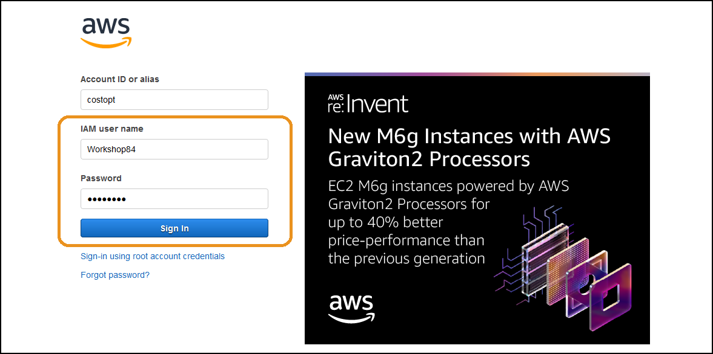  

**Make sure you are in the US-EAST-1 region**

4. Go into the Athena console:
  

5. Click the **arrow**, select the **webserverlogs** database:
 

4. You will see a table **applogfiles_reinventworkshop**:
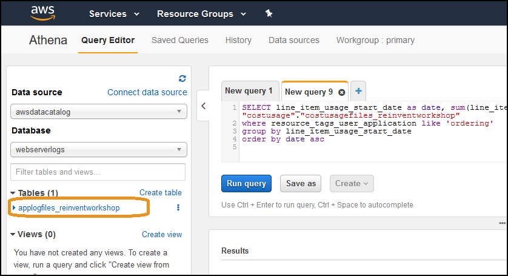 

3. Copy and paste the following query into the query window, and click **Run query**:

        SELECT * FROM "webserverlogs"."applogfiles_reinventworkshop" limit 10;

    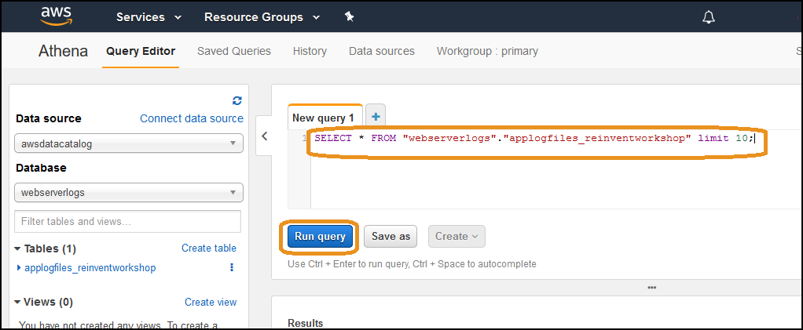 
    
4. Review the data and look at the columns and sample data available in your log file.
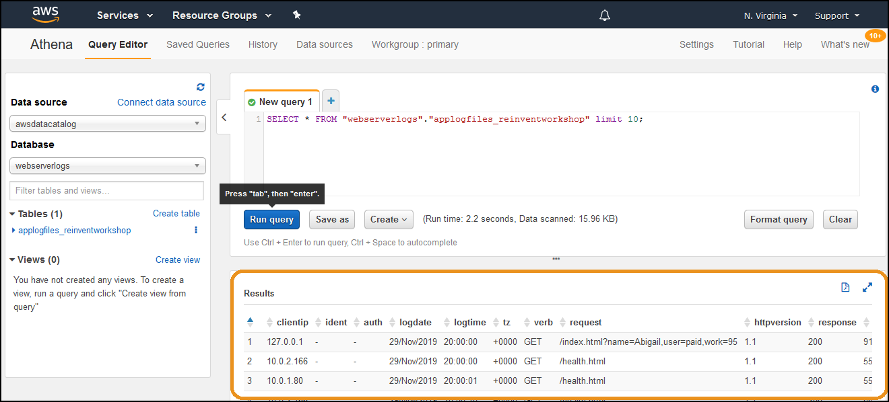 

5. We will now look at the most popular requests by size. Inside the query we convert the column **bytes** from a string into a number, which we then divide by 1048576 to get MBytes instead of bytes. Run the following query:

        select distinct request, verb, response, (sum(cast(bytes as bigint)))/1048576 as Mbytes, count(*) as count FROM "webserverlogs"."applogfiles_reinventworkshop" 
        where bytes not like '-'
        group by request, verb, response
        order by Mbytes desc
        limit 100

6. Errors or invalid requests still take resources from your systems, lets look at the number of non-successful (non 200) responses per day:

        select date_parse(logdate, '%d/%b/%Y') as date, count(*) as count FROM "webserverlogs"."applogfiles_reinventworkshop" 
        where response not like '200'
        group by logdate
        order by logdate

Use this technique for your workload, view the data in your columns and see what makes up the requests to your workload, and what important lines are in your application log files. This should help identify key items within the log file to analyze and measure the true demand on your workload.

### 2.2 Workload cost components

1. Select the **costusage** database:
 

2. Run the following query to view all the columns:

        SELECT * FROM "costusage"."costusagefiles_reinventworkshop" limit 10;

     
    
2. View the columns available (there are > 100), most important are typically columns starting with **line_item** and **resource_tags**.
 

3. For a quick listing and description of your costs, the following statement is useful as a starting point:

        SELECT line_item_line_item_description, sum(line_item_unblended_cost) as cost FROM "costusage"."costusagefiles_reinventworkshop" 
        where resource_tags_user_application like 'ordering'
        group by line_item_line_item_description
        order by cost desc
        limit 10

     

4. Lets add some more columns to help identify what the main components of cost are, run the following statement:

        SELECT line_item_product_code, line_item_usage_type, line_item_operation, line_item_line_item_description, sum(line_item_unblended_cost) as cost  FROM "costusage"."costusagefiles_reinventworkshop" 
        where resource_tags_user_application like 'ordering'
        group by line_item_product_code, line_item_usage_type, line_item_operation, line_item_line_item_description
        order by cost desc
        limit 10

     

Using this data we can identify where we should look for savings in your cost optimization cycles.

### 2.3 Efficiency
We have looked at our workload demand, and our workload costs. Lets combine the two to create a workload efficiency metric. 

1. Run the following query to return the total number of lines in our log file, this is our total demand:

        SELECT  count(*) FROM "webserverlogs"."applogfiles_reinventworkshop" 

    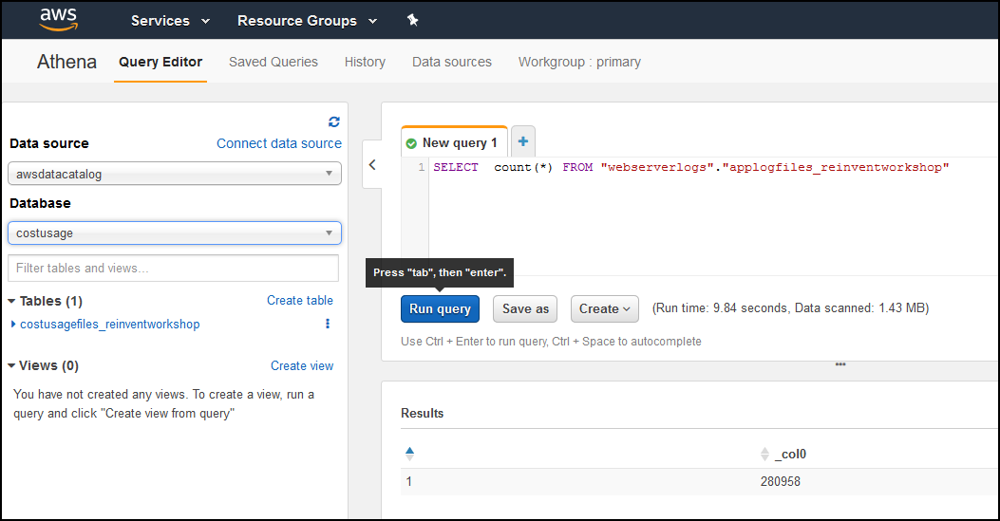 
    
4. Copy the results into a spreadsheet application and label it **Total workload demand**

5. Run the following query to get the **total successful responses**, and valid successful responses, in the spreadsheet record these also:

        SELECT  count(*) FROM "webserverlogs"."applogfiles_reinventworkshop" 
        where response like '200' and (request like '%index%' or request like '%image_file%')

    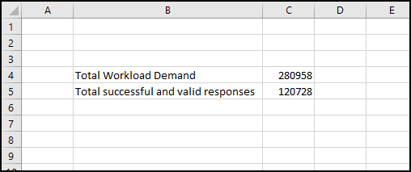 

5. We will now get the successful and valid responses by hour with the query below. Note the use of **date_parse** to turn the string into an actual date we can work with:

        SELECT date(date_parse(logdate, '%d/%b/%Y')) as date, hour(date_parse(logtime, '%H:%i:%s')) as hour, count(*) as requests FROM "webserverlogs"."applogfiles_reinventworkshop" 
        where response like '200' and (request like '%index%' or request like '%image_file%')
        group by date_parse(logdate, '%d/%b/%Y'), hour(date_parse(logtime, '%H:%i:%s'))
        order by date, hour

6. Click the icon in the top right to automatically open it in a spreadsheet:
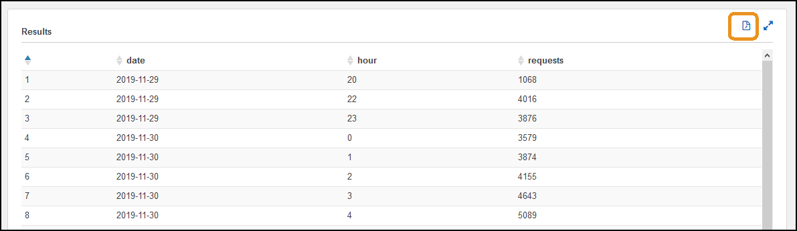 

7. Copy the results into your original spreadsheet:
 

7. Now lets get the workload cost that corresponds to the demand, run the following statement, and put it into the spreadsheet next to the demand:

        SELECT sum(line_item_unblended_cost)  FROM "costusage"."costusagefiles_reinventworkshop" 
        where resource_tags_user_application like 'ordering'

     
    
9. Execute the following statement to get the cost by hour, copy the **cost** column into the spreadsheet:

        SELECT line_item_usage_start_date as date, sum(line_item_unblended_cost) as cost FROM "costusage"."costusagefiles_reinventworkshop" 
        where resource_tags_user_application like 'ordering'
        group by line_item_usage_start_date
        order by date asc

    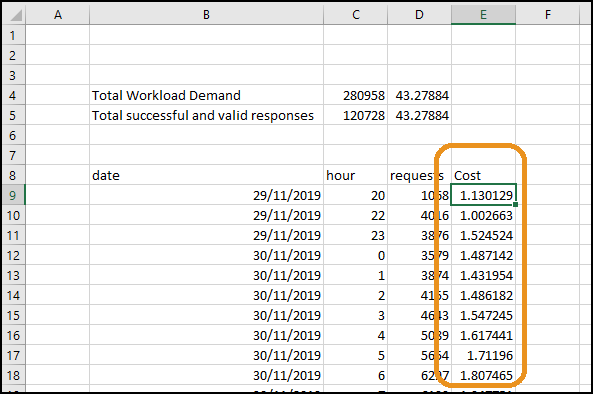 
    
10. In the spreadsheet, **calculate the efficiency** by **dividing the requests by the cost**. This will give you the number of outcomes per dollar spent. Notice the difference when you compare total vs successful vs valid. Also notice any variation of efficiency throughout the day.

  

You can see from the spreadsheet that the workload does:

    - 6,491.809 total requests per dollar, overall
    - 2789.539 successful customer requests per dollar, overall
    - from 945 to 3483 successful customer requests per dollar, throughout the day

## 2. Workload Demand Visualization
We have our workload application logs ready to analyze and visualize. This step will be to visualize the workload demand and understand how it is used.

### 2.2 Demand visualization - Requests per hour
1. Click in the top left and go to the homepage:
  

2. Go to QuickSight:
  

3. Enter in any valid email address and click **continue**:
  

4. Click **close** on any popups

5. Click **All dashboards**:
  

6. Click **Workload**: 
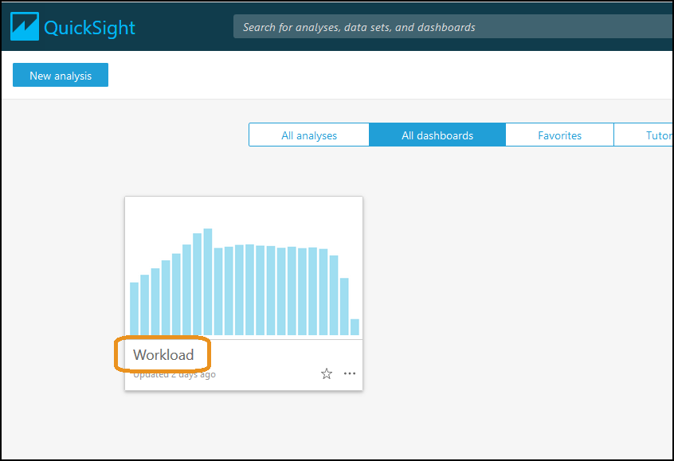  

7. On sheet 1 in the top image, you have the profile of the valid and successful customer outcomes of your workload:
     

This shows you the demand that is on your workload, it shows you how many requests were made and when these requests were made.

### 2.3 Categorize requests
Your workload may do different things, there could be different requests that consume different amounts of resources - so you would like to treat them differently. In this section we will look for specific requests and categorize them out.

1. When you viewed the application log files you saw requests:

                /index.html?name=Isabella,user=sponsored,work=26

    You can see there is **user=sponsored**, for this sample workload we have **free**, **sponsored** and **paid** user types.

2. Go to **sheet 2**
  

3. You now have a visual of your requests by different categories. In our example there is an "empty" usertype with a lot of usage, and the others are similar except for the middle of the middle of the day - where paid users are much more than free users:
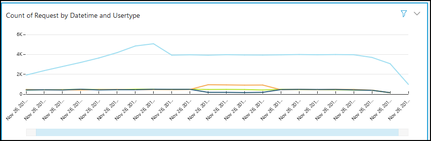  

You now have more insight into your workload, as you now know the different types of requests that come into your workload, and how they vary over time. 

### 2.4 Quantify requests
In your application log files, you may be able to take a numerical value from inside the log file, or assign a numerical value depending on the log line contents. These can then be used to perform a calculation on, which can indicate the amount of work or resource consumption for the request.

1. When using your logs, you will need to find how different types or categories of requests can be measured in terms of resource consumption. Look to find what is in that request that indicates more resource consumption. In our sample log file it is inside the request string. A sample request string is:

        /index.php?name=Isabella,user=sponsored,work=26

    You can see there is text **work=26** which has a number, this corresponds to the amount of resources it consumes, so we will use that in this example.

2. Go to **sheet 3**
  

3. You have a visual of your requests by **total work**:
  

You now have more insight into your workload, as you can measure overall load in a more meaningful way.

Compare the graphs on the first, second and third sheets.  You can see that by including additional small amounts of information or focusing on certain parts of information in your analysis you can get a very different outcome. 

### 2.5 Compare visualizations
Go back to each of the tabs and focus on the similarities between visualizations. The similarities should indicate if there is a strong correlation between usage and cost for the categories we chose. If the cost follows the demand, then you have a scalable and elastic workload:
  

  

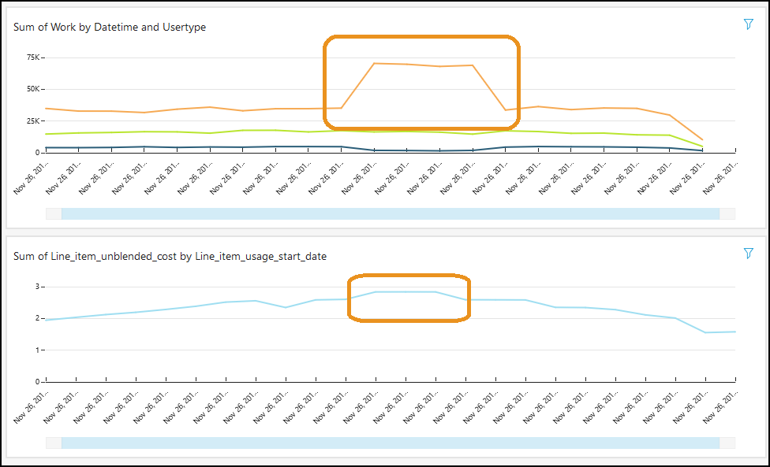  

