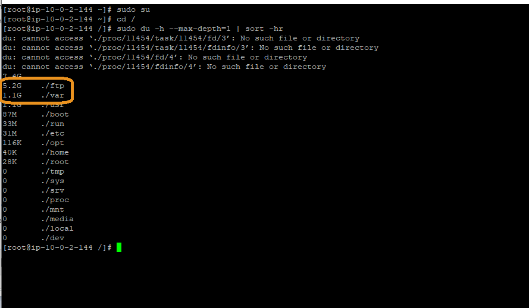

# Storage

## Authors
- Nathan Besh, Cost Lead Well-Architected

## Feedback
If you wish to provide feedback on this lab, there is an error, or you want to make a suggestion, please email: costoptimization@amazon.com

## Goals
- Understand the cost of storage in your environment
- Understand where the storage costs are in your environment

# Table of Contents
1. [Understand the cost of storage in your workload](#understand_storage)
2. [Use of storage](#use_storage)
3. [Simulate the change and validate](#validation)

## 1. Understand the cost of storage in your workload 
Storage costs may make up a small component of the overall cost of a workload, however at an enterprise level with large numbers of workloads or a larger workload, storage costs can become significant. There may not be one single resource that contributes to a large storage cost, it could be a large number of small amounts. So we will develop a technique to find where our storage costs are and how we can minimize waste.  We will focus on EBS storage, but this technique can be applied to any storage type, and other services where there are large numbers of small resources.

For this exercise we start with the files that were used at the end of Step3, these should already be loaded if you just finished Step3: 

    - [Step2CUR.gz](Code/Step2CUR.gz)
    - [Step2access_log.gz](Code/Step2AccessLog.gz)

### 1.1 Discover large volumes
The first step is to look for any large volumes, which can singled out for deeper inspection.

1. In the **Athena console** execute the following query:

        SELECT line_item_resource_id, sum(line_item_unblended_cost) as cost, sum(line_item_usage_amount) as amount FROM "costusage"."costusagefiles_reinventworkshop" 
        where line_item_usage_type like '%EBS%' and resource_tags_user_application like 'ordering'
        group by line_item_resource_id
        order by cost desc
        limit 50

2. It will return a list of volumes with the largest cost at the top of the list, look for any large volumes at the top of the list.

3. If there are any significant costs, you search for the volume by its resource ID, copy the top resource ID, in our example one of them is: **vol-0c4ceffc35e2a8d43**

4. You could then see in the console what instance is attached to. We could logon to that instance and ensure there is a high level of utilization of the storage, as it is a large cost.

### 1.2 Large number of small volumes
This technique is useful for scale, such as large organizations that have standard images or templates for resources, as any waste in the template can multiply to a large amount on the bill.

We will use a query to get the number of volumes and associated cost, grouped by size. This will return one line per unique volume size, for example: the total cost and number of 10Gb volumes, total cost and number of 15Gb volumes.

The query uses **730** as the hours in the month, this will vary depending on the days in the month. 730 is the average monthly hours for a 365 day year.   

2. In the **Athena console** execute the following query:

        SELECT sum(line_item_unblended_cost) as Cost, line_item_usage_amount*730 as Vol_Size, count(*)/count(distinct line_item_usage_start_date) as Num_Volumes  FROM "costusage"."costusagefiles_reinventworkshop"
        where line_item_usage_type like '%EBS%' and resource_tags_user_application like 'ordering'
        group by line_item_usage_amount
        order by cost desc
        limit 50

3. You can see we have  **23 x ~30Gb** volumes costing **$2.283**, and **26 x ~8Gb** volumes costing **$0.66444**.

4. In the previous step our largest single EBS volume cost was only **1.9166**, even the smallest amount of time spent to optimize $2 of costs would end in wasted time. 

5. With the query above, we can see there is a large number of volumes the same size, these may be boot volumes, so there could be potential savings in a large environment if we were to **make one change**: the boot volume size!

### 1.3 Wasted space on volumes
There are many different ways to manage your fleet of resources, but its important to do it at scale, and be able to pick patterns. In the previous example we highlighted that there may be lots of boot volumes that make up your total storage cost. You need to be able to understand if these volumes are fully utilized before making changes. 

Inventory management is out of scope for this lab, so we will show how we ran a small Linux script that can be used to display volume utilization for spot checks.

We used a return state within the script to trigger Systems Manager to show success or fail depending on if there is wasted storage. We program the script to **succeed** if there is the specified amount of waste, otherwise it will fail which means there is no waste.

1. We used **AWS-RunShellScript** from within **Systems Manager**:

2. The following script checks if the volume utilization is below 40% and the amount of free space is more than 5Gb.  You can modify this script to ensure the amount of waste is over a certain $ amount, and there is still enough headroom on the volume:
        
        df | grep -vE '^Filesystem|tmpfs|cdrom' | awk '{ print $1 " " $5 " " $2 " " $4}' | while read output;
        do
            volume=$(echo $output | awk '{ print $1 }')
            usepercent=$(echo $output | awk '{ print $2 }' | cut -d'%' -f1 )
            free=$(echo $output | awk '{ print $4 }')

            if [ $usepercent -lt 40 ] && [ $free -gt 5000000 ]
            then
                echo "$HOSTNAME has less than 40% utilization and greater than 5Gb free on $volume"
            else
                exit 1
            fi
        done

3. You can see here we had 4 instances that have a lot of wasted space on their volumes, these are our middle Tier application servers:

7. If there are large numbers of success, and the volume names correspond to boot volumes or other recognizable volumes in your environment, then they could be good candidates for improvement. 

8. In our simulated environment, it returned **success** for all c5 instances in the middle tier.  

### 1.4 Use of storage
The other area for saving with storage is to find the best type of storage for your purpose. If you have large amounts of storage with high utilization/low free space, then this could potentially yield large benefits, this will be highly dependent on your workload.

We will show how we found what our storage was used for in the test environment.

1. We executed the following disk usage command and view the results:

        sudo du -h --max-depth=1 | sort -hr
        

4. You can see there was a lot of storage used in the **ftp** and **var** directories, lets look further.

5. Iteratively we executed disk usage statements for the large directories, here we traversed the /var directory to find the largest usage on our front end instance:

        du -h --max-depth=1 /var | sort -hr
        du -h --max-depth=1 /var/www | sort -hr
        du -h --max-depth=1 /var/www/html | sort -hr

5. So we found the directory consuming the storage and can look at the contents. Understand how the storage is being used and look for alternative services. You can then use the AWS storage page to see if there are alternative services or classes of storage that would be most cost effective: https://aws.amazon.com/products/storage/

 
## 2. Simulate the change and validate
We saw earlier that our C5 middle tier instances had unused 30Gb volumes that were attached. We will simulate the change, and remove the excess storage.

**Wait at this step until we tell you to proceed**

1. In the **Athena console** execute the following query:

        SELECT sum(line_item_unblended_cost) as Cost, line_item_usage_amount*730 as Vol_Size, count(*)/count(distinct line_item_usage_start_date) as Num_Volumes  FROM "costusage"."costusagefiles_reinventworkshop"
        where line_item_usage_type like '%EBS%' and resource_tags_user_application like 'ordering'
        group by line_item_usage_amount
        order by cost desc
        limit 50
        
      
3. You can see we now have **8 x 30Gb** volumes at a cost of **$0.7667** and **13 x 8Gb volumes** at a cost of **$0.33222**. We revmoved the 4 unused 30Gb volumes from the middle tier, and deleted other unused volumes: 

4. We have removed **$1.84852** of storage cost from our front and middle tiers. This has removed **62%** of our storage costs.

In this step we analyzed storage costs, looking for small numbers of large savings opportunities, and large numbers of small savings opportunities. Use these methods to find gains across storage and other services where there are large numbers of smaller costs.

