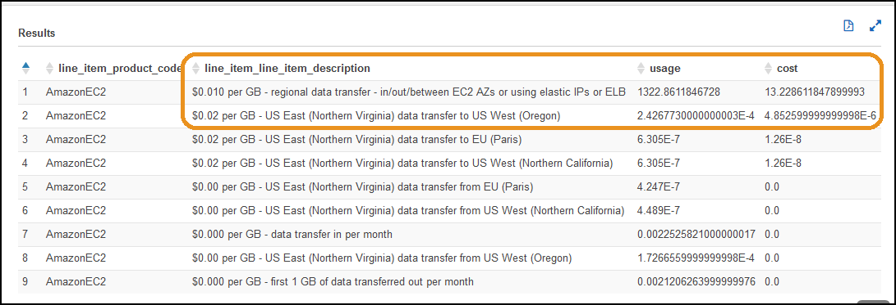
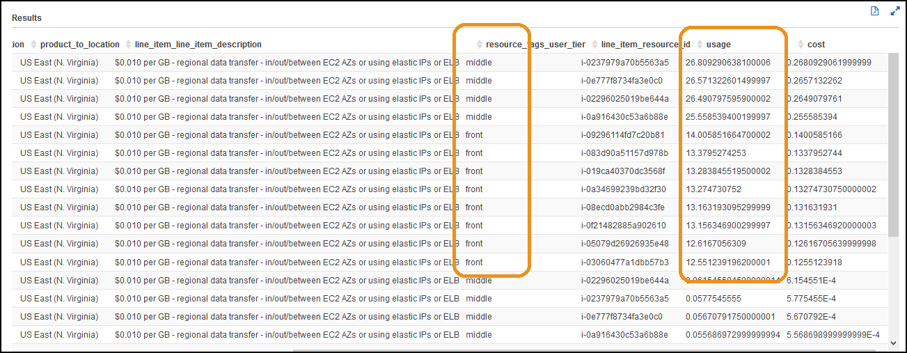

# Data Transfer

## Authors
- Nathan Besh, Cost Lead Well-Architected

## Feedback
If you wish to provide feedback on this lab, there is an error, or you want to make a suggestion, please email: costoptimization@amazon.com

## Goals
- Understand the cost of data transfer
- Understand where the data transfer costs are in your environment

# Table of Contents
1. [Understand licensing costs in your workload](#setup_data)
2. [Create an account structure](#cost_licensed)
3. [Simulate the change and validate](#validation)

    

## 1. Understand the cost of data transfer in your workload 
Depending on the type of workload, data transfer may be a small or significant cost of the overall workload cost. There are also different pricing rates for transferring data (just as there is for computing - i.e. instance types, lambda, containers) depending on the source and destination of the transfer, so we will look at what makes up your data transfer costs.

For this exercise we start with the files that were used at the end of Step4, these should already be loaded if you just finished Step4: 
    - [Step3CUR.gz](Code/Step3CUR.gz)
    - [Step3access_log.gz](Code/Step3AccessLog.gz)

### 1.1 Understand data transfer types and total
We will look for the word **transfer** in the **line_item_line_item_description** column to identify data transfer. We will look at the total amount in your workload and then the different types of data transfer.

1. Logon to the Athena console, and run the following query: 

        select line_item_product_code, sum(line_item_usage_amount) as usage, sum(line_item_unblended_cost) as cost FROM "costusage"."costusagefiles_reinventworkshop" 
        where resource_tags_user_application like 'ordering' and line_item_line_item_description like '%transfer%'
        group by line_item_product_code
        order by cost desc

2. You can see the product code **AmazonEC2**, the amount and cost of data transfer. At **$13.2286** of a workload total of **$44.2776**, it is approximately **30% of our total workload cost**.

3. Now lets look deeper into the types of data transfer that is in our workload. We will look at the description, run the following query:

        select line_item_product_code, line_item_line_item_description, sum(line_item_usage_amount) as usage, sum(line_item_unblended_cost) as cost FROM "costusage"."costusagefiles_reinventworkshop"
        where resource_tags_user_application like 'ordering' and line_item_line_item_description like '%transfer%'
        group by line_item_product_code, line_item_line_item_description
        order by cost desc

4. We can see that it is regional data transfer between AZs or using Elastic IPs, and also data transfer to Oregon that make up the main cost:

5. We need some more information to find the source of the data transfer, lets look at the **usage type** column to provide some more information. Run the following query:

        select line_item_product_code, line_item_usage_type, line_item_line_item_description, sum(line_item_usage_amount) as usage, sum(line_item_unblended_cost) as cost FROM "costusage"."costusagefiles_reinventworkshop" 
        where resource_tags_user_application like 'ordering' and line_item_line_item_description like '%transfer%'
        group by line_item_product_code, line_item_usage_type, line_item_line_item_description
        order by cost desc

5. We can see that it is Regional transfer, but no additional insights can be gained. 

6. Lets look at the **operation** column to provide more insights.  Run the following query:

        select line_item_product_code, line_item_operation, line_item_line_item_description, sum(line_item_usage_amount) as usage, sum(line_item_unblended_cost) as cost FROM "costusage"."costusagefiles_reinventworkshop" 
        where resource_tags_user_application like 'ordering' and line_item_line_item_description like '%transfer%'
        group by line_item_product_code, line_item_operation, line_item_line_item_description
        order by cost desc

6. You can see that the operation column provides more detail. The first two lines **PublicIP-In**, **LoadBalancing-PublicIP-Out** are the majority of usage and cost, and are very similar in amounts and cost. There is also 20% of costs in the next two lines **InterZone**.

7.  Lets now find the source and destination of the data transfer, run the following query:

        select line_item_product_code, line_item_operation, product_from_location, product_to_location, line_item_line_item_description, line_item_unblended_rate, sum(line_item_usage_amount) as usage, sum(line_item_unblended_cost) as cost FROM "costusage"."costusagefiles_reinventworkshop" 
        where resource_tags_user_application like 'ordering' and line_item_line_item_description like '%transfer%'
        group by line_item_product_code, line_item_operation, product_from_location, product_to_location, line_item_line_item_description, line_item_unblended_rate
        order by cost desc

7. We can see that the main costs are from **US East (N. Virginia)** to **US East (N. Virginia)**. The description tells us its between AZs or Elastic IPs or ELB traffic. 

Since we know the product, location, amount and cost of our data transfer, we will move onto finding the specific resources in our workload transferring the data.

## 2. Understand where your data transfer is in your workload
Now we know the type of data transfer we have in our workload and the costs, we will find the resources that are making the data transfer in order to find a way to reduce the cost if possible.
We will take the information from the previous step and find out which tier and resources are the source and destination.

### 2.1 Workload Tiers
We will find which tiers the data transfer is coming from and going too

1. We will narrow our focus to the top costs, run the following query:

        select line_item_product_code, line_item_operation, product_from_location, product_to_location, line_item_line_item_description, sum(line_item_usage_amount) as usage, sum(line_item_unblended_cost) as cost FROM "costusage"."costusagefiles_reinventworkshop" 
        where resource_tags_user_application like 'ordering' and line_item_line_item_description like '%regional data transfer%' and (line_item_operation like '%InterZone%' or line_item_operation like '%PublicIP%')
        group by line_item_product_code, line_item_operation, product_from_location, product_to_location, line_item_line_item_description
        order by cost desc

2. We can assume the PublicIP transfer in and out is to the Front tier - as its transfer to and from the internet. Lets look at the InterZone transfer and see which of our workload tiers it is in. We will use our tags for this, by selecting the **resource_tags_user_tier** column. Run the following query:

        select line_item_product_code, line_item_operation, product_from_location, product_to_location, line_item_line_item_description, resource_tags_user_tier, sum(line_item_usage_amount) as usage, sum(line_item_unblended_cost) as cost FROM "costusage"."costusagefiles_reinventworkshop" 
        where resource_tags_user_application like 'ordering' and line_item_line_item_description like '%regional data transfer%' and line_item_operation like '%InterZone%'
        group by line_item_product_code, line_item_operation, product_from_location, product_to_location, line_item_line_item_description, resource_tags_user_tier
        order by cost desc

3. You can see there are now 4 lines of results, the top 2 making up the majority of costs and usage. If you read the columns together you can see that it is: Data transfer **InterZone-In** to **middle tier**, and data transfer **InterZone-Out** from **front tier**. The usage amounts are close to identical, so we have data transfer being transferred from the front to the middle tier.

### 2.2 Workload Resources
Now we know the tiers, lets track down the resources responsible. We will now look at the individual resources that are the source & destination for the traffic.

1. Include the **line_item_resource_id** column to get the individual resources. Run the following query:

        select line_item_product_code, line_item_operation, product_from_location, product_to_location, line_item_line_item_description, resource_tags_user_tier, line_item_resource_id, sum(line_item_usage_amount) as usage, sum(line_item_unblended_cost) as cost FROM "costusage"."costusagefiles_reinventworkshop"  
        where resource_tags_user_application like 'ordering' and line_item_line_item_description like '%regional data transfer%' and line_item_operation like '%InterZone%'
        group by line_item_product_code, line_item_operation, product_from_location, product_to_location, line_item_line_item_description, resource_tags_user_tier, line_item_resource_id
        order by cost desc
  
2. We can see the top 4 items by amount and cost, are instances in the middle tier, with usage spread across each of them quite evenly. Next there are 8 instances in the front tier which are the source, with the amount of traffic roughly half that of each middle tier instance - as there are 8 front tier instances and 4 middle tier instances.

3. We look at the pricing page here: https://aws.amazon.com/ec2/pricing/on-demand/ select the correct region and scroll down to **Data Transfer**. There is the heading **Data Transfer within the same AWS Region**, and it specifies **Data transferred "in" to and "out" from Amazon EC2.... across Availability Zones..... in the same AWS Region is charged at $0.01/GB in each direction.**

Further down it states: **Data transferred between Amazon EC2...instances and Elastic Network Interfaces in the same Availability Zone is free.** 

4. If we modify our workload to only transfer data between front and middle tiers in the same AZ, we can remove the data transfer cost. In this sample workload the saving is **$2.10** per day, which is approximately 5%  of our total workload cost. Use your figure to determine if the effort involved will provide a saving over the lifetime of the workload. Ensure you factor in any changes in growth or usage that are predicted.

**NOTE:** Changing the way your application is allowed to route traffic may impact the availability/resiliency of your application. Ensure you maintain the required levels of availability/resiliency for your customers.

If data transfer is required between AZs for availability/resiliency, then the cost of data transfer is part of the cost of availability/resiliency, the same way as additional instances and storage is.

## 3. Simulate the change and validate 
We will simulate the change of having traffic only go between the tiers within the same AZ.

1. Download the updated CUR and application log files from here: 
    - [Step4CUR.gz](Code/Step4CUR.gz)
    - [Step4access_log.gz](Code/Step4AccessLog.gz)

2. Lets see that we've removed the Inter AZ Data transfer, run the following query:
        
        select line_item_product_code, line_item_operation, product_from_location, product_to_location, line_item_line_item_description, resource_tags_user_tier, sum(line_item_usage_amount) as usage, sum(line_item_unblended_cost) as cost FROM "costusage"."costusagefiles_reinventworkshop" 
        where resource_tags_user_application like 'ordering' and line_item_line_item_description like '%regional data transfer%' and line_item_operation like '%InterZone%'
        group by line_item_product_code, line_item_operation, product_from_location, product_to_location, line_item_line_item_description, resource_tags_user_tier
        order by cost desc

3. Previously we had $1.05 each way between the tiers, we now have virtually zero:

4. Looking at our overall costs, run the following query in Athena:

        select line_item_product_code, sum(line_item_usage_amount) as usage, sum(line_item_unblended_cost) as cost FROM "costusage"."costusagefiles_reinventworkshop" 
        where resource_tags_user_application like 'ordering' and line_item_line_item_description like '%transfer%'
        group by line_item_product_code
        order by cost desc
        

3. You can see that is is **$11.45**, providing a saving of **$1.77**, or  **13%** of our overall workload cost.

We have successfully analyzed our data transfer costs, found out where we can make improvements and implemented the changes to restrict data transfer to within an AZ.

