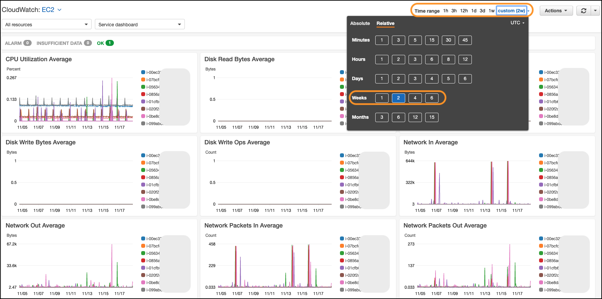
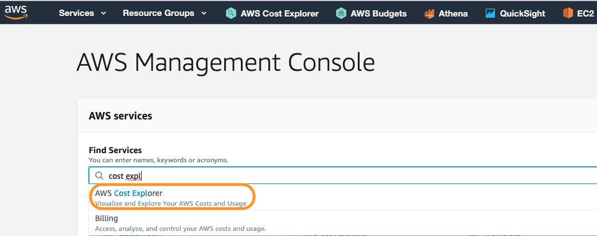
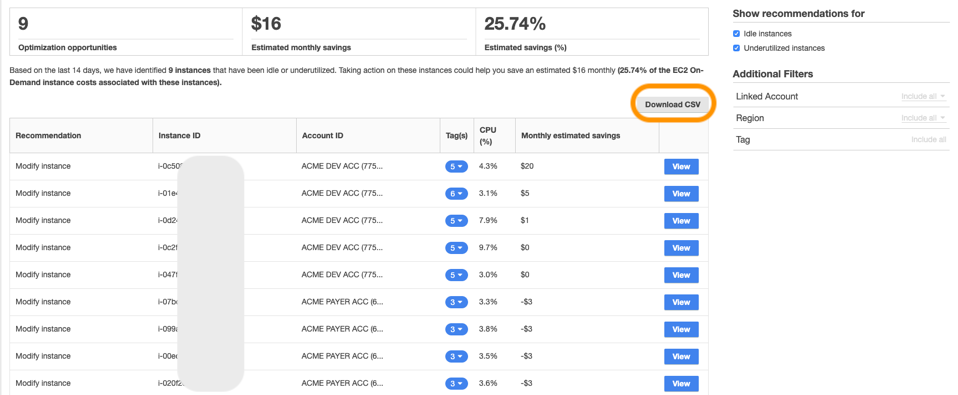
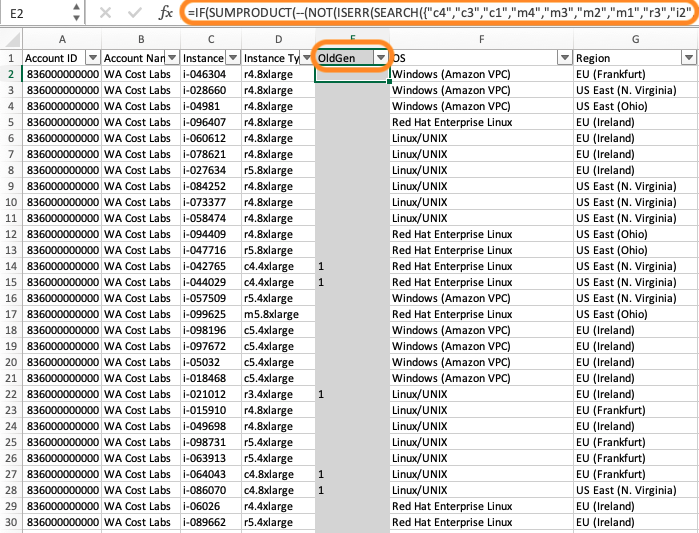
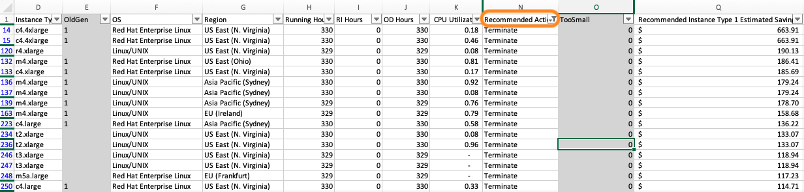
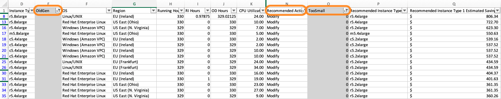

# Level 100: EC2 Right Sizing: Lab Guide

## Authors
- Arthur Basbaum, AWS Cloud Economics

## Feedback
If you wish to provide feedback on this lab, there is an error, or you want to make a suggestion, please email: costoptimization@amazon.com

# Table of Contents
1. [Getting to know AWS CloudWatch](#CloudWatch_intro)
2. [Using AWS Resource Optimization Recommendations](#resource_opt)
3. [Prioritizing EC2 Right Sizing](#prio_resource_opt)
4. [Actionig on the recommendations](#act_resource_opt)
5. [EC2 Right Sizing Best Practices](#EC2_RS_best_practices)
6. [EC2 Right Sizing Reference Material](#EC2_RS_ref_material)

**NOTE:** In order to run this lab you will need to have at least one **EC2 instance** running and have **AWS Cost Explorer** and **AWS Resource Optimization** enabled.

## 1. Getting to know AWS Cloudwatch<a name="CloudWatch_intro"></a>

The first step to perform right sizing is to monitor and analyze your current use of services to gain insight into instance performance and usage patterns. To gather sufficient data, observe performance over at least a two-week period (ideally, over a one-month period) to capture the workload and business peak. The most common metrics that define instance performance are vCPU utilization, memory utilization, network utilization, and disk use.

1. Log into your AWS console, go to the **Amazon CloudWatch** service page:


2. Select **EC2** under the **Service Dashboard**:


3. Observe the **Service Dashboard** and all of its different metrics, but focus on **CPU Utilization** and **Network In** and **Out**:


4. Select one of the **EC2** resources by clicking on the little color icon to the left of the **resource-id** name:


5. Deselect the **EC2 resource** and now modify the time range on the top right, selecting the **last 2 weeks**:


6. Navigate to the **CPU Utilization Average** widget and launch the **View in metrics** page. Using the **Graphed metrics** section try to answer the following questions:

- a. What is the instance with the highest CPU Average?
- b. What is the instance with the highest CPU Max?
- c. What is the instance with the lowest CPU Min?


## 2. Using AWS Resource Optimization Recommendations<a name="resource_opt"></a>
**NOTE**: In order to complete this step you need to have AWS Resource Optimization enabled, you can do that going to the AWS Cost Explorer, Recommendations (left bar) section.

Amazon EC2 Resource Optimization offers right sizing recommendations in the AWS Cost Explorer without any additional cost. These recommendations identify likely idle and underutilized instances across your accounts, regions and tags. To generate these recommendations, AWS analyzes your historical EC2 resource usage (using Amazon CloudWatch) and your existing reservation footprint to identify opportunities for cost savings (e.g., by terminating idle instances or downsizing active instances to lower-cost options within the same family/generation).

1. Navigate to the **AWS Cost Explorer** page


2. Select **Recommendations** in the left menu bar


3. Click on the **View All** link associated with the **AWS Resource Optimization Recommendations** section. 


In case you haven’t enabled the Amazon EC2 Resource Optimization please do so (no additional cost), it may take up to 24 hours in order to generate your first recommendations. Only regular or payer accounts can enable it and by default both linked and payer accounts will be able to access their rightsizing recommendations unless the payer account specifically prohibits it on the settings page (top right).


To improve the quality of recommendations, AWS might use other utilization metrics that you might be collecting, such as disk or memory utilization. All resource utilization metrics are anonymized and aggregated before AWS uses them for model training. If you would like to opt out of this experience and request your metrics not be stored and used for model improvement, please submit an AWS support ticket. For more information, see [AWS Service Terms](https://aws.amazon.com/service-terms/).

4. Assuming you had enabled the AWS Resource Optimization Recommendations, you will be presented with a screen that provides recommendations (if any exists). Click to view the **Resource Optimization** recommendations.


- **Optimization opportunities** – The number of recommendations available based on your resources and usage
- **Estimated monthly savings** – The sum of the projected monthly savings associated with each of the recommendations provided
- **Estimated savings (%)** – The available savings relative to the direct Amazon EC2 costs (On-Demand) associated with the instances in the recommendation list

You can also filter your recommendations by the type of action (Idle and Underutilized), Linked Account, Region and Tag. 

5. Click on any single recommendation to view the details


How are the potential savings calculated? AWS will first examine the instance running during the last 14 days to identify if it was partially or fully covered by an RI or running On-Demand. Another factor is whether the RI is instance size-flexible. The cost to run the instance is calculated based on the On-Demand hours and the hourly rate for the instance type. For each recommendation, AWS calculates the cost to operate a new instance. AWS assumes that an instance size-flexible Reserved Instance will cover the new instance in the same way as the previous instance. Savings are calculated based on the number of On-Demand running hours and the difference in On-Demand rates. If the Reserved Instance isn't instance size-flexible, the savings calculation is based on whether the instance hours during the last 14 days are operated as On-Demand. AWS will only provide recommendations with estimated savings greater than or equal to $0.

Amazon Resource Optimize recommendations already excludes Spot usage and takes into consideration the existing Reserved Instances and Savings Plan footprint to provide recommendations. There are two types of recommended actions: **Terminate** if the instance is considered idle (*max CPU utilization is at or below 1%*) or **Downsize** if the instance is underutilized (*max CPU utilization is between 1% and 40%*).

You can enable Amazon CloudWatch to report memory utilization and improve the recommendation accuracy. Please check the [200 level EC2 Right Sizing lab](https://github.com/awslabs/aws-well-architected-labs/blob/master/Cost/ent206.md) for more information on how to enable memory utilization metrics. Finally, Amazon EC2 Resource Optimization Recommendations will only ever recommend up to three, same-family instances as target instances for downsizing.

## 3. Download the Amazon EC2 Resource Optimization CSV File and sort it to find quick wins <a name="prio_resource_opt"></a>

1. Download the **AWS Resource Optimization** report:


2. If you don’t have any AWS Resource Optimization recommendation use the file below as a reference.
[Sample Amazon EC2 Resource Optimization file (.csv)](./Code/ENT206-ec2-rightsizing-recommendations.csv)

3. First let’s exclude instances that are too small or were only running for a few hours from the analysis. By doing so, we minimize the time required to perform rightsizing modifications that would otherwise result in minimal savings.


**NOTE**: Depending on how many cost allocation tags you have enabled on your account the columns may differ from the example, that said try to match the formulas using the screenshots below and the default column names.

Insert a new column to the right of the *Recommended Action* column. The first row will be the label for the column “TooSmall”. In each row below the label, paste the following formula:
```
=IF(Q2<25,1,0)
```
Where *Column Q = Recommended Instance Type 1 Estimated Savings*

That formula will flag all EC2 instances with a “1” any instance that will fail to deliver more than $25/month in savings (or $300/year). Feel free to adjust the threshold for your organization own savings expectation. If you prefer to perform the analysis against instance families instead of potential savings you can use the following formula to exclude smaller instances from the recommendations as well.
```
=IF(N2="Modify",IF(SUMPRODUCT(--(NOT(ISERR(SEARCH({"nano","micro","small","medium"},D2)))))>0,"1","0"),"0")
```
Where *Column N = Recommended Action* and *Column D = Instance Type*

4. Next, let’s flag EC2 instances that belong to previous generations (C4, M3, etc), if you are investing engineer time on right sizing let's make sure you are also leveraging the newest technology available. Newer EC2 generations have a superior performance increasing the changes of success for the right sizing exercise, they also generally cost less than previous generations providing a higher cost vs benefit.



Insert a new column to the right of the *Instance Type* field, and paste the following formula:
```
=IF(SUMPRODUCT(--(NOT(ISERR(SEARCH({"c4","c3","c1","m4","m3","m2","m1","r3",”r4”,"i2","cr1","hs1","g2"},D2)))))>0,"1","0")
```
*Column D = Instance Type*

5. Now let’s sort the recommendations by low complexity and higher savings:

**Group 1:** Idle EC2 resources (Filters: Recommended Actions = “Terminate”)

Start filtering the idle resources or instances where CPU utilization <1%, it is likely these instances were launched and forgotten so the potential savings here may represent the entire On Demand cost. 



The resulting filtered list should be where you start right sizing discussions with application owners; perform an investigation to understand why these instance were launched and validate their usage with the resource owner. If possible, terminate them.

If you are using the Right Sizing CSV file provided in this lab exercise, you will notice that we filtered down from an original *2,534 recommendations to 235* and *identified $4,808 per month in potential savings*.

**Group 2:** Previous generation instances (Filters: Recommended Actions = “Modify” AND OldGen = “1” AND TooSmall = “0”)

Now let’s focus on the underutilized resources (<40% CPU) that belongs to previous generations and can either be downsized within the same family (column P below) or modernized to the newest generation. 


Moving to a modern generation may require additional testing hours compared to instances identified on Group 1, but depending on the case it can maximize savings and performance.

|          | Linux     | vs new gen | Windows   | vs new gen |          | Linux     | vs new gen | Windows   | vs new gen |
| -------- |:---------:| ----------:|:---------:| ----------:| -------- |:---------:| ----------:|:---------:| ----------:|
| c3.large | $0.105/hr |     up 19% | $0.188/hr |      up 5% | m3.large | $0.133/hr |     up 27% | $0.259/hr |     up 27% |
| c4.large | $0.100/hr |     up 15% | $0.192/hr |      up 7% | m4.large | $0.100/hr |      up 4% | $0.192/hr |      up 2% |
| c5.large | $0.985/hr |         0% | $0.177/hr |         0% | m5.large | $0.096/hr |         0% | $0.188/hr |         0% |

*prices are from US-Virginia (Nov 2019)*

If you are using the Right Sizing CSV file provided in this lab exercise, you will notice that we filtered down from originally *2,534 recommendations to 183* with *$38,464 per month in potential savings*.

**Group 3:** Current generation instances (Filters: Recommended Actions = “Modify” AND OldGen = “0” AND TooSmall = “0”)

Finally let’s select underutilized resources from the current, most modern generation. We recommend sorting them by potential savings to make sure you are prioritizing the instances that will provide larger savings first. 



Also, do not forget to check the other recommended instance types (columns U to AD); Amazon EC2 Resource Optimization will recommend up to 3 instances for each resource moving from a more conservative recommendation (the first recommendation) to a more aggressive and higher savings recommendation (second and third recommendations). 

If you are using the Right Sizing CSV file provided in this lab exercise, you will notice that we filtered down from originally *2,534 recommendations to 305* with *$38,693 per month in potential savings*.

## 4. Actionig on the recommendations<a name="act_resource_opt"></a>
During this lab exercise, we learned how to prioritize the right sizing recommendations with the goal of identifying low complexity and high savings recommendations. **We initially started with 2,534 recommendations with a potential saving of $86,627 but we managed to identify the top 723 cases (29%) with lowest complexity that together add up to $81,965 or 95% of the overall potential saving**.

*Group 1 (Idle)* and *Group 2 (Previous Generation)* are the less complex cases where you may want to start your right sizing exercises for your organization. As you gain more confidence and learn how to develop a regular process for right sizing, your organization will be able to rapidly act on *Group 3 (Current/modern generation)* and other instance types.

## 5. Amazon EC2 Right Sizing Best Practices<a name="EC2_RS_best_practices"></a>
* **Start simple:** idle resources, non-critical development/QA and previous generation instances will require less testing hours and provide quick wins (The Amazon EC2 Launch time statistics can be used to identify instances that have been running longer than others and is a good statistic to sort your Amazon EC2 instances by).

* **Right Size before performing a migration:** If you skip right sizing to save time, your migration speed might increase, but you will end up with higher cloud infrastructure spend for a potentially longer period of time. Instead, leverage the test and QA cycles during a migration exercise to test several instance types and families.  Also, take that opportunity to test different sizes and burstable instances like the “t” family.

* **The best right sizing starts on day 1:** As you perform right sizing analysis, and ultimately rightsize resources, ensure any learnings are being shared across your organization and influencing the design of new workloads.

* **Measure Twice, Cut Once: Test, then test some more:** The last thing you want is for a new resource type to be uncapable of handling load, or functioning incorrectly.

* **Test once and perform multiple right sizing:** Aggregate instances per autoscaling group and tags to scale right sizing activities.

* **Combine Reserved Instance or Savings Plans strategy with Right Sizing to maximize savings:** For Standard RIs and EC2 Instance SP: Perform your pricing model purchases after rightsizing and for Convertible RIs, exchange them after rightsizing. Compute Savings plan will automatically adjust the commitment for the new environment.

* **Ignore burstable instance families (T types):** These families are designed to typically run at low CPU percentages for significant periods of time and shouldn’t be part of the instance types being analyzed for rightsizing.

## 6. Reference Material<a name="EC2_RS_ref_material"></a>

* [AWS Resource Optimization Documentation](https://docs.aws.amazon.com/awsaccountbilling/latest/aboutv2/ce-rightsizing.html)

* [AWS Cost Optimization](aws.amazon.com/pricing/cost-optimization/)

* [AWS Well Architect Cost Opt Whitepaper](d1.awsstatic.com/whitepapers/architecture/AWS-Cost-Optimization-Pillar.pdf)

* [Laying the foundation for Cost Opt Whitepaper](d1.awsstatic.com/whitepapers/cost-optimization-laying-the-foundation.pdf)

* [AWS Cost Management Products](aws.amazon.com/aws-cost-management/)

* [AWS Cost Management Blog](aws.amazon.com/blogs/aws-cost-management/)

* [Case Studies and Research](aws.amazon.com/solutions/case-studies)

## 7. Tear down<a name="tear_down"></a>  
This exercise covered the fundamental steps for right sizing on AWS. Starting from understanding which type of data/telemetry is available, granularity to the AWS Resource Optimization recommendation that automatically identify idle resources and isntances with downsizing opportunities. There is no tear down for exercises in this lab.

## 8. Rate this lab<a name="rate_lab"></a>  
[](http://dx1572sre29wk.cloudfront.net/Cost_100_1_1star) [](http://dx1572sre29wk.cloudfront.net/Cost_100_1_2star) [](http://dx1572sre29wk.cloudfront.net/Cost_100_1_3star) [](http://dx1572sre29wk.cloudfront.net/Cost_100_1_4star) [](http://dx1572sre29wk.cloudfront.net/Cost_100_1_5star) 


## 9. Survey <a name="survey"></a>
Thanks for taking the lab, We hope that you can take this short survey (<2 minutes), to share your insights and help us improve our content.

[](https://amazonmr.au1.qualtrics.com/jfe/form/SV_cvavNi7IbbzCyfX)

This survey is hosted by an external company (Qualtrics), so the link above does not lead to our website.  Please note that AWS will own the data gathered via this survey and will not share the information/results collected with survey respondents.  Your responses to this survey will be subject to Amazons Privacy Policy.
 
