# Level 200: EC2 Right Sizing: Lab Guide

## Authors
- Jeff Kassel, AWS Technical Account Manager
- Arthur Basbaum, AWS Cloud Economics

## Feedback
If you wish to provide feedback on this lab, there is an error, or you want to make a suggestion, please email: costoptimization@amazon.com

# Table of Contents
1. [Getting to know AWS CloudWatch](#CloudWatch_intro)
2. [Create an IAM Role to use with Amazon CloudWatch Agent](#create_iamrole)
3. [Attach CloudWatch IAM role to selected EC2 Instances](#attach_iamrole)
4. [Cloudwatch Agent Manual Install](#memory_plugin)
5. [Updated Resource Optimization recommendations](#EC2_updated_rec)
6. [EC2 Right Sizing Best Practices](#EC2_RS_best_practices)
7. [EC2 Right Sizing Reference Material](#EC2_RS_ref_material)

**NOTE:** In order to run this lab you will need to have at least one **EC2 instance** running and have **AWS Cost Explorer** and **AWS Resource Optimization** enabled.

During this lab we will create a **custom metric** at **Amazon CloudWatch** and install an agent in one EC2 instance to start collecting Memory utilization and improve the recommendation accuracy of the **AWS Resource Optimization** report. Be aware that *custom metrics are not part of the Amazon CloudWatch [free tier](https://aws.amazon.com/free/)* usage so **additional costs will incur at your bill**. For more information read the [Amazon CloudWatch pricing](https://aws.amazon.com/cloudwatch/pricing/) page.

All custom metrics charges are prorated by the hour and metered only when you send metrics to Amazon CloudWatch. **Each custom metrics costs $0.30 per metric/month for the first 10,000 metrics** and can go down to $0.02 per metric/month at the lowest priced tier (*US Virginia prices from November 2019*).

## 1. Getting to know AWS Cloudwatch<a name="CloudWatch_intro"></a>

The first step to perform right sizing is to monitor and analyze your current use of services to gain insight into instance performance and usage patterns. To gather sufficient data, observe performance over at least a two-week period (ideally, over a one-month period) to capture the workload and business peak. The most common metrics that define instance performance are vCPU utilization, memory utilization, network utilization, and disk use.

1. Log into your AWS console, go to the **Amazon CloudWatch** service page:


2. Select **EC2** under the **Service Dashboard**:
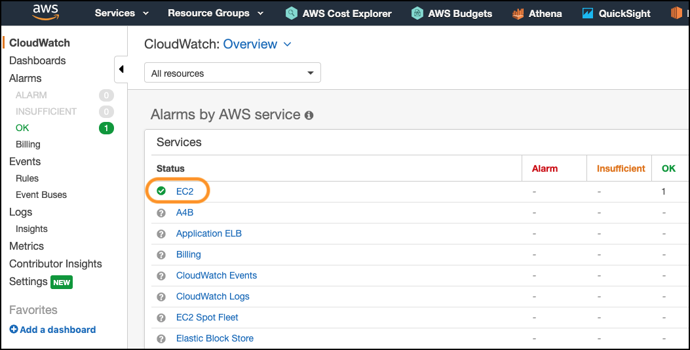

3. Observe the **Service Dashboard** and all of its different metrics, but focus on **CPU Utilization** and **Network In** and **Out**:


4. Select one of the **EC2** resources by clicking on the little color icon to the left of the **resource-id** name:


5. Deselect the **EC2 resource** and now modify the time range on the top right, selecting the **last 2 weeks**:


6. Navigate to the **CPU Utilization Average** widget and launch the **View Metrics detailed** page. Using the **Graphed metrics** session try to answer the following questions:

- a) What is the instance with the lowest CPU Average?
- b) What is the instance with the lowest CPU Max?
- c) What is the instance with the lowest CPU Min?

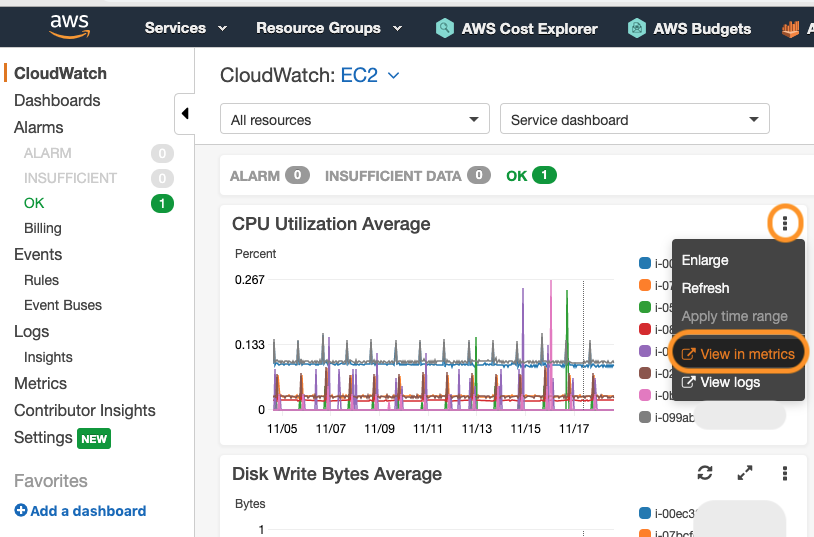


## 2. Create an IAM Role to use with Amazon CloudWatch Agent<a name="create_iamrole"></a>

Access to AWS resources requires permissions. You will now create an IAM role to grant permissions that the agent needs to write metrics to CloudWatch. Amazon created two new default policies called *CloudWatchAgentServerPolicy* and *CloudWatchAgentAdminPolicy* only for that purpose.

1. To create the IAM role first you will need to sign in to the **AWS Management Console** and open the **IAM console**


2. In the navigation pane on the left, choose **Roles** and then **Create role**.


3. For Choose the service that will use this role, choose **EC2 Allows EC2 instances to call AWS services on your behalf.** Choose **Next: Permissions**.


4. In the list of policies, select the check box next to *CloudWatchAgentServerPolicy*. If necessary, use the search box to find the policy.


5. Choose **Next: Review**.
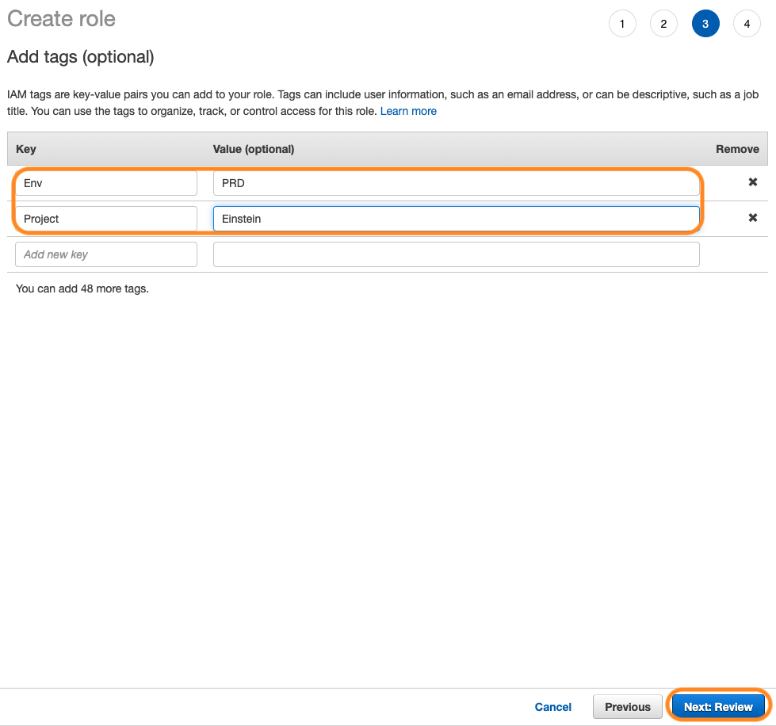

6. Confirm that *CloudWatchAgentServerPolicy* appears next to **Policies**. In Role name, enter a name for the role, such as *CloudWatchAgentServerRole*. Optionally give it a description. Then choose Create role.
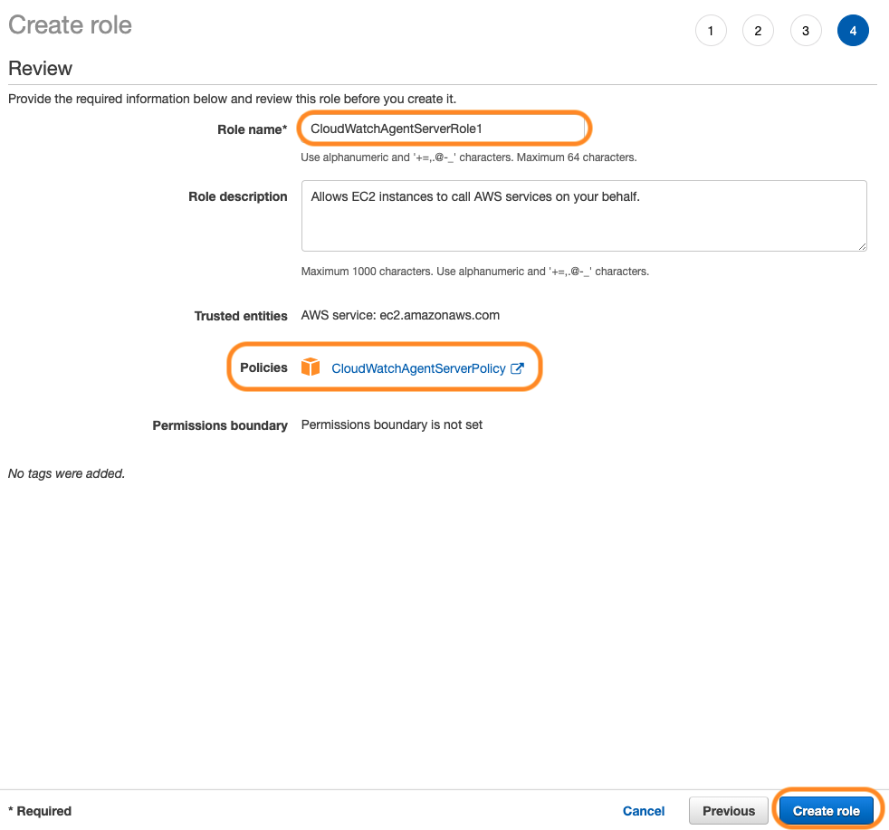

The role is now created.

## 3. Attach CloudWatch IAM role to selected EC2 Instances<a name="attach_iamrole"></a>

1. We are now going to attach the IAM Role created on the previous step in one of our EC2 Instances, to do that let's go to the **Amazon EC2 Dashboard**.
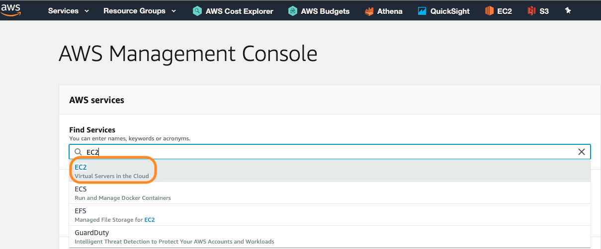

2. On the left bar, click on **Instances**.


3. Click on **Launch Instance** and select **Linux 2 AMI (HVM)** and **t2.micro** (free tier eligible) on the following screens.
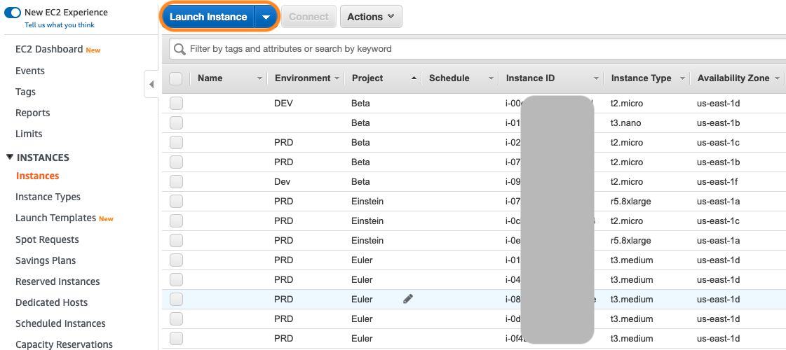
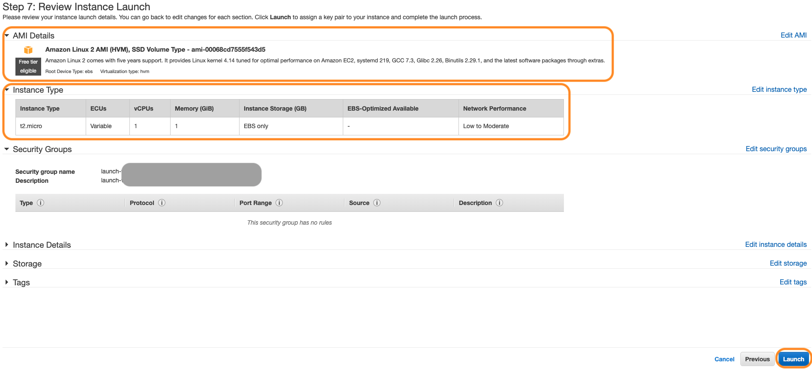

4. Select the instance you want to start collecting Memory data, go to **Actions** on the top bar, select **Instance Settings>>Attach/Replace IAM Role**.


5. Look for the created IAM role *CloudWatchAgentServerRole* under the **IAM role** box, select it and apply.
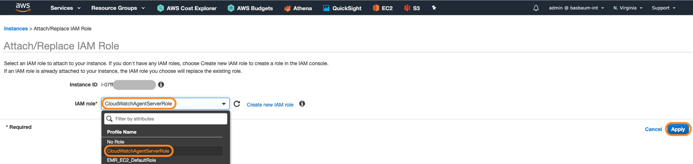

6. Confirm that the *CloudWatchAgentServerRole* was sucessfully attached to your **EC2 instance** 
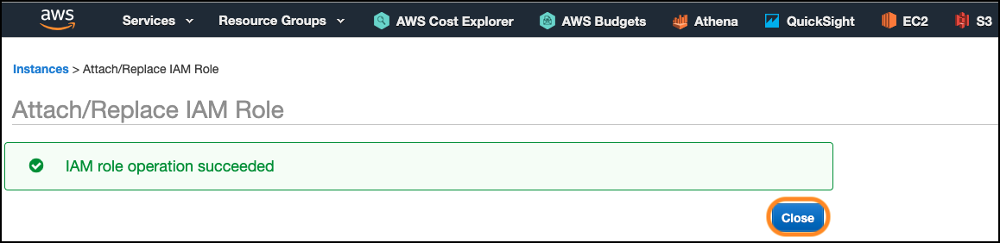

7. Validade if the IAM role *CloudWatchAgentServerRole* is attached to the desired instance
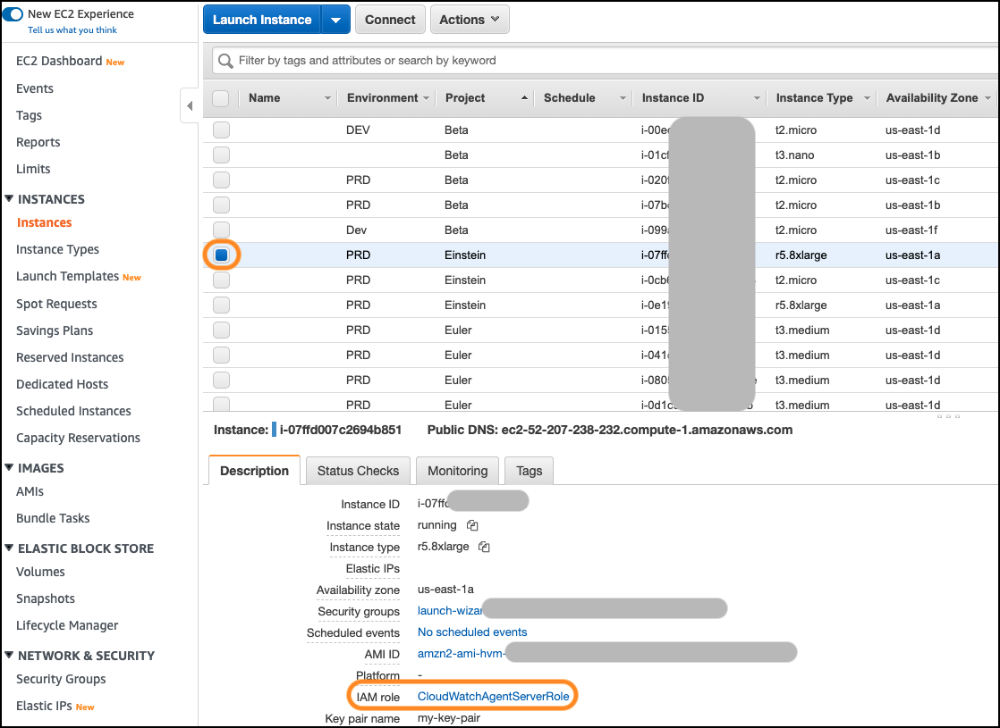

## 4. Cloudwatch Agent Manual Install<a name="install_memory_plugin"></a>

1. We are now going to manually install the **CloudWatch agent** to start collecting memory data, to start let's go back to the **Amazon EC2 Dashboard**.
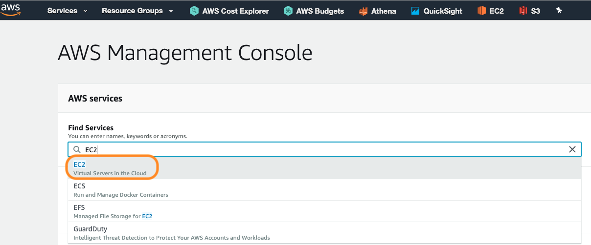

2. On the left bar, click on **Instances** and select the **EC2 Instance** with the *CloudWatchAgentServerRole* IAM role.
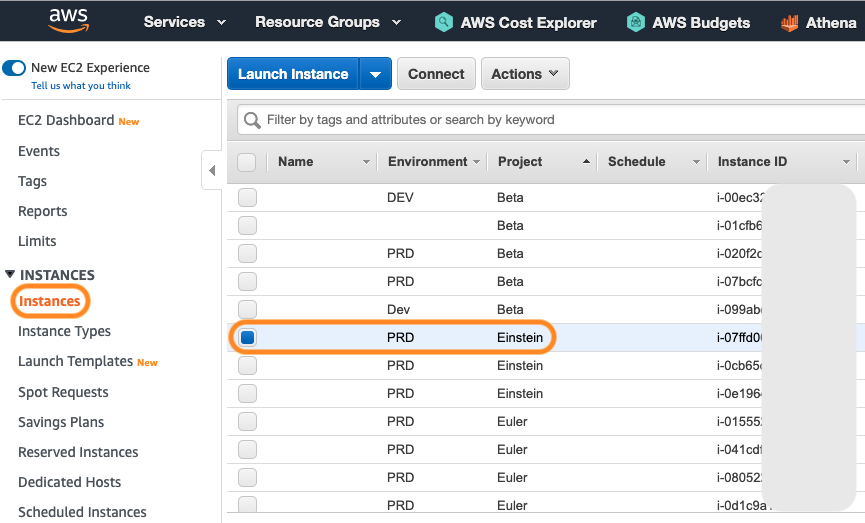

3. Connect into the EC2 Instance using the **browser-based SSH connection tool**
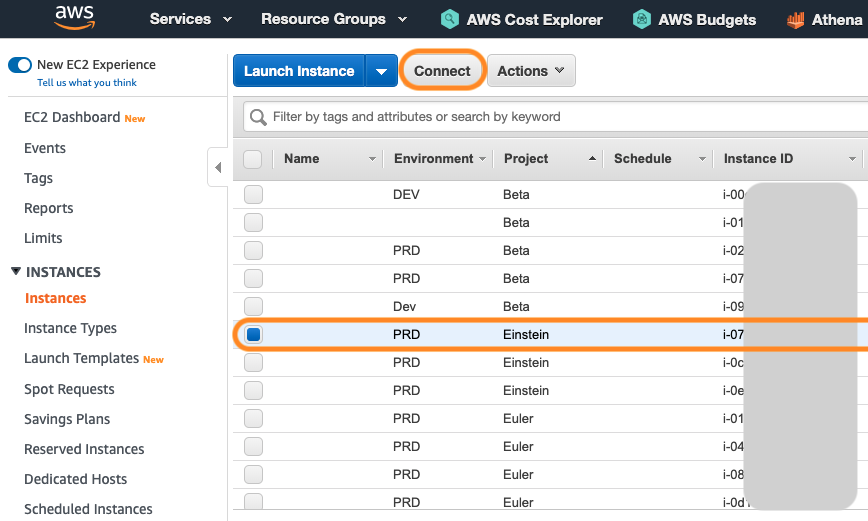
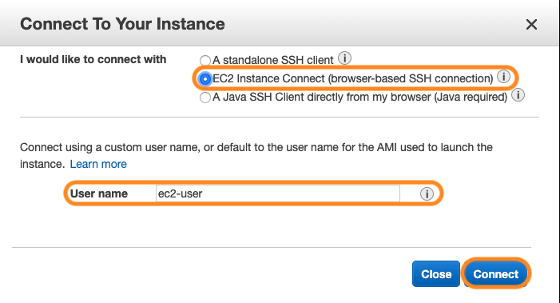


4. Download the **Amazon Cloudwatch** agent package, the instructions below are for Amazon Linux, for other OS please check [here](https://docs.aws.amazon.com/AmazonCloudWatch/latest/monitoring/download-cloudwatch-agent-commandline.html)

```
wget https://s3.amazonaws.com/amazoncloudwatch-agent/linux/amd64/latest/AmazonCloudWatchAgent.zip
```


5. Unzip and Install the package

```
unzip AmazonCloudWatchAgent.zip
sudo ./install.sh
```

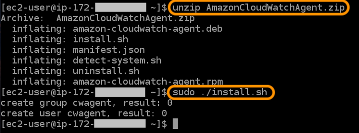

6. Configure the AmazonCloudWatchAgent profile

Before running the CloudWatch agent on any servers, you must create a CloudWatch agent configuration file, which is a JSON file that specifies the metrics and logs that the agent is to collect, including custom metrics. You can create it by using the wizard or by writting it yourself from scratch. Any time you change the agent configuration file, you must then restart the agent to have the changes take effect.

The wizard can autodetect the credentials and AWS Region to use if you have the AWS credentials and configuration files in place. For more information about these files, see [Configuration and Credential Files](https://docs.aws.amazon.com/cli/latest/userguide/cli-config-files.html) in the *AWS Systems Manager User Guide* and the [AWS documentation page](https://docs.aws.amazon.com/AmazonCloudWatch/latest/monitoring/create-cloudwatch-agent-configuration-file.html).

For now, let's start the CloudWatch agent configuration file wizard executing the command below withing the selected EC2 instance.

```
sudo /opt/aws/amazon-cloudwatch-agent/bin/amazon-cloudwatch-agent-config-wizard
```


For this lab we want to keep the following structure:

| CloudWatch Agent Configutation File Wizard                  | Parameter    | 
| ----------------------------------------------------------- |:------------:|
| On which OS are you planning to use the agent?              | 1. Linux     |
| Are you using EC2 or On-Premises hosts?                     | 1. EC2       |
| Which user are you planning to run the agent?               | 2. cwagent   |
| Do you want to turn on StatsD daemon?                       | 2. No        |
| Do you want to monitor metrics from CollectD?               | 2. No        |
| Do you want to monitor any host metrics?                    | 1. Yes       |
| Do you want to monitor cpu metrics per core?                | 2. No        |
| Do you want to add ec2 dimensions?                          | 1. Yes       |
| Would you like to collect your metrics at high resolution?  | 4. 60s       |
| Which default metrics config do you want?                   | 1. Basic     |
| Are you satisfied with the above config?                    | 1. Yes       |
| Do you have any existing CloudWatch Log Agent?              | 2. No        | 
| Do you want to monitor any log files?                       | 2. No        |
| Do you want to store the config in the SSM parameter store? | 2. No        |

The CloudWatch Agent config file should look like the following:

```
{
	"agent": {
			"metrics_collection_interval": 60,
			"run_as_user": "cwagent"
	},
	"metrics": {
			"append_dimensions": {
				"AutoScalingGroupName": "${aws:AutoScalingGroupName}",
				"ImageId": "${aws:ImageId}",
				"InstanceId": "${aws:InstanceId}",
				"InstanceType": "${aws:InstanceType}"
			},
			"metrics_collected": {
				"disk": {
					"measurement": [
						"used_percent"
				],
				"metrics_collection_interval": 60,
					"resources": [
							"*"
				]
			},
			"mem": {
					"measurement": [
						"mem_used_percent"
					],
					"metrics_collection_interval": 60
			}
		}
	}
}
```

7. Start the CloudWatch Agent

```
sudo /opt/aws/amazon-cloudwatch-agent/bin/amazon-cloudwatch-agent-ctl -a fetch-config -m ec2 -c file:/opt/aws/amazon-cloudwatch-agent/bin/config.json -s
```


Now go back to the **Amazon CloudWatch** console page, under the **Metrics** session to validate that you are getting Memory information.


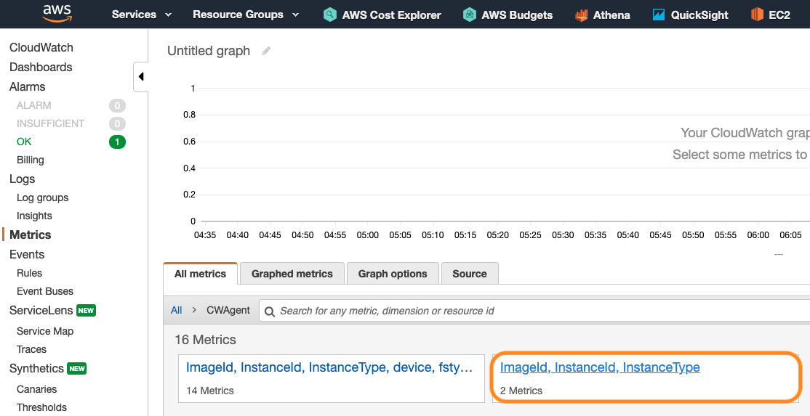
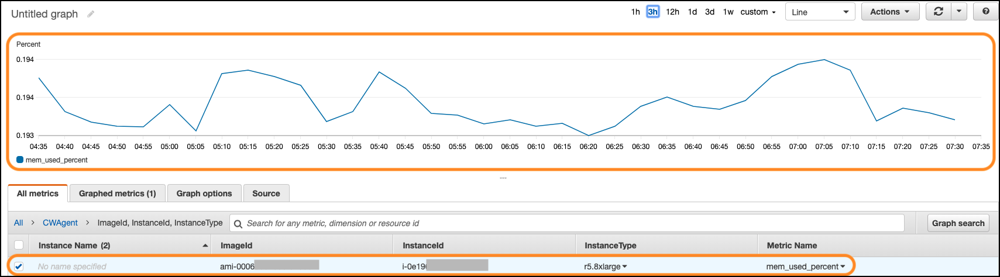

You have now completed the CloudWatch agent installation and will be able to monitor on Amazon CloudWatch the memory utilization of that instance.

**[BONUS]** The next step is not mandatory to complete this lab.

If you have a lot of instances manually installing the CloudWatch agent in each of them is not a scalable option, instead consider using a pre-configured AWS CloudFormation template to automatically install the CloudWatch agent by default on all your stack. As an example on how to do that check the following steps:

- Right-click and save link as: [here](https://raw.githubusercontent.com/awslabs/aws-cloudformation-templates/master/aws/solutions/AmazonCloudWatchAgent/inline/amazon_linux.template) to download the **AWS Cloudformation** template

- Go to the **AWS CloudFormation** console

- Click to **Create Stack** and select **Upload a template file** and point to the downloaded file

- Enter a **Stack Name** and select a **KeyName**

- Enter the tag **Key: Event | Value: myStackforWACostLab**

- Click **Next** and **Create stack**

## 5. Updated Resource Optimization recommendations<a name="EC2_updated_rec"></a>
**NOTE**: In order to complete this step you need to have AWS Resource Optimization enabled, you can do that going to the AWS Cost Explorer, Recommendations (left bar) section.

**Important:** If you have just installed the CloudWatch agent at your instances it may take a couple of days for Amazon Resource Optimization to start to provide updated recommendations, so don't worry if you don't see the memory data during the first checks.

Now that we have Memory data as a custom metric in CloudWatch let's check how that affects the Amazon Resource Optimization recommendations. 

Amazon Resource Optimization offers right sizing recommendations in the AWS Cost Explorer without any additional cost. These recommendations identify likely idle and underutilized instances across your accounts, regions and tags. To generate these recommendations, AWS analyzes your historical EC2 resource usage (last 14 days using Amazon CloudWatch) and your existing reservation footprint to identify opportunities for cost savings. There are two types of recommended actions: **Terminate** if the instance is considered idle (*max CPU utilization is at or below 1%*) or **Downsize** if the instance is underutilized (*max CPU utilization is between 1% and 40%*).

By default Amazon Resource Optimization doesn't need memory datapoint to provide recommendations, but if that information is available it will take that into consideration updating the **Downsize** recommendation for instances that now have *max CPU and MEM utilization between 1% and 40%* over the past 14 days.

That said during this step we will compare how that recommendation is impacted for two instances from the same family/generation where only one has the available.

1. Navigate to the **AWS Cost Explorer** page
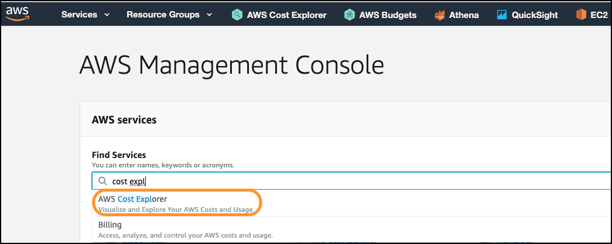

2. Select **Recommendations** in the left menu bar


3. Click on the **View All** link associated with the **AWS Resource Optimization Recommendations** section. 
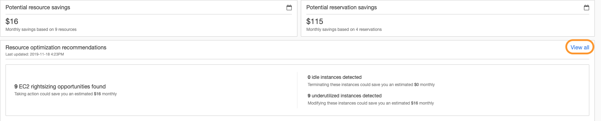

In case you haven’t enabled the Amazon EC2 Resource Optimization please do so (no additional cost), it may take up to 24 hours in order to generate your first recommendations. Only regular or payer accounts can enable it and by default both linked and payer accounts will be able to access their rightsizing recommendations unless the payer account specifically prohibits it on the settings page (top right).


4. Assuming you had enabled the AWS Resource Optimization Recommendations, you will be presented with a screen that provides recommendations (if any exists). Click to view the **Resource Optimization** recommendations.


- **Optimization opportunities** – The number of recommendations available based on your resources and usage
- **Estimated monthly savings** – The sum of the projected monthly savings associated with each of the recommendations provided
- **Estimated savings (%)** – The available savings relative to the direct Amazon EC2 costs (On-Demand) associated with the instances in the recommendation list

You can also filter your recommendations by the type of action (Idle and Underutilized), Linked Account, Region and Tag. 

5. Understanding the AWS Resource Optimization recommendations.

In the example below we have a recommendation to downsize the **t2.micro** (1vCPU *for a 2h 24m burst* and 1GB RAM) to a **t2.nano** (1vCPU *for a 1h 12m burst* and 0.5 GB RAM) and save $12 USD per year.

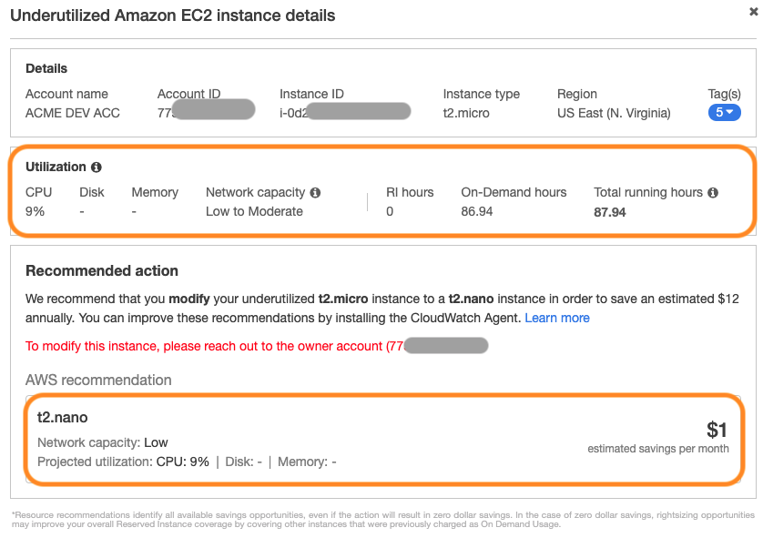

Over the past 14 days the maximum CPU utilization for this instance was only 9% and this instance was running for 86 hours and all of these were On Demand hours. Observe that there is no memory information available so AWS Resource Optimization will ignore that datapoint and recommend to downsize to a t2.nano that have half of the memory available of a t2.micro. 

That can be risky and waste engineer time when testing if the proposed right sizing option is valid or not. That said you can improve the accuracy of this recommendation with the CloudWatch agent we just installed.

In this other example we also see a recommendation to downsize a r5.8xlarge (32 vCPU and 256GB RAM) to a r5.4xlarge (16 vCPU and 128GB RAM) and save $2,412 USD per year.
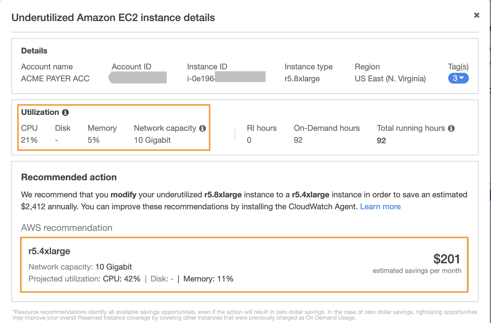

On this case we have both CPU and Memory information available: the maximum CPU utilization was 21% and Memory was only 5%. That makes the case for downsize much stronger and the recommendation will even try estimate the CPU and Memory utilization for the new instance size. Keep in mind that this is just a simple estimation based on the past utilization data from CloudWatch, before executing the modification all the required load tests must be performed to avoid any impacts on your workload.

As explained above the AWS Resource Optimization logic will recommend to downsize any instances where the maximum CPU utilization was between 1% to 40% over the past 14 days. If you do have memory information available the AWS Resource Optimization will now consider to downsize instances that have *both CPU and Memory* maximum utilization between 1% and 40%.

## 6. Amazon EC2 Right Sizing Best Practices<a name="EC2_RS_best_practices"></a>
* **Start simple:** idle resources, non-critical development/QA and previous generation instances will require less testing hours and provide quick wins (The Amazon EC2 Launch time statistics can be used to identify instances that have been running longer than others and is a good statistic to sort your Amazon EC2 instances by).

* **Right Size before performing a migration:** If you skip right sizing to save time, your migration speed might increase, but you will end up with higher cloud infrastructure spend for a potentially longer period of time. Instead, leverage the test and QA cycles during a migration exercise to test several instance types and families.  Also, take that opportunity to test different sizes and burstable instances like the “t” family.

* **The best right sizing starts on day 1:** As you perform right sizing analysis, and ultimately rightsize resources, ensure any learnings are being shared across your organization and influencing the design of new workloads.

* **Measure Twice, Cut Once: Test, then test some more:** The last thing you want is for a new resource type to be uncapable of handling load, or functioning incorrectly.

* **Test once and perform multiple right sizing:** Aggregate instances per autoscaling group and tags to scale right sizing activities.

* **Combine Reserved Instance or Savings Plans strategy with Right Sizing to maximize savings:** For Standard RIs and EC2 Instance SP: Perform your pricing model purchases after rightsizing and for Convertible RIs, exchange them after rightsizing. Compute Savings plan will automatically adjust the commitment for the new environment.

* **Ignore burstable instance families (T types):** These families are designed to typically run at low CPU percentages for significant periods of time and shouldn’t be part of the instance types being analyzed for rightsizing.

## 7. Reference Material<a name="EC2_RS_ref_material"></a>

* [AWS Cost Optimization](aws.amazon.com/pricing/cost-optimization/)

* [AWS Well Architect Cost Opt Whitepaper](d1.awsstatic.com/whitepapers/architecture/AWS-Cost-Optimization-Pillar.pdf)

* [Laying the foundation for Cost Opt Whitepaper](d1.awsstatic.com/whitepapers/cost-optimization-laying-the-foundation.pdf)

* [AWS Cost Management Products](aws.amazon.com/aws-cost-management/)

* [AWS Cost Management Blog](aws.amazon.com/blogs/aws-cost-management/)

* [Case Studies and Research](aws.amazon.com/solutions/case-studies)

## 7. Tear down<a name="tear_down"></a>  
This exercise explained step by step how to install the CloudWatch agent in an EC2 instance in order to improve the recommendation accuracy of AWS Resource Optimization. After the lab is concluded make sure to turn of the EC2 instance that was created (t2.micro) and delete the IAM roles created to give the agent permission to write on CloudWatch.

## 8. Rate this lab<a name="rate_lab"></a>  
[](http://dx1572sre29wk.cloudfront.net/Cost_100_1_1star) [](http://dx1572sre29wk.cloudfront.net/Cost_100_1_2star) [](http://dx1572sre29wk.cloudfront.net/Cost_100_1_3star) [](http://dx1572sre29wk.cloudfront.net/Cost_100_1_4star) [](http://dx1572sre29wk.cloudfront.net/Cost_100_1_5star) 


## 9. Survey <a name="survey"></a>
Thanks for taking the lab, We hope that you can take this short survey (<2 minutes), to share your insights and help us improve our content.

[](https://amazonmr.au1.qualtrics.com/jfe/form/SV_cvavNi7IbbzCyfX)

This survey is hosted by an external company (Qualtrics), so the link above does not lead to our website.  Please note that AWS will own the data gathered via this survey and will not share the information/results collected with survey respondents.  Your responses to this survey will be subject to Amazons Privacy Policy.
 
