# Level 200: Pricing Model Analysis

## Authors
- Nathan Besh, Cost Lead, Well-Architected (AWS)
- Nataliya Godunok, Technial Account Manager (AWS)

## Feedback
If you wish to provide feedback on this lab, there is an error, or you want to make a suggestion, please email: costoptimization@amazon.com


# Table of Contents
1. [Create Pricing Data Sources](#pricing_sources)
2. [Create the Usage Data Source](#usage_source)
3. [Setup QuickSight Dashboard](#quicksight_setup)
4. [Create the Recommendation Dashboard](#recommendation_dashboard)
5. [Format the Recommendation Dashboard](#format_dashboard)
6. [Teardown](#tear_down)
7. [Rate this Lab](#rate_lab)


<a name="pricing_sources"></a>
## 1. Create Pricing Data Sources
Create S3 bucket with folders, lambda functions, CloudWatch event, table in Athena


### 1.1. Create S3 Bucket and Folders
Create a **single S3 bucket** that contains **two folders** - **od_pricedata** and **sp_pricedata**, these will contain the on-demand pricing data and the Savings Plans pricing data.

1. Log into the console as an IAM user with the required permissions, go to the **S3** service page:


2. Click **Create bucket**:

3. Enter a **Bucket name** (we have used sptool-pricingfiles, you will need to use a unique bucket name) and click **Create bucket**:


4. Click on the **(bucket name)**:


5. Click **Create folder**:
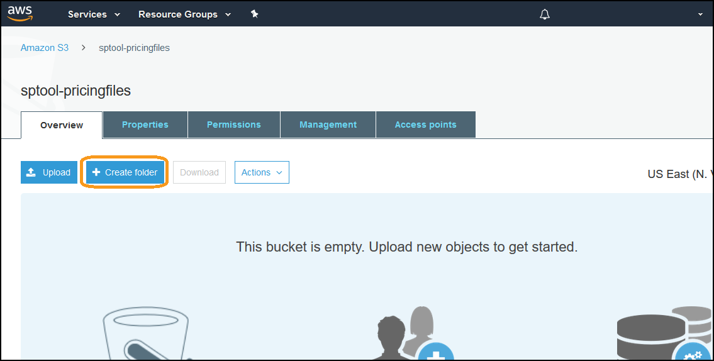

6. Enter a folder name of **od_pricedata**, click **Save**:
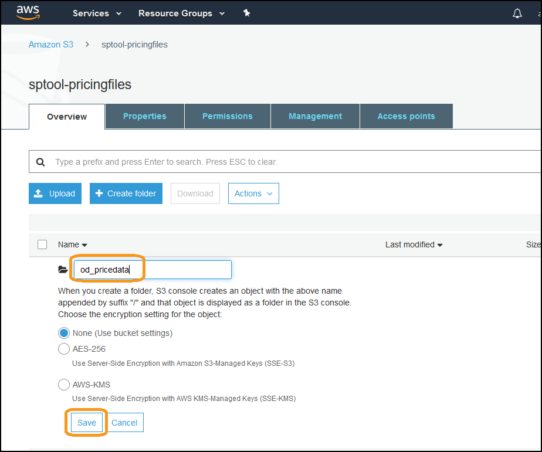

7. Click **Create folder**:


8. Enter a folder name of **sp_pricedata**, click **Save**:


You have now setup the S3 bucket with the two folders that will contain the OnDemand and Savings Plans pricing data.
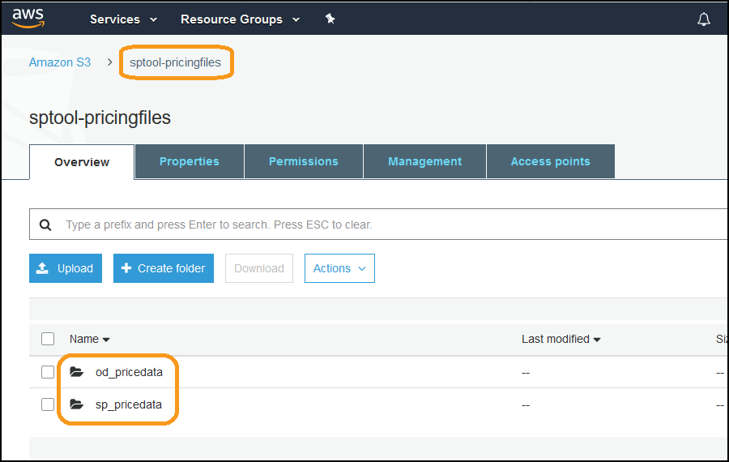


### 1.2. Setup On-Demand Pricing Lambda Function
Create the On-Demand Lambda function to get the pricing information, and extract the required parts from it.

1. Go to the **Lambda** service page:


2. Click **Create function**:


3. Enter the following details:
    - Select: **Author from scratch**
    - Function name: **SPTool_ODPricing_Download**
    - Runtime: **Python** (Latest)
    - Execution Role: **Create a new role**
    - Role name: **SPTool_Lambda**

4. Click **Create function**


5. Copy and paste the following code into the **Function code** section:

    <details>
    <summary> Click here to see the function code</summary>
    
        # Lambda Function Code - SPTool_OD_pricing_Download
        # Function to download OnDemand pricing, get out the required lines & upload it to S3 as a zipped file
        # It will find 'OnDemand' and 'Compute Instance', and write to a file
        # Written by natbesh@amazon.com
        # Please reachout to costoptimization@amazon.com if there's any comments or suggestions
        import boto3
        import gzip
        import urllib3

        def lambda_handler(event, context):

            # Create the connection
            http = urllib3.PoolManager()

            try:
                # Get the EC2 OnDemand pricing file, its huge >1GB
                r = http.request('GET', 'https://pricing.us-east-1.amazonaws.com/offers/v1.0/aws/AmazonEC2/current/index.csv')

                # Put the response data into a variable & split it into an array line by line
                plaintext_content = r.data
                plaintext_lines = plaintext_content.splitlines()

                # Varaible to hold the OnDemand pricing data
                pricing_output = ""

                # Go through each of the pricing lines to find the ones we need
                for line in plaintext_lines:

                    # If the line contains 'OnDemand' or 'Compute Instance' then add it to the output string
                    if ((str(line).find('OnDemand') != -1) and (str(line).find('RunInstances') != -1)):
                        pricing_output += str(line.decode("utf-8"))
                        pricing_output += "\n"

                # Add the output to a local temporary file & zip it
                with gzip.open('/tmp/od_pricedata.txt.gz', 'wb') as f:
                    f.write(pricing_output.encode())

                # Upload the zipped file to S3
                s3 = boto3.resource('s3')

                # Specify the local file, the bucket, and the folder and object name - you MUST have a folder and object name
                s3.meta.client.upload_file('/tmp/od_pricedata.txt.gz', 'bucket_name', 'od_pricedata/od_pricedata.txt.gz')

            # Die if you cant get the pricing file                
            except Exception as e:
                print(e)
                raise e

            # Return happy
            return {
                'statusCode': 200
            }
    </details>

6. Edit the pasted code, replacing **bucket_name** with the name of your bucket:


7. Edit **Basic settings** below:
    - Memory: **2688MB**
    - Timeout: **5min**
    - Click **save**
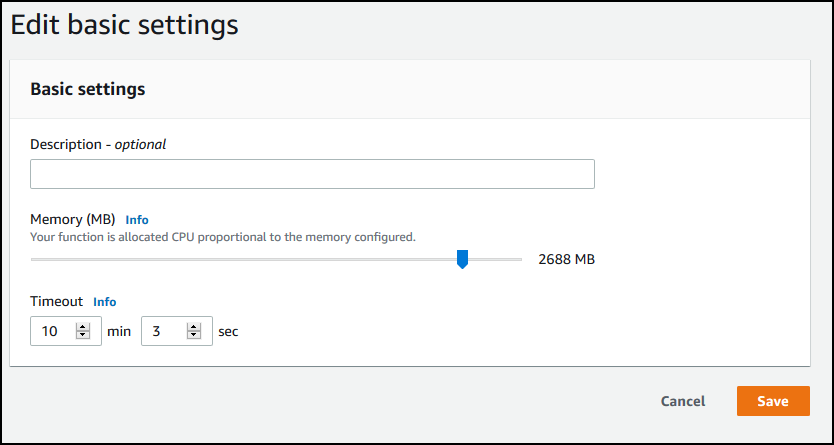

8. Scroll to the top and click **Test**
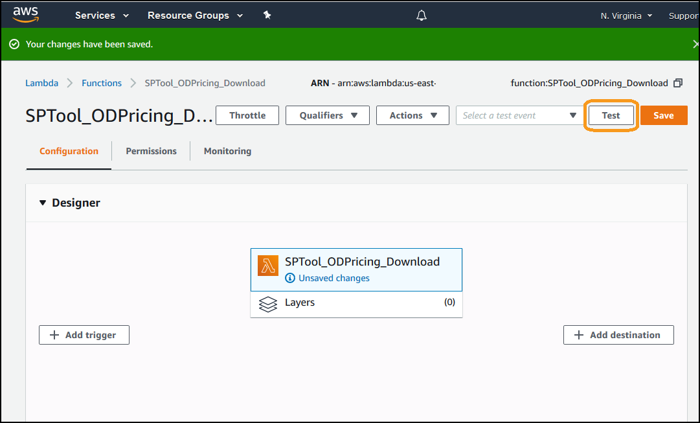

9. Enter an **Event name** of **Test**, click **Create**:
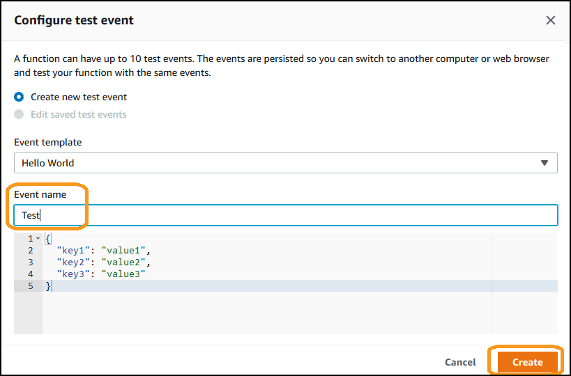

10. Click **Save**:


11. Click on **Permissions**:


12. Right-click(open link in new tab) **View the SPTool_Lambda role** to open the role in the IAM Service page:
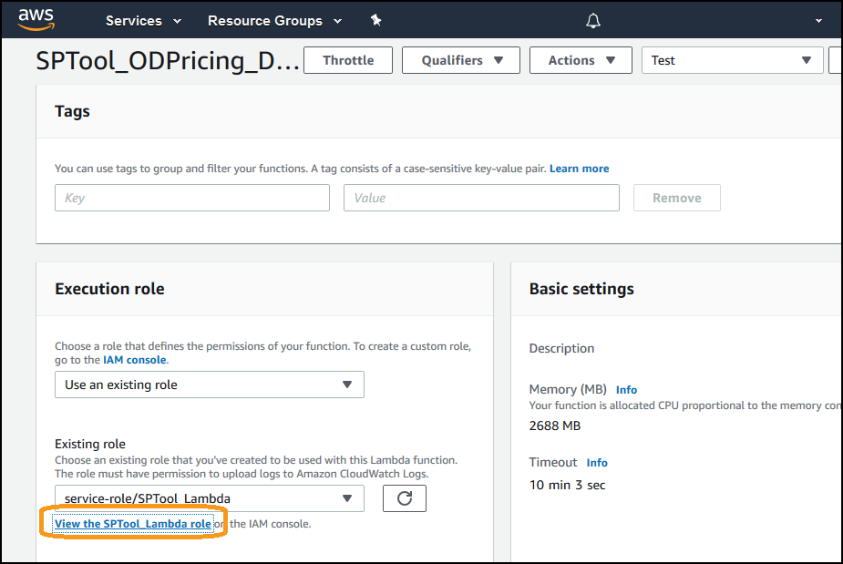

13. Click on **Attach policies**:
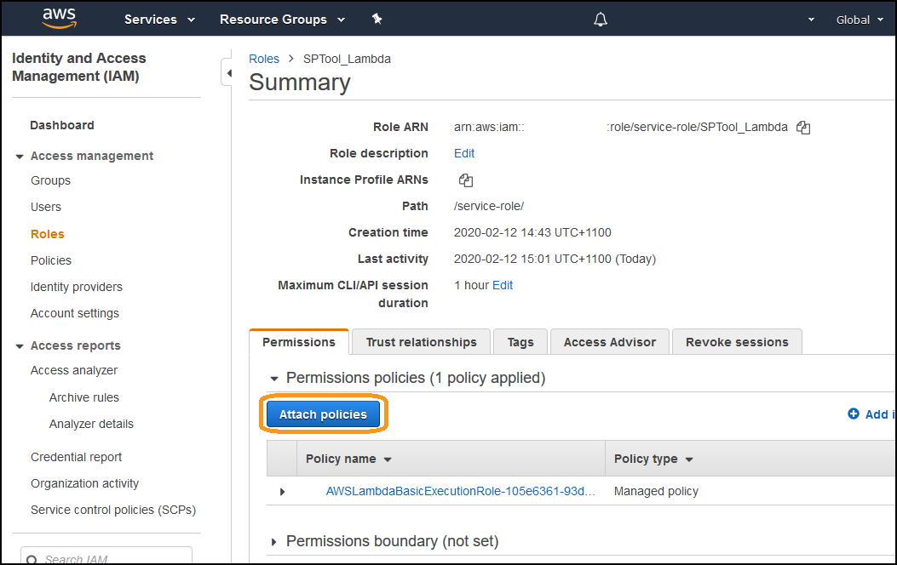

14. Click on **Create policy**:
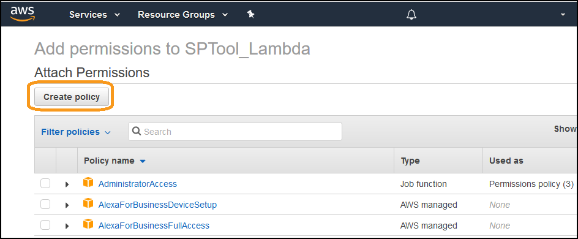

15. Create a policy to allow object write to your S3 bucket created, and click **Review policy**:


16. Name the policy **s3_pricing_lambda**, optionally and add a description, click **Create policy**:


17. Click on **Roles**:


18. Click on the role **SPTool_Lambda**:


19. Click **Attach policies**:


20. Click **Filter Policies** and select **Customer managed**:
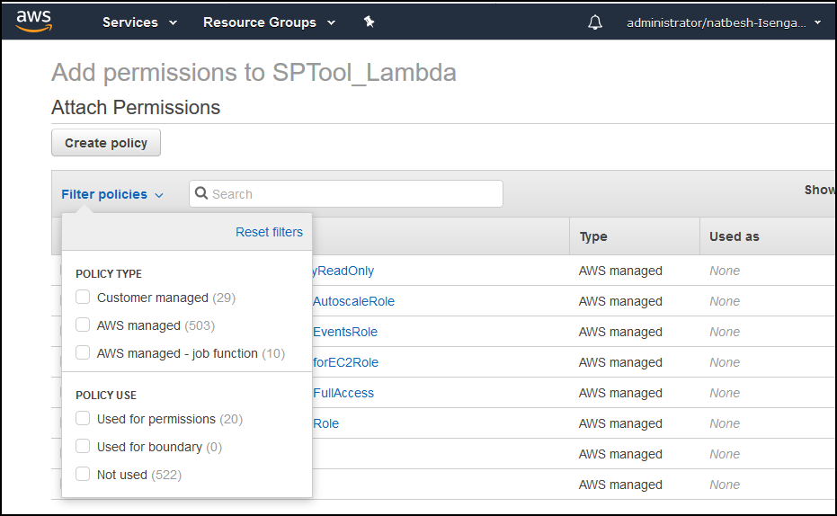

21. Select the **S3_pricing_lambda** policy and click **Attach policy**:


22. Go back to the **Lambda** service page and click **Test**:
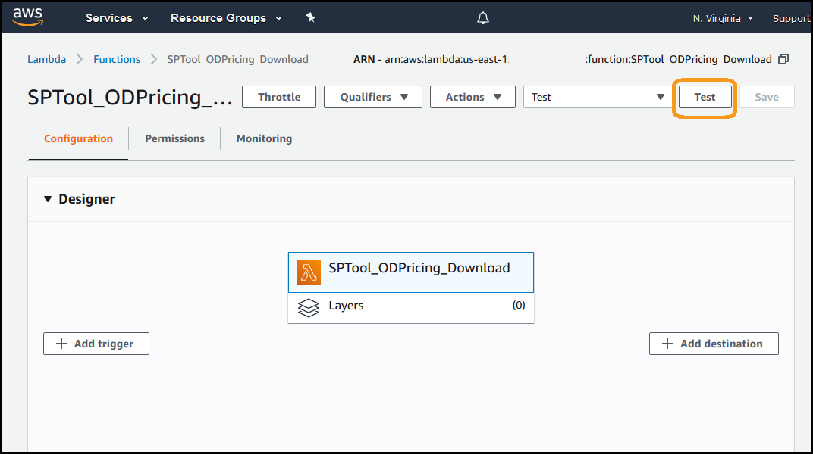

23. The function will run, it will take a minute or two given the size of the pricing files and processing required, then return success. Click **Details** and verify there is headroom in the configured resources and duration to allow any increases in pricing file size over time:
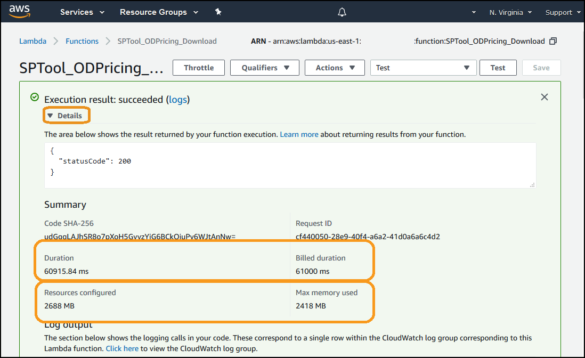

24. Go to your S3 bucket and into the **od_pricedata** folder and you should see a gz file of non-zero size is in it:


### 1.3. Setup Savings Plan Pricing Lambda Function
Create the Savings Plan Lambda function to get the pricing information, and extract the required parts from it.

1. Go to the **Lambda** service page:


2. Click **Create function**:


3. Enter the following details:
    - Select: **Author from scratch**
    - Function name: **SPTool_SPPricing_Download**
    - Runtime: **Python** (Latest)
    - Execution Role: **Use an existing role**
    - Role name: **SPTool_Lambda**

4. Click **Create function**


5. Copy and paste the following code into the **Function code** section:

    <details>
    <summary> Click here to see the function code</summary>

        # Lambda Function Code - SPTool_SP_pricing_Download
        # Function to download SavingsPlans pricing, get out the required lines & upload it to S3 as a zipped file
        # It will get each regions pricing file in CSV, find 'Usage' and '1yr', and write to a file
        # Written by natbesh@amazon.com
        # Please reachout to costoptimization@amazon.com if there's any comments or suggestions
        import boto3
        import gzip
        import urllib3
        import json

        def lambda_handler(event, context):

            # Create the connection
            http = urllib3.PoolManager()

            try:
                # Get the SavingsPlans pricing index file, so you can get all the region files, which have the pricing in them
                r = http.request('GET', 'https://pricing.us-east-1.amazonaws.com/savingsPlan/v1.0/aws/AWSComputeSavingsPlan/current/region_index.json')

                # Load the json file into a variable, and parse it
                sp_regions = r.data
                sp_regions_json = (json.loads(sp_regions))

                # Variable to hold all of the pricing data, its large at over 150MB
                sp_pricing_data = ""

                # Cycle through each regions pricing file, to get the data we need
                for region in sp_regions_json['regions']:

                    # Get the CSV URL
                    url = "https://pricing.us-east-1.amazonaws.com" + region['versionUrl']
                    url = url.replace('.json', '.csv')

                    # Create a connection & get the regions pricing data CSV file
                    http = urllib3.PoolManager()
                    r = http.request('GET', url)
                    spregion_content = r.data

                    # Split the lines into an array
                    spregion_lines = spregion_content.splitlines()

                    # Go through each of the pricing lines
                    for line in spregion_lines:

                        # If the line has 'Usage' then grab it for pricing data, exclude all others
                        if (str(line).find('Usage') != -1):
                            sp_pricing_data += str(line.decode("utf-8"))
                            sp_pricing_data += "\n"

                # Compress the text into a local temporary file
                with gzip.open('/tmp/sp_pricedata.txt.gz', 'wb') as f:
                    f.write(sp_pricing_data.encode())

                # Upload the file to S3
                s3 = boto3.resource('s3')

                # Specify the local file, the bucket, and the folder and object name - you MUST have a folder and object name
                s3.meta.client.upload_file('/tmp/sp_pricedata.txt.gz', 'bucket_name', 'sp_pricedata/sp_pricedata.txt.gz')

            # Die if you cant get the file
            except Exception as e:
                print(e)
                raise e

            # Return happy
            return {
                'statusCode': 200
            }
    </details>

6. Edit the pasted code, replacing **bucket_name** with the name of your bucket:


7. Edit Basic settings below:
    - Memory: **2688MB**
    - Timeout: **5min**
    - Click **save**


8. Scroll to the top and click **Test**


9. Enter an **Event name** of **Test**, click **Create**:


10. Click **Save**:


11. Click **Test**:


12. The function will run, it will take a minute or two given the size of the pricing files and processing required, then return success. Click **Details** and verify there is headroom in the configured resources and duration to allow any increases in pricing file size over time:
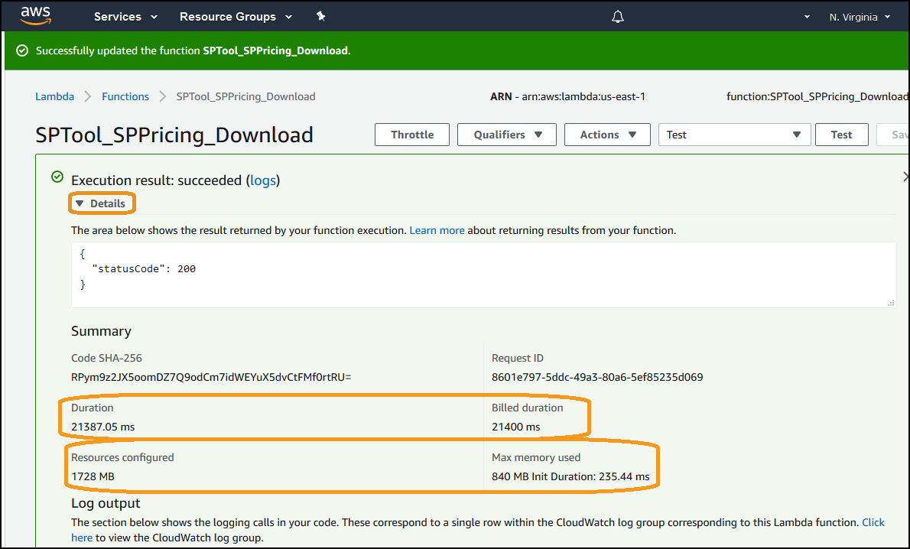

13. Go to your S3 bucket and into the **sp_pricedata** folder and you should see a gz file of non-zero size is in it:
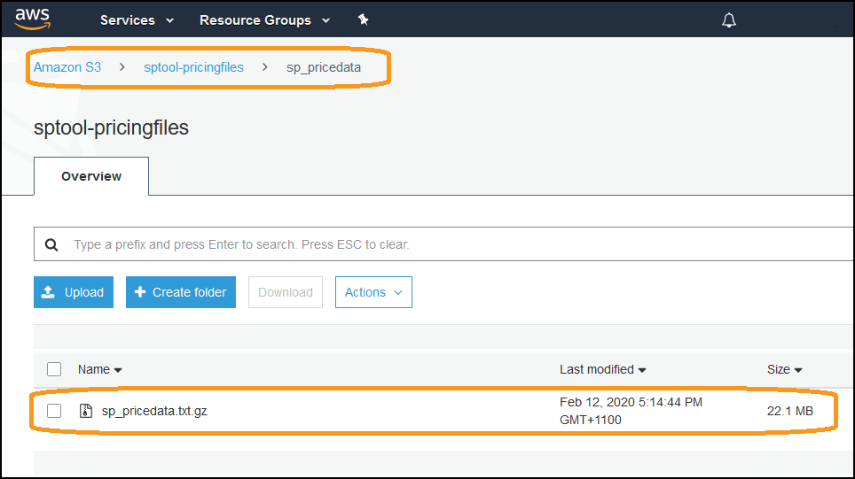


### 1.4 CloudWatch Events Setup
We will setup a CloudWatch Event to periodically run the Lambda functions, this will update the pricing and include any newly released instances.

1. Go to the CloudWatch service page:
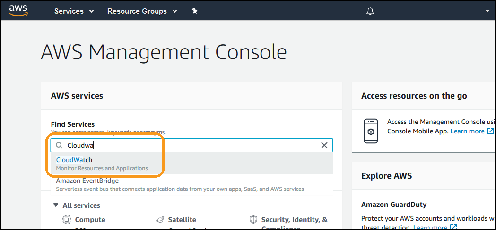

2. Click on **Events**, then click **Rules**:


3. Click **Create rule**


4. For the **Event Source** select **Schedule** and set the required period, we have selected **5 days**, click **Add target**:


5. Add the **SPTool_ODPricing_Download** Lambda function, and click **Add target**:


6. Add the **SPTool_SPPricing_Download** Lambda function, and click **Configure details**:


7. Add the name **SPTool-pricing**, optionally add a description and click **Create rule**:
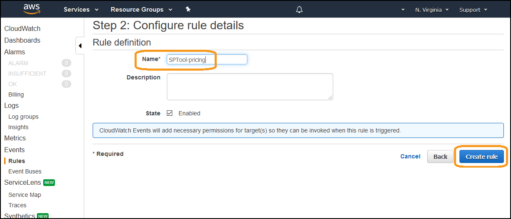

You have now successfully configured a CloudWatch event, it will run the two Lambda functions and update the pricing information every 5 days.


### 1.5 Prepare the Pricing Data Source
We will prepare a pricing data source which we will use to join with the CUR. In this example we will take 1 year No Upfront Savings Plans rates and join them to On-Demand pricing. You can modify this part to select 3 year or Partial or All-Upfront rates.

1. Go to the **Glue** Service page:


2. Click **Crawlers** from the left menu:
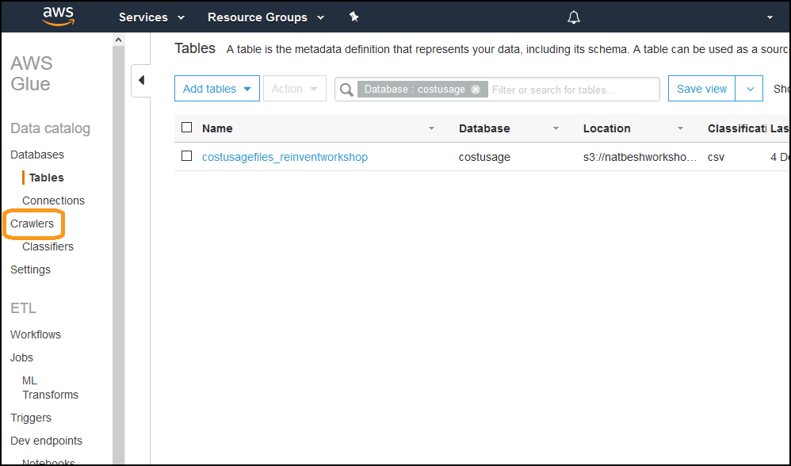

3. Click **Add crawler**:


4. Enter a crawler name of **OD_Pricing** and click **Next**:


5. Ensure **Data stores** is the source type, click **Next**:
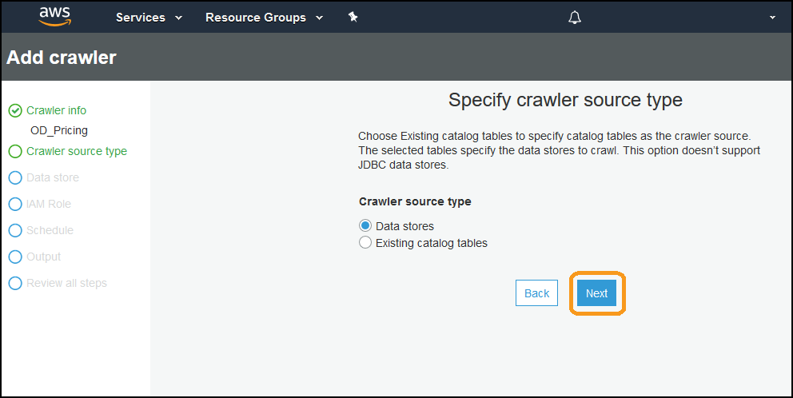

6. Click the folder icon to list the S3 folders in your account:


7. Expand the bucket which contains your pricing folders, and select the folder name **od_pricedata**, click **Select**:
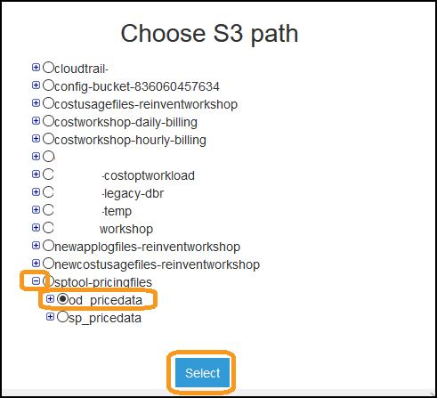

8. Click **Next**:


9. Click **Next**:


10. **Create an IAM role** with a name of **SPToolPricing**, click **Next**:


11. Leave the frequency as **Run on demand**, and click **Next**:
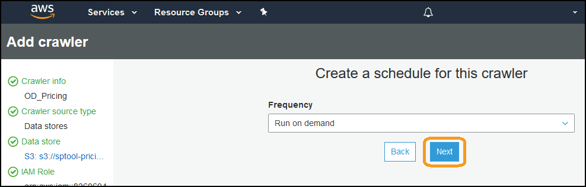

12. Click on **Add database**:


13. Enter a database name of **pricing**, and click **Create**:
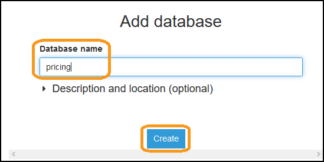

14. Click **Next**:
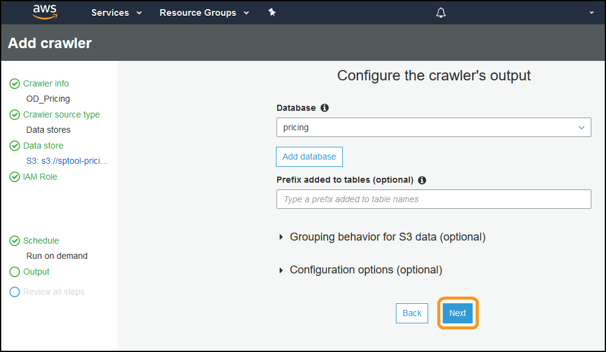

15. Click **Finish**:


16. Select the crawler **OD_Pricing** and click **Run crawler**:


17. Once its run, you should see tables created:


18. Repeat **Steps 3 through to 17** with the following details:
    - Crawler name: **SP_Pricing**
    - Include path: **s3://(pricing bucket)/sp_pricedata** (replace pricing bucket)
    - IAM Role: **Choose an existing IAM role** and **AWSGlueServiceRole-SPToolPricing**
    - Database: **pricing**

19. Open the **IAM Console** in a new tab, click **Policies**:


20. Click on the **AWSGlueServiceRole-SPToolPricing** role:


21. Type in **SPTool** and click on the policy name **AWSGlueServiceRole-SPTool**:


22. Click **Edit policy**:
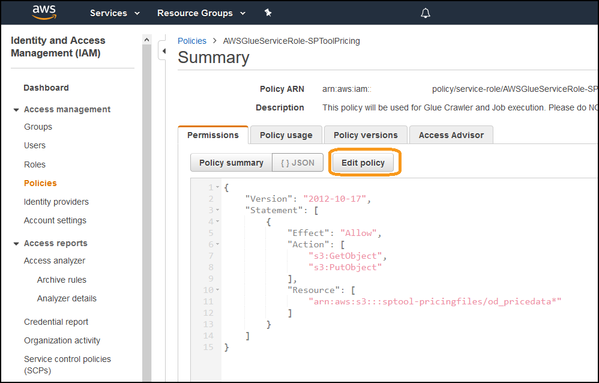

23. Click **JSON**:
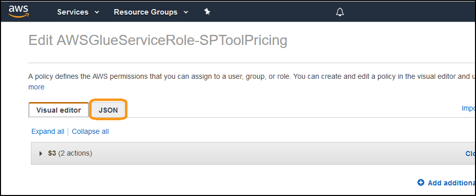

24. Edit the **Resource** line by removing the **OD_Pricing** folder to leave the bucket:


25. Click **Review policy**:
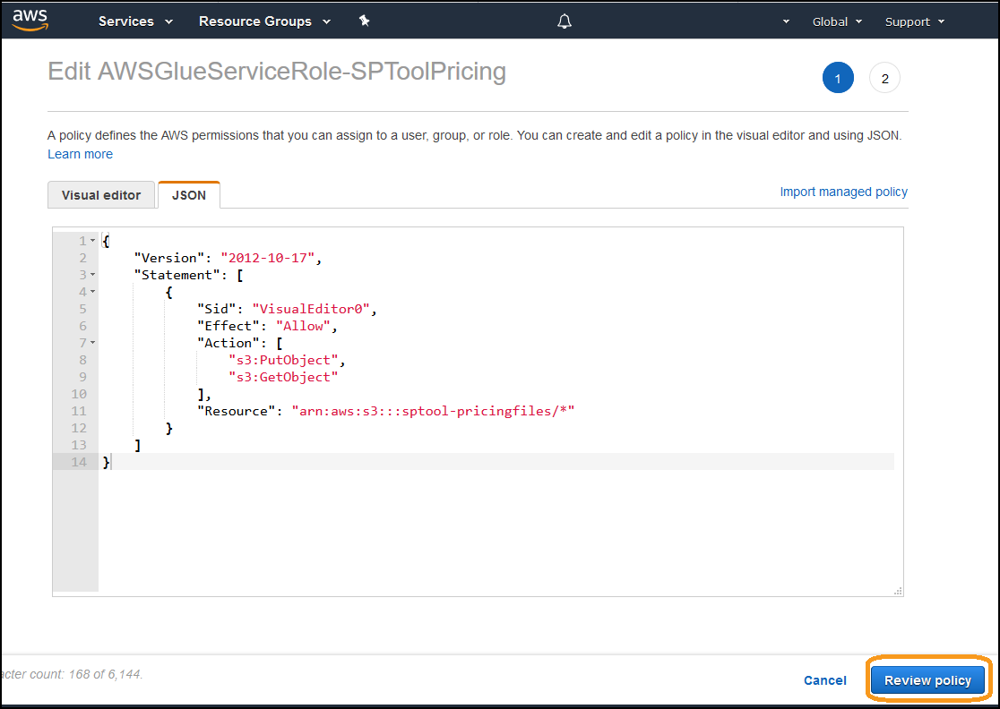

26. Click **Save changes**:


27. Go back to the Glue console, select the **SP_Pricing** crawler, click **Run crawler**:
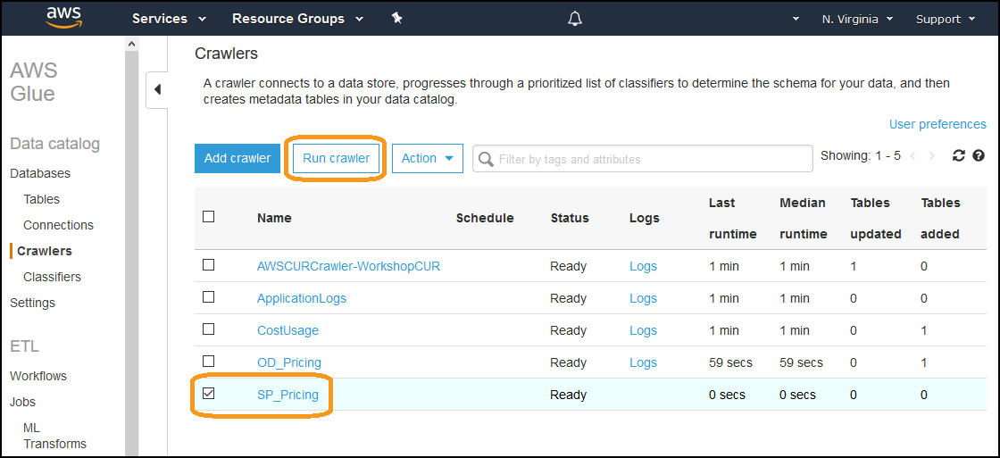

28. Click on **Databases**:


29. Click on **Pricing**:


30. Click **Tables in pricing**:
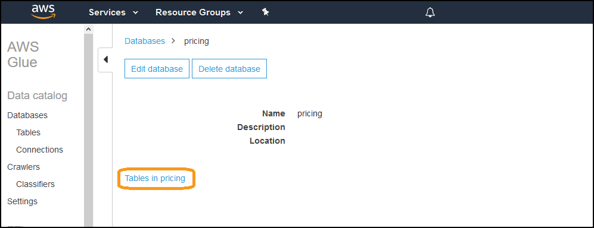

31. Click **od_pricedata**:
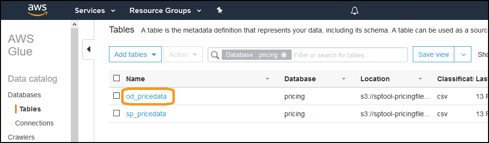

32.Click **Edit schema**:


33. Click **double** next to **col9**:


34. Select **string** and click **Update**:


35. Click **Save**:
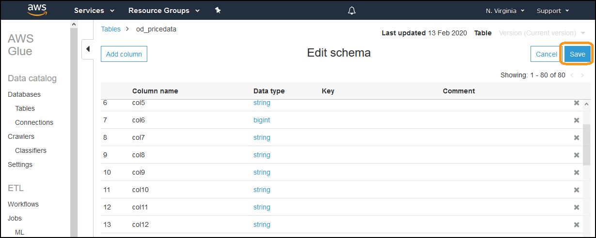


<a name="usage_source"></a>
## 2. Create the Usage Data Source
We will combine the pricing information with our Cost and Usage Report (CUR). This will give us a usage data source which contains a summary of your usage at an hourly level, with multiple pricing dimensions.

1. Go to the **Athena** service page:
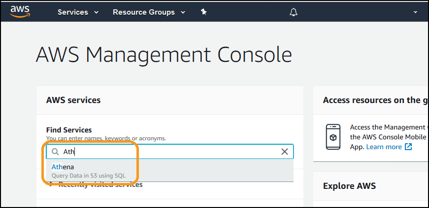

2. Run the following query to create a single pricing data source, combining the OD and SP pricing:

    <details>
    <summary> Click here to see the Athena SQL code</summary>

        CREATE VIEW pricing.pricing AS SELECT
        sp.location AS Region,
        sp.discountedoperation AS OS,
        REPLACE(od.col18, '"') AS InstanceType,
        REPLACE(od.col35, '"') AS Tenancy,
        REPLACE(od.col9, '"') AS ODRate,
        sp.discountedrate AS SPRate

        FROM pricing.sp_pricedata sp
        JOIN pricing.od_pricedata od ON
        ((sp.discountedusagetype = REPLACE(od.col46, '"'))
        AND (sp.discountedoperation = REPLACE(od.col47, '"')))

        WHERE od.col9 IS NOT NULL
        AND sp.location NOT LIKE 'Any'
        AND sp.purchaseoption LIKE 'No Upfront'
        AND sp.leasecontractlength = 1
    </details>

3. Next we'll join the CUR file with that pricing source as a view. Edit the following query, replace **cur.curfile** with your existing database name and tablename of your CUR, then run the rollowing query:

    <details>
    <summary> Click here to see the Athena SQL code</summary>

        CREATE VIEW cur.SP_Usage AS SELECT
        cur.line_item_usage_account_id,
        cur.line_item_usage_start_date,
        to_unixtime(cur.line_item_usage_start_date) AS EpochTime,
        cur.product_instance_type,
        cur.product_location,
        cur.product_operating_system,
        cur.product_tenancy,
        SUM(cur.line_item_unblended_cost) AS ODPrice,
        SUM(cur.line_item_unblended_cost*(cast(pr.SPRate AS double)/cast(pr.ODRate AS double))) SPPrice,
        abs(SUM(cast(pr.SPRate AS double)) - SUM (cast(pr.ODRate AS double))) / SUM(cast(pr.ODRate AS double))*100 AS DiscountRate,
        SUM(cur.line_item_usage_amount) AS InstanceCount

        FROM cur.curfile cur
        JOIN pricing.pricing pr ON (cur.product_location = pr.Region)
        AND (cur.line_item_operation = pr.OS)
        AND (cur.product_instance_type = pr.InstanceType)
        AND (cur.product_tenancy = pr.Tenancy)

        WHERE cur.line_item_product_code LIKE '%EC2%'
        AND cur.product_instance_type NOT LIKE ''
        AND cur.product_operating_system NOT LIKE 'NA'
        AND cur.line_item_unblended_cost > 0

        GROUP BY cur.line_item_usage_account_id,
        cur.line_item_usage_start_date,
        cur.product_instance_type,
        cur.product_location,
        cur.product_operating_system,
        cur.product_tenancy

        ORDER BY cur.line_item_usage_start_date ASC,
        DiscountRate DESC
    </details>

4. Verify the data source is setup by editing the following query, replace **cur.** with the name of the database and run the following query:
```SQL
SELECT * FROM cur.sp_usage limit 10;
```

You now have your usage data source setup with your pricing dimensions. You can modify the queries above to add or remove any columns you want in the view, which can later be used to visualize the data, for example tags.


<a name="quicksight_setup"></a>
## 3. Setup QuickSight Dashboard
We will now setup the QuickSight dashboard to visualize your usage by cost, and setup the analysis to provide Savings Plan recommendations.

1. Go to the QuickSight service:


2. Click on your username in the top right:
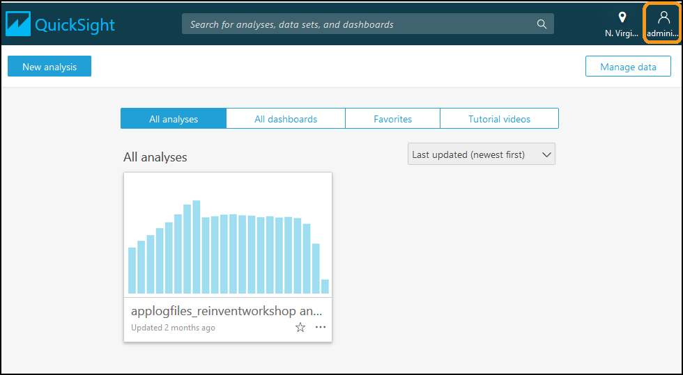

3. Click **Manage QuickSight**:


4. Click **Security & permissions**, then click **Add or remove**:


5. Click **Details** next to Amazon S3:
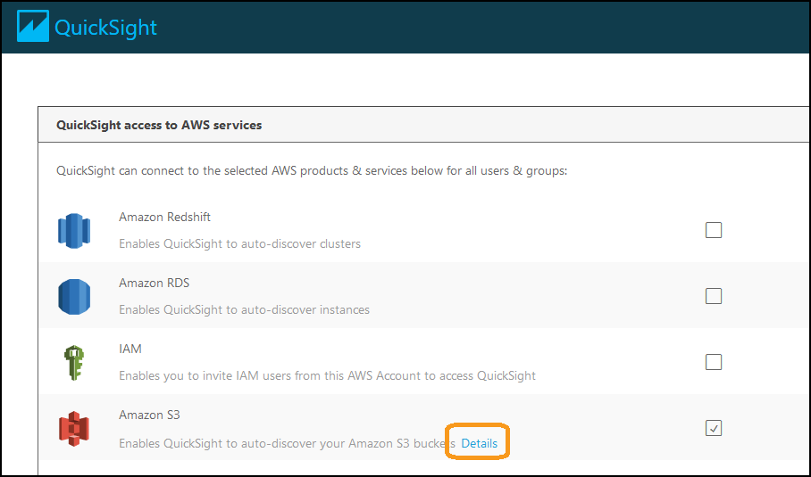

6. Click **Select S3 buckets**:
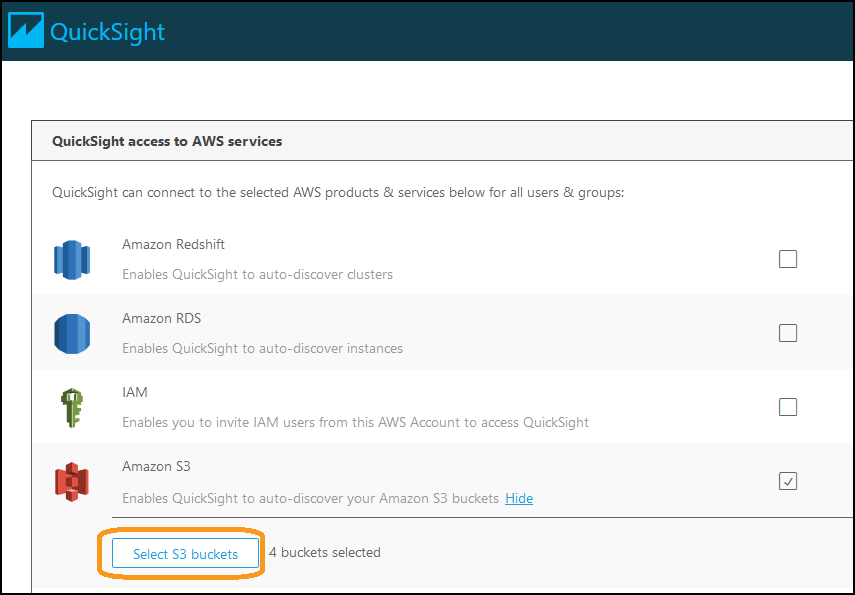

7. Select your **pricing bucket** and click **Finish**:


8. Scroll down and click **Update**:
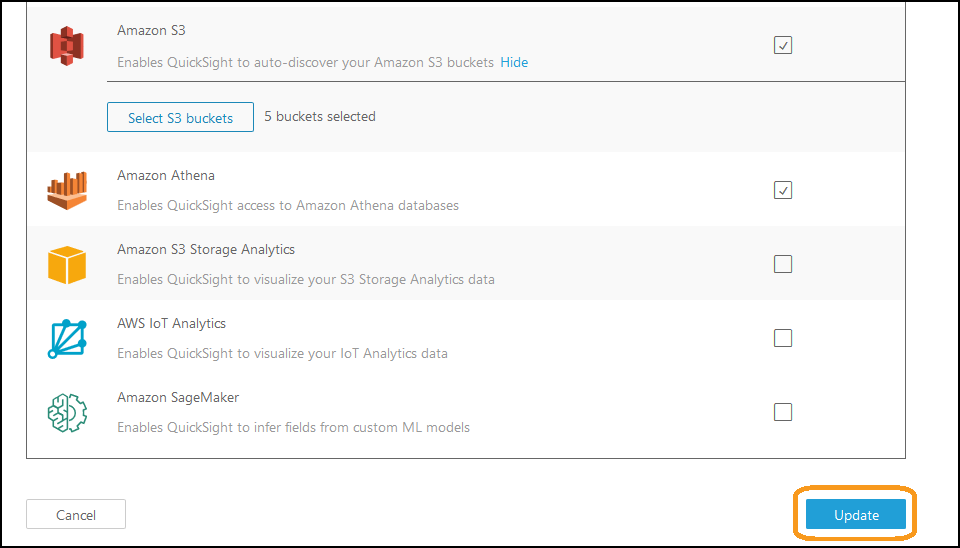

9. Click on **QuickSight** to go to the home page:
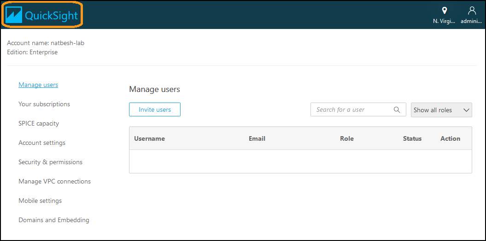

10. Click on **Manage data**:
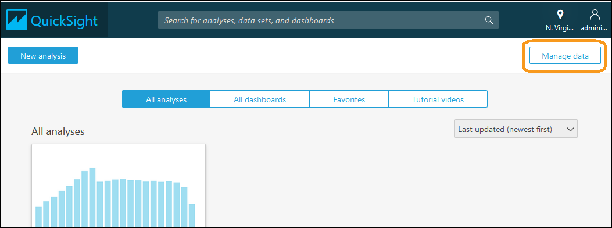

11. Click on **New data set**:


12. Click **Athena**:


13. Enter a Data source name of **SP_Usage** and click **Create data source**:


14. Select the **cur** database, and the **sp_usage** table, click **Select**:
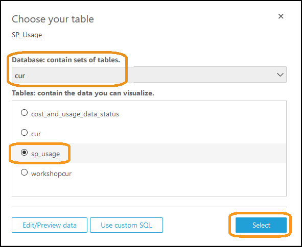

15. Ensure SPICE is selected, click **Visualize**:
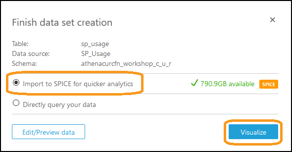

16. Click on **QuickSight** to go to the home page:


17. Click on **Manage data**:


18. Select the **sp_usage** Dataset:


19. Click **Schedule refresh**:


20. Click **Create**:


21. Enter a schedule, it needs to be refreshed daily, and click **Create**:
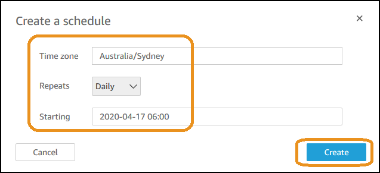

22. Click **Cancel** to exit: 
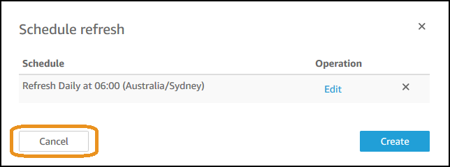

23. Click the **x** in the top corner:
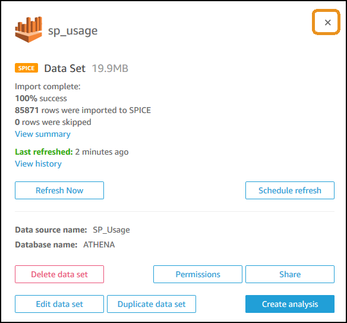


<a name="recommendation_dashboard"></a>
## 4. Create the Recommendation Dashboard

1. Go to the QuickSight service homepage:


2. Go to the **sp_usage analysis**: 


3. Create a line chart, add **line_item_usage_start_date** to the **X axis**, aggregate **day**. Add **spprice** to the **Value** and set the aggregate to **min**. Drag the **product_instance_type** to **Colour** field well. Change the title to **Usage in Savings Plan Rates**:
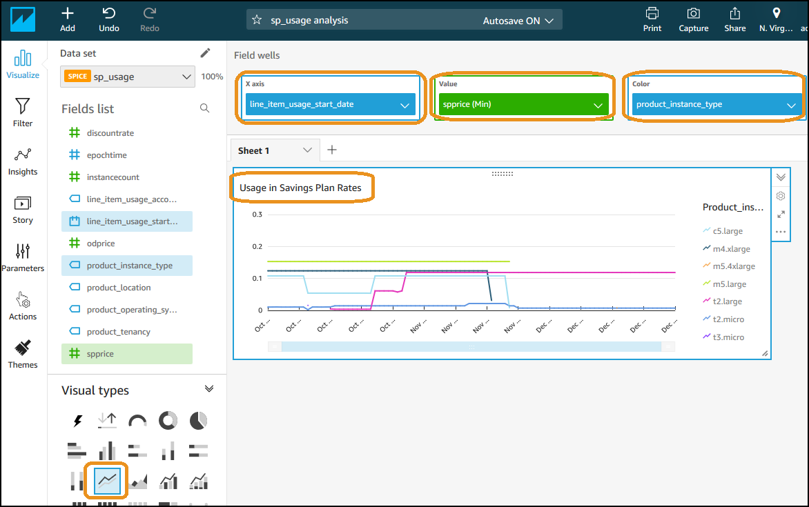

4. Click **Parameters**, and click **Create one**:
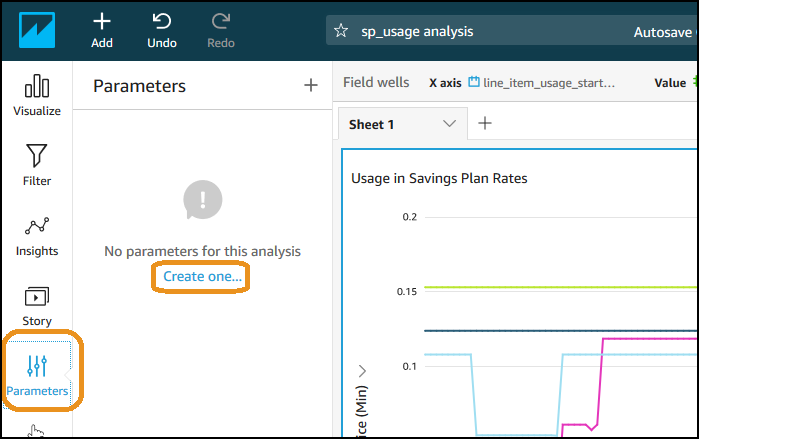

5. Parameter name **OperatingSystem**, Data type **String**, click **Set a dynamic default**:
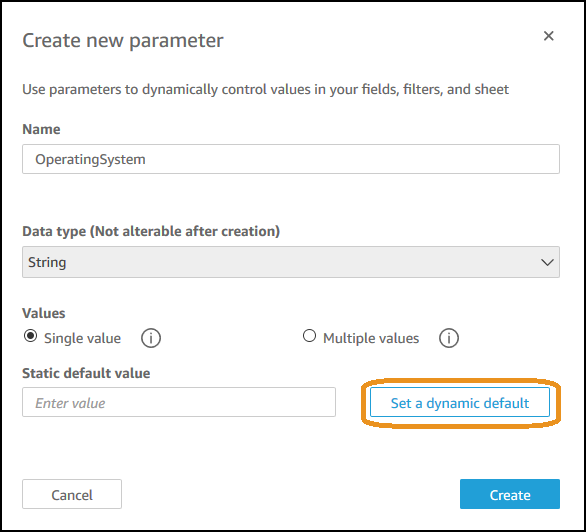

6. Select your dataset, and select **product_operating_system** for the columns, click Apply:
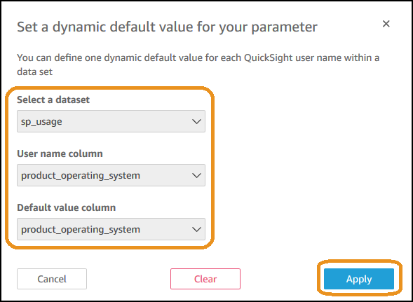

7. Click **Create**:
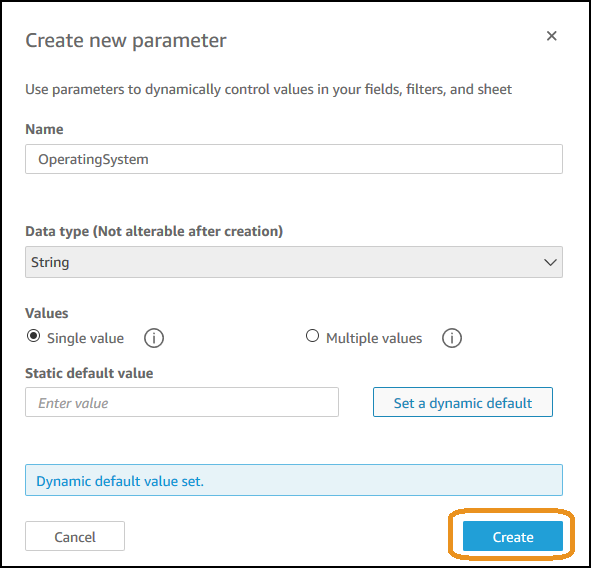

8. Click **Control**:
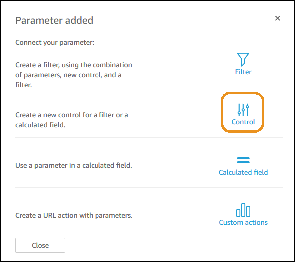

9. Enter **OperatingSystem** as the display name, style **Single select drop down**, values **Link to a data set field**, dataset **your data set**, column **product_operating_system**, click **Add**:
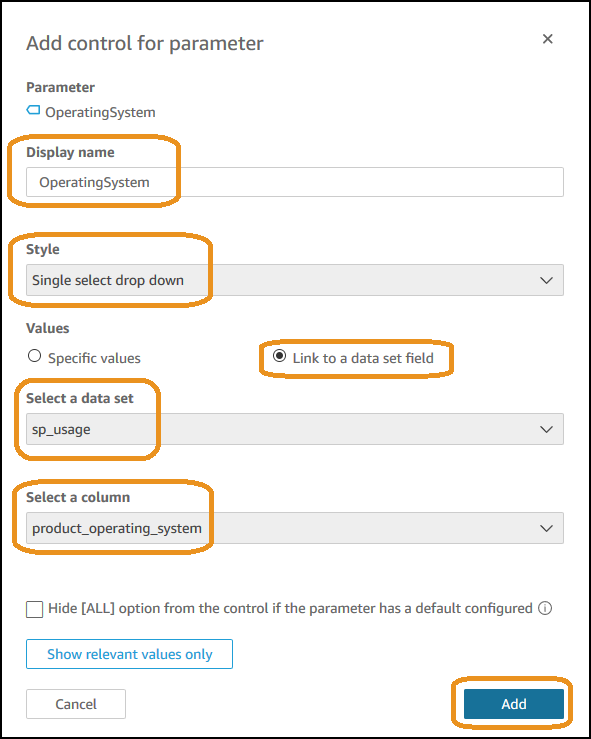

10. Using the process above, Add the parameter **Region**:
    - Name: Region
    - Data type: String
    - Values: Single value
    - Dyanmic default
    - Dataset: your dataset, product_location, product_location
    - Add as: Control
    - Control Display Name: Region
    - Style: Single select drop down
    - Values: link to data set field
    - Data set: your data set
    - Column: product_location

11. Using the process above, Add the parameter **Tenancy**:
    - Name: Tenancy
    - Data type: String
    - Values: Single value
    - Dyanmic default
    - Dataset: your dataset, product_tenancy, product_tenancy
    - Add as: Control
    - Control Display Name: Tenancy
    - Style: Single select drop down
    - Values: link to data set field
    - Data set: your data set
    - Column: product_tenancy
 
12. Create an **InstanceType** parameter, datatype **String**, **Single value**, Static default value of **.** (a full stop):


13. Click **Control**, 


14. Display name **InstanceType**, style **Text box**, click **Add**:
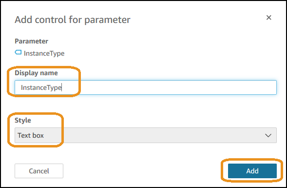

15. Click **Filter** and click **Create one**, select **product_instance_type**:
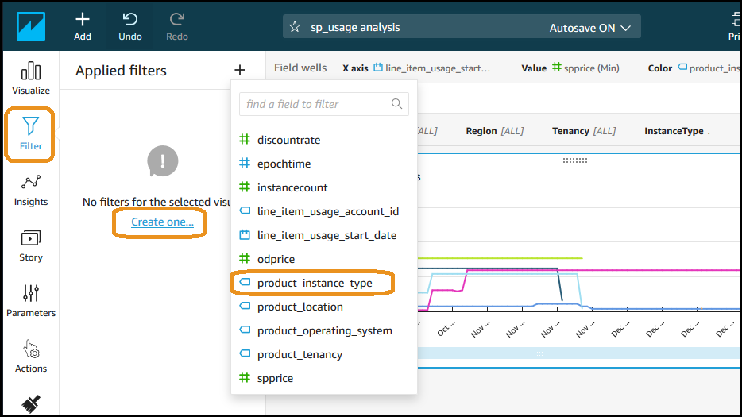

16. Edit the filter, Filter type: 
    - **All visuals**
    - **Custom filter**
    - **Contains**
    - **Use Parameters**
    - **InstanceType**
    - click **Apply**:
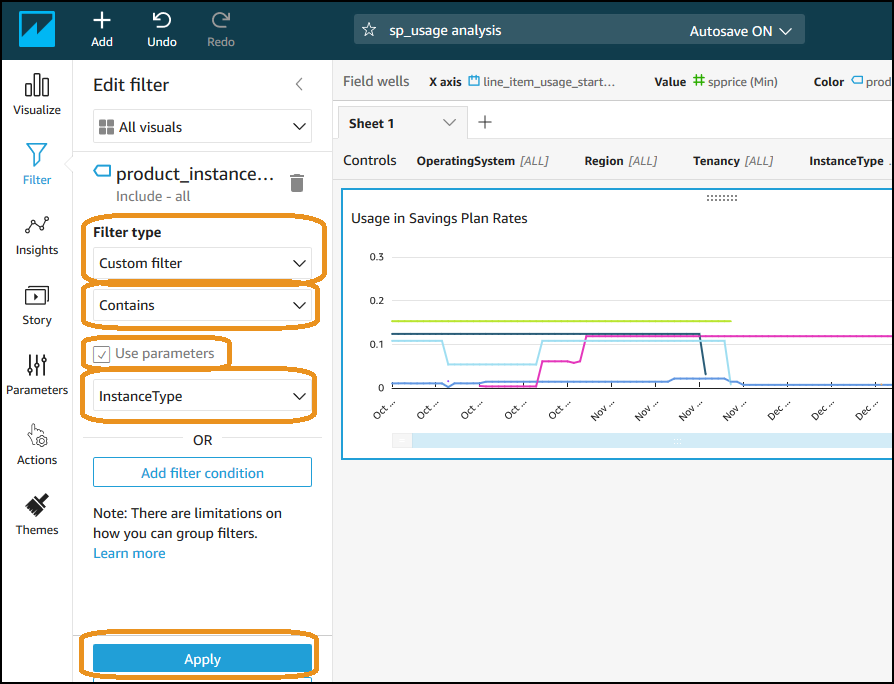

17. Create a Parameter **DaysToDisplay**:
    - Name: DaysToDisplay
    - Data type: Integer
    - Values: Single value
    - Static default value: 90
    - Click **Create**:


18. Click **Control**:
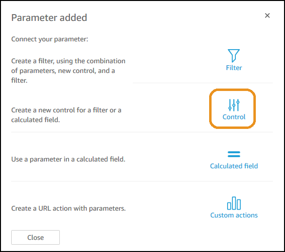

19. Enter a Display name **DaysToDisplay**, Style **Text box** and click **Add**: 
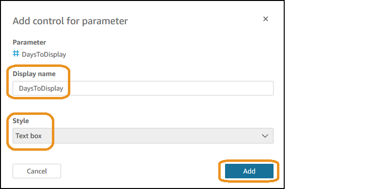

20. Click on **Filter**, click **+**, and select **line_item_usage_start_date**:
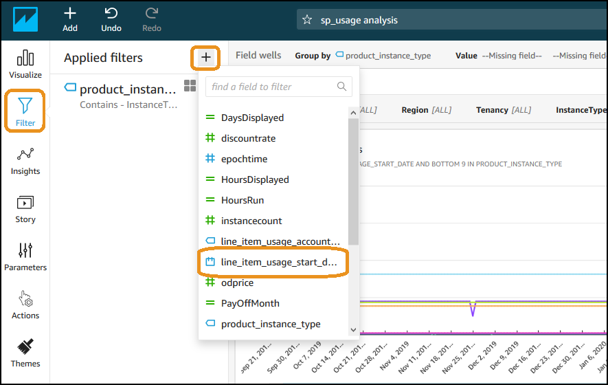

21. Click on the new filter:


22. Select a filter type of:
    - **All visuals**
    - **Relative dates**
    - **Days**
    - **Last N days**
    - select **Use parameters**, and accept to change the scope of the filter
    - select the parameter **DaysToDisplay**
    - click **Apply**:
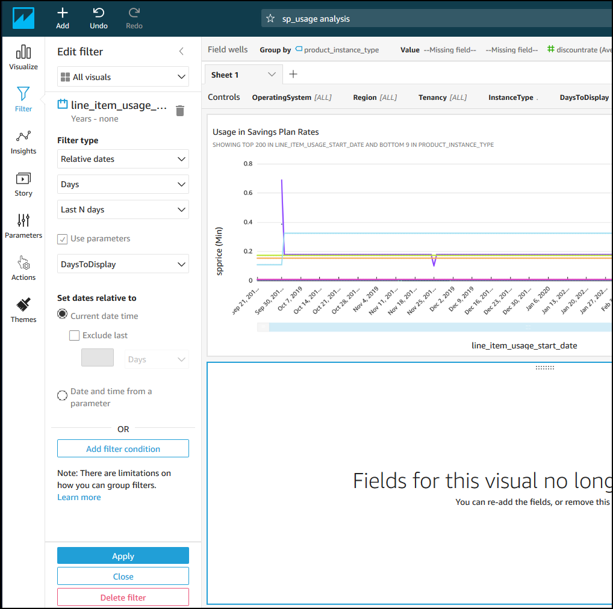

23. Create a filter for **product_operating_system**:
    - **All visuals**
    - Type: Custom filter
    - equals
    - Use parameters, change the scope of this filter: yes
    - Parameter: OperatingSystem
 

24. Create a filter for **product_location**:
    - **All visuals**
    - Type: Custom filter
    - equals
    - Use parameters, change the scope of this filter: yes
    - Parameter: Region
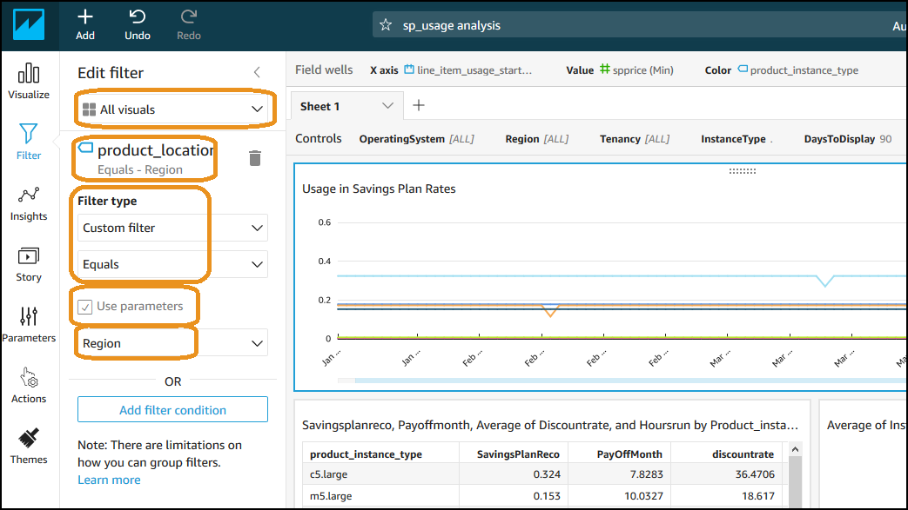 
 
24. Create a filter for **product_tenancy**:
    - **All visuals**
    - Type: Custom filter
    - equals
    - Use parameters, change the scope of this filter: yes
    - Parameter: Tenancy
 

25. Click on **Visualize**, click **Add**, select **Add calculated field**:
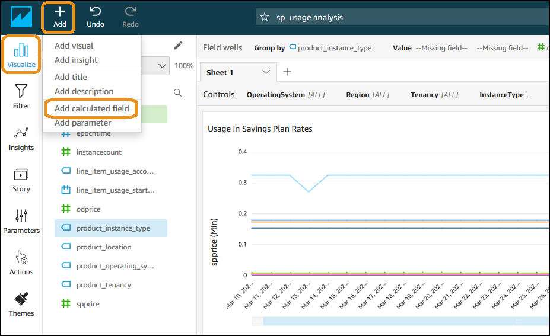

26. Field name **HoursDisplayed**, add the formula below and click **Create**:

        distinct_count({line_item_usage_start_date})
   

27. Create a calculated field **HoursRun**, formula:

        HoursDisplayed / (${DaysToDisplay} * 24)

28. Create a calculated field **PayOffMonth**, formula:

        ifelse(((((sum(spprice) / HoursDisplayed) * 730 * 12) / ((sum(odprice) / (${DaysToDisplay} * 24)) * 730))) < 12,((((sum(spprice) / HoursDisplayed) * 730 * 12) / ((sum(odprice) / (${DaysToDisplay} * 24)) * 730))),12)

29. Create a calculated field **SavingsPlanReco**, formula:

        ifelse(PayOffMonth < 12,percentile(spprice,10),0.00)

30. Create a calculated field **StartSPPrice**, formula:

        lag(min(spprice),[{line_item_usage_start_date} ASC],${DaysToDisplay} - 2,[{product_instance_type}])

31. Create a calculated field **Trend**, formula:

        (min(spprice) - {StartSPPrice}) / min(spprice) 

32. Create a calculated field **First3QtrAvg**, formula:

        windowAvg(avg(spprice),[{line_item_usage_start_date} ASC],${DaysToDisplay},${DaysToDisplay} / 4,[{product_instance_type}])

33. Create a calculated field **LastQtrAvg**, formula: 

        windowAvg(avg(spprice),[{line_item_usage_start_date} ASC],${DaysToDisplay} / 4,1,[{product_instance_type}])

34. Create a calculated field **TrendAvg**, formula:

        (LastQtrAvg- First3QtrAvg) / First3QtrAvg

35. Add a Visual, click **Add**, select **Add visual**:


36. Select a **Table** visualization, Group by **product_instance_type**, Add the **values**:
    - SavingsPlanReco
    - PayOffMonth
    - discountrate, aggregate: average
    - HoursRun, show as percent
    - Label it **Recommendations**
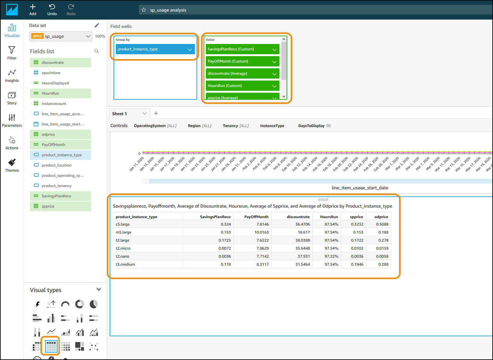

37. Add a **Table** visual, Group By: **product_instance_type** and **line_item_usage_start_date aggreate: day**, Add the **values**:
    - instancecount aggregate: average
    - Trend
    - TrendAvg (show as percent)
    - Label it **Trends**,

 
38. Add a **filter** to **this visual only**:
    - Filter on: StartSPPrice
    - Type: Custom filter
    - Operation: Greater than
    - Value: -1
    - Nulls: Exclude nulls

40. Decrease the width of the date column as much as possible, its not needed


<a name="format_dashboard"></a>
## 5. Format the Recommendation Dashboard
We will format the recommendation dashboard, this will improve its appearance, and also includes some business rules.

1. Click on **Themes**, then click on **Midnight**:


2. Select the **Recommendations** table, click the **three dots**, click **Conditional formatting**:


3. Column: **PayOffMonth**, **Add background color**:


4. Enter the formatting:
    - Condition: Greater than
    - Value: 9
    - Color: red
    - Click **Apply**, click **Close**:
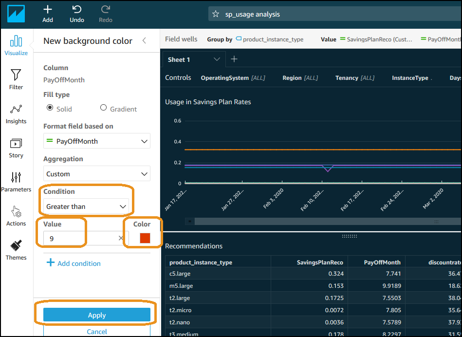

5. Using the same process, add formatting for the column **discountrate**:
    - Type: Background color
    - Condition: Less than
    - Value: 10 **NOTE** adjust this for your business rules, speak with your finance teams
    - Color: red
    - Click **Apply**, click **Close**

6. Under the **discountrate** formatting, Click **Add text color**:
    - Condition: Greater than
    - Value: 20
    - Color: Green
    - Click **Apply**, click **Close**
      
6. Using the same process, add formatting for the column **HoursRun**:
    - Type: **Add text color**
    - Condition: Less than
    - Value: 0.6
    - Color: Red
    - Click **Add condition**
    - Condition#2: Less than
    - Value: 0.85
    - Color: Orange
    - Click **Apply**, click **Close**
   
7. Add formatting for the column **SavingsPlanReco**:
     - Type: Add background color
     - Format field based on: PayOffMonth
     - Condition: Greater than
     - Value: 9
     - Color: Red
     - Click **Apply**, click **Close**
     - Click **Add text color**
     - Format field based on: discountrate
     - Aggregation: Average
     - Condition: greater than
     - Value: 20
     - Color: Green
     - Click **Apply**, click **Close**
   
8. Click **SavingsPlanReco**, **Sort by Descending**:   

   
9. Select the **Trends** table, select conditional formatting, Column **instancecount**:
    - Type: Add background color
    - Condition: Less than
    - Value: 5, speak with your team to set this at the appropriate level
    - Color: red
    - Click **Add condition**
    - Condition #2: Less than
    - Value: 10
    - Color: Orange
    - Click **Apply**, click **Close**

10. Using the process above on the **Trends** table, Select the **Trend** column:
    - Type: Add background color
    - Condition: Less than
    - Value 0
    - Color: Red
    - Click **Apply**, click **Close**
    - Click **Add text color**
    - Condition: Greater than
    - Value: 0
    - Color: Green
    - Click **Apply**, Click **Close** 

11. Add the same formatting to the **TrendAvg** column as the **Trend** column.


Congratulations - you now have an analytics dashboard for Savings Plan recommendations!

<a name="tear_down"></a>
## 6. Teardown
Savings Plan analysis is a critical requirement of cost optimization, so there is no tear down for this lab. 

The following resources were created in this lab:

- S3 Bucket: (custom name)
- Lambda Functions: SPTool_ODPricing_Download and SPTool_SPPricing_Download
- IAM Role: SPTool_Lambda
- IAM Policy: s3_pricing_lambda
- CloudWatch Event, Rule: SPTool-Pricing
- Glue Crawlers: OD_Pricing and SP_Pricing
- IAM Role: AWSGlueServiceRole-SPToolPricing
- Glue Database: Pricing
- Athena Views: pricing.pricing and cur.SP_USage
- QuickSight Permissions: your pricing S3 bucket
- QuickSight Dataset: SP_Usage
- QuickSight Analysis: sp_usage analysis

<a name="rate_lab"></a>
## 7. Rate this lab
[](http://wellarchitectedlabs.com/Cost_SP_Analysis_1star) [](http:///wellarchitectedlabs.com/Cost_SP_Analysis_2star) [](http:///wellarchitectedlabs.com/Cost_SP_Analysis_3star) [](http:///wellarchitectedlabs.com/Cost_SP_Analysis_4star) [](http:///wellarchitectedlabs.com/Cost_SP_Analysis_5star)

