# Level 100: AWS Account Setup: Lab Guide

## Authors
- Nathan Besh, Cost Lead Well-Architected
- Spencer Marley, Commercial Architect 

## Feedback
If you wish to provide feedback on this lab, there is an error, or you want to make a suggestion, please email: costoptimization@amazon.com


## 1. Create an account structure 
You will create an AWS Organization, and join one or more accounts to the master account. An organization will allow you to centrally manage multilpe AWS accounts efficiently and consistently. It is recommended to have a master account that is primarily used for billing and does not contain any resources, all resources and workloads will reside in the member accounts. You will need organizations:CreateOrganization access, and 2 or more AWS accounts. When you create a new master account, it will contain all billing information for member accounts, member accounts will no longer have any billing information, including historical billing information.  Ensure you backup or export any reports or data.  

### 1.1 Create an AWS Organization
You will create an AWS Organization with the master account. 

1. Login to the AWS console as an IAM user with the required permissions, start typing *AWS Organizations* into the **Find Services** box and click on **AWS Organizations**:


2. Click on **Create organization**:


3. To create a fully featured organization, Click on **Create organization**


4. You will receive a verification email, click on **Verify your email address** to verify your account:
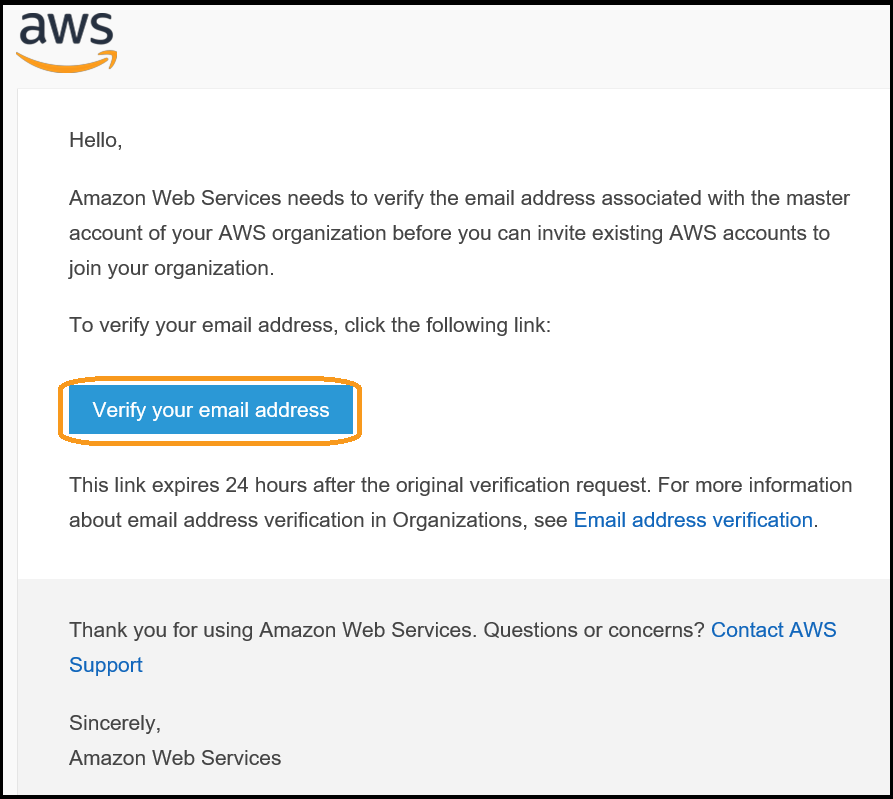

5. You will then see a verification message in the console for your organization:


You now have an organization that you can join other accounts to.

### 1.2 Join member accounts
You will now join other accounts to your organization.

1. From the AWS Organizations console click on **Add account**:


2. Click on **Invite account**:


3. Enter in the **Email or account ID**, enter in any relevant **Notes** and click **Invite**:


4. You will then have an open request:


5. Log in to your **member account**, and go to **AWS Organizations**:


6. You will see an invitation in the menu, click on **Invitations**:


7. Verify the details in the request (they are blacked out here), and click on **Accept**: 


8. Verify the Organization ID (blacked out here), and click **Confirm**:


9. You are shown that the account is now part of your organization:


10. The member account will receive an email showing success:


11. The master account will also receive email notification of success:
 

Repeat the steps above (exercise 1.2) for each additional account in your organization. 


## 2. Configure billing account settings
It is important to ensure your account contacts are up to date and correct. This allows AWS to be able to contact the correct people in your organization if required. It is recommended to use a mailing list or shared email that is accessible by muptile team members for redudancy. Ensure the email accounts are actively monitored.

1. Log in to your Master account, Click on the account name in the top right, and click on **My Account** from the menu:


2. Scroll down to **Alternate Contacts** and click on **Edit**:


3. Enter information into each of the fields for **Billing**, **Operations** and **Security**, and click **Update**:


## 3. Configure IAM access to your billing
**NOTE**: You will need to sign into the account with root account credentials to perform this action. You need to enter in the account email and password for root access.
You need to enable IAM access to your billing so the correct IAM users can access the information. This allows other users (non-root) to access billing information in the master account. It is also required if you wish for member accounts to see their usage and billing information. This step will not provide access to the information, that is configured through IAM policies.


1. Log in to your Master account, Click on the account name in the top right, and click on **My Account** from the menu:


2. Scroll down to **IAM User and Role Access to Billing Information**, and click **Edit**:


3. Select **Activeate IAM Access** and click on **Update**:


4. Confirm that **IAM user/role access to billing information is activated**:
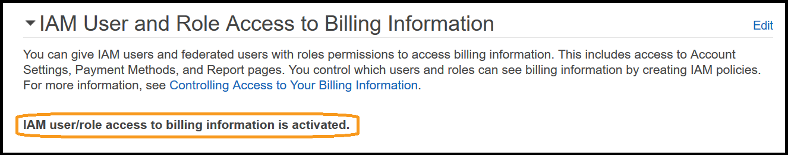 

You will now be able to provide access to non-root users to billing information via IAM policies.

## 4. Configure Cost and Usage Reports
Cost and Usage Reports provide the most detailed information on your usage and bills. They can be configured to deliver 1 line per resource, for every hour of the day. They must be configured to enable you to access and analyze your usage and billing information. This will allow you to make modifications to your usage, and make your applications more efficient.

### 4.1 Setup S3 Billing bucket 
We will create an S3 bucket that will be used to deliver the Cost and Usage Reports into. It will be a bucket that allows the AWS Billing account access to put objects.

1. Log into your Master account, and go to the **S3** console:
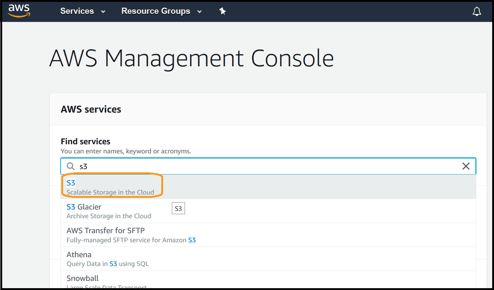

2. Click on **Create bucket**:
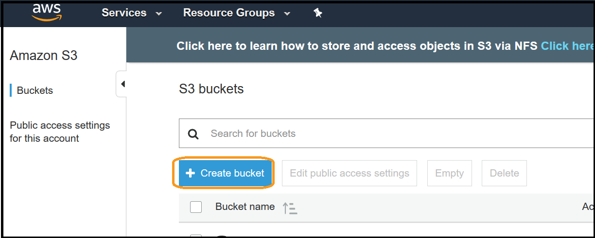

3. Enter a **Bucket name**, **Region** and click **Next**:
NOTE: Later you will be using Athena and QuickSight, we suggest you create all resources in a single region for ease of access. Ensure that all required services are available in your chosen region.
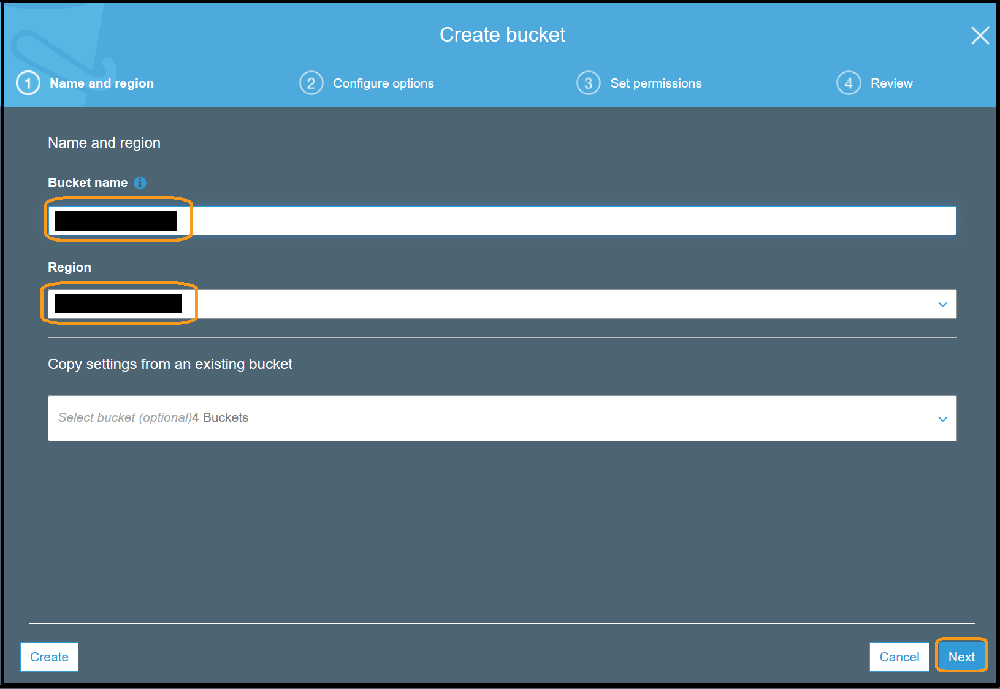

4. Enter any additional information such as **Tags** if required, and click **Next**: 
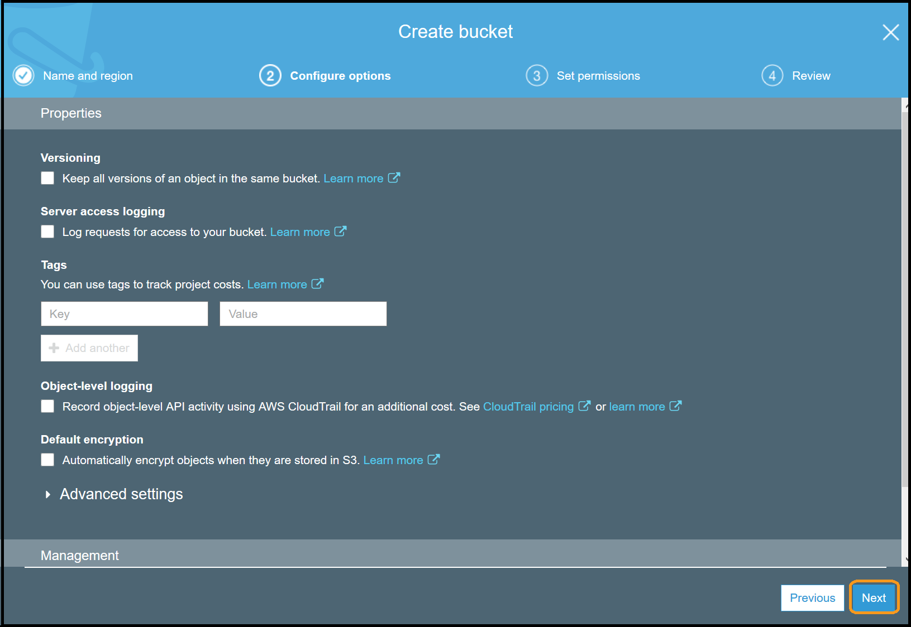

5. It is suggested to leave the defaults to block public access, and click **Next**:
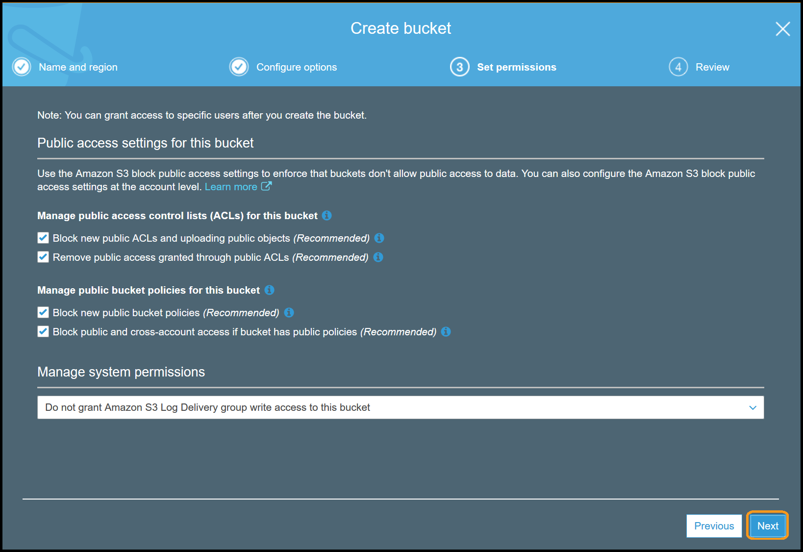

6. Verify the settings and click **Create bucket**:
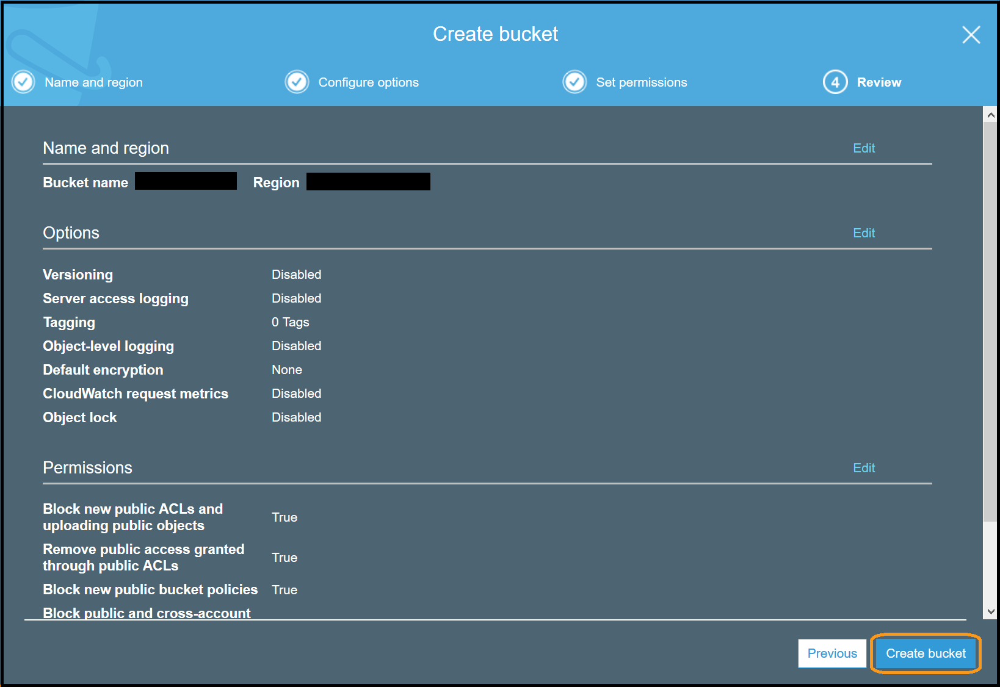

7. Click on the name of the bucket you just created: 
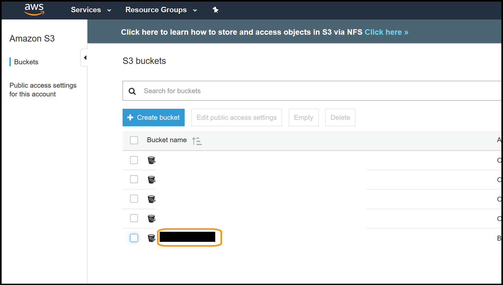

8. Click on **Permissions**:
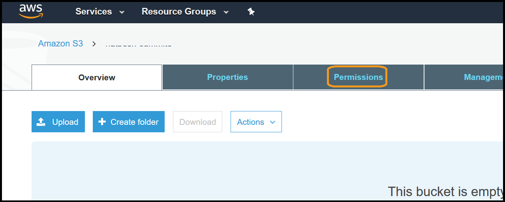

9. Click on **Bucket Policy**: 
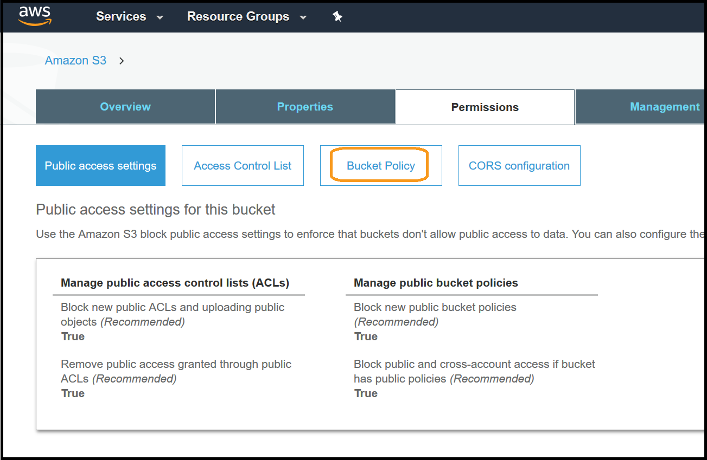

10. Copy the following bucket policy:
```
{
  "Version": "2008-10-17",
  "Id": "Policy1335892530063",
  "Statement": [
    {
      "Sid": "Stmt1335892150622",
      "Effect": "Allow",
      "Principal": {"AWS": "arn:aws:iam::386209384616:root"},
      "Action": [ "s3:GetBucketAcl", "s3:GetBucketPolicy" ],
      "Resource": "arn:aws:s3:::<change_me>"
    },
    {
      "Sid": "Stmt1335892526596",
      "Effect": "Allow",
      "Principal": {"AWS": "arn:aws:iam::386209384616:root"},
      "Action": [ "s3:PutObject" ],
      "Resource": "arn:aws:s3:::<change_me>/*"
    }
  ]
}
```
11. Modify the **<change_me>** to the name of your bucket, and paste it into the policy editor and click **Save**:
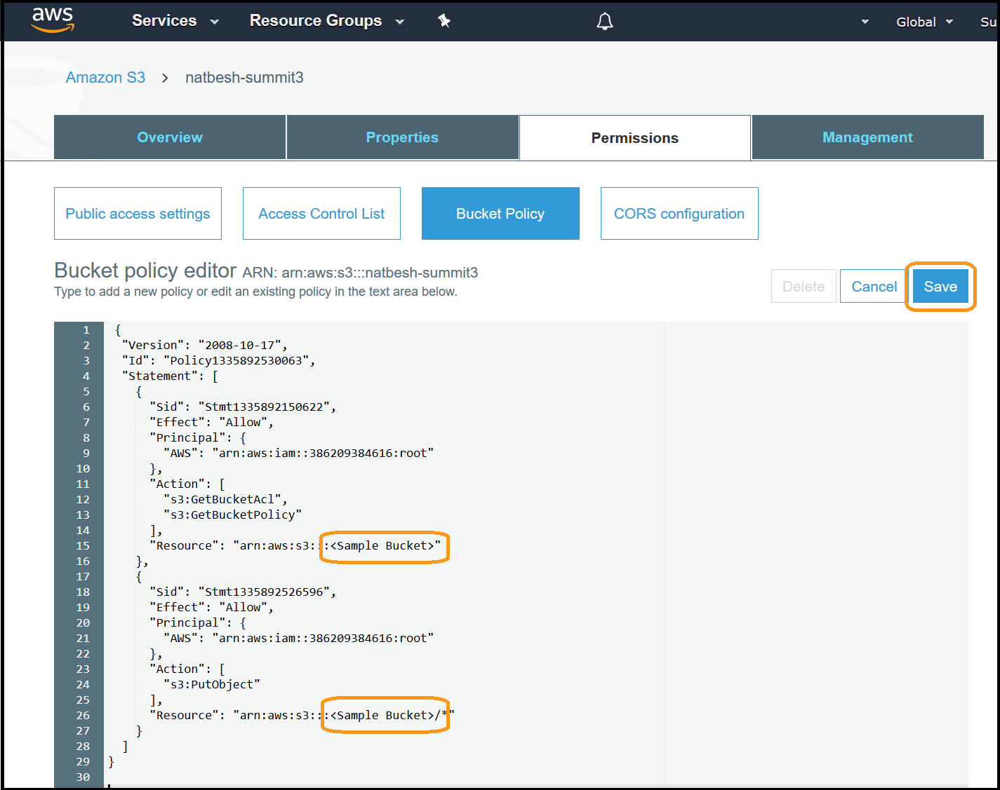

The bucket is now configured and ready to receive the billing reports.


### 4.2 Configure a Cost and Usage Report
1. Log into your Master account, and go to the **Billing** console:
 

2. Select **Reports** from the left menu:
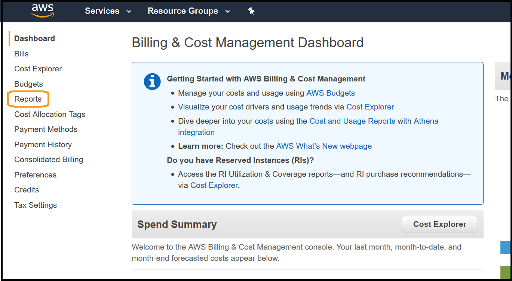 

3. Click on **Create report**:
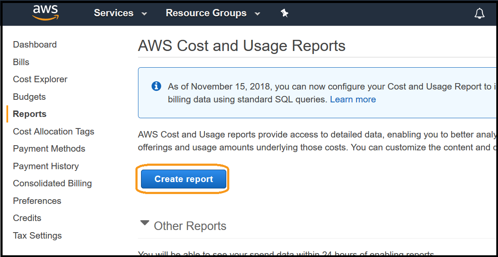

4. Enter a **Report name** (it can be any name), ensure you have selected **Include resource IDs** and **Data refresh settings**, then click on **Next**:
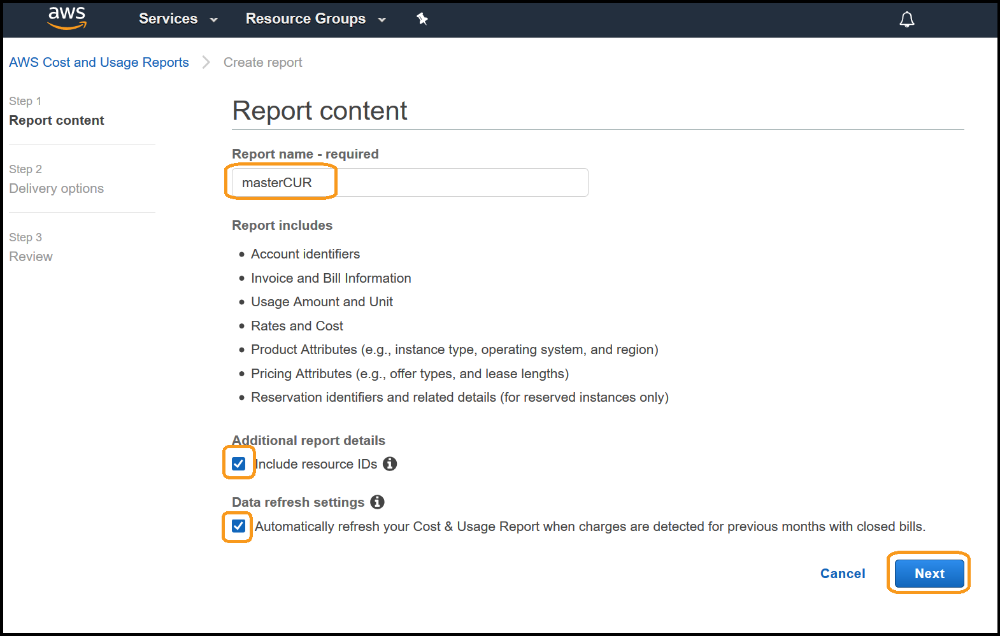

5. Enter the **S3 bucket** name you configured above, click **Verify** and ensure it shows a green tick (if it fails check your bucket policy). Enter a **Report path prefix** (it can be any word) without any '/' characters, ensure the **Time Granularity** is **Hourly**, **Report Versioning** is set to **Overwrite existing report**, under **Enable report data integration for** select **Amazon Athena**, and click **Next**:
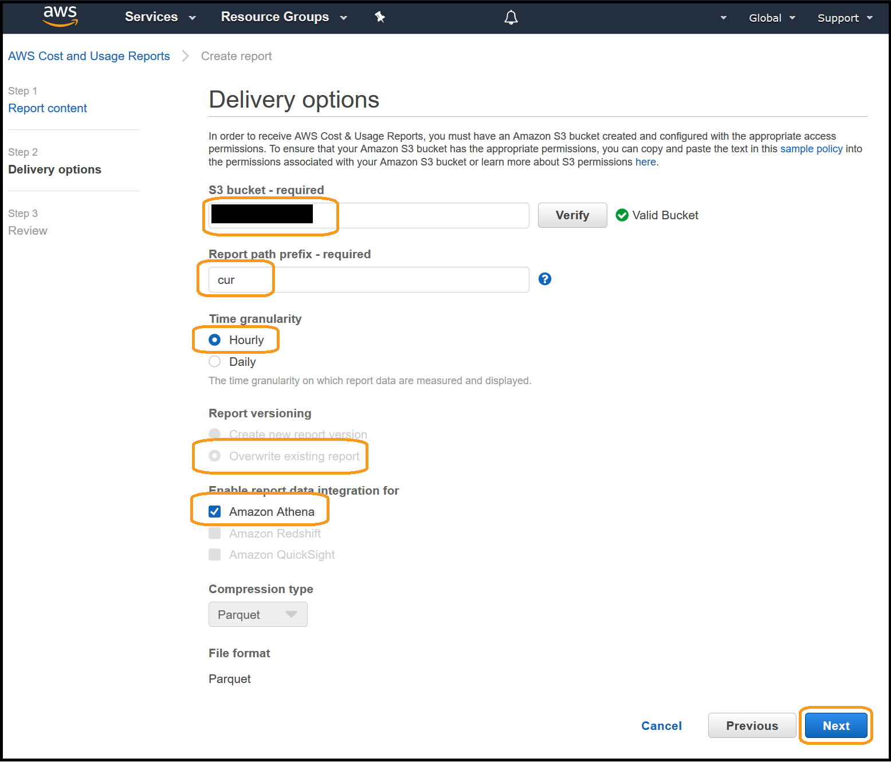

6. Review the configuration, scroll to the bottom and click on **Review and Complete**:


You have successfully configured a Cost and Usage Report to be delivered.  It may take up to 24hrs for the first report to be delivered.

## 5. Tear down
This exercise covered fundamental steps that are recommended for all AWS accounts to enable Cost Optimization. There is no tear down for exercises in this lab.
Ensure you remove the IAM policies from the users/groups if they were used. 
