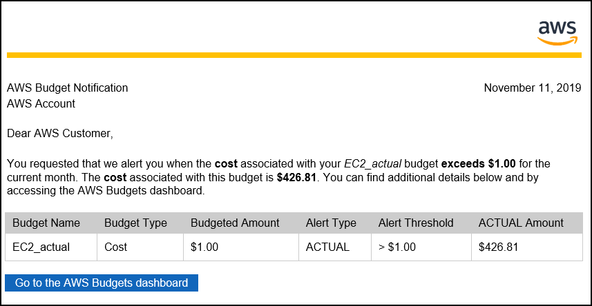

# Level 100: Cost and Usage Governance

## Authors
- Nathan Besh, Cost Lead Well-Architected
 
## Feedback
If you wish to provide feedback on this lab, there is an error, or you want to make a suggestion, please email: costoptimization@amazon.com

# Table of Contents
1. [Create an AWS Budget - monthly forecast](#budget_forecast)
2. [Create an AWS Budget - EC2 actual](#budget_ec2actual)
3. [Create an AWS Budget - SP Coverage](#budget_spcoverage)
4. [Create an AWS Budget Report](#budget_report)
5. [Tear down](#tear_down)
6. [Rate this Lab](#rate_lab)  

## 1. Create and implement an AWS Budget for monthly forecasted cost 
Budgets allow you to manage cost and usage by providing notifications when cost or usage are outside of configured amounts. They cannot be used to restrict actions, only notify on usage after it has occurred.

Budgets and notifications are updated when your billing data is updated, which is at least once per day.

**NOTE**: You may not receive an alarm for a forecasted budget if your account is new. Forecasting requires existing usage within the account.

### Create a monthly cost budget for your account 
We will create a monthly cost budget which will notify if the forecasted amount exceeds the budget.

1. Log into the console as an IAM user with the required permissions, go to the **Billing console**:

2. Select **Budgets** from the left menu:

3. Click on **Create a budget**:

4. Ensure **Cost Budget** is selected, and click **Set your budget >**:

5. Create a cost budget, enter the following details:
    - **Name**: CostBudget1 
    - **Period**: Monthly
    - **Budget effective dates**: Recurring Budget
    - **Start Month**: (select current month)
    - **Budget amount**: Fixed
    - **Budgeted amount**: $1 (enter an amount a lot LESS than last months cost), 
    -  Other fields: leave as defaults:

6. Scroll down and click **Configure alerts >**:

7. Select:
    - **Send alert based on**: Forecasted Costs
    - **Alert threshold**: 100% of budgeted amount
    - **Email contacts**: (your email address)
    - Click on **Confirm budget >**:

8. Review the configuration, and click **Create**:

9. You should see the current forecast will exceed the budget (it should be red, you may need to refresh your browser):
 

10: You will receive an email similar to this within a few minutes:

You have created a forecasted budget, when your forecasted costs for the entire account are predicted to exceed the forecast, you will receive a notification. You can also create an actual budget, for when your current costs actually exceed a defined amount.

## 2. Create and implement an AWS Budget for EC2 actual cost
We will create a monthly EC2 actual cost budget, which will notify if the actual costs of EC2 instances exceeds the specified amount.

1. Click **Create budget**:

2. Select **Cost budget**, and click **Set your budget >**:

3. Create a cost budget, enter the following details:
    - **Name**: EC2_actual
    - **Period**: Monthly
    - **Budget effective dates**: Recurring Budget
    - **Start Month**: (current month)
    - **Budget amount**: Fixed
    - **Budgeted amount**: $1 (enter an amount a lot LESS than last months cost), 
    - Other fields: leave a defaults
    - Under **FILTERING** click on Service:

4. Type **Elastic** in the search field, then select the checkbox next to **EC2-Instances(Elastic Compute Cloud - Compute)** and Click **Apply filters**:

5. De-select **Upfront reservation fees**, and click **Configure alerts >**:
 

6. Select:
    - **Send alert based on**: Actual Costs
    - **Alert threshold**: 100% of budgeted amount
    - **Email contacts**: (your email address)
    - Click on **Confirm budget >**:

7. Review the configuration, and click **Create**:

8. You can see the current amount exceeds the budget (it is red, you may need to refresh your browser):
 

9. You will receive an email similar to the previous budget within a few minutes.

You have created an actual cost budget for EC2 usage. You can extend this budget by adding specific filters such as linked accounts, tags or instance types. You can also create budgets for services other than EC2.

## 3. Create and implement an AWS Budget for EC2 Savings Plan coverage
We will create a monthly savings plan coverage budget which will notify if the coverage of Savings Plan for EC2 is below the specified amount.

1. From the **AWS Budgets** dashboard in the console, click **Create budget**:

2. Select **Savings Plans budget**, and click **Set your budget >**:

3. Create a cost budget, enter the following details:
    - **Name**: SP_Coverage
    - **Period**: Monthly
    - **Savings Plans budget type**: Savings Plans Coverage
    - **Coverage threshold**: 90%
    - Leave all other fields as defaults
 
  
**NOTE**: **NEVER** create a utilization budget, unless you are doing it for a **single** and specific discount rate by using filters. For example you want to track the utilization of m5.large Linux discount. A utilization budget across different discounts will most likely lead to confusion and unnecessary work.

4. Scroll down and click **Configure alerts >**:
 

5. Enter an address for **Email contacts** and click **Confirm budget >**:

6. Review the configuration, and click **Create** in the lower right:

7. You have created an Savings Plans Coverage budget. High coverage is critical for cost optimization, as it ensures you are paying the lowest price for your resources.

     
8. You will receive an email similar to this within a few minutes:

## 4. Create and implement an AWS Budget Report 
AWS Budgets Reports allow you to create and send daily, weekly, or monthly reports to monitor the performance of your AWS Budgets.

1. From the Budgets dashboard, Click on **Budgets Reports**:

2. Click **Create budget report**:

3. Create a report with the following details:
    - **Report name**: WeeklyBudgets
    - **Select all budgets**

4. Click **Configure delivery settings >**:

5. Configure the delivery settings:
    - **Report frequency**: Weekly
    - **Day of week**: Monday
    - **Email recipients**: <your email>

6. Click **Confirm budget report >**:

7. Review the configuration, click **Create**:

8. Your budget report should now be complete:

9. You should receive an email similar to the one below:

## 5. Tear down 

### Delete a budget report
We will delete the bugdet report we created in section 4.

1. From the **Budgets Reports** dashboard, click on the three dots next to the **Weekly Budgets** budget report, and click **Delete**: 

2. You can see there are no budget reports:

### Delete a budget
We will delete all three budgets that were configured in sections 1,2 and 3.

1. From the **Budgets** dashboard, click on the budget name **CostBudget1**:

2. Click on the **3 dot menu** in the top right, select **Delete**:

3. Click on the other budget name **EC2_actual**:

4. Click on the **3 dot menu** in the top right, select **Delete**:

5. Click on the other budget name **SP_Coverage**:

6. Click on the **3 dot menu** in the top right, select **Delete**:

7. All budgets should be deleted that were created in this workshop:

## 5. Rate this lab 
     

