# Level 100: Cost and Usage Governance

## Authors
- Nathan Besh, Cost Lead Well-Architected
 
## Feedback
If you wish to provide feedback on this lab, there is an error, or you want to make a suggestion, please email: costoptimization@amazon.com


# Table of Contents
1. [Create a cost optimization team](#create_team)
2. [Create an AWS Budget - monthly forecast](#budget_forecast)
3. [Create an AWS Budget - EC2 actual](#budget_ec2actual)
4. [Create an AWS Budget - RI Coverage](#budget_ricoverage)
5. [Tear down](#tear_down)
6. [Rate this Lab](#rate_lab)  
7. [Feedback survey](#survey)  

## 1. Create a cost optimization team <a name="create_team"></a>
We are going to create a cost optimization team. Within your organization there needs to be a team of people that are focused around costs and usage. This exercise will create the users and the group, then assign all the access they need.
This team will then be able to manage the organizations cost and usage, and start to implement optimization mechanisms.

Log into the console as an IAM user with the required permissions, as per:
- [./Code/IAM_policy](./Code/IAM_policy.md) IAM policy required for this lab
      
### 1.1 Create an IAM policy for the team
This provides access to allow the cost optimization team to perform their work, namely the Labs in the 100 level fundamental series. This is the minimum access the team requires.

1. Log in and go to the **IAM** Service page:


2. Select **Policies** from the left menu:


3. Select **Create Policy**:

  
4. Select the **JSON** tab:

  
5. Copy & paste the following policy into the the field:
**NOTE**: Ensure you copy the entire policy, everything including the first '{' and last '}'
```
{
    "Version": "2012-10-17",
    "Statement": [
        {
            "Sid": "VisualEditor0",
            "Effect": "Allow",
            "Action": [
                "aws-portal:ViewUsage",
                "aws-portal:ModifyBilling",
                "aws-portal:ViewBilling",
                "aws-portal:ViewAccount",
                "budgets:*"
            ],
            "Resource": "*"
        }
    ]
}
```
6. Click **Review policy**: 


7. Enter a **Name** and **Description** for the policy and click **Create policy**:


You have successfully created the cost optimization teams policy.
  
    
### 1.2 Create an IAM Group
This group will bring together IAM users and apply the required policies.

1. While in the IAM console, select **Groups** from the left menu:


2. Click on **Create New Group**:


3. Enter a **Group Name** and click **Next Step**:


4. Click **Policy Type** and select **Customer Managed**:


5. Select the **CostOptimization_Summit** policy (created previously):


6. Click **Create Group**:


You have now successfully created the cost optimization group, and attached the required policies.


### 1.3 Create an IAM User
For this lab we will create a user and join them to the group above.

1. In the IAM console, select **Users** from the left menu:


2. Click **Add user**:


3. Enter a **User name**, select **AWS Management Console access**, choose **Custom Password**, type a suitable password, deselect **Require password reset**, and click **Next: Permissions**:


4. Select the **CostOptimization** group (created previously), and click **Next: Tags**:


5. Click **Next Review**:


6. Click **Create user**:


7. Copy the link provided, and logout by clicking on your username in the top right, and selecting **Sign Out**::


8. Log back in as the username you just created, with the link you copied for the remainder of the Lab.


You have successfully create a user, placed them in the cost optimization group and have applied policies.
You can continue to expand this group by adding additional users from your organization.


## 2. Create and implement an AWS Budget for monthly forecasted usage<a name="budget_forecast"></a> 
Budgets allow you to manage cost and usage by providing notifications when usage or cost are outside of configured amounts. They cannot be used to restrict actions, only notify on usage after it has occurred.

**NOTE**: You may not receive an alarm for a forecasted budget if your account is new. Forecasting requires existing usage within the account.

### Create a monthly cost budget for your account 
We will create a monthly cost budget which will notify if the forecasted amount exceeds the budget.

1. Go to the **Billing console**:


2. Select **Budgets** from the left menu:


3. Click on **Create a budget**:
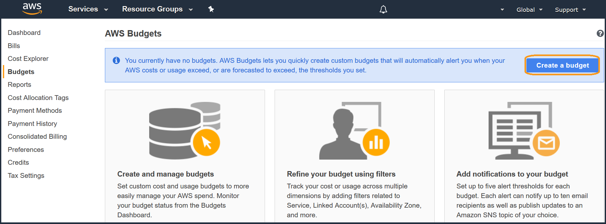

4. Ensure **Cost Budget** is selected, and click **Set your budget >**:


5. Create a cost budget, enter the following details:
- **Name**: (enter a name), 
- **Budgeted amount**: (enter an amount a lot LESS than last months cost), 
- **Budget effective dates**: Select **Recurring Budget** and start month is the current month, 
- Other fields: leave as defaults:
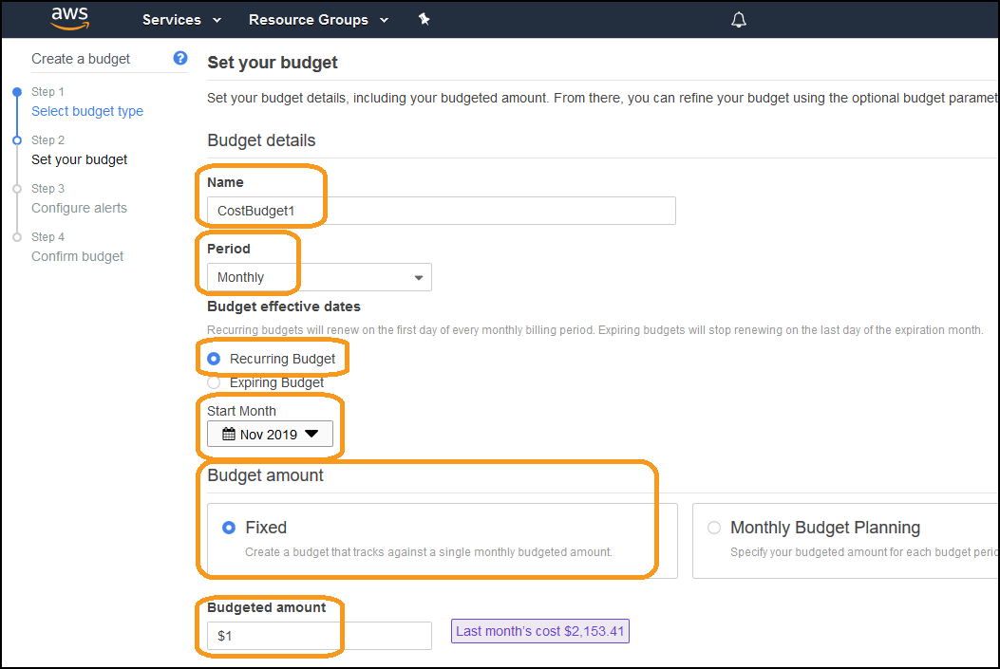

6. Scroll down and click **Configure alerts >**:


7. Select:
- **Send alert based on**: Forecasted Costs
- **Alert threshold**: 100% of budgeted amount
- **Email contacts**: (your email address)
- Click on **Confirm budget >**:
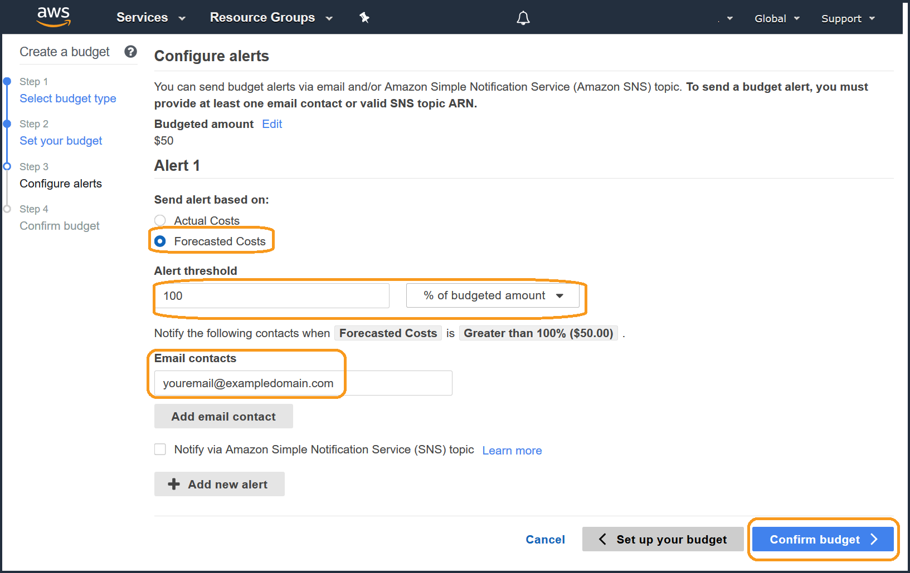

8. Review the configuration, and click **Create**:


9. You can see the current forecast will exceed the budget (it is red, you may need to refresh your browser):
 

10: You will receive an email similar to this within a few minutes:


You have created a forecasted budget, when your forecasted costs for the entire account are predicted to exceed the forecast, you will receive a notification. You can also create an actual budget, for when your current costs actually exceed a defined amount.


## 3. Create and implement an AWS Budget for EC2 actual cost<a name="budget_ec2actual"></a>
We will create a monthly EC2 actual cost budget, which will notify if the actual costs of EC2 instances exceeds the specified amount.

1. Click **Create budget**:
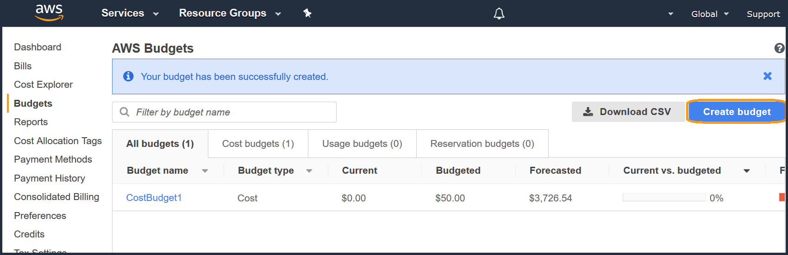

2. Select **Cost budget**, and click **Set your budget >**:


3. Create a cost budget, enter the following details:
- **Name**: (enter a name), 
- **Budgeted amount**: (enter an amount a lot LESS than last months cost), 
- **Budget effective dates**: Select **Recurring Budget** and start month is the current month, 
- Other fields: leave a defaults
- Under **FILTERING** click on Service:
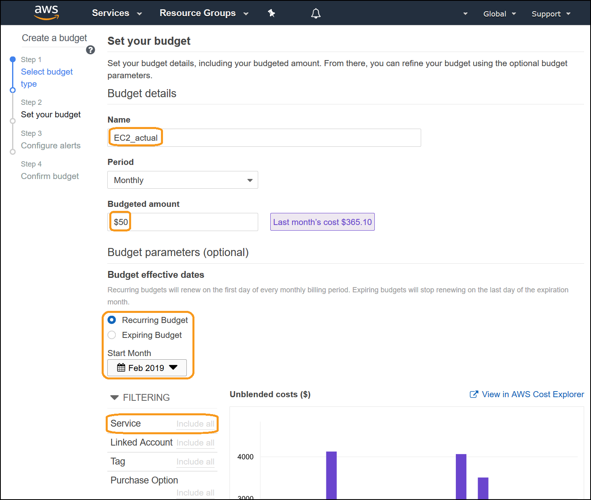

4. Type **Elastic** in the search field, then select the checkbox next to **EC2-Instances(Elastic Compute Cloud - Compute)** and Click **Apply filters**:
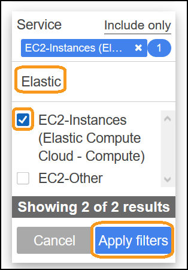

5. De-select **Upfront reservation fees**, and click **Configure alerts >**:
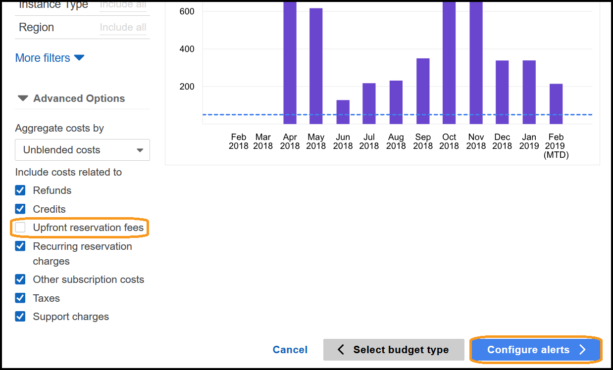 

6. Select:
- **Send alert based on**: Actual Costs
- **Alert threshold**: 100% of budgeted amount
- **Email contacts**: (your email address)
- Click on **Confirm budget >**:


7. Review the configuration, and click **Create**:
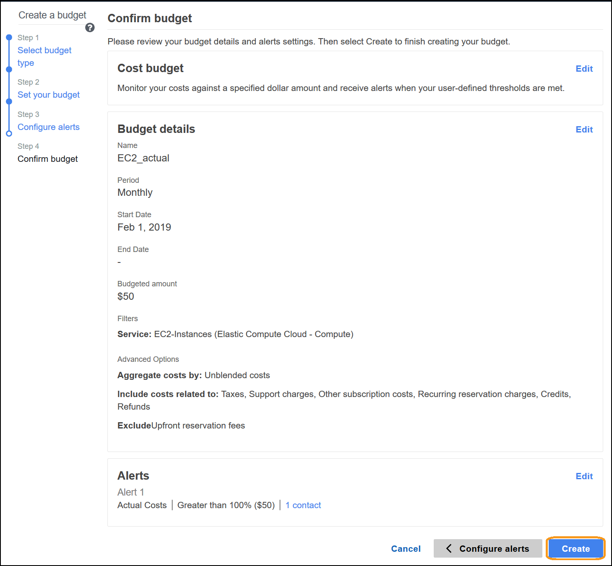

8. You can see the current amount exceeds the budget (it is red, you may need to refresh your browser):
 

9. You will receive an email similar to the previous budget within a few minutes.

You have created an actual cost budget for EC2 usage. You can extend this budget by adding specific filters such as linked accounts, tags or instance types. You can also create budgets for other services than EC2.


## 4. Create and implement an AWS Budget for EC2 Instance RI coverage<a name="budget_ricoverage"></a>
We will create a monthly RI coverage budget which will notify if the coverage of Reserved Instances for EC2 is below the specified amount.

1. Click **Create budget**:
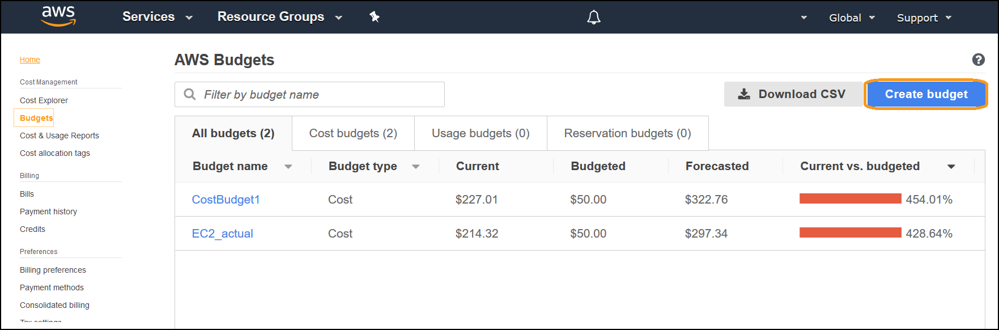

2. Select **Reservation budget**, and click **Set your budget >**:
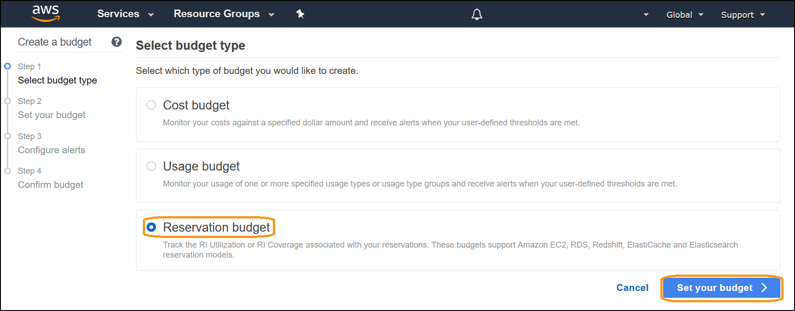

3. For **Reservation budget type** Select **RI Coverage**, enter a **Name**, select **EC2-Instances** as the **Service**, enter a **Coverage threshold** of **80%** and click **Configure alerts >**:
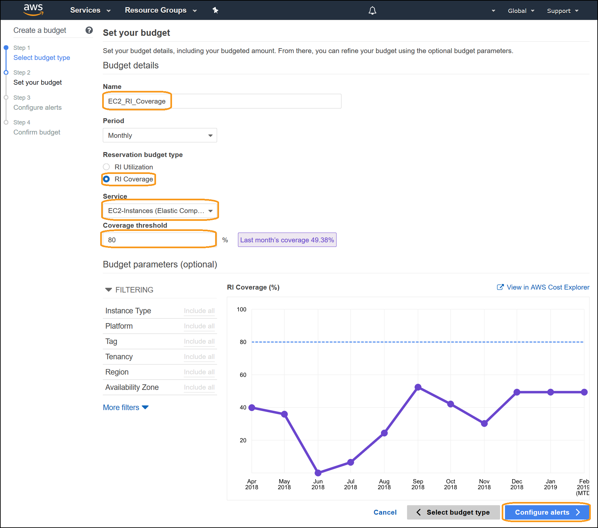 

4. Enter an address for **Email contacts** and click **Confirm budget >**:
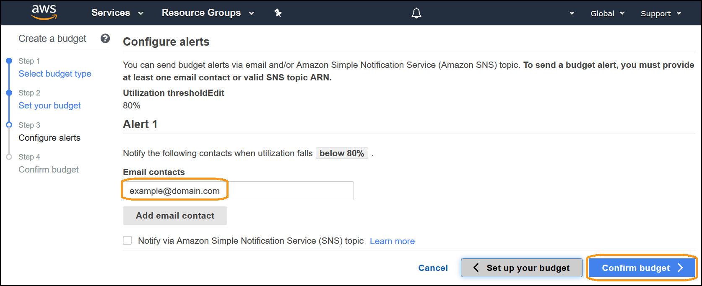

5. Review the configuration, and click **Create** in the lower right:
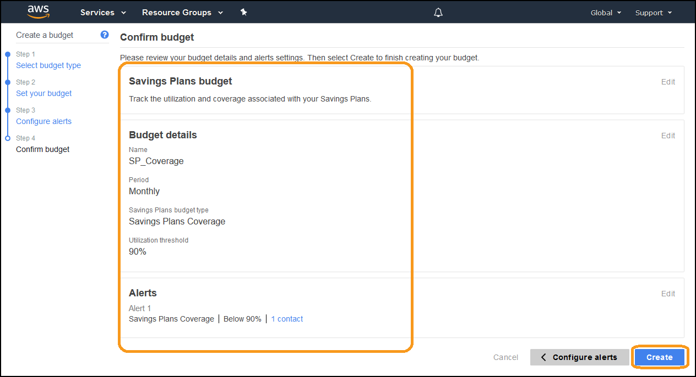

6. You have created an RI Coverage budget. High coverage is critical for cost optimization, as it ensures you are paying the lowest price for your resources.
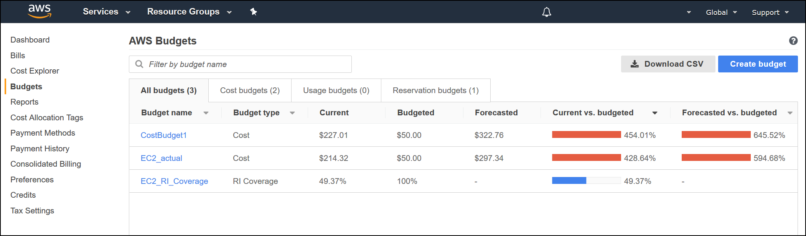
     
7. You will receive an email similar to this within a few minutes:
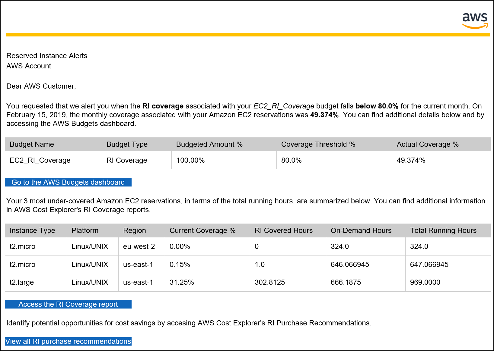
 
        

## 5. Tear down <a name="tear_down"></a>
NOTE: The cost optimization user, group and policies are required for the completion of the fundamental labs. If you remove these resources you will not be able to complete the labs. There is no tear down for this component as it is best practices to have this group created in all organizations.


### Delete a budget
We will delete all three budgets that were configured in sections 2,3 and 4.

1. From the budgets homepage, click on the budget name **CostBudget1**:


2. Click on the **3 dot menu** in the top right, select **Delete**:


3. Click on the other budget name **EC2_actual**:
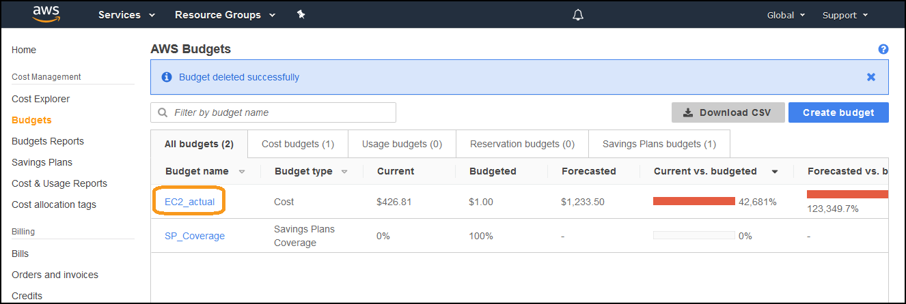

4. Click on the **3 dot menu** in the top right, select **Delete**:


5. Click on the other budget name **EC2_RI_Coverage**:


6. Click on the **3 dot menu** in the top right, select **Delete**:
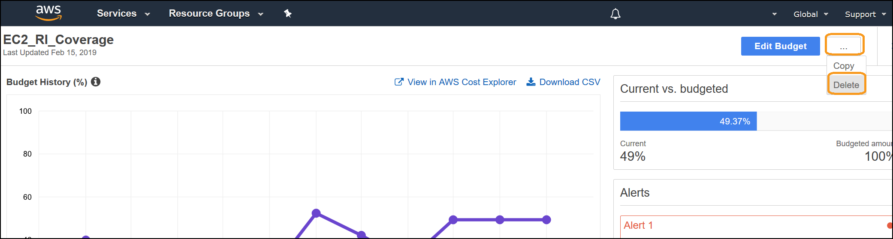

7. ALl budgets should be deleted that were created in this workshop:


## 6. Rate this lab<a name="rate_lab"></a> 
[](http://dx1572sre29wk.cloudfront.net/Cost_100_2_1star) [](http://dx1572sre29wk.cloudfront.net/Cost_100_2_2star) [](http://dx1572sre29wk.cloudfront.net/Cost_100_2_3star) [](http://dx1572sre29wk.cloudfront.net/Cost_100_2_4star) [](http://dx1572sre29wk.cloudfront.net/Cost_100_2_5star) 


## 7. Survey <a name="survey"></a>
Thanks for taking the lab, We hope that you can take this short survey (<2 minutes), to share your insights and help us improve our content.

[](https://amazonmr.au1.qualtrics.com/jfe/form/SV_9M48P1ZocaP940d)


This survey is hosted by an external company (Qualtrics) , so the link above does not lead to our website.  Please note that AWS will own the data gathered via this survey and will not share the information/results collected with survey respondents.  Your responses to this survey will be subject to Amazons Privacy Policy.
 

