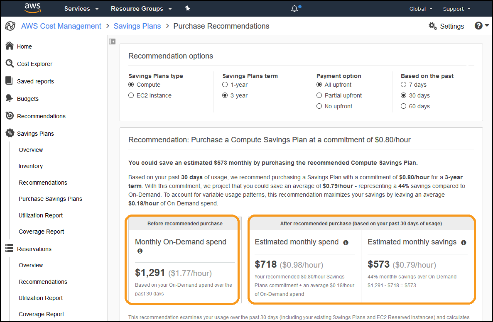
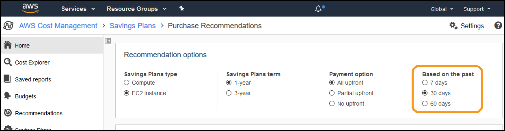
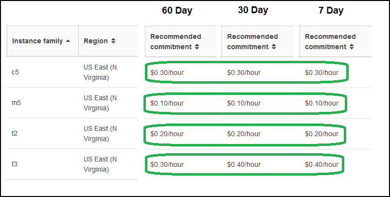
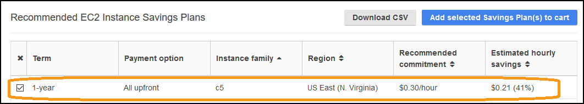
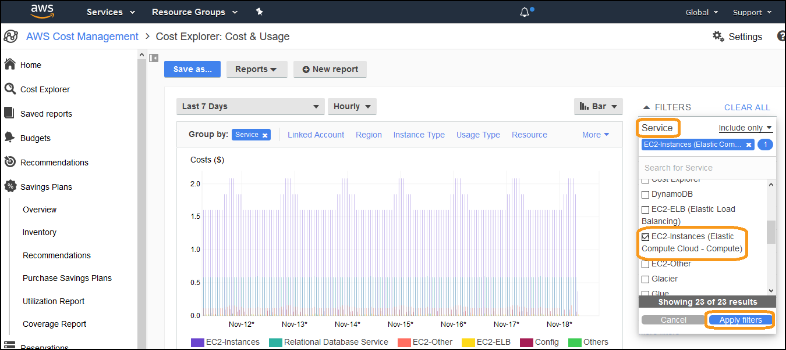

# Level 100: Pricing Models

## Authors
- Nathan Besh, Cost Lead Well-Architected

## Feedback
If you wish to provide feedback on this lab, there is an error, or you want to make a suggestion, please email: costoptimization@amazon.com

# Table of Contents
1. [Savings Plan Introduction](#SP_intro)
2. [View your Savings Plan recommendations](#view_recommendations)
3. [Understand your usage trend](#usage_trend)
4. [Analyze your Savings Plan recommendations](#analyze_recommendations)
5. [Visualize your Savings Plan recommendations](#visualize_recommendations)
6. [Tear down](#tear_down)
7. [Rate this Lab](#rate_lab) 

## 1. Introduction
Savings Plans are a commitment based discount model. By making a commitment of the amount of resources you will use for 1 or 3 years, you receive a discount of up to 72%. They offer the same discounts as Reserved Instances, however offer a great deal more flexibility, and do not have the management overhead.

In this workshop we will take you through your recommendations, and help you choose the right savings plan for your future business requirements.

## 2. View your Savings Plan recommendations
In this step we will look at the recommendation tooling and different Savings Plan options available.

1. Log into the console as an IAM user with the required permissions, go to the **Cost Explorer** dashboard:

2. Click on **Savings Plans** on the left menu:

3. You can see a description and some examples of Savings Plans under the **Savings Plans** heading, and **estimated savings** at the bottom::

4. Click on **Recommendations** on the left menu:

5. You can see the default options at the top, its a **Compute** savings plan, for **3-year**, paying **All upfront** and based on the previous **30 days** of usage.

6. At the bottom you can see your estimated **before** and **after** spend, along with the **percentage saving**, this is an ideal starting point to understand the overall return you can get on your commitment:

7. Click on **Compute**, **1-year** and **No upfront** from the options above, and see the changes in before and after below. Note down the % saving, in this example it is **22%**:

8. Click on **EC2 Instance**, **3-year** and **All upfront**, and note the % saving, in this example it is now **46%**:

9. This will typically be the highest and lowest savings you can achieve on the previous usage that was analyzed. You can vary those options to achieve the discount and features that most suit your business. You can also combine the options by purchasing multiple savings plans, making some commitment for 1-year with an upfront component, and some with no upfront commitment for a 3-year term.

While the commitment is a full 1 or 3 years, a Savings Plan will typically be paid off much sooner. We will analyze this in the next step. 

## 3. Understand your usage trend 
In large organizations usage can be distributed across many teams, and could take significant effort to collect. We can assist this effort by using tooling to understand your overall trends in usage to make an informed choice on Savings Plan commitments.

You can use the **Compute Savings Plan** for this exercise if you plan on purchasing a compute plan. However we will use an **EC2 Instance** plan to provide more granularity and insights into usage.

1. Click on **Recommendations** and then select **EC2 Instance** Savings Plans type, **1-year** Savings Plans term, **All upfront**, and **60 days** time period:

2. Scroll down to **Recommended EC2 Instance Savings Plans**, take note of the **Recommended commitment**:

3. Scroll up and change it to **30 days** analysis:

4. Scroll down to **Recommended EC2 Instance Savings Plans**, take note of the **Recommended commitment**:

5. Scroll up and change it to **7 days** analysis:

6. Scroll down to **Recommended EC2 Instance Savings Plans**, take note of the **Recommended commitment**:

7. Compare the trends in usage to see if your usage is increasing or decreasing. If usage is decreasing make a smaller initial hourly commitment, then re-analyze in 2-4 weeks. If usage is steady or increasing make a commitment closer to the recommended commitment:  

You now have an understanding of your overall usage trend, and can use this information to make a commitment that is matched to your business requirements.

## 4. Analyze your Savings Plan recommendations
We have an understanding of the potential savings available to us, and how we can adjust that based on our business requirements. We also know our usage trends across the business, which will help us with our initial commitment.  We will now go deeper to help you understand exactly what Savings Plan commitment is right for you.

You can think of a single Savings Plan as a highly flexible group of Reserved Instances (RI's), without the management overhead.  Depending on the discount level and your usage, RI's can pay themselves off very quickly and offer large savings, or pay themselves off over a longer period with less savings. We will look into a Savings Plan to ensure our commitment pays off in the right amount of time and offers the amount of savings we need.  

We will analyze our Savings Plan to further refine our initial commitment level to purchase, this commitment will be very low risk and high return. Once that is purchased you then re-analyze every fortnight or month and "top up" your commitment levels. This ensures you maintain high levels of discounts, and you can continually adjust as your business evolves. 

1. Click on **Recommendations** and select **EC2 Instance**, **1-year**, **No upfront**: 

2. Scroll down and click **Download CSV**

3. There is a sample file here if you do not have data:
- [Sample SavingsPlan](Code/SavingsPlan.xlsx)

4. Add the new column headings **O**, **P** and **Q**. and put in the formulas for each:
    - Monthly OnDemand Cost, **Cell O2**: **=G2*730**
    - Monthly Cost after SP, **Cell P2**: **=O2-K2**
    - Fully Paid Day, **Cell Q2**: **=P2*12/O2**
- [Updated Sample SavingsPlan](Code/SavingsPlan02.xlsx)

5. The **Fully Paid Day** is the number of months it takes to pay off the entire 12 month savings plan. It is a combination of the discount level and your utilization level. At your current usage, after this day even if you turn off all your usage you will not lose money and be better off than paying on demand. The sooner the period the lower risk the purchase.

6. We want the lowest risk purchases for our initial commitment, so sort by the **Fully Paid Day**, in order of **smallest to largest**, and insert some blank lines before a fully paid day of **9 months**:
- [Updated Sample SavingsPlan](Code/SavingsPlan03.xlsx)

7. Sort the top group and bottom group by **Estimated monthly savings amount**, in order of **largest to smallest**, insert some lines above anything less than $50 in savings:
- [Updated Sample SavingsPlan](Code/SavingsPlan04.xlsx)

8. You now have four groups of Savings Plan usage:
    - Very low risk, high return
    - Very low risk, low return
    - low to medium risk, high return
    - low to medium risk, low return

9. Combining this information with the previous exercises, your initial purchase will be typically focused on the low risk and high return, and some of the medium risk high return. Add up the hourly commitment for the recommendations that match your business requirements. In this example we have taken all of the very low risk high return, and 40% of the medium risk high return:  
- [Updated Sample SavingsPlan](Code/SavingsPlan05.xlsx)

10. Take this commitment level, apply the findings from the previous exercises (type of Savings Plan and Usage Trend) to make your initial purchase. 

## 5. Visualize your Savings Plan recommendations
A visualization of your recommendation can be used as a quick double check, and also assist to demonstrate the savings and risks to other job functions.

We will use the **Cost Explorer** hourly granularity feature to visualize Savings Plan recommendations. You need to have this enabled to view hourly usage, and there are associated costs.

1. In the console go to the **Billing Dashboard**:

2. Click on **Savings Plans**: 

3. Click on **Recommendations**, and select **EC2 Instance**, **1-year**, **All upfront** and **7 days**:

4. Scroll down and pick a specific instance type:

5. Scroll up and click **Cost Explorer**:

6. Click the time period **Last 7 days** in this example, then click **7D** and click **Apply**:

7. Click the granularity **Monthly** in this example, and select **Hourly**:

8. Click the **Service** filter, select **EC2-Instances (Elastic Compute Cloud - Compute)** and click **Apply filters**:

9. Click **Instance Type** in the Group by menu:

10. Click on **Stack** and select **Line**:

11. Apply a filter on the region if you use multiple regions:

12. If you have multiple instance types for a single family, you can select them by using a filter and choosing a stack graph. This will show the total costs for that family in the required region.

13. Click **More filters**:

14. Click **Purchase Option**, select **On Demand** and click **Apply**: 

15. Hover over the recommendation that matches the family you chose:

16. Cost Explorer gives **$0.51 hourly usage of C5.large** which is the only instance in the C5 family. Our **recommended commitment was $0.30 per hour** for C5 all upfront. Go to the pricing page: https://aws.amazon.com/savingsplans/pricing/

17. Select the correct parameters that match the recommendation and view the rates:

18. The savings is **41%**. We were using **$0.51**, so multiplied by **1-41% (0.59)** = **$0.30**. 
 
We can see the recommendation is accurate and valid, and see the usage pattern associated with the recommendation.  

## 6. Tear down 
There is no tear down required for this lab.

## 7. Rate this lab 
     

