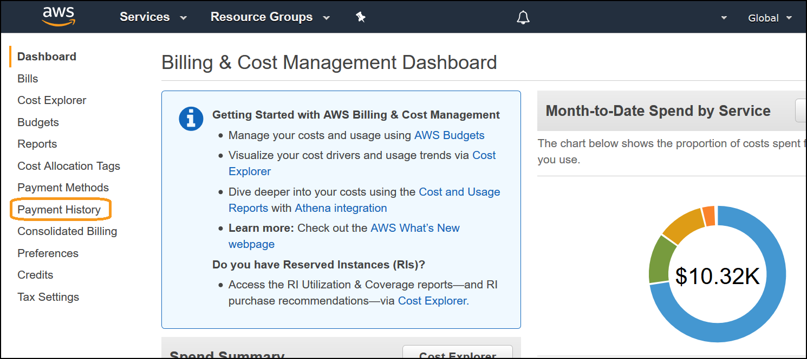
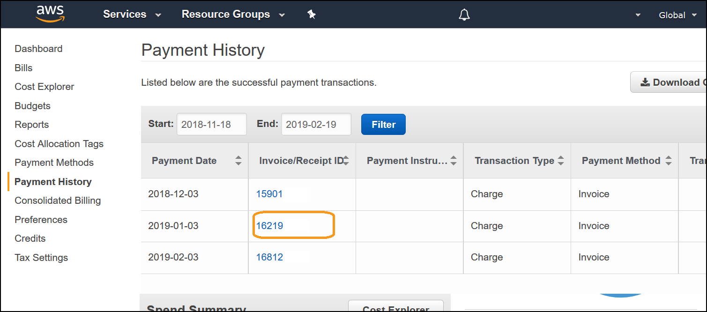

# Level 100: Billing Analysis

## Authors
- Nathan Besh, Cost Lead Well-Architected

## Feedback
If you wish to provide feedback on this lab, there is an error, or you want to make a suggestion, please email: costoptimization@amazon.com

# Table of Contents
1. [View your AWS Invoices](#view_invoice)
2. [View your cost and usage in detail](#cost_usage_detail)
3. [Download your monthly cost and usage file](#cost_usage_download)
4. [Tear down](#tear_down)
5. [Survey](#survey)

## 1. View your AWS Invoices 
At the end of a billing cycle or at the time you choose to incur a one-time fee, AWS charges the payment method you have and issues your invoice as a PDF file. You can view these invoices through the AWS console, which will show summary information of all usage and cost incurred for that one off item, or billing period.

1. Log into the console as an IAM user with the required permissions, go to the billing dashboard:

2. Select **Payment history** from the menu on the left:

3. Click on an **Invoice/Receipt ID** corresponding to the month you wish to view:

4. It will download a PDF version of your invoice similar to below:

[Back to Top](#TOC)
   
## 2. View your cost and usage in detail
You can view past and present cost and usage through the console, which also provides more detailed information on cost and usage. We will go through accessing your cost and usage by service, and by linked account (if applicable). We will then drill down into a specific service.

1. Go to the billing dashboard:

2. Click on **Bills** from the left menu:

3. Select the **Date** you require from the drop down menu, by clicking on the menu item:

4. You will be shown **Bill details by service**, where you can dynamically drill down into the specific services' cost and usage. Pick your largest cost service and look into the region and line items:

5. Select **Bill details by account** to see cost and usage for each account separately. Select the **Account name**, then drill down into the specific service cost and usage:

[Back to Top](#TOC)

## 3. Download your monthly cost and usage file
It is possible to download a CSV version of your summary cost and usage information. This can be accessed by a spreadsheet application for ease of use.  We will download your monthly usage file and view it.  

1. Go to the billing dashboard:

2. Click on **Bills** from the left menu:

3. Select the **Date** you require from the drop down menu, by clicking on the menu item:

4. Click on **Download CSV**:

5. It will download a CSV version of the bill you can use in a spreadsheet application. It is recommended to NOT use this data source for calculations and analysis, instead you should use the Cost and Usage Report, which is covered in [200_4_Billing_Analysis](../200_4_Billing_Analysis/Lab%20Guide.md).

[Back to Top](#TOC)

## 4. Tear down
There is no configuration performed within this lab, so no teardown is required.

[Back to Top](#TOC)

## 5. Survey 
Thanks for taking the lab; we hope that you can take this short survey (<2 minutes), to share your insights and help us improve our content.

This survey is hosted by an external company (Qualtrics) , so the link above does not lead to our website.  Please note that AWS will own the data gathered via this survey and will not share the information/results collected with survey respondents.  Your responses to this survey will be subject to [AWS's Privacy Policy](https://aws.amazon.com/privacy/).
 