# Level 200: Cost and Usage Governance

## Authors
- Nathan Besh, Cost Lead Well-Architected
- Spencer Marley, Commercial Architect
 
## Feedback
If you wish to provide feedback on this lab, there is an error, or you want to make a suggestion, please email: costoptimization@amazon.com


# Table of Contents
1. [Create a cost optimization team](#create_team)
2. [Create an EC2 Policy](#EC2_policy)
3. [Create an AWS Budget](#budget)
4. [Tear down](#tear_down)
5. [Feedback survey](#survey)  

## 1. Create a cost optimization team <a name="create_team"></a>
We are going to create a cost optimization team. Within your organization there needs to be a team of people that are focused around costs and usage. This exercise will create the users and the group, then assign all the access they need.
This team will then be able to manage the organizations cost and usage, and start to implement optimization mechanisms.

      
### 1.1 Create an IAM policy for the team
This provides access to allow the cost optimization team to perform their work, namely the Labs in the 100 level fundamental series. This is the minimum access the team requires.

1. Log in and go to the **IAM** Service page:
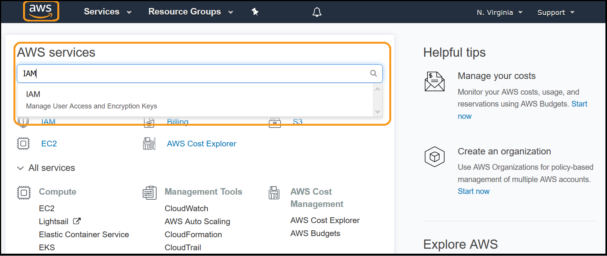

2. Select **Policies** from the left menu:


3. Select **Create Policy**:

  
4. Select the **JSON** tab:

  
5. Modify the policy below, replace **-billing bucket-** (2 replacements) with the name of the bucket your CUR files are delivered to. Then copy & paste the policy into the the field:
**NOTE**: Ensure you copy the entire policy, everything including the first '{' and last '}'
```
{
  "Version": "2012-10-17",
  "Statement": [
    {
      "Sid": "VisualEditor0",
      "Effect": "Allow",
      "Action": [
        "s3:GetObject",
        "s3:ListBucket"
      ],
      "Resource": [
        "arn:aws:s3:::-billing bucket-",
        "arn:aws:s3:::-billing bucket-/*"
      ]
    },
    {
      "Sid": "VisualEditor1",
      "Effect": "Allow",
      "Action": [
        "iam:GetPolicyVersion",
        "quicksight:CreateAdmin",
        "iam:DeletePolicy",
        "iam:CreateRole",
        "iam:AttachRolePolicy",
        "aws-portal:ViewUsage",
        "iam:GetGroup",
        "aws-portal:ModifyBilling",
        "iam:DetachRolePolicy",
        "iam:ListAttachedRolePolicies",
        "ds:UnauthorizeApplication",
        "aws-portal:ViewBilling",
        "iam:DetachGroupPolicy",
        "iam:ListAttachedGroupPolicies",
        "iam:CreatePolicyVersion",
        "ds:CheckAlias",
        "quicksight:Subscribe",
        "ds:DeleteDirectory",
        "iam:ListPolicies",
        "iam:GetRole",
        "ds:CreateIdentityPoolDirectory",
        "ds:DescribeTrusts",
        "iam:GetPolicy",
        "iam:ListGroupPolicies",
        "aws-portal:ViewAccount",
        "iam:ListEntitiesForPolicy",
        "iam:AttachUserPolicy",
        "iam:ListRoles",
        "iam:DeleteRole",
        "budgets:*",
        "iam:CreatePolicy",
        "quicksight:CreateUser",
        "s3:ListAllMyBuckets",
        "iam:ListPolicyVersions",
        "iam:AttachGroupPolicy",
        "quicksight:Unsubscribe",
        "iam:ListAccountAliases",
        "ds:DescribeDirectories",
        "iam:ListGroups",
        "iam:GetGroupPolicy",
        "ds:CreateAlias",
        "ds:AuthorizeApplication",
        "iam:DeletePolicyVersion"
      ],
      "Resource": "*"
    }
  ]
}
```
5. Click **Review policy**: 


6. Enter a **Name** and **Description** for the policy and click **Create policy**:


You have successfully created the cost optimization teams policy.
  
    
### 1.2 Create an IAM Group
This group will bring together IAM users and apply the required policies.

1. While in the IAM console, select **Groups** from the left menu:
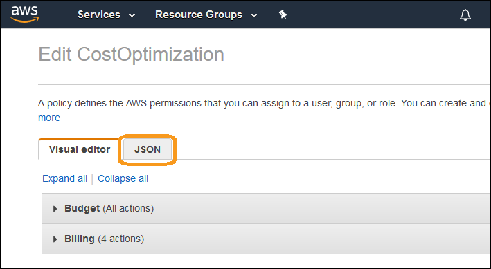

2. Click on **Create New Group**:


3. Enter a **Group Name** and click **Next Step**:


4. Click **Policy Type** and select **Customer Managed**:


5. Select the **CostOptimization_Summit** policy (created previously):


6. We will now add more policies, click on **Customer Managed** and select **AWS Managed**:
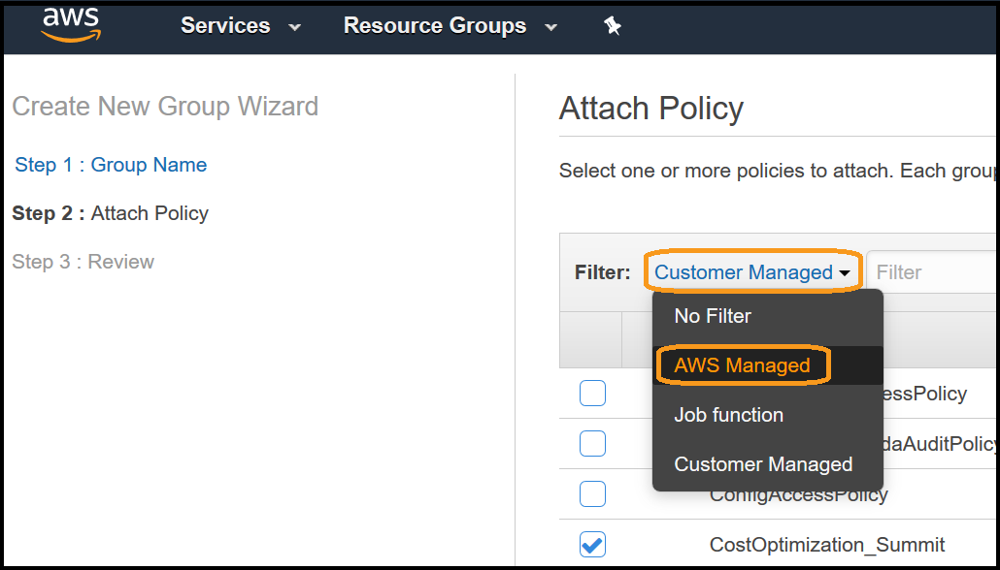

7. Type **Athena** into the filter box, select **both** policies, and click **Next Step**:


8. Click **Create Group**:
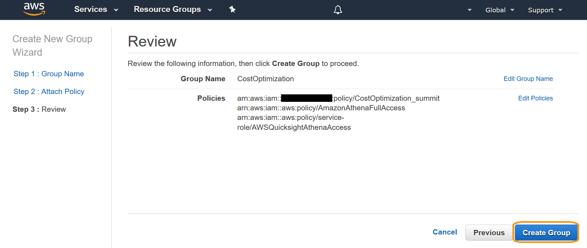


You have now successfully created the cost optimization group, and attached the required policies.


### 1.3 Create an IAM User
For this lab we will create a user and join them to the group above.

1. In the IAM console, select **Users** from the left menu:


2. Click **Add user**:


3. Enter a **User name**, select **AWS Management Console access**, choose **Custom Password**, type a suitable password, deselect **Require password reset**, and click **Next: Permissions**:


4. Select the **CostOptimization** group (created previously), and click **Next: Tags**:


5. Click **Next Review**:


6. Click **Create user**:


7. Copy the link provided, and logout by clicking on your username in the top right, and selecting **Sign Out**::
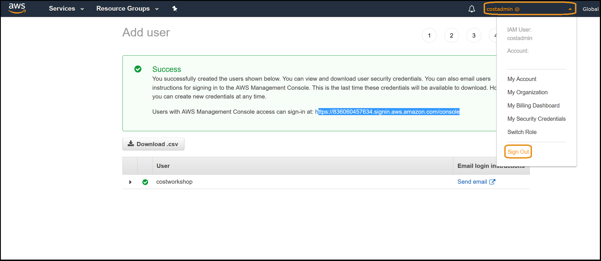

8. Log back in as the username you just created, with the link you copied for the remainder of the Lab.
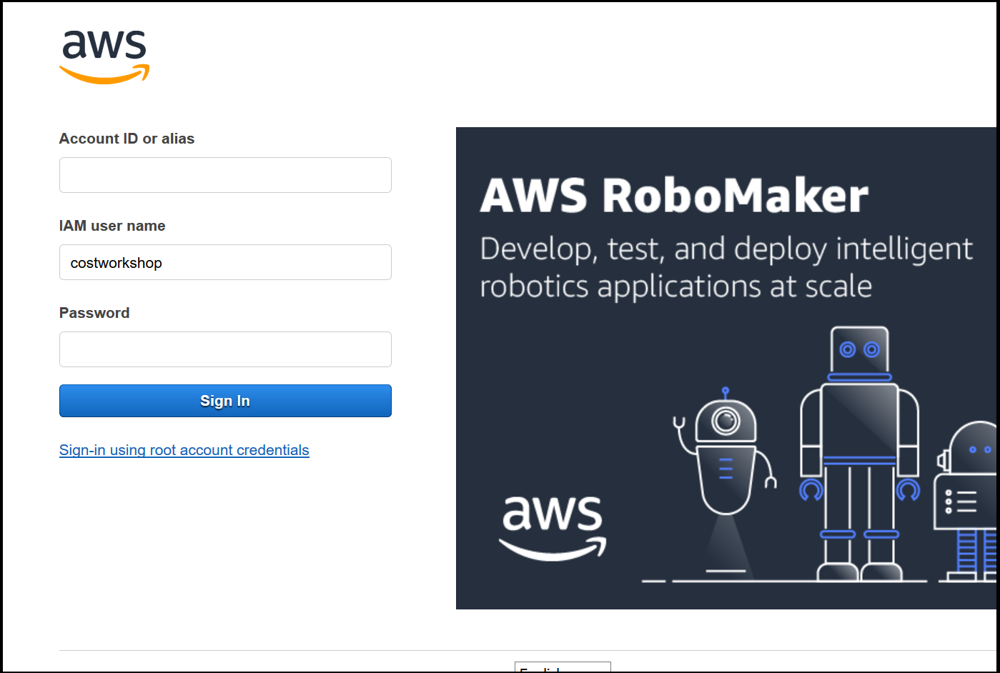

You have successfully create a user, placed them in the cost optimization group and have applied policies.
You can continue to expand this group by adding additional users from your organization.


## 2. Create and implement an IAM policy to manage region and EC2 usage <a name="EC2_policy"></a>
To manage costs you need to manage and control your usage. We will create a policy that controls 2 aspects of usage: the regions that a user has access to, and the types of EC2 instances they can create. By implementing these policies, you restrict where usage occurs - making it easier to manage, and also limit the maximum amount that can be incurred. 

### 2.1 Create the IAM Policy <a name="EC2_RestrictPolicy"></a>

1. Go to the **IAM** service page: 


2. Select **Policies** from the left menu:


3. Click **Create Policy**:


4. Click the **JSON** tab:


5. Open the following text file, copy and paste the policy into the console:
**NOTE** Ensure you copy the entire policy, including the start '{' and end '}' 
 
               
This policy restricts EC2 usage to a single region **us-east-1**, and also limit all EC2 operations (such as resource creation) to specific instance families and instance sizes.  

6. Click **Review policy**:

NOTE: the policy may be different from the image above

7. Enter a **Name** and **Description**, and click **Create policy**: 


You have successfully created the Policy.


### 2.2 Apply it to a group <a name="EC2_apply"></a>

1. Select **Groups** from the left menu:


2. Click on the **CostOptimization** group (created previously):


3. Select the **Permissions** tab:


4. Click **Attach Policy**:


5. Click **Policy Type** and select **Customer Managed**:


6. Select the checkbox next to **EC2_Restricted** (created above) and click **Attach Policy**:


You have successfully attached the policy to the Cost Optimizaiton group. 


### 2.3 Verify the policy is in effect <a name="verify_EC2_policy"></a>
1. Go to the EC2 Service dashboard: 


2. Click the current region in the top right, and select **US West (N.California)**: 


3. You will notice that there are authorization messages due to not having access in that region (the policy restricted EC2 usage to N. Virginia only):


4. Try to launch an instance by clicking **Launch Instance**:


5. Click on **Select** next to the **Amazon Linux 2 AMI**, You will receive an error when you select an AMI as you do not have permissions:


You have successfully verified that you can not launch any instances outside of the N.Virginia region.
We will now verify the instance type restrictions are in place.

6. Change the region by clicking the current region, and selecting **US East (N.Virginia)**:


7. Now launch a c5.large instance in N.Virginia. Choose the **Amazon Linux 2 AMI**, leave **64-bit (x86)** selected, click **Select**:


8. Scroll down and select a **c5.large**, and click **Review and Launch**:


9. Take note of the security group created (as you need to delete it), Click **Launch**:


10. Select the **I acknowledge..** checkbox, and click **Launch Instances**:


11. You will get a failure message, as we only allowed the m5 family (of any size), and nano through to medium sized instances. Click **Cancel**:


You have successfully implemented an IAM policy that restricts all EC2 operations to the m5 instance family (of any size), and any instance family where the instance size is nano, micro, small or medium. NOTE: this will not only stop people from launching instances, but all operations - such as stopping, terminating or modifying them.

By implementing an IAM policy to control usage, you not only ensure unnecessary resources are not created, but also potentially increase the usage of Reserved Instances - by enforcing specific instance families and sizes to be launched.  


## 3. Create and implement AWS Budgets <a name="budget"></a> 
Budgets allow you to manage cost and usage by providing notifications when usage or cost are outside of configured amounts. They are less intrusive then policies as they do not restrict actions. We will create a cost budget and also an RI coverage budget.

### Create a monthly cost budget for your account 
We will create a monthly cost budget which will notify if the forecasted amount exceeds the budget.

1. Go to the **Billing console**:


2. Select **Budgets** from the left menu:


3. Click on **Create a budget**:


4. Ensure **Cost Budget** is selected, and click **Set your budget >**:
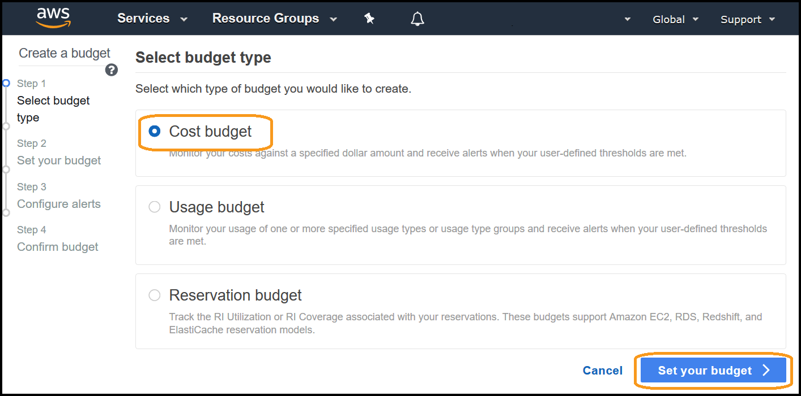

5. Create a cost budget, enter the following details:
   **Name**: (enter a name), 
   **Budgeted amount**: (enter an amount a lot LESS than last months cost), 
   **Budget effective dates**: Select **Recurring Budget** and start month is the current month, 
   Other fields: leave a defaults


6. Scroll down and click **Configure alerts >**:
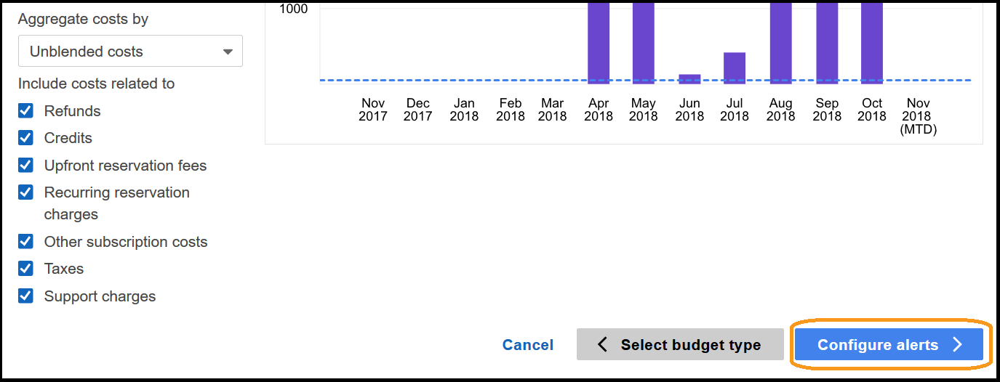

7. Select:
   **Send alert based on**: Forecasted Costs
   **Alert threshold**: 100% of budgeted amount
   **Email contacts**: (your email address)
Click on **Confirm budget >**:


8. Review the configuration, and click **Create**:


9. You can see the current forecast will exceed the budget (it is red):
 

10: You will receive an email similar to this within a few minutes:


You have created a forecasted budget, when your forecasted costs for the entire account are predicted to exceed the forecast, you will receive a notification. You can also create an actual budget, for when your current costs actually exceed a defined amount.

### Create an RI Coverage budget
We will create a monthly RI coverage budget which will notify if the forecasted amount is below the specified amount.

1. Click **Create budget**:


2. Select **Reservation budget**, and click **Set your budget >**:
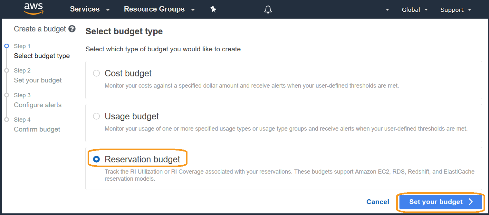

3. For **Reservation budget type** Select **RI Coverage**, enter a **Name**, select **Amazon Elastic Compute** as the **Service**, enter a high **Utilization threshold** of **99%** and click **Configure alerts >**:
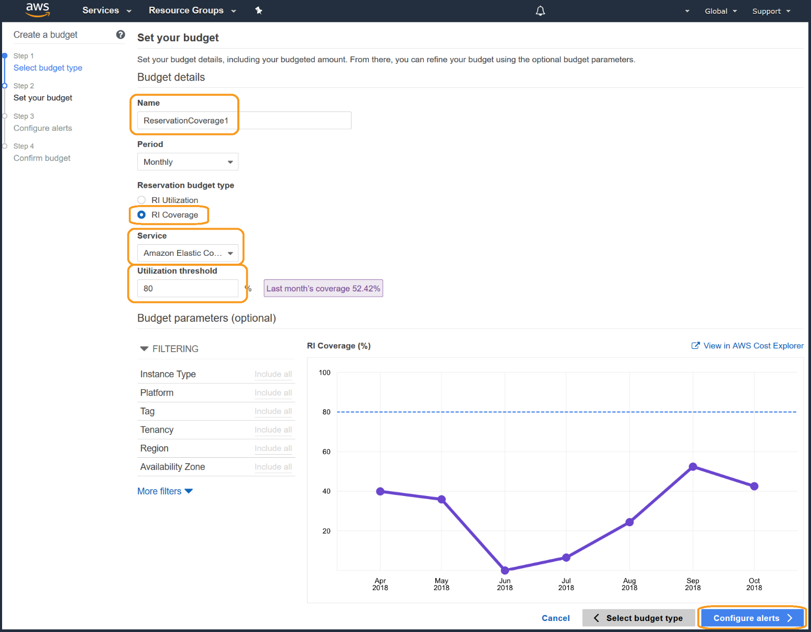 

4. Enter an address for **Email contacts** and click **Confirm budget >**:
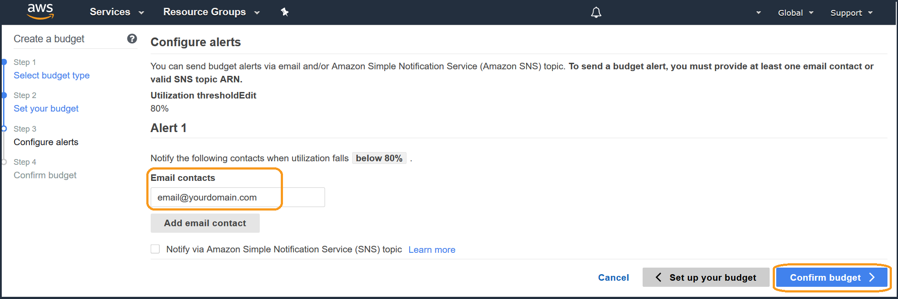

5. Review the configuration, and click **Create** in the lower right:
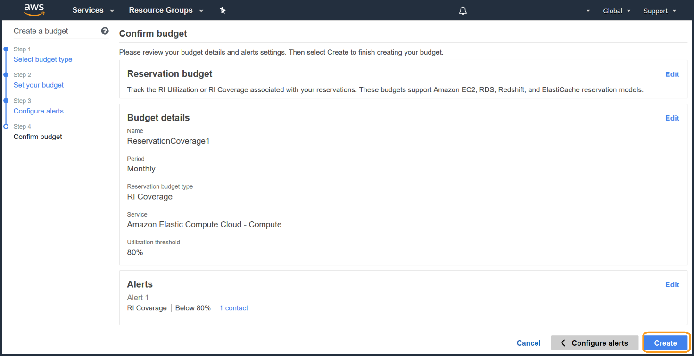

6. You will receive an email similar to this within a few minutes:
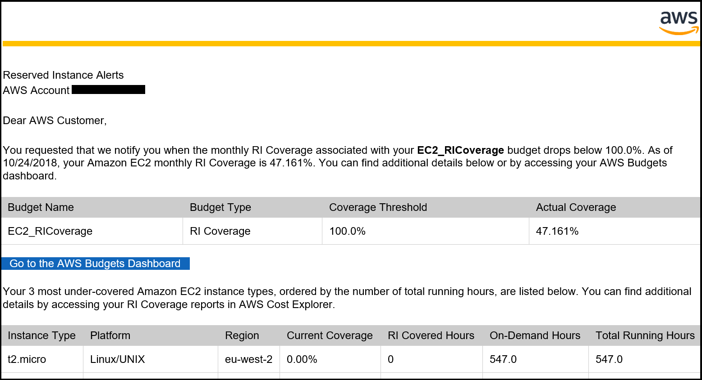

You have created an RI Coverage budget.  When creating coverage budgets you can consider specific services or instance types, but always ensure you have a high coverage across the entire account. High coverage is critical for cost optimization, as having low coverage costs the same as having additional & unused RI's - for example, t3 instance coverage at 50% is approximately the same as having an additional 10% of RI's - which are unused, d2 coverage at 50% is approximately the same as having an additional 48% of RI's - which are unused.

  
    
        

## 4. Tear down <a name="tear_down"></a>
NOTE: The cost optimization user, group and policies are required for the completion of the fundamental labs. If you remove these resources you will not be able to complete the labs. There is no tear down for this component as it is best practices to have this group created in all organizations.

### Delete a security group
When you attempted to launch an instance in [2.3 Verify the policy](#verify_EC2_policy), it created a **launch-wizard** security group automatically, which you will need to delete.

1. Go to the EC2 Dashboard:


2. Select **Security Groups** under **NETWORK AND SECURITY** on the left:
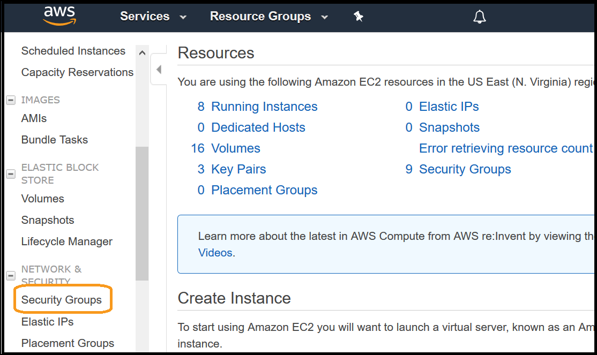

3. Click the checkbox next to the security group you need to delete:
NOTE: you took note of the specific group in the exercise above.


4. Click **Actions**, then select **Delete Security Group**:
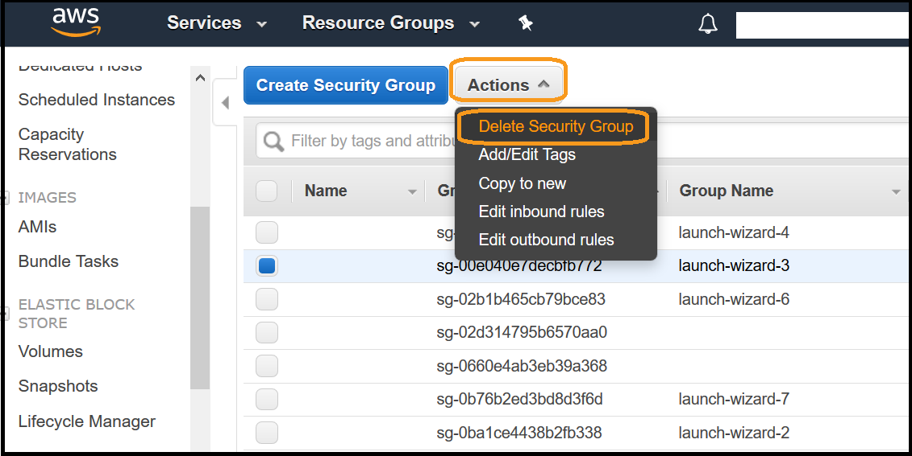

5. Click **Yes, Delete**:
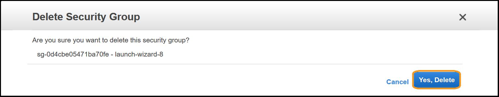


### Remove a policy from a group
We will remove the **EC2_Restricted** policy setup in [2.2 Apply it to a group](#EC2_apply) from our cost optimization group, as they do not require the EC2 access.

1. Go to the IAM Console:


2. Select **Groups** from the left menu:
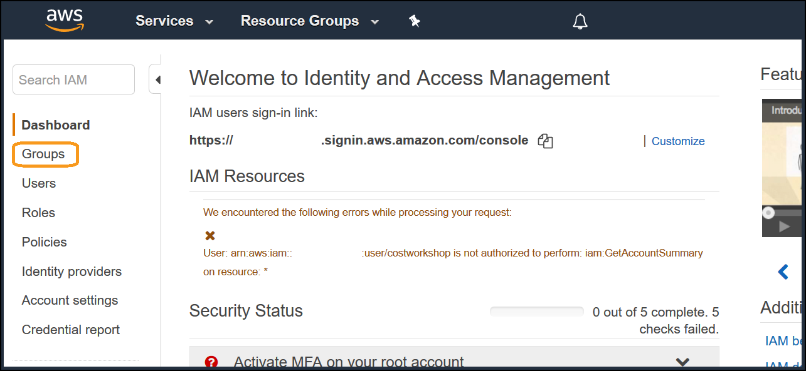

3. Click on the **CostOIptimization** group (that was created previously):
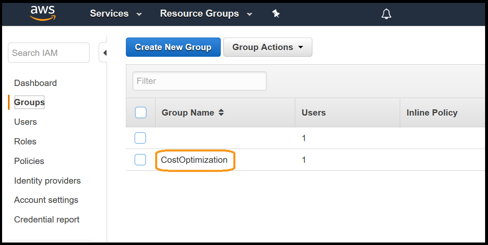 

4. Click on **Permissions**:
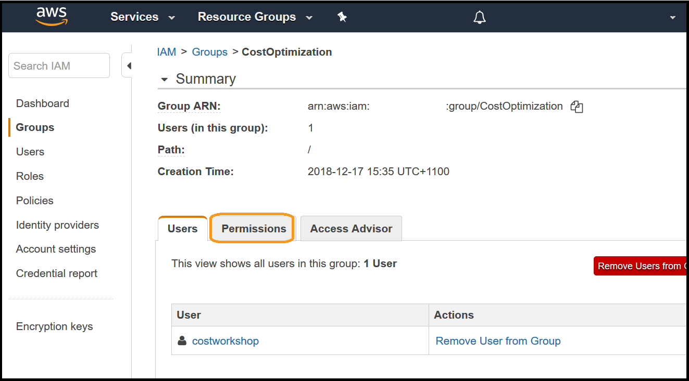

5. Click on **Detach Policy** next to the **EC2_Restricted** Policy Name:
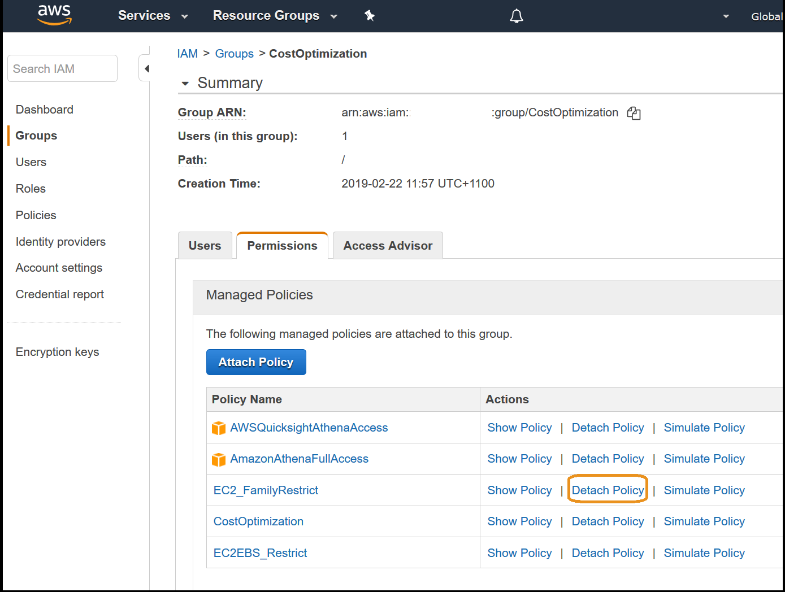

6. Click **Detach**:
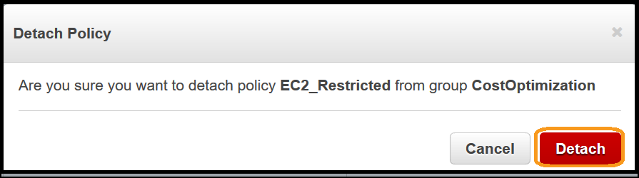


### Delete a policy
We will delete the EC2_Restricted policy created in [2.1 Create the IAM policy](#EC2_RestrictPolicy) as its no longer applied to any groups.

1. Go to the IAM Console:


2. Click on **Policies** on the left:


3.Click on **Filter Policies** and select **Customer managed**: 


4. Select the policy you want to delete **EC2_Restricted**:


5. Click on **Policy actions**, and select **Delete**:


6. Click on **Delete**:


### Delete a budget
We will delete both budgets that were configured in [3. Create and implement AWS Budgets](#budget), the cost budget and the reservation coverage budget.

1. From the budgets homepage, click on the budget name **CostBudget1**:


2. Click on the **3 dot menu** in the top right, select **Delete**:


You will be notified that the deletion was successful.

3. Click on the other budget name **ReservationCoverage1**:


4. Click on the **3 dot menu** in the top right, select **Delete**:


## 5. Survey <a name="survey"></a>
Thanks for taking the lab, We hope that you can take this short survey (<2 minutes), to share your insights and help us improve our content.

[](https://amazonmr.au1.qualtrics.com/jfe/form/SV_9EPtEoy72tDcIDP)


This survey is hosted by an external company (Qualtrics) , so the link above does not lead to our website.  Please note that AWS will own the data gathered via this survey and will not share the information/results collected with survey respondents.  Your responses to this survey will be subject to Amazons Privacy Policy.
 


