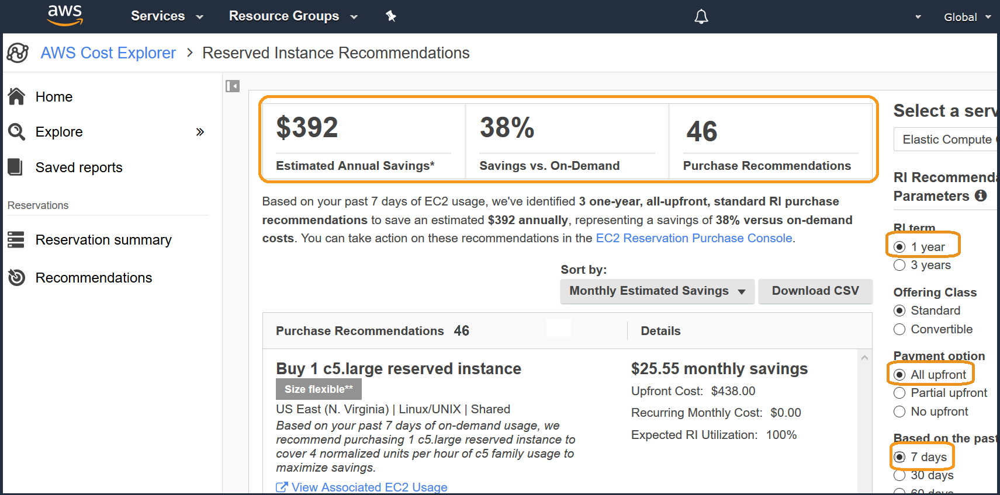
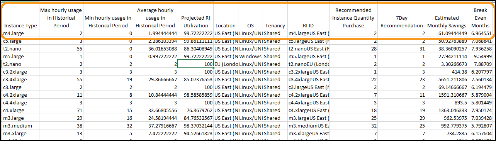
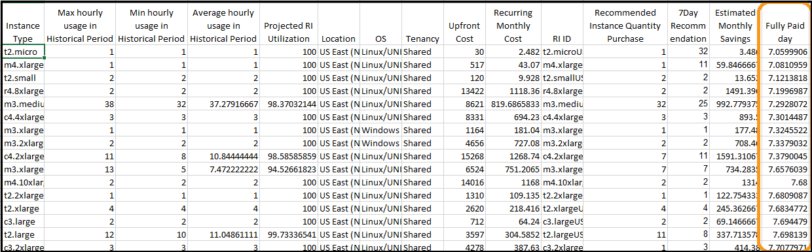
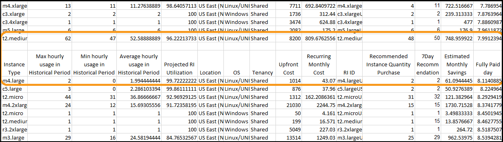
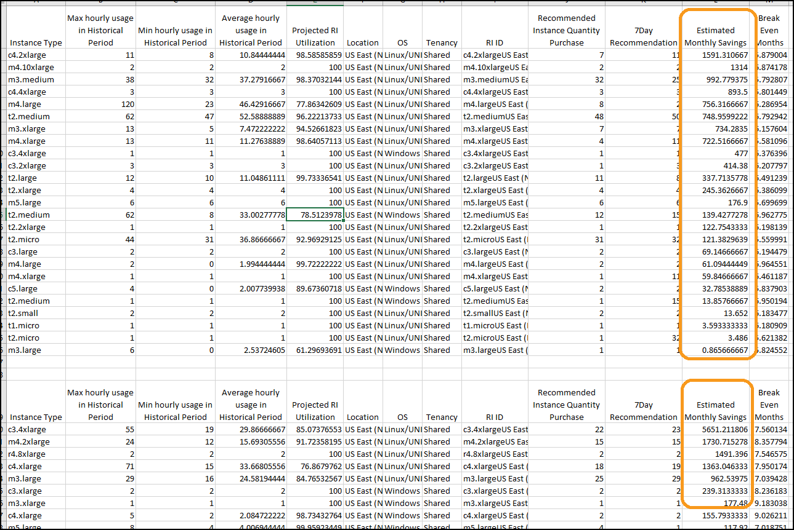
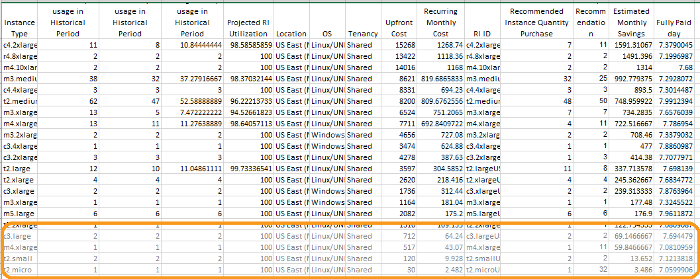
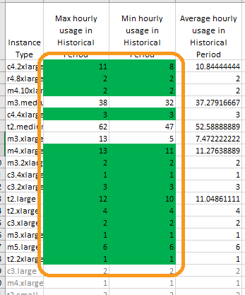
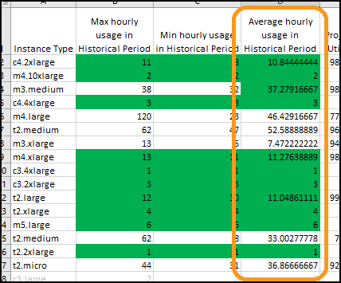
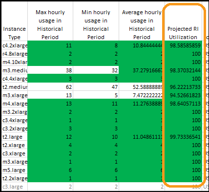

# Level 200: Pricing Models

## Authors
- Nathan Besh, Cost Lead, Well-Architected
- Spencer Marley, Commercial Architect
- Paul Lambden, Principal Technical Account Manager


## Feedback
If you wish to provide feedback on this lab, there is an error, or you want to make a suggestion, please email: costoptimization@amazon.com


# Table of Contents
1. [View an RI report](#ri_report)
2. [Download and prepare the RI CSV files](#prepare_csv)
3. [Sort and filter the RI CSV files](#filter_csv)
4. [Teardown](#tear_down)
5. [Rate this Lab](#rate_lab) 


## 1. View an RI report<a name="ri_report"></a>
We are going to view the RI reports within AWS Cost Explorer, to understand the recommendations and possible purchases we should make.

**NOTE**: Analysis can ONLY be done on **All Up Front** recommendations, as this allows the break even to show when the entire RI term (12 or 36 months) is paid off. After the analysis is performed, you can proceed to purchase the required RI type.

1. Log into the console as an IAM user with the required permissions, go to the **AWS Cost Explorer** service page:


2. In the left menu select **Recommendations**: 


3. On the right select the filters: **RI term** 1 year, **Payment Option** All upfront, **Based on the past** 7 days:


The top section will show the estimated savings and number of recommendations, take note of the **Purchase Recommendations**

4. On the right select the filter: **Based on the past** 30 days:


View the **Purcahse Recommendations**, if the 30 day recommendation is less than 7 days recommendation - your usage is **increasing** and the recommendations are lower risk.  If the 7 days recommendation is less than 30 days, then your usage is **decreasing** and you need to look further into your usage patterns to see which RI's would be suitable.


## 2. Download and prepare the RI CSV files<a name="prepare_csv"></a>
1 - Download the CSV for **both** the 7 day and 30 day recommendation files, by selecting the filter **7 days** or **30 days**, and clicking on **Download CSV**:


2 - If you do not have sufficient usage, you can download the two sample files:

Ctrl-click to open them in a new tab, then copy the text and paste it into a spreadsheet application. Paste the 30day recommendations into one worksheet, and the 7day recommendations into another worksheet called **7Day Rec**, in the same spreadsheet.

- [7_day_EC2_R_Rec.csv](./Code/7_day_EC2_RI_Rec.csv)
- [30_day_EC2_R_Rec.csv](./Code/30_day_EC2_RI_Rec.csv)


3 - Create a new column called **RI ID** to the left of the **Recommendation** column on **both** 30Day and 7Day sheets, which is a unique identifier of the RI Type, the formula for this cell will concatenate the columns: **Instance Type**, **Location**,**OS** and **Tenancy**:
```
=CONCATENATE(C5,L5,M5,N5)
```


4 - Add a column in the **30Day** worksheet to the right of the Recommendation column. This will be for the 7Day recommendations.  Add a VLOOKUP formula to get the values from the **7Day** worksheet, modify this formula for the number of rows you require (U column):
```
=VLOOKUP(T5,'7Day Rec'!T$4:U$48,2,FALSE)
```


5 - Delete the following columns as they are not necessary: **Recommendation Date**, **Owner Account**, **Size Flexible Recommendation**, **Max hourly normalized unit usage in Historical Period**, **Min hourly normalized unit usage in Historical Period**, **Average hourly normalized unit usage in Historical Period**, **Offering Class**, **Term**, **Payment Option**, **Upfront Cost**, **Recurring Monthly Cost**. You should be left with the following columns:



We now have the required data required to be able to analyze, and filter out the high risk and low return RIs.


## 3. Sort and filter the RI CSV files<a name="filter_csv"></a>
RI purchases should be done frequently (bi-weekly or monthly), so for each cycle we want: **low risk** and **high return** purchases, and purchase the top 50-75% of recommendations. This will ensure you have sufficiently high coverage, while minimizing the risk of unused RIs.

### 3.1 Filter out low risk, and high return RIs
1 - To get the lowest risk, we sort by **Break Even Months** smallest to largest, as these will be fully paid off in the shortest amount of time. You can see that some of the RI's below are fully paid off in less than 6months - so if they are used for 6 months - they have paid themselves off completely.



2 - We will separate the very low, low, and medium risk recommendations. Add in some empty lines between **Break Even Months** of 7, 10, and copy the header line across: 



3 - We have categorized the risk, so we will now look for the highest return recommendations in each category. Sort each of the three groups by **Estimated Monthly Savings**, **largest to smallest**:



4 - Depending on your usage and business, chose a minimum estimated monthly savings - a typical value for larger customers is in the range of $50-100. While they save money, these recommendations do not save enough - aim for the top 50-70% of recommendations.  We have chosen $100, grey out anything less than this:


### 3.2 Filter out usage patterns
It would be a large amount of effort to view the daily usage patterns over the month for every recommendation - checking for declining usage or erratic usage, but we can do this programatically. By looking at the columns, we can assess the underlying usage pattern.

1 - If the **Max hourly usage** is close to **Min hourly usage**, within 75-100% - then the usage would be relatively flat, with low variance.  Go through and highlight these cells green.  You could do this with a formula, but a very fast judgment is ok:


2 - If the **Average hourly usage** is close to the **Max hourly usage**, then the minimum was only a small duration, so highlight anything green where the **Average** is roughly within 75-100% of the **Max**:


3 - Minimum utilization required varies by the discount level.  The lowest discount level is approximately 20%, so we would look for a minimum utilization of >80%. While this is reflected through the Break even (if utilization is low, break even would be very late), we'll double check & filter out only the very high utilization. Highlight anything above **90%** in green:


4 - Now we look for a declining usage pattern. If the recommendation for the last 7 days is less than the 30 days, usage is declining - and you should consult your business to determine if usage will continue to fall. If the **7day Recommended Instance Quantity** is equal or more than the **30day Recommended Instance Quantity** then highlight the cell green:


5 - Now we will see if the recommendation is close to the average, if its not then usage is varying. If the recommendation is **NOT** above, equal or close to the average (within 10%) then remove the highlighting from the recommendation column:


The processed sample files are available here:
- [Combined_EC2_RI_Rec.xls](./Code/Combined_EC2_RI_Rec.xlsx)


### 3.3 Making recommendations
We look at each of the risk categories as follows:

1 - Very low and low risk

 - For any recommendations that are highlighted in the **7Day** column, recommend the lowest of the **30Day** or **7Day** Columns.
 - For any recommendations that are highlighted in the **Average hourly usage** and **Projected RI Utilization**, select a percentage of either the **30Day** or **7Day** column (which ever is lower).


2 - Medium risk

 - From the recommendations highlighted in the **7Day** column, select a portion of these on a case by case basis based on business knowledge  


Other suggestions for recommendations that do not fall into the categories above:

- Re-evaluate in another 7-14 days to observe the usage trend
- Purchase a lower percentage of the average hourly
- Purchase a higher percentage of the minimum hourly


You have successfully filtered and processed all the recommendations. You can now make low risk and high return recommendations that are suitable based on your ongoing usage patterns with high confidence.
You can then take those recommendations, and purchase the quantity in the required accounts, with the required payment option (All upfront, Partial upfront, No upfront), and class (standard or convertible).


## 4. Teardown<a name="tear_down"></a>
There are no resources or configuration items that are created during this workshop. 

## 5. Rate this lab<a name="rate_lab"></a> 
[](https://wellarchitectedlabs.com/Cost_200_3_1star) [](https://wellarchitectedlabs.com/Cost_200_3_2star) [](https://wellarchitectedlabs.com/Cost_200_3_3star) [](https://wellarchitectedlabs.com/Cost_200_3_4star) [](https://wellarchitectedlabs.com/Cost_200_3_5star) 


    


