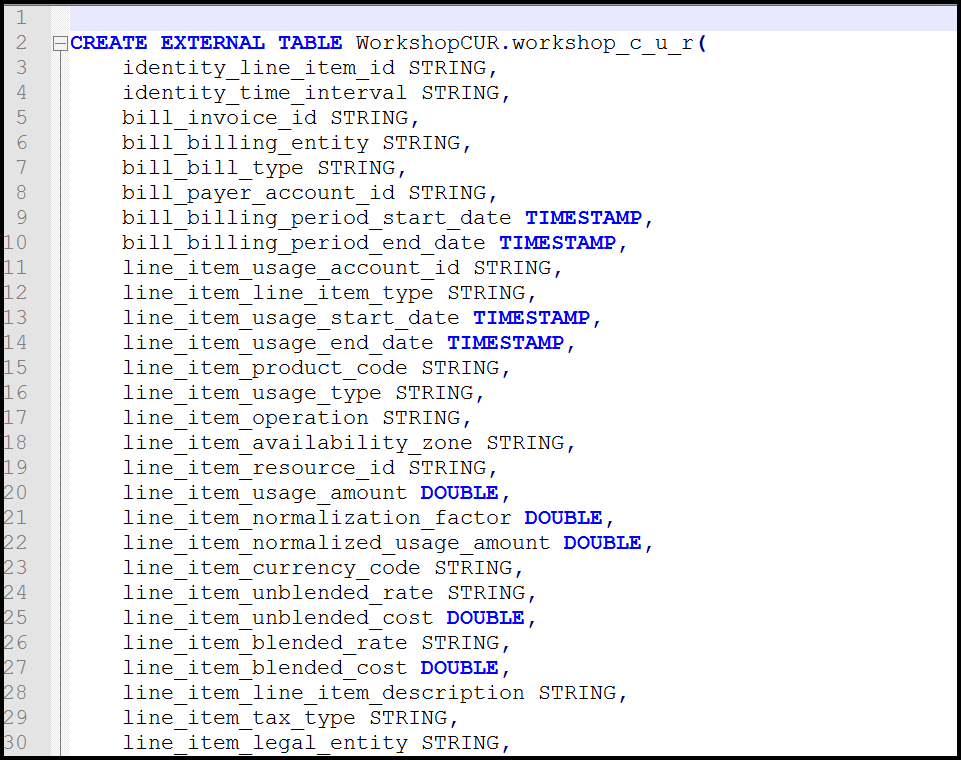
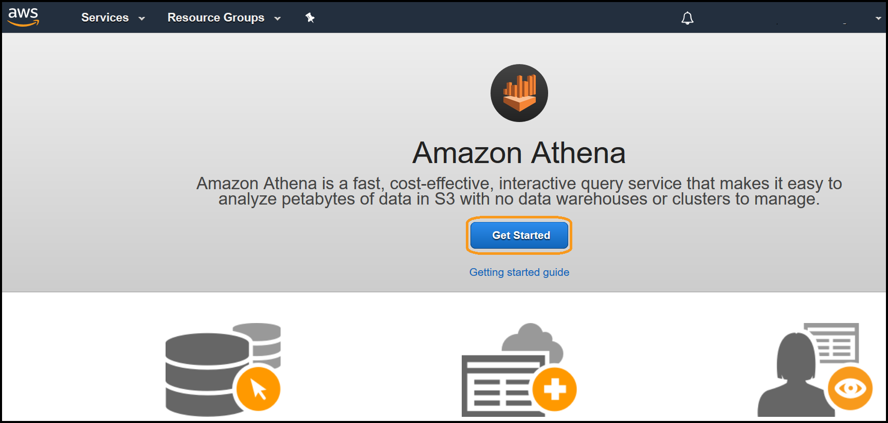

# Level 200: Billing Analysis

## Authors
- Nathan Besh, Cost Lead, Well-Architected
- Spencer Marley, Commercial Architect


## Feedback
If you wish to provide feedback on this lab, there is an error, or you want to make a suggestion, please email: costoptimization@amazon.com


# Table of Contents
1. [Verify your CUR files are being delivered](#Verify_CUR)
2. [Setup Amazon Athena and load the CUR files](#Setup_Athena)
3. [Cost and Usage analysis](#CUR_Analysis)
4. [Tear down](#tear_down)


## 1. Verify your CUR files are being delivered <a name="Verify_CUR"></a>
We will verify the CUR files are being delivered, they are in the correct format and the region they are in.

1. Go to the **Billing** console, and view the CUR report you created in [AWS Account Setup](../100_1_AWS_Account_Setup/Lab%20Guide.md), confirm the **S3 bucket**, and **Report path prefix**:


2. Go to the **S3** Service console: 


3. Verify the region where the bucket is located (here it is **US East N.Virginia**), and click on the **bucket name** where the report is delivered(it is blacked out here):


4. You should see a **aws-programmatic-access-test-object** which was put there to verify AWS can deliver reports, and also the folder which is the report prefix - **cur**. Click on the folder name for the **prefix** (here it is cur):


5. Click on the **folder name** which is also part of the prefix (here it is WorkshopCUR):


6. You should see a folder for each month, which contains the **sql** and **manifest** files. You will also have a folder from the prefix, labelled **WorkshopCUR** here. Click on the folder for the current month, for December 2018 it will be: **20181201-20190101**


7. You will see the **create-table.sql** file, open this text file & copy it to a text editor for later. This is delivered as you chose Athena support for your CUR. 


8. Here is a sample of the SQL file:


9. Go back up a level in the S3 console, and click on the **prefix** folder, here it is WorkshopCUR, then drill down in the current year and month:


10. You can see the delivered CUR file, it is in the **parquet** format:


You have successfully verified that the CUR files are being delivered and in the correct format.  You have also verified that Athena support was enabled through the delivery of the sql file.

## 2. Setup Amazon Athena and load the CUR files <a name="Setup_Athena"></a>
We will configure Athena to access and view our CUR files via SQL. Athena is a serverless solution to be able to execute SQL queries across very large amounts of data. Athena is only charged for data that is scanned, and there are no ongoing costs if data is not being queried, unlike a traditional database solution.

1. Go to the **Athena** console: 


2. If prompted, click on **Get Started**:


3. Go to your text editor, view the first line in the SQL file and check the name of the database, here it is **WorkshopCUR** 


4. In the Athena console, check the region in the top right is the same as the S3 bucket (here it is **N.Virginia**), then create the database in Athena - with the exact name above (check the case matches), by pasting the following code into the query window, and click on **Run query**:
```
CREATE DATABASE IF NOT EXISTS WorkshopCUR
  COMMENT 'Database for CUR files';
```


5. You will see in the lower **Results** window **Query successful**, and on the left - a new **workshopcur** database has been created:


6. Select the **workshopcur** database on the left, copy and paste the entire **.sql** file you have in your text editor into the query window, and click **Run query**:


6. A new table called **workshop_c_u_r** will have been created, we will now load the partitions. Click on the **3 dot menu** and select **Load partitions**:


7. You will see it execute the command **MSCK REPAIR TABLE**, and in the results it will add partitions to the metastore for each month that has a billing file:

NOTE: If it did not add partitions, then there is an error and there will be no data. 
Check
- The database name is correct & the same as the SQL file
- The folder names **year** and **month** are in S3 and the case matches
- There are parquet files in each of the month folders

8. We will now preview the data.  Click on the **3 dot menu** and select **Preview table**:


9. It will execute a **Select * from** query, and in the results you will see the first 10 lines of your CUR file:


10. (Optional if you have a linked account) We will create a member account table, this is for large organizations or partners - that want only a single accounts usage to be visible to them.
Copy and paste the following code:
```
CREATE TABLE linked_AccountID
WITH (
      format = 'Parquet',
      parquet_compression = 'SNAPPY')
AS SELECT * FROM "workshopcur"."workshop_c_u_r"
where "line_item_usage_account_id" = 'AccountID'
```
NOTE: replace **AccountID** with the 12 digit account ID of your member account.

You will see a new table created on the left:

NOTE: You can restrict and grant access to this specific member account table through IAM policies. This will be covered in the 300 level billing analysis lab 

You have successfully setup your CUR file to be analyzed. You can now query your usage and costs via SQL.


## 3. Cost and Usage analysis <a name="CUR_Analysis"></a>
We will now perform some common analysis of your usage through SQL queries. You will be charged for Athena usage by the amount of data that is scanned - the source files are monthly, and in parquet format - which is compressed and partitioned to minimise cost. Be careful to include **limit 10** or similar at the end of your queries to limit the amount of data that comes back.

For each of the queries below, copy and paste each query into the query window, click **Run query** and view the results.


We will restrict the queries to a single month (December, 2018) by including the following line:
```
where month(bill_billing_period_start_date) = 12 and year(bill_billing_period_start_date) = 2018
```


### 3.1 What data is available in the CUR file?
We will learn how to find out what data is available for querying in the CUR files, this will show what columns there are and some sample data in those columns.

1. What columns and data are in the CUR table?
```
select * from "workshopcur"."workshop_c_u_r" 
where month(bill_billing_period_start_date) = 12 and year(bill_billing_period_start_date) = 2018
limit 10;
```

2. What are all the different values in a column? (the column we use is **line_item_line_item_description**)
```
select distinct "line_item_line_item_description" from "workshopcur"."workshop_c_u_r"
where month(bill_billing_period_start_date) = 12 and year(bill_billing_period_start_date) = 2018
limit 10;
```

3 Give me all columns from the CUR, where a specific value is in a column (here the column **line_item_line_item_type** contains the word **Usage** somewhere, note the capital 'U'):
```
select * from "workshopcur"."workshop_c_u_r"
where "line_item_line_item_type" like '%Usage%' and month(bill_billing_period_start_date) = 12 and year(bill_billing_period_start_date) = 2018
limit 10;
```

4. What billing periods are available?
```
SELECT distinct bill_billing_period_start_date FROM "workshopcur"."workshop_c_u_r"
limit 10;
```

### 3.2 Top Costs
To efficiently optimize its useful to view the top costs in different categories, such as service, description or tags.

1. Top10 Costs by AccountID:
```
select "line_item_usage_account_id", round(sum("line_item_unblended_cost"),2) as cost from "workshopcur"."workshop_c_u_r"
where month(bill_billing_period_start_date) = 12 and year(bill_billing_period_start_date) = 2018
group by "line_item_usage_account_id"
order by cost desc
limit 10;
```

2. Top10 Costs by Product:
```
select "line_item_product_code", round(sum("line_item_unblended_cost"),2) as cost from "workshopcur"."workshop_c_u_r"
where month(bill_billing_period_start_date) = 12 and year(bill_billing_period_start_date) = 2018
group by "line_item_product_code"
order by cost desc
limit 10;
```

3. Top Costs by Line Item Description
```
select "line_item_product_code", "line_item_line_item_description", round(sum("line_item_unblended_cost"),2) as cost from "workshopcur"."workshop_c_u_r"
where month(bill_billing_period_start_date) = 12 and year(bill_billing_period_start_date) = 2018
group by "line_item_product_code", "line_item_line_item_description"
order by cost desc
limit 10;
```

4. Top EC2 Costs
```
select "line_item_product_code", "line_item_line_item_description", round(sum("line_item_unblended_cost"),2) as cost from "workshopcur"."workshop_c_u_r"
where "line_item_product_code" like '%AmazonEC2%' and month(bill_billing_period_start_date) = 12 and year(bill_billing_period_start_date) = 2018
group by "line_item_product_code", "line_item_line_item_description"
order by cost desc
limit 10;
```

5. Top EC2 OnDemand Costs
```
select "line_item_product_code", "line_item_line_item_description", round(sum("line_item_unblended_cost"),2) as cost from "workshopcur"."workshop_c_u_r"
where "line_item_product_code" like '%AmazonEC2%' and "line_item_usage_type" like '%BoxUsage%' and  month(bill_billing_period_start_date) = 12 and year(bill_billing_period_start_date) = 2018
group by "line_item_product_code", "line_item_line_item_description"
order by cost desc
limit 10;
```

### 3.3 Tagging and Chargeback
Common in large organizations is the requirement to allocate costs back to specific business units. It is also critical for optimization to be able to allocate costs to workloads, to measure workload efficiency.
**NOTE**: This will only work if you have tags enabled in your billng files, and they are the same as the examples here - **resource_tags_user_cost_center**

1. Top 20 Costs by line item description and CostCenter Tag
```
SELECT "bill_payer_account_id", "product_product_name", "line_item_usage_type", "line_item_line_item_description", resource_tags_user_cost_center, round(sum(line_item_unblended_cost),2) as cost FROM "workshopcur"."workshop_c_u_r"
where length("resource_tags_user_cost_center") >0 and month(bill_billing_period_start_date) = 12 and year(bill_billing_period_start_date) = 2018
group by "resource_tags_user_cost_center", "bill_payer_account_id", "product_product_name", "line_item_usage_type", "line_item_line_item_description"
order by cost desc
limit 20
```

2. Top 20 costs by line item description, without a CostCenter Tag
```
SELECT "bill_payer_account_id", "product_product_name", "line_item_usage_type", "line_item_line_item_description", round(sum(line_item_unblended_cost),2) as cost FROM "workshopcur"."workshop_c_u_r"
where length("resource_tags_user_cost_center") = 0 and month(bill_billing_period_start_date) = 12 and year(bill_billing_period_start_date) = 2018
group by "bill_payer_account_id", "product_product_name", "line_item_usage_type", "line_item_line_item_description"
order by cost desc
limit 20
```

### 3.4 Reserved Instance, On Demand and Spot Usage
To improve the use of pricing models across a business, these queries can assist to highlight the top opportunities for Reserved Instance (top On Demand cost), and also identify who is successful with pricing models (Top users of spot).
**NOTE**: You will need specific usage in your account that matches the instance types below, for this to work correctly.

1. T2 family instance usage
Observe how much is being spent on each different family (usage type) and how much is covered by Reserved instances.
```
select "line_item_usage_type", sum("line_item_usage_amount") as usage, round(sum("line_item_unblended_cost"),2) as cost from "workshopcur"."workshop_c_u_r"
where "line_item_usage_type" like '%t2.%' and month(bill_billing_period_start_date) = 12 and year(bill_billing_period_start_date) = 2018
group by "line_item_usage_type"
order by "line_item_usage_type"
```

2. Costs By running type
Divide the cost by usage (hrs), and see how much is being spent per hour on each of the usage types. Compare **BoxUsgae** (On Demand), to **HeavyUsage** (Reserved instance), to **SpotUsage** (Spot).
``` 
select "line_item_usage_type", round(sum("line_item_usage_amount"),2) as usage, round(sum("line_item_unblended_cost"),2) as cost, round(avg("line_item_unblended_cost"/"line_item_usage_amount"),4) as hourly_rate from "workshopcur"."workshop_c_u_r"
where "line_item_product_code" like '%AmazonEC2%' and "line_item_usage_type" like '%Usage%' and month(bill_billing_period_start_date) = 12 and year(bill_billing_period_start_date) = 2018
group by "line_item_usage_type"
order by "line_item_usage_type"
```

3. Show unused Reserved Instances
This will show how much of your reserved instances are not being used, and sorts it via cost of unused portion (recurring fee).
You can use this in two ways:
- See where you have spare RI's and modify instances to match, so they will use the RIs
- Convert your existing RI's if possible

```
select bill_billing_period_start_date, product_region, line_item_usage_type, reservation_reservation_a_r_n, reservation_unused_quantity, reservation_unused_recurring_fee from "workshopcur"."workshop_c_u_r"
where length(reservation_reservation_a_r_n) > 0 and reservation_unused_quantity > 0
order by bill_billing_period_start_date, reservation_unused_recurring_fee desc
```


## 4. Tear down <a name="tear_down"></a>
Amazon Athena only charges when it is being used, i.e. data is being scanned - so if it is not being actively queried, there are no charges. It is also best practice to regularly analyze your usage and cost, so there is no teardown for this lab.


