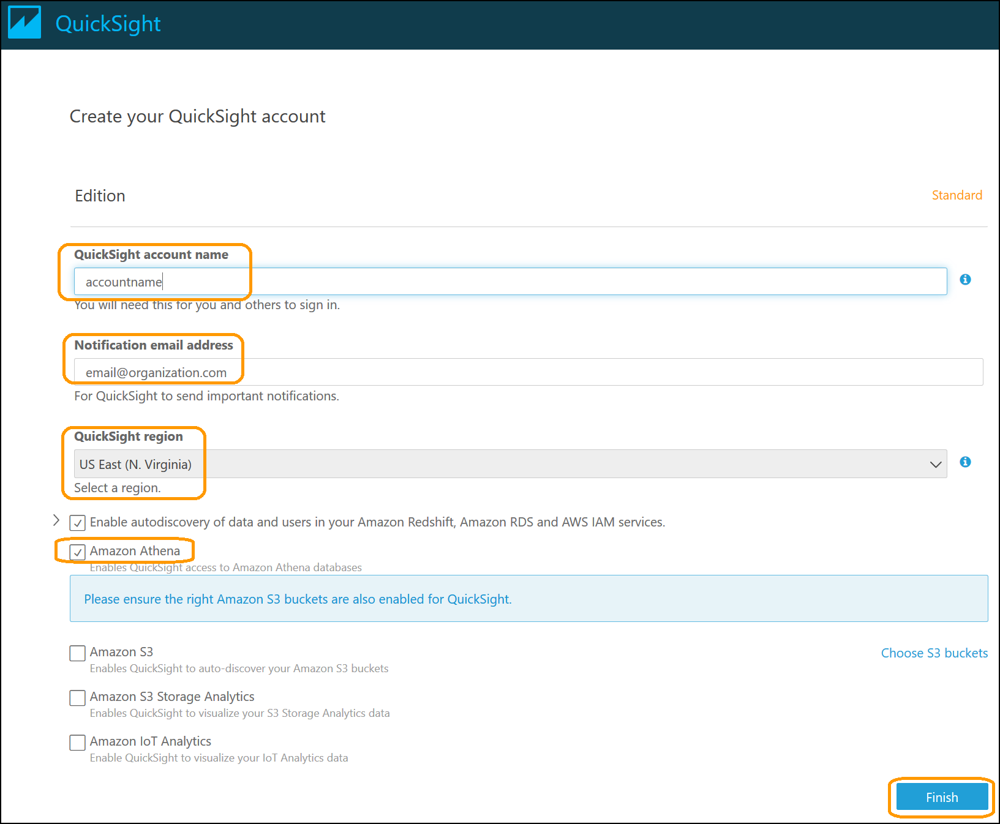
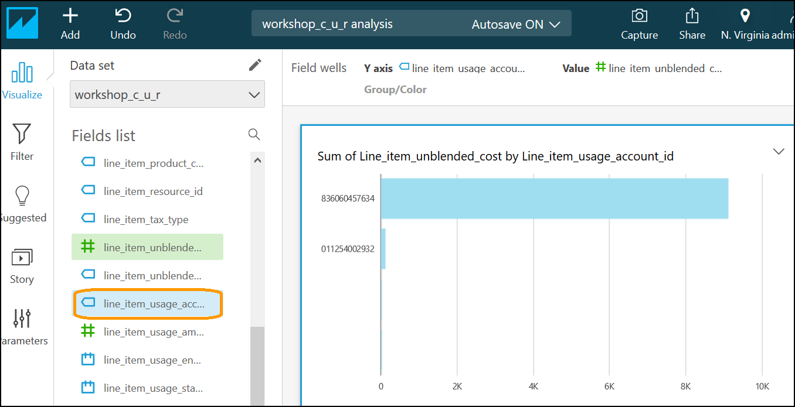
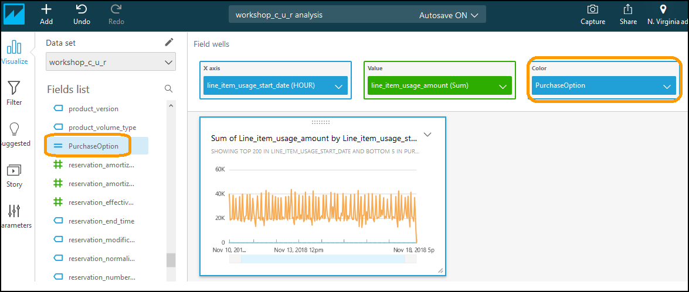
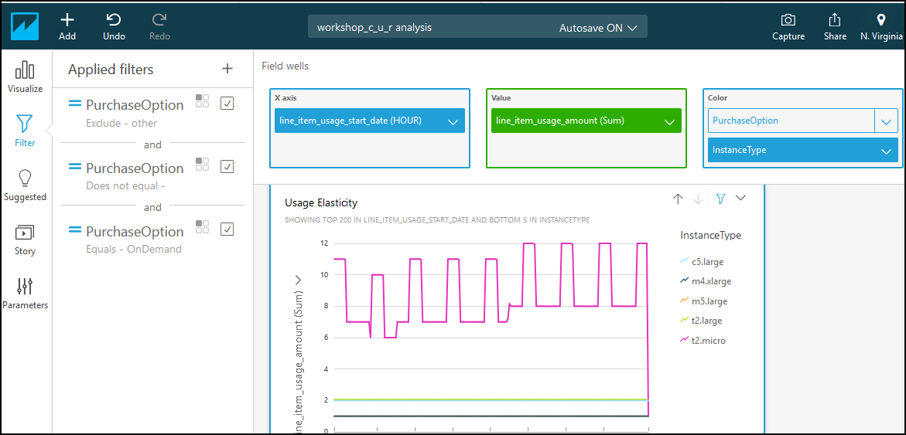
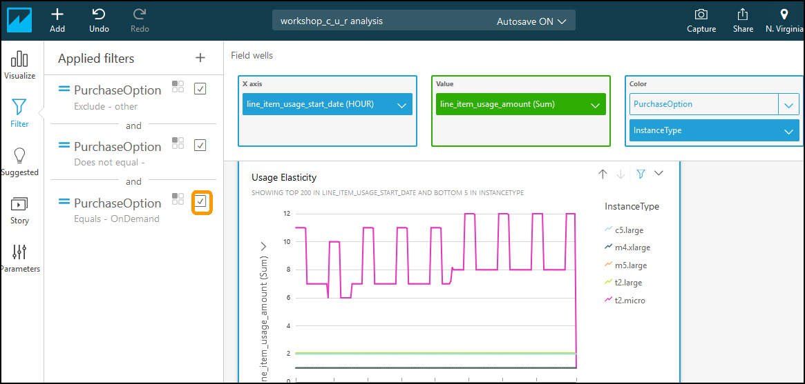
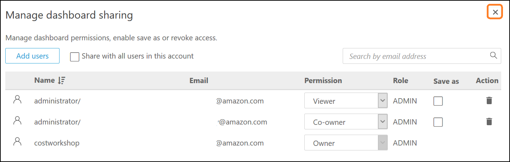

# Level 200: Cost Visualization

## Authors
- Spencer Marley, Commercial Architect
- Nathan Besh, Cost Lead, Well-Architected


## Feedback
If you wish to provide feedback on this lab, there is an error, or you want to make a suggestion, please email: costoptimization@amazon.com


# Table of Contents
1. [Setup Amazon QuickSight](#setup_quicksight)
2. [Create a data set](#data_set)
3. [Create visualizations](#create_visualizations)
4. [Share your Analysis and Dashboard](#share_analysis)
5. [Tear down](#tear_down)


## 1. Setup Amazon QuickSight <a name="setup_quicksight"></a>
The first step is to setup Amazon QuickSight, so that you can use the service in your account, and it has access to all the resources in your account.

1. Go to the **Amazon QuickSight** console:


### 1.1 Setup QuickSight for the first time
1. If you havent used QuickSight before click on **Sign up for QuickSight**, otherwise login and go to [step 5](#manage_quicksight):


2. Select the **Standard** edition, and click **Continue**:


3. Enter your **QuickSight account name**, **Notification email address**, select the **QuickSight region** (which matches your S3 bucket and Athena setup), select **Amazon Athena** and click **Finish**: 


4. Click **Go to Amazon QuickSight**:


5. Click on your **profile icon** in the top right, and select **Manage QuickSight**:<a name="manage_quicksight"></a>


6. Click **Account settings**, then click **Manage QuickSight permissions**


7. Click **Choose S3 buckets**:


8. Select your billing bucket where the CUR files are delivered, and click **Select buckets**:


9. Click **Apply**:


10. Click on the **QuickSight** logo in the top left:


## 2. Create a data set <a name="data_set"></a>
We will create a data set so that QuickSight can access our Athena data set, and visualize our CUR data.

1. Click **Manage data** in the top right:


2. Click **New data set**:


3. Click **Athena**:


4. Enter a **Data source name**, and click **Create data source**:


5. Select the **workshpocur** database (or the name you setup previously), and then the **workshop_c_u_r** table you created in Athena, and click **Select**:


6. Select **Directly query your data**, and click **Visualize**: 


You have now configured QuickSight to access your Athena data set, and have access to your CUR data.


## 3. Create visualizations <a name="create_visualizations"></a>
We will now start to visualize our costs and usage, and create a dashboard.

### 3.1 Cost by account and product
The first visualization of the dashboard will do is a visualization of costs by linkedaccountID, and product. This will highlight top spend by account and product.

1. Select **line_item_unblendedcost** from the Fields list, and it will show Sum of Line_item_unblended_cost:


2. Select **line_item_usage_account_id**, which will add it to the graph:


3. Expand the field wells by clicking on the **two arrows** in the top right. Drag **line_item_product_code** into the **Group/Color** field:


4. Select the **dropdown** next to the title, and chose **Format visual**:


5. Click on the **down arrows** under **format visual**, change:
- **Y-Axis label**: Linked Account ID
- **X-Axis label**: Cost
- Double click the **title** to set it:
- Title: Cost by Account and Product


6. Modify the graph so that all elements are visible, with the **lower corner** and **vertical bars**: (you may need to increase the size of the graph)


7. Sort the accounts by cost, click the **dropdown under the X-Axis** (Cost label), and select **Sort by descending**:


8. The visualization is complete and the layout should look similar to:


9. Click on the highest usage bar, in this example it is **AWSGlue**, and select **Exclude AWSGlue**:


10. You will notice that AWSGlue (or the service you selected) is no longer showing, and on the left it has automatically **created and applied a filter**:


### 3.2 Elasticity
The next visualization on the dashboard we will create is a visualization that shows usage for every hour, by purchase type (On Demand, Spot, Reserved Instance). In the CUR file there is no single field which shows the purchase type for EC2 Instances – so we’ll make one with a calculated field.

1. Click **Add** in the top left corner, then select **Add calculated field**:


2. Copy and paste this formula into the **Formula** box:
```
ifelse(split({line_item_usage_type},':',1) = 'SpotUsage','Spot',ifelse(right(split({product_usagetype},':',1), 8) = 'BoxUsage',{pricing_term},'other'))
```
**Description**:
- Ifelse(<if>, <then>, <else>) If statement evaluated and returns <then> if true, otherwise <else>
- Right(<expression>, <limit>) Returns the right most characters from a string
- Split(<expression>, <string>, <position>) Returns the substring when <expression> is split by <string>, position is the index of the array starting at 1

**Formula Logic**:
If the first part of ‘lineitem/usagetype’ is ‘SpotUsage’ then PurchaseOption = ‘Spot’, otherwise check part of ‘product/usagetype’ is ‘BoxUsage’, if it is then PurchaseOption = ‘pricing/term’, otherwise PurchaseOption = ‘other’.

3. Enter a **Calculated field name** of **PurchaseOption**, and click **Create**:


The new field will appear in the list of fields in the data source

4. Click **Add** then select **Add visual** from the top left:


5. Click the field **line_item_usage_amount** to add it to the visualization: 


6. Click **line_item_usage_start_date** to add it to the visualization x-axis:


7. Change the aggregation of time to **hourly**, expand the field wells wih the **arrows at the top right**, click the **down arrow* next to **line_item_usage_start_date**, click the arrow next to **Aggregate: Day**, and click **Hour**: 


8. Click and drag **PurchaseOption** to the **Color** field:


9. Now we will filter out **other**, click **Filter** on the left, and click **Create One...**:


10. Select **PurchaseOption**:


11. Click on the filter name **PurchaseOption** to edit it:


12. Change the filter type to **Custom filter list**, enter **other** and click the **+**, change the **Current list** to **Exclude**:


13. Click **Apply**:


14. Select the **empty** line, and right click and select **exclude**:


15. Update the title to **Usage Elasticity**, and you now have your elasticity graph, showing hourly usage by purchase option:


**NOTE**: In the top left it states SHOWING TOP 200, and on the x-axis it has changed the range from Nov 10th to Nov 18th (most recent data points).
Line charts show up to 2500 data points on the X axis when no color field is selected. When color is populated, line charts show up to 200 data points on the X axis and up to 25 data points for color.
To work within this limitation, you can to add a filter to see each purchase option (OnDemand, Reserved, Spot) and remove the color field, we will do that next.

16. We will now add instance type to the visualization, to be able to further drill down on usage. We will use another calculated field to get the instance type. Click on **Add**, and click **Add calculated field**:


17. Copy and paste the following formula:
```
split({line_item_usage_type},':',2)
```

18. Name the field **InstanceType**, click **Create**:


19. Drag **InstanceType** across to the **Color** field, the **bottom of the box** so it says Add drill-down layer:


20. Select **InstanceType** and it will display the **hourly usage by instance type** (which is all usage regardless of purchase option):


21. Now select **PurchaseOption**:


22. Now we’ll focus only **on ondemand**. Click on the **blue line** & select **Focus only on OnDemand**:


23. You can see it automatically **added a filter on the left**, now click **InstanceType**:


24. It will now only show **hourly usage of OnDemand instances**:


25. You can enable/disable the filter to quickly cycle through the different options, by clicking on the **checkbox next to the filter**:


- This is also useful to work within the limitations of the number of data points on visuals. Remove the color field & enable/disable the filters to switch between data.
- Hourly usage of on demand instances is useful when making Reserved Instance purchase decisions and verifying usage to confirm if a purchase should be made.


### 3.3 Cost by line item description
The previous visual showed instance usage, however instances vary in cost and your organization may have significant spend in other services and other components of EC2. So now we’ll create a visualization that looks at daily costs by line_item_line_item_descrption, this will help to identify exactly where your costs are by within each service, across all services on a daily basis.


1. Click **Add** and select **Add visual**:


2. Click on **line_item_unblendedcost** to add it to the visualization:


3. Click on **line_item_usage_start_date** to add it to the visualization, and you will have the **Sum of Line_item_unblended_cost** by **line_item_usage_start_date**:


4. The data source for our workshop is 3 months of data, so we’ll narrow that down with a filter to make it faster. Click on **Filter** and click **Create one…**


5. Select **bill_billing_period_start_date**:


6. Click on the filter name, **bill_billing_period_start_date**:


7. Select a **Relative dates** filter, by **Months** and select **This month**, then click **Apply**:


8. Click **Visualize**:


9. Drag **line_item_line_item_description** to the **Color field well**, to add it to the visualization:


10. You may have a visualization similar to below, which doesn’t look very meaningful:


11. Click on the **Vertical stacked bar** chart icon under **Visual Types**:


12. You should get a graph similar to below which highlights cost more efficiently:


Hover over the large usage and you can see the actual costs.
To use this graph, observe the top costs, then exclude them and continue to drill down on the highest cost visible.

### 3.4 Dashboard Comple
Your dashboard is now complete, you should have a similar dashboard to below:


## 4. Share your Analysis and Dashboard <a name="share_analysis"></a>
Now that your QuickSight Analysis is complete, it is time to share the Analysis or publish a Dashboard. An Analysis is a read and write copy of the Visuals and Data Set that you created. A dashboard is a read-only version, allowing the user to apply filters but not make any changes to the Visuals or Data Set.

### 4.1 Share an analysis
1. To share an analysis, click on **Share** on the top right, then select **Share analysis**:


2. Share with **Authors and Admins** in your QuickSight account by searching by email address. Once you have added all the users, click **Share**:


3. The users will then receive an email similar to the one below. When they click on **Click to View** they’ll be taken straight to the analysis, and they will have full access to modify the analysis as we have been doing in this workshop.:


### 4.2 Publish a dashboard
1. To publish a dashboard click on **Share** in the upper right, and select **Publish dashboard**:


2. Enter a **name for the dashboard**, and click **Publish dashboard**:


3. Share with users in your QuickSight account by searching by email address. Once you have added all the users, select their permission levels and click **Share**.  For the permissions, Viewer: can view, filter and sort the dashboard data, they can also use controls. Co-owner: can edit and share the dashboard.


4. Click the **x button** in the top right to close the Manage dashboard sharing dialog:


5. You will then have the dashboard on screen: 


6. All users will receive an email:


## 5. Tear down <a name="tear_down"></a>
It is best practice to regularly analyze your usage and cost, so you should not tear down this lab unless you have an alternative visualization solution.


### 5.1 Cancel your QuickSight subscription
1. Click on your **profile icon** in the top left, select **Manage QuickSight**: 


2. Click on **Account settings**:


3. Cluck on **Unsubscribe**:


4. Review the notifications, click **Unsubscribe**:

