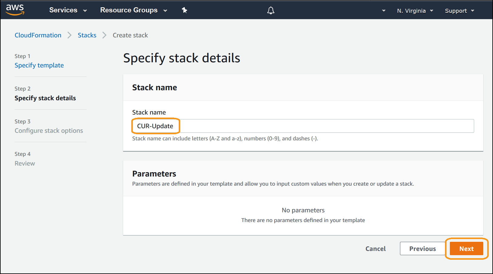
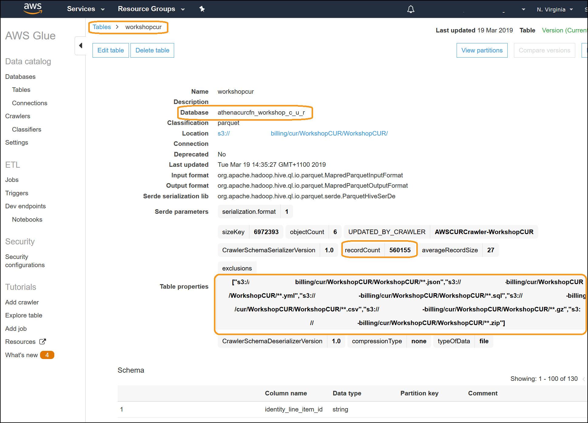
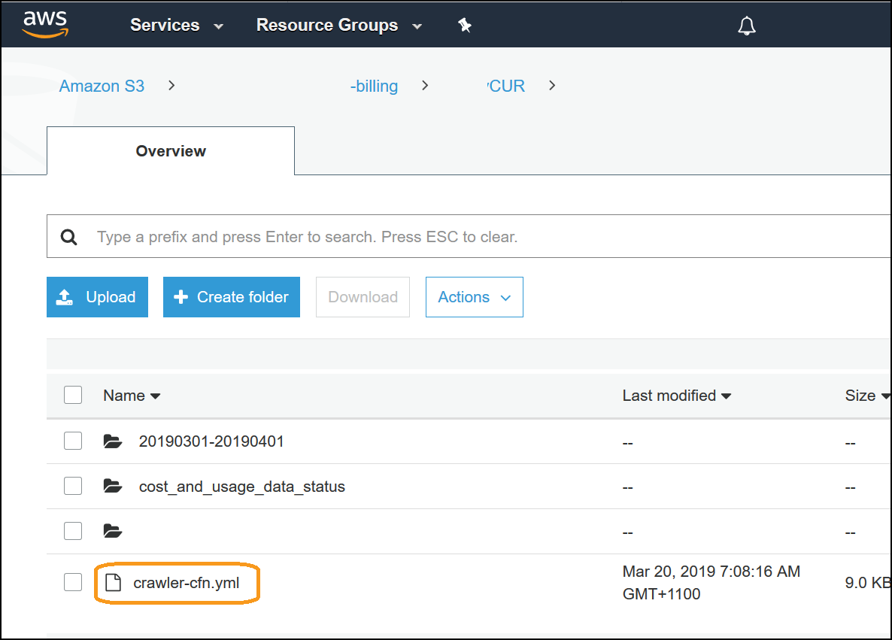

# Level 300: Automated CUR Updates and Ingestion

## Authors
- Nathan Besh, Cost Lead, Well-Architected
- Derrick Gold, Software Development Engineer, AWS Insights


## Feedback
If you wish to provide feedback on this lab, there is an error, or you want to make a suggestion, please email: costoptimization@amazon.com


# Table of Contents
1. [Create the CloudFormation stack](#CF_stack)
2. [Multiple CURs](#multiple_CURs)
3. [Tear down](#tear_down)
4. [Rate this Lab](#rate_lab) 


## 1. Create the CloudFormation Stack<a name="CF_stack"></a>
This step is used when there is a single CUR being delivered, and have it automatically update Athena/Glue when there are new versions and new months data.

We will follow the steps here: https://docs.aws.amazon.com/awsaccountbilling/latest/aboutv2/setting-up-athena.html#use-athena-cf to implement the CloudFormation template, which will automatically update existing CURs, and include new CURs when they are delivered. 

NOTE: IAM roles will be created, these are used to:
- Add event notification to existing S3 buckets
- Create s3 buckets and upload objects
- Create and run a Glue crawler
- Create and update a Glue database and tables

- Please review the CloudFormation template with your security team.

We will build the following solution:


1. Log into the console as an IAM user with the required permissions. Go to the S3 dashboard, go to the bucket and folders which contain your CUR file. Open the CloudFormation(CF) file and save it locally:


2. Here is a sample of the CF file:


3. Go to the CloudFormation dashboard and create a stack:


4. Load the template and click **Next**:


5. Specify the details for the stack and click **Next**:


6. Review the configuration, click **I acknowledge that AWS CloudFormation might create IAM resources**, and click **Create stack**:


7. You will see the stack will start in **CREATE_IN_PROGRESS**:


8. Once complete, the stack will show **CREATE_COMPLETE**:


9. Click on **Resources** to view the resources that it will create:


10. Go to the AWS Glue dashboard:


11. Click on **Databases** and click the database starting with **athenacurcfn**:


12. View the table within that database and its properties: 

      
You will see that the table is populated, the **recordCount** should be greater than 0. You can now go to Athena and load the partitions and view the cost and usage reports.


## 2. Multiple CURs<a name="multiple_CURs"></a>
This step is used when there are multilpe CURs being delivered into the same bucket - for example a CUR with hourly granularity and one with daily granularity. This will automatically update Athena/Glue when there are new versions and new months data for both reports.

The easiest way to work with multiple CURs is to deliver each CUR to a different S3 bucket, and follow the previous process. If you **must** deliver to a single bucket, configure your CURs with different prefixes or folders and follow this process.

1. Log into the console as an IAM user with the required permissions, verify you have multiple CURs with different prefixes being delivered into the same bucket.
We will have the following configuration:
```
Format:
<bucket name>/<prefix>/<report_name>/

Configuration:
<bucket name>/DailyCUR/daily/
<bucket name>/HourlyCUR/hourly/
```

2. Open the S3 console, and navigate to one of the directories where CURs are stored. Open and save the **crawler-cfn.yml** file:


3. Open the file in your favourite text editor

4. Modify the following lines to remove all references to the prefix or report name. Replace the first line with the second in each case:<br/>
Under **AWSCurDatabase:**
```
Name: 'athenacurcfn_daily'
Name: 'athenacurcfn'
```

Under **AWSCURCrawlerComponentFunction:**
```
Resource: arn:aws:s3:::<bucket name>/DailyCUR/daily/daily*
Resource: arn:aws:s3:::<bucket name>*                
```

Under **AWSCURCrawler:**
```
Name: AWSCURCrawler-daily
Name: AWSCURCrawler
```
and
```
Path: 's3://<bucket name>/DailyCUR/daily/daily'
Path: 's3://<bucket name>'
```
and under Exclusions after **.zip** add:
```
'aws-programmatic-access-test-object'
```              

Under **AWSPutS3CURNotification:**
```
ReportKey: 'DailyCUR/daily/daily'
ReportKey: ''
```

Under **AWSCURReportStatusTable:**
```
DatabaseName: athenacurcfn_daily
DatabaseName: athenacurcfn
```
and
```
Location: 's3://<bucket name>/DailyCUR/daily/cost_and_usage_data_status/'
Location: 's3://<bucket name>/cost_and_usage_data_status/'
```

A modified sample is provided here:
[Code/crawler-cfn.yml](Code/crawler-cfn.yml)
Look for the comments: ### New line


5. Save the template file. 


6. Go to the CloudFormation dashboard and execute the template you just created


7. Go to the Glue dashboard and verify that there is a single database, containing multiple tables:


## 3. Tear down<a name="tear_down"></a> 
1. Delete the Glue database, select the database name, click **Action** and click **Delete database**:


2. Delete the CloudFormation stack, select the stack, click **Actions** and click **Delete stack**:
 


## 4. Rate this lab<a name="rate_lab"></a>
[](https://wellarchitectedlabs.com/Cost_300_Automated_CUR_Updates_and_Ingestion_1star) [](https://wellarchitectedlabs.com/Cost_300_Automated_CUR_Updates_and_Ingestion_2star) [](https://wellarchitectedlabs.com/Cost_300_Automated_CUR_Updates_and_Ingestion_3star) [](https://wellarchitectedlabs.com/Cost_300_Automated_CUR_Updates_and_Ingestion_4star) [](https://wellarchitectedlabs.com/Cost_300_Automated_CUR_Updates_and_Ingestion_5star) 


