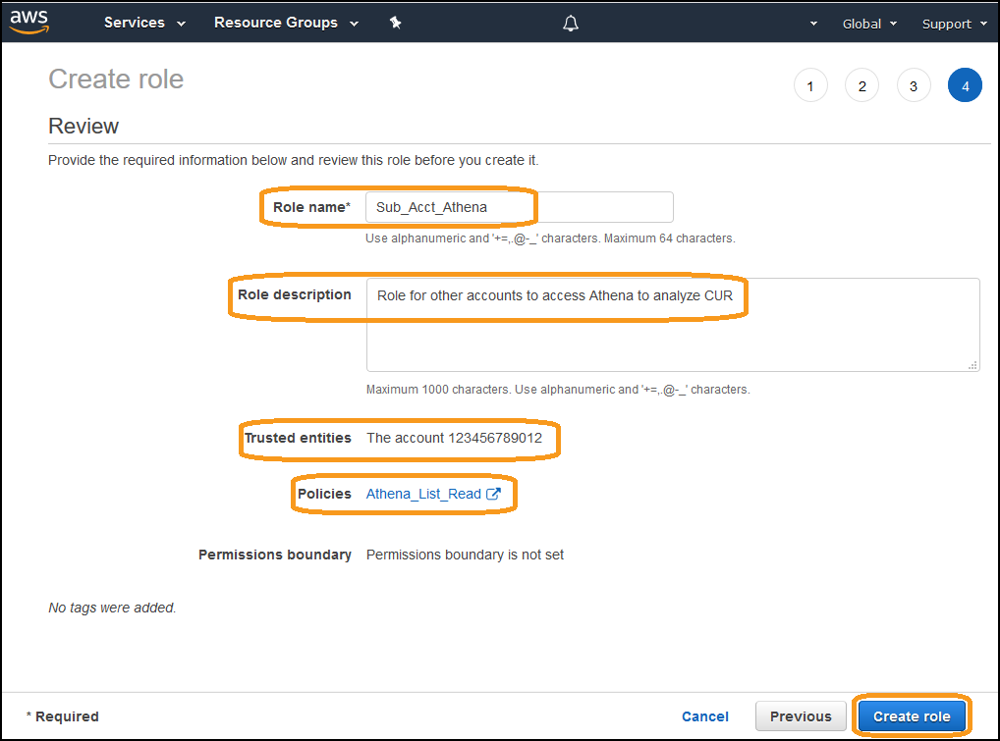

# Level 300: Multi Account CUR Access
https://wellarchitectedlabs.com 

## Authors
- Nathan Besh, Cost Lead, Well-Architected


## Feedback
If you wish to provide feedback on this lab, there is an error, or you want to make a suggestion, please email: costoptimization@amazon.com


# Table of Contents
1. [Access Master/Payer via a Role](#create_role)
2. [Access Master/Payer via a User](#create_user)
3. [Use Athena to access a CUR in Master/Payer](#CUR_in_acct)
4. [Tear down](#tear_down)
5. [Rate this Lab](#rate_lab) 


## 1. Access Master/Payer via a Role  <a name="create_role"></a>
To provide access to the Cost and Usage data in the master/payer account to another account, you can create a role for the users in that account to assume. The users then have access to the data, in  the same way a user in the master/payer account would. This is an ideal solution when you want to provide access to the data by allowing them to use only specific services in your account (Athena/Glue), and requires minimum coding and complexity. 

1 - Login to the AWS console as an IAM user with the required permissions, go to the **IAM** dashboard

2 - Create a new policy **Athena_List_Read** with the required permissions. A sample policy that can be used as a starting point is here:

[./Code/IAM_Athena](./Code/IAM_Athena.md)


It provides: 

 * Athena: List, Read, and Start Query (write) access to all Athena resources; 
 * Glue: Read access to all resources; 
 * S3: Read access to the bucket containing the Cost and Usage reports; 
 * S3: List, Read, Write access to the bucket containing Athena query results.

NOTE: You must modify this policy in line with security best practices (least privilege) before implementation.

Next we will create a role **Sub_Acct_Athena** and attach the newly created policy.

3 - From the IAM dashboard, create a role for **Another AWS Account**, enter in the Sub-Accounts **Account ID**:


4 - Attach the policy **Athena_List_Read**

5 - Add any required tags

6 - Enter a **Role name** and **Role description**, review and create the role:


7 - The completed role should be similar to this:


8 - Logout from your master/payer account, then login to the other account (which will access your master/payer CUR file).

9 - From the IAM console check the users have permissions to assume a role, the IAM policy they require is:

NOTE: Replace (Account ID) and (Role name) inside the brackets
```
    {
        "Version": "2012-10-17",
        "Statement": [
                {
                "Sid": "VisualEditor0",
                "Effect": "Allow",
                "Action": "sts:AssumeRole",
                "Resource": "arn:aws:iam::(Account ID):role/(Role name)"
                }
        ]
    }
```
NOTE: Replace (Account ID) and (Role name) inside the brackets

10 - The users in the member/linked account can then assume the role. They will then be able to access Athena in the payer/linked account. 


You have successfully allowed users in another account to get access to your CUR. They assume the role in the master/payer account, and can use Athena to query the CUR just as a user in the master/payer account would.


## 2. Access Master/Payer via a User <a name="create_user"></a>
You can also provide access to the Cost and Usage information in the payer account by giving people a login to the payer account and assigning the required permissions. This is against security best practices, as roles and centralized federation should be utilized.

If there is a specific reason you need to implement users for this, follow the following procedure:

1 - Login to the AWS console as an IAM user with the required permissions, go to the **IAM** dashboard

2 - Create the policy **Athena_List_Read** as defined above

3 - Create a user and group, and assign them the IAM policy

4 - Users can now login to the primary account and have access to Athena


## 3. Use Athena to access a CUR in Master/Payer <a name="CUR_in_acct"></a>
You can use Athena in your member/linked account or an account outside your organization to access the CUR in your master/payer account. This requires cross account S3 access, and a permissions change on the delivered CUR files.

This is an ideal solution when you want to make the data available to another account via S3, that account can then use any services within their own account to access the data. This solution provides additional flexibility to the other account, and can be extended with additional features later.

NOTE: We assume you have completed the lab [300_Automated_CUR_Updates_and_Ingestion](../300_Automated_CUR_Updates_and_Ingestion/README.md), which creates a Lambda function and puts an S3 Event on your billing bucket, so we will extend this existing solution.

First we will add the s3 bucket permissions allowing the member/linked account access.

1 - Login to the Master/Payer account AWS console as an IAM user with the required permissions, navigate to the **S3 Dashboard**:

2 - Select your bucket containing the **CUR reports**

3 - Click on **Permissions**

4 - Click on **Bucket Policy**

5 - Edit the following lines and add them to the bucket policy. Change **[Sub-Account ID]** and **[S3 Bucket Name]** to your member/linked account and S3 bucket:
  
```
    {
      "Sid": "Stmt1546900919345",
      "Effect": "Allow",
      "Principal": {
        "AWS": "arn:aws:iam::[Sub-Account ID]:root"
      },
      "Action": "s3:ListBucket",
      "Resource": "arn:aws:s3:::[S3 Bucket Name]"
    },
    {
      "Sid": "Stmt1546901049588",
      "Effect": "Allow",
      "Principal": {
        "AWS": "arn:aws:iam::[Sub-Account ID]:root"
      },
      "Action": "s3:GetObject",
      "Resource": "arn:aws:s3:::[S3 Bucket Name]/*"
    }

```

6 - Save the new bucket policy.


7 -  A sample complete policy is here:
[./Code/S3_Bucket_Policy](./Code/S3_Bucket_Policy.md)


Finally, we will update the Cloudformation stack with the code, this will ensure that a new permissions ACL is written on all delivered CUR files - so that newly delivered CURs will be accessible to the other account.

8 - Open the following modified CloudFormation template in a new window:
[./Code/crawler-cfn.md](./Code/crawler-cfn.md)

9 - Open the CloudFormation dashboard, select the **CUR-Update** stack and view the current template:


10 - Copy the current template into a text editor, save this template for rollback. 

11 - Make the changes required as per below, and save the new yml file.
```
              - Effect: Allow
                Action:
                  - 's3:PutObjectVersionAcl'
                  - 's3:PutObjectAcl'
                Resource: 'arn:aws:s3:::(CUR Billing Bucket)/*'       
```
```
          const util = require('util');
```
```
              // Read options from the event.
              console.log("Reading options from event:\n", util.inspect(event, {depth: 5}));
              var srcBucket = event.Records[0].s3.bucket.name;
              // Object key may have spaces or unicode non-ASCII characters.
              var srcKey = decodeURIComponent(event.Records[0].s3.object.key.replace(/\+/g, " "));  

              // New Object ACL to be written
              var params =
              {
                Bucket: srcBucket,
                Key: srcKey,
                AccessControlPolicy:
                {
                    'Owner':
                    {
                        'DisplayName': '(name)',
                        'ID': '(Canonical ID)'
                    },
                    'Grants': 
                    [
                        {
                            'Grantee': {
                            'Type': 'CanonicalUser',
                            'DisplayName': '(name)',
                            'ID': '(Canonical ID)'
                            },
                            'Permission': 'FULL_CONTROL'
                        },
                        {
                            'Grantee': {
                            'Type': 'CanonicalUser',
                            'DisplayName': '(name2)',
                            'ID': '(Canonical ID2)'
                            },
                            'Permission': 'READ'
                        },
                    ]
                }
              };

              // get reference to S3 client 
              var s3 = new AWS.S3();

              // Put the ACL on the object
              s3.putObjectAcl(params, function(err, data) {
                if (err) console.log(err, err.stack); // an error occurred
                else     console.log(data);           // successful response
              });
```

12 - In the CloudFormation console under **Stack actions**, **Create change set for current stack**, **Replace current template**, and upload the edited file.

13 - **Execute** the change set:


14 - You can verify the changes to the stack by viewing the IAM console - **CUR-Update-AWSCURCrawlerLambdaExecutor** role, and the Lambda console - function **CUR-Update-AWSCURInitializer**, ensure they contain the changes you made.

15 - We will now test the function. Upload a file to the CUR billing bucket, preferably next to the CUR files for the current month.

16 - Click on the file and you should see that the **bucket owner** is the owner, and it has **multiple Grantees** for read:


17 - Click on the **permissions** and you can confirm the bucket owner has full access, and the required Canonical IDs also have read access, then **delete this test file**:


At this point the other account will have the required access to any **NEW** CUR files delivered. You will need to modify any previous months billing files and ensure they have the correct permissions.

**NOTE: If you do not modify previous CUR file permissions, Athena queries from the member/linked account will not work.**

To change previous CUR files you can use S3 batch operations:
(NOTE: the inventory will take time to generate to be able to complete this step)

 - Go to the S3 Console
 - Create a destination bucket for the inventory file
 - Go to the CUR folder, Select **Management**, select **Inventory**, then create an inventory to produce a CSV file of all files.
 - Wait until the inventory populates
 - Go to the S3 console, select **Batch operations**, create job
 - Select the inventory file
 - Choose to replace the ACL (Get this from the Lambda function)
 - Check you have the policy **and** trust to run the job 
 - Start the job
 - Confirm the old CURs are updated
 

The other account will now need to create the tables in Athena, and also update these tables when new versions and new months are delivered. We will do this with a recurring Glue crawler.

18 - Login to the other account as an IAM user with the required permissions, and go into the **Glue console**.

19 - Add a **Crawler** with the following details:
 - **Include path**: the S3 bucket in the account with the delivered CURs
 - **Exclude patterns** (1 per line):
```
**.json, **.yml, **.sql, **.csv, **.gz, **.zip
```


20 - Create a daily schedule to update the tables each morning before you come into work


NOTE: CUR files are updated at least every day, a crawler with a daily schedule is a simple code-free solution for this.

21 - Run the crawler, and check that it has created the database, the tables, and that the tables contain data.


26 - Open up Athena & execute a query to verify access:


You have now given the sub account access to the Master/Payer CUR file. This will be automatically updated on any new versions delivered, or any new months delivered.


## 4. Tear down <a name="tear_down"></a>

Execute either of these steps depending on the implementation you chose above.

### 4.1 Access Master/Payer via a Role

1 - Go to the **IAM Dashboard**, delete the role **Sub_Acct_Athena**

2 - Delete the policy **Athena_List_Read**


### 4.2 Access Master/Payer via a User

1 - Go to the **IAM Dashboard**, delete the group, delete the user

2 - Delete the policy **Athena_List_Read**


### 4.3 Use Athena to access a CUR in Master/Payer

1 - Go to the **CloudFormation Dashboard**

2 - Update the stack and implement the **original yml** file. If you didn't save this, it will be in the S3 bucket that contains the CUR files.

3 - If you change the permissions ACL on the old CUR files, follow the same process - but remove the member/linked account from the ACL. 

4 - Login to the member/linked account, go to the **Glue Dashboard** 

5 - Delete the database that was created


## 5. Rate this lab<a name="rate_lab"></a>
[](https://wellarchitectedlabs.com/Cost_300_Multi_Account_CUR_Access_1star) 
[](https://wellarchitectedlabs.com/Cost_300_Multi_Account_CUR_Access_2star) 
[](https://wellarchitectedlabs.com/Cost_300_Multi_Account_CUR_Access_3star) 
[](https://wellarchitectedlabs.com/Cost_300_Multi_Account_CUR_Access_4star) 
[](https://wellarchitectedlabs.com/Cost_300_Multi_Account_CUR_Access_5star) 


