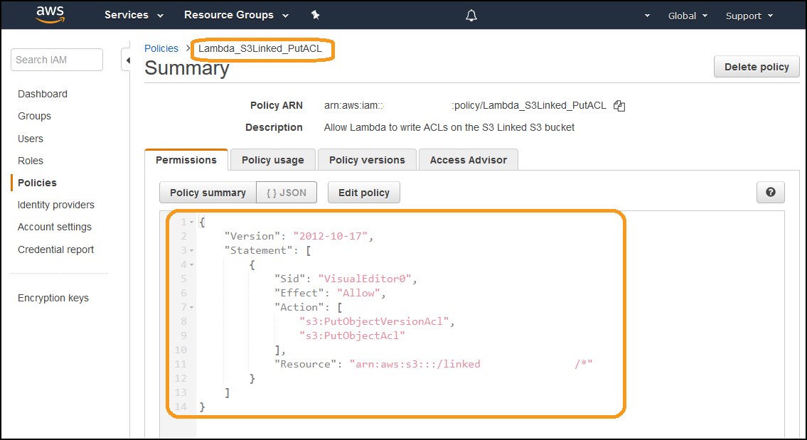
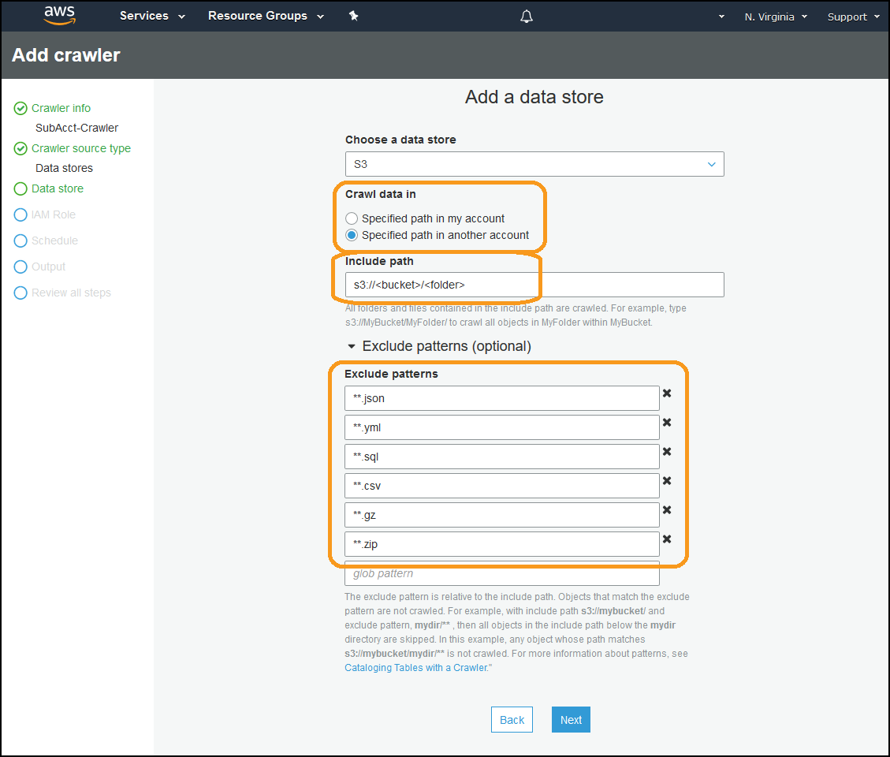

# Level 300: Splitting the CUR and Sharing Access
https://wellarchitectedlabs.com 

## Authors
- Nathan Besh, Cost Lead, Well-Architected


## Feedback
If you wish to provide feedback on this lab, there is an error, or you want to make a suggestion, please email: costoptimization@amazon.com


# Table of Contents
1. [Setup Output S3 Bucket](#setup_s3_output)
2. [Perform one off Fill of Member/Linked Data](#backfill_data)
3. [Create Athena Saved Queries to Write new Data](#athena_queries)
4. [Create Lambda function to run the Saved Queries](#lambda_function)
5. [Trigger the Lambda When a CUR is Delivered](#trigger_lambda)
6. [Sub Account Crawler Setup](#sub_acct) 
7. [Tear down](#tear_down)
8. [Rate this Lab](#rate_lab) 


## 1. Setup Output S3 Bucket <a name="setup_s3_output"></a>
We need to provide a location to deliver the output from the Athena queries, so that it can be secured and restricted to the sub accounts. We'll need to create the S3 bucket, and implement a Lambda function to re-write the object ACLs when new objects are delivered.

So what we'll do is as follows:

 - Create the output S3 bucket with the required bucket policy
 - Create an IAM policy that will allow a Lambda function to re-write object ACLs
 - Implement the Lambda function

1 - Login to the master/payer account as an IAM user with the required permissions.

2 - Go to the S3 console

3 - Create the output S3 bucket

4 - The lab has been designed to allow multiple statements to output to a single bucket, each in a different folder. Create one folder for each Athena statement you will run, a convenient name for the folders is the Account ID of the sub account.

5 - Go to **Permissions**, and implement a bucket policy to allow sub accounts access, ensure you follow security best practices and allow least privilege:


You can modify this sample policy as a starting point:
```
{
    "Version": "2012-10-17",
    "Statement": [
        {
            "Sid": "AllowListingOfFolders",
            "Effect": "Allow",
            "Principal": {
                "AWS": "arn:aws:iam::(account ID):root"
            },
            "Action": "s3:ListBucket",
            "Resource": "arn:aws:s3:::(bucket)"
        },
        {
            "Sid": "AllowAllS3ActionsInSubFolder",
            "Effect": "Allow",
            "Principal": {
                "AWS": "arn:aws:iam::(account ID):root"
            },
            "Action": "s3:*",
            "Resource": "arn:aws:s3:::(bucket)/(folder)/*"
        }
    ]
}
```

6 - Go to the IAM Dashboard

7 - Create an IAM policy **Lambda_S3Linked_PutACL** to allow lambda to write ACLs:


You can modify the following sample policy as a starting point:

NOTE: replace (bucket name):
```
{
    "Version": "2012-10-17",
    "Statement": [
        {
            "Sid": "VisualEditor0",
            "Effect": "Allow",
            "Action": [
                "s3:PutObjectVersionAcl",
                "s3:PutObjectAcl"
            ],
            "Resource": "arn:aws:s3:::(bucket name)/*"
        }
    ]
}
```

8 - Create an IAM role for **Lambda** named **Lambda_Put_Linked_S3ACL**

9 - Attach the **Lambda_S3Linked_PutACL** policy:


10 - Go to the Lambda service dashboard

11 - Create the lambda function **S3LinkedPutACL** with the following details:

 - Node.js 
 - Role: **Lambda_Put_Linked_S3ACL**
 - Code: [./Code/S3LinkedPutACL.md](./Code/S3LinkedPutACL.md)

12 - Go to the S3 service dashboard 

13 - Select the **Output Bucket**, go to **Properties**, and add an S3 event to trigger on **All object create events**, and have it run the **S3LinkedPutACL** Lambda function:


14 - Test the configuration is working correctly by uploading a file into the S3 folder. Verify that it has multiple Grantees to the required accounts:


The output bucket setup is now complete. Every time the Athena query runs and outputs a file into the S3 bucket, it will automatically have its permissions ACL updated to allow access to the sub account.


## 2. Perform one off Fill of Member/Linked Data <a name="backfill_data"></a>
Perform this step if you want to generate data for all previous months available in your current CUR files. This is a one off step that is performed manually.  We create a temporary table in Athena, and write the output to the S3 location created above, for the member/linked account to access it. We then delete the temporary table - which does not delete the S3 output data. 

1 - In the master/payer account go into the Athena service dashboard

2 - Create your query using the template below:

The following statement will copy **all columns** from the source table if the **line_item_usage_account_id** matches a specific Account ID. It will output each month into a separate folder by using partitioning on the **year** and **month**, and output it to the S3 output folder.

```
CREATE TABLE (database).temp_table
WITH (
      format = 'Parquet',
      parquet_compression = 'GZIP',
      external_location = 's3://(bucket)/(folder)',
      partitioned_by=ARRAY['year_1','month_1'])
AS SELECT *, year as year_1, month as month_1 FROM "(database)"."(table)"
where line_item_usage_account_id like '(account ID)' 
```

Some key points for your queries:

 - Partitioning will allow us to write only the current months data each time, and not write all the data
 - Parquet format is used, which allows faster access and reduced costs through reduced data scanning
 - GZIP compression produces smaller output files than SNAPPY
 - SNAPPY is faster than GZIP to run

Example of performance with a source CUR of 6.3Gb:

 - Using Parquet and GZIP, it will take approximate 11min 16sec, and produce 8.4Gb of output files
 - Using Parquet and SNAPPY, it will take approximately 7min 8sec, and produce 12.2Gb of output files


3 - Execute the statement in Athena:


4 - Go into the S3 service dashboard

5 - Go to the output bucket and folder

6 - Verify the data has been populated into the S3 folders


7 - Verify the permissions are correct on the files - there should be multiple **Grantees**: 


8 - Then delete the temp table from Athena by modifying the following code: (this will NOT delete the s3 data)

```
DROP TABLE (database).temp_table
```


## 3. Create Athena Saved Queries to Write new Data <a name="athena_queries"></a>
Next we setup your recurring Athena queries.  These will run each time a new CUR file is delivered, separate out the information for the sub accounts, and write it to the output S3 location. These queries will be very similar to the one above, except it will only extract data for the current month.

You must write one query for the extraction of the data, which will create a temporary table, and then a second query to delete the table. As the system has been written for future expansion, you must adhere to the guidelines below when writing and naming statements (other wise you will need to change the code):

 - The queries MUST start with: **create_linked_** and **delete_linked_** otherwise you'll need to modify the Lambda function. As Lambda looks for this string to identify these queries to automatically run when new files are delivered
 - The output location must also end in the actual word **subfolder** as this will be re-written by the lambda function, to the current year and month
 - The queries must include the component **CAST(bill_billing_period_start_date as VARCHAR) like concat(substr(CAST(current_date as VARCHAR),1,7),'-01%')** which ensures the query only gets data from the current month
 - There is no need to include the columns **year as year_1** and **month as month_1**, as that was only used for partitioning

1 - Create the saved query in Athena named **create_linked_(folder name)**, the following sample code is the accompanying query for the previous query above:

```
CREATE TABLE (database).temp_table
WITH (
      format = 'Parquet',
      parquet_compression = 'GZIP',
      external_location = 's3://(bucket)/(folder)/subfolder')
AS SELECT * FROM "(database)"."(table)"
where line_item_usage_account_id like '(some value)' and CAST(bill_billing_period_start_date as VARCHAR) like concat(substr(CAST(current_date as VARCHAR),1,7),'-01%')
```

2 - Create the accompanying delete statement named **delete_linked_(folder name)** to delete the temporary table: 

```
drop TABLE IF EXISTS (database).temp_table;
```

3 - Repeat the steps above for any additional **create** and **delete** queries as required.


##  4. Create Lambda function to run the Saved Queries <a name="lambda_function"></a>
This Lambda function ties everything together, it will remove all objects in the current months S3 folders, find the Athena queries to run, and then execute the saved Athena queries. First we will create the role with permissions for Lambda to use, then the Lambda function itself.

1 - Go to the IAM service dashboard

2 - Create a policy named **LambdaSubAcctSplit** 

3 - Edit the following policy inline with security best practices, and add it to the policy:

[./Code/SubAcctSplit_Role.md](./Code/SubAcctSplit_Role.md)

4 - Create a Role for **Lambda** to call services

5 - Attach the **LambdaSubAcctSplit** policy

6 - Name the role **LambdaSubAcctSplit**

7 - Go into the Lambda service dashboard

8 - Create a function named **SubAcctSplit**, **Author from scratch** using the **Python 3.7** Runtime:  


9 - Copy the code into the editor from here:
[./Code/Sub_Account_Split.md](./Code/Sub_Account_Split.md)

10 - Edit the code as per the instructions at the top, you will need to change the arrays and Athena variable.

11 - Under **Basic settings** set the **Timeout** to 30seconds, and review this after the test at the end

12 - Change the **Execution role** to **LambdaSubAcctSplit**  

13 - Save the function

14 - Test that the function by clicking on the **Test** button at the top, and make sure that it executes correctly:


15 - Go into the S3 Service dashboard, view the output folder and verify that there are files for the current month. Check the **Last modified** time stamp to ensure they were created at the time of the test. 


You have now setup the Lambda function which executes the queries. The final step is to trigger this Lambda function every time a new CUR file is delivered.


## 5. Trigger the Lambda When a CUR is Delivered <a name="trigger_lambda"></a>
It is assumed that you have completed 300_Automated_CUR_Updates_and_Ingestion, so there is an existing Lambda function that is being executed when a new CUR file is delivered.  We will add code into this setup to trigger the new Lambda function.

1 - Go to the CloudFormation service Dashboard

2 - Select the current stack which updates the Glue database

3 - Download the current template (crawler-cfn.yml file), and save this for later (if Teardown is required)

4 - Open the template up in a text editor of your choice

5 - A sample crawler file is below:  
[./Code/crawler-cfn.md](./Code/crawler-cfn.md)

6 - Update the ** AWSCURCrawlerLambdaExecutor** IAM role section, inside the PolicyName **AWSCURCrawlerLambdaExecutor** section:

**Add** the following Action:
```
    'lambda:InvokeFunction'
```

**Edit the following line**, and **add** the following resource 
```
    - 'arn:aws:lambda:<region>:<accountID>:function:SubAcctSplit'
```                  

7 - Make the following amendments to the **AWSCURInitializer** Lambda function section, inside the **else** statement after the glue section:

```
    var lambda = new AWS.Lambda();
    
    var params = {
      FunctionName: 'SubAcctSplit'
    };

    lambda.invoke(params, function(err, data) {
      if (err) console.log(err, err.stack); // an error occurred
      else     console.log(data);           // successful response
    });
```

8 - Save the new template file

9 - In the CloudFormation console **update** the stack

10 - Replace the current template with the new one, and upload your modified template

11 - After the stack has successfully updated, you can test the function

12 - Go to the S3 service dashboard, navigate to the **source bucket** and folder containing the current months original master/payer CUR file

13 - Download the CUR file, and delete the object from the bucket

14 - Re-upload the current CUR file back into its bucket

15 - Navigate to the **output bucket and folder** for the current month

16 - Check the **Last modified** time stamp on the object/s is/are the current time, and check that it has the correct **Grantees** in the permissions

Setup is now complete for the payer account. When new CUR files are delivered, it will execute the Athena queries and extract the required data for the current month, and output it to the required S3 folder with the required permissions.  


## 6. Sub Account Crawler Setup <a name="sub_acct"></a>
The final step is to setup the sub account to automatically scan the S3 folders each morning using a Glue Crawler, and update a local Athena database.

1 - Login to the sub account as an IAM user with the required permissions, and go into the **Glue console**.

2 - Add a **Crawler** with the following details:

 - **Include path**: the S3 bucket in the account with the delivered CURs
 - **Exclude patterns**: 

 ```
 **.json, **.yml, **.sql, **.csv, **.gz, **.zip (1 per line)
```



3 - Create a new role for the crawler to use


4 - Create a daily schedule to update the tables each morning before you come into work


5 - Create a new database

6 - Review the crawler configuration and finish:


7 - Run the crawler, and check that it has added tables.

8 - Go into Athena and execute a preview query to verify access and the data.


You have now given the sub account access to their specific CUR files as extracted from the Master/Payer CUR file. This will be automatically updated on any new versions delivered, or any new months delivered.


## 7. Tear Down <a name="tear_down"></A>
We will tear down this lab, removing any data, resources and configuration that it created. We will restore any modified code or resources to their original state before the lab.

### 7.1 Sub Account
1 - Log into the sub account as an IAM user with the required privileges

2 - Go to the Glue service dashboard

3 - Delete the created database and tables

4 - Delete the recurring Glue crawler

### 7.2 Master/Payer Account
1 - Log into the master/payer account as an IAM user with the required privileges

2 - Go to the Cloudformation service dashboard, and select the CUR update stack

3 - Update the stack and use the original Template yml file

4 - Go to the Lambda service dashboard

5 - Delete the **SubAcctSplit** and **S3LinkedPutACL** Lambda functions

6 - Go to the IAM service dashboard

7 - Delete the **LambdaSubAcctSplit** and **Lambda_Put_Linked_S3ACL** roles

8 - Delete the **LambdaSubAcctSplit** and **Lambda_S3Linked_PutACL** policies

9 - Go to the Athena service dashboard

10 - Delete the **create_linked_** and **delete_linked_** Athena saved queries

11 - Delete any temp tables

12 - Go into the S3 service dashboard 

13 - Delete the S3 output folder


## 8. Rate this lab<a name="rate_lab"></a>
[](https://wellarchitectedlabs.com/Cost_300_Splitting_Sharing_CUR_Access_1star) 
[](https://wellarchitectedlabs.com/Cost_300_Splitting_Sharing_CUR_Access_2star) 
[](https://wellarchitectedlabs.com/Cost_300_Splitting_Sharing_CUR_Access_3star) 
[](https://wellarchitectedlabs.com/Cost_300_Splitting_Sharing_CUR_Access_4star) 
[](https://wellarchitectedlabs.com/Cost_300_Splitting_Sharing_CUR_Access_5star) 


