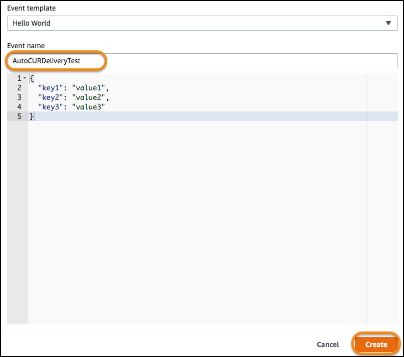
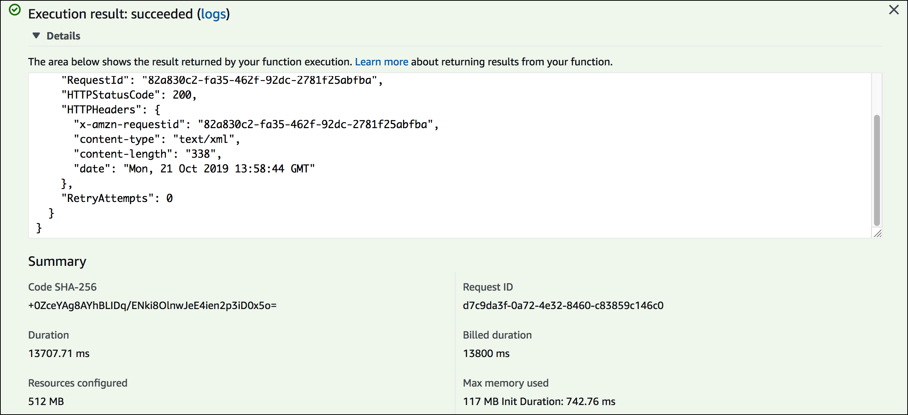

# Level 300: Automated Athena CUR Query and E-mail Delivery

## Authors
- Na Zhang, Sr. Technical Account Manager, AWS


## Feedback
If you wish to provide feedback on this lab, there is an error, or you want to make a suggestion, please email: costoptimization@amazon.com


# Table of Contents
1. [Overview architecture](#architecture)
2. [Create S3 Bucket](#create_bucket) 
3. [Create an IAM policy and role for Lambda function](#iam_policy_and_role)
4. [Configure parameters of function code and upload code to S3](#configure_function_parameters)
5. [Create and test a Lambda function](#create_lambda_function)
6. [Customize query strings and create scheduled CloudWatch event](#cloudwatch_event)
7. [Tear down](#tear_down)
8. [Rate this Lab](#rate_lab) 


<a name="architecture"></a>
## 1. Overview architecture


<a name="create_bucket"></a>
## 2. Create S3 Bucket
The first step is to create an S3 bucket which will hold the lambda code and also used for storage of the reports. **NOTE**: the bucket must be in the same region as the Lambda function, it is advised to use a single region for all resources within this lab.

This bucket will store the reports and Athena CUR query results. These will **not** be deleted, to enable historical reporting, so delete these periodically if you do not require them.

1. Login as an IAM user with the required permissions, go to the **s3 dashboard** and create an S3 bucket in the required region:


<a name="iam_policy_and_role"></a>
## 3. Create an IAM policy and role for Lambda function
This step is used to create an IAM policy and a role that allows Lambda function to perform Athena CUR query and deliver processed CUR report via SES.

1.  Log into **IAM console**, click on **Policies** and click on **Create Policy**:


2. Click on the **JSON** tab, **modify** the following policy, replacing the **your-cur-query-results-bucket** string.  Make sure you add "*" at the end of the bucket name so the whole bucket is writable:

    
        {
            "Version": "2012-10-17",
            "Statement": [
                {
                    "Sid": "VisualEditor0",
                    "Effect": "Allow",
                    "Action": [
                        "s3:PutObject"
                    ],
                    "Resource": [
                        "arn:aws:s3:::your-cur-query-results-bucket*"
                    ]
                },
                {
                    "Sid": "VisualEditor1",
                    "Effect": "Allow",
                    "Action": [
                        "athena:List*",
                        "athena:*QueryExecution",
                        "athena:Get*",
                        "athena:BatchGet*",
                        "glue:Get*",
                        "glue:BatchGet*",
                        "s3:Get*",
                        "s3:List*",
                        "SES:SendRawEmail",
                        "SES:SendEmail",
                        "logs:CreateLogStream",
                        "logs:CreateLogGroup",
                        "logs:PutLogEvents"
                    ],
                    "Resource": "*"
                }
            ]
        }


3. Copy the policy to JSON edit frame, ensure the **bucket name** has been changed, click **Review policy**:


4. Configure the name **Lambda_Auto_CUR_Delivery_Access**, and click **Create policy**.


5. Click on **Roles**, click **Create Role**:


6. Choose **Lambda** as the service that will use this role, click **Next Permissions**: 


7. At **Attach permissions policies** page, search and choose **Lambda_Auto_CUR_Delivery_Access** policy created in the previous step. Click **Next:Tags**, click **Next:Review**.
 

8. At **Review** page, configure a name **Lambda_Auto_CUR_Delivery_Role**, click **Create role**. This role will be used for lambda function execution.
 


<a name="configure_function_parameters"></a>
## 4. Configure parameters of function code and upload code to S3
This step is used to edit parameters (CUR database name and table, SES sender and recipient etc) in the Lambda function code, which is then uploaded to S3 for Lambda execution.

1. Download function code [./Code/AutoCURDelivery.zip](./Code/AutoCURDelivery.zip) to your local disk. This zip file includes:
    - auto_cur_delivery.py - Lambda function code 
    - config.yml - Configuration file  
    - package/ -  All dependencies, libraries, including pandas, numpy, Xlrd, Openpyxl, Xlsxwriter, pyyaml

2. Unzip **config.yml** from within **AutoCURDelivery.zip**, and open it into a text editor.

3. Configure the following parameters in **config.yml**: 
    - **CUR_Output_Location**: Your S3 bucket created previously, i.e. S3://my-cur-bucket/out-put/
    - **CUR_DB**: CUR database and table name defined in Athena, i.e. athenacurcfn_my_athena_report.myathenareport
    - **CUR_Report_Name**: Report filename that is sent with SES as an attachment, i.e. cost_utilization_report.xlsx
    - **Region**: The region where SES service is called, i.e. us-east-1
    - **Subject**: SES mail subject, i.e. Cost and Utilization Report
    - **Sender**: Your sender e-mail address, i.e. john@example.com
    - **Recipient**: Your recipient e-mail addresses. If there are multiple recipients, separate them by comma, i.e. john@example.com,alice@example.com

4. Keep other configuration unchanged and save **config.yml**.

5. Add the updated **config.yml** back to **AutoCURDelivery.zip**.

6. Upload **AutoCURDelivery.zip** to your S3 bucket. Make sure this S3 path is in the same region as Lambda function created in next step.  **NOTE** this is a large 30+Mb file, so it may take a little time.


<a name="create_lambda_function"></a>
## 5. Create a Lambda function
We will now create a Lambda function which will run the code and produce the reports.  **NOTE**: this Lambda function must be created in the same region as S3 bucket for CUR query results created earlier.

1. Go to the **Lambda console**, click **Create function**.

2. Select **Author from scratch**, configure the following parameters:
    - **Function name**: Auto_CUR_Delivery
    - **Runtime**: Python 3.7
    - **Execution role**: Use an existing role
    - **Existing role**: Lambda_Auto_CUR_Delivery_Role
    - click **Create function**.


3. In the top right-hand corner of Lambda configuration page, click **Select a test event** drop-down box and choose **Configure test events**.                                          


4. Use the default event template Hello world, because this function does not need any input event parameters, set a event name **AutoCURDeliveryTest**, and click **Create**.


5. In **Function code** section, configure the following:
    - **Code entry type**: Upload a file from Amazon S3
    - **Amazon S3 link URL**: https://s3.amazonaws.com/bucket name/AutoCURDelivery.zip
    - **Handler**: auto_cur_delivery.lambda_handler


6. Scroll down to **Basic settings** section, set Memory to 512 MB, and timeout to 5 min. 


7. Keep other configurations as default, scroll to the very top and click **Save**. Click the **Actions** drop-down box and choose **Publish new version**. 


8. Set the **Version description** to v1, and click **Publish**.


9. We have finished the configuration and we will now test it.  Make sure **AutoCURDeliveryTest** event is selected, click **Test**.


10. It takes a few seconds to execute Lambda function, and you'll see all logs after execution.


11. Check your e-mail recipients, they should receive a mail for cost & utilization report with an excel file attached, similarly as below:
 

12. By default, the cost & utilization report contains:
    - Cost_By_Service - Cost in the recent three months split by service (e.g. current month is Jul, the recent three months are Jul, Jun and May, same as below)
    - Data_Cost_By_Service - Data cost in the recent three months split by service 
    - MoM_Inter_AZ_DT(with graph) - Month over months inter-AZ data transfer usage and change in the recent three months
    - MTD_S3_By_Bucket - Month to date S3 cost and usage type split by bucket name 
    - MTD_ELB_By_Name - Month to date ELB cost split by ELB name and region
    - MTD_CF_By_Distribution - Month to date Cloudfront cost and usage split by distribution id 


Now you have completed this auto CUR delivery solution with default CUR query. In the next step we will add an additional query, and a CloudWatch scheduled event to trigger Lambda function as required. 


<a name="cloudwatch_event"></a>
## 6. Customize query strings and create scheduled CloudWatch event

1. In you local path where **AutoCURDelivery.zip** is located. Unzip and re-open **config.yml** in a text editor.

2. Find **Body_Text**, insert a description of new query **MTD_Inter_AZ_DT**.
    ```
    MTD_Inter_AZ_DT -  Month to date inter-AZ data transfer split by resource ID
    ```
    

3. Find the section **Query_String_List**, add following new query string at the bottom of file (note the indent should be same as other query strings), save **config.yml**.

        MTD_Inter_AZ_DT: SELECT
                year
                ,month(line_item_usage_start_date) month
                ,line_item_product_code as Product_Name  
                ,line_item_resource_id as Resource_Id  
                ,line_item_usage_type as Usage_Type
                ,sum(line_item_usage_amount) as "Inter_AZ_Data_Transfer(GB)"
                ,sum(line_item_unblended_cost) as "Cost($)" 
                FROM
                CUR_DB
                WHERE 
                "line_item_usage_type" like '%Bytes%' 
                AND "line_item_usage_type" like '%Regional%' 
                AND year='CUR_YEAR' AND month='CUR_MONTH'
                GROUP BY 
                1,2,3,4,5
                ORDER BY 
                sum("line_item_unblended_cost") desc

The paramemters CUR_DB, CUR_MONTH, CUR_YEAR are replaced when function is running

4. Add **config.yml** back into **AutoCURDelivery.zip**, and upload zip file to S3.

5. Goto Lambda console, update function code path to above S3 path where new zip file is located, click **Save**. 

6. Perform another **Test** of the function.

7. Check the cost & utilization report in the mail your recipient receives, there should be one more tab added in the excel file for month to date inter-az data transfer cost.

We will now create a scheduled Cloudwatch event to trigger Lambda function periodically

8. Go to the **Cloudwatch dashboard**, under **Events** click **Rules**

9. Click  **Create rule**.

10. In **Event Source**, choose **Schedule**, use default **fixed rate of 5 minutes**. 

11. In **Targets** click **Add Target** and choose **Lambda function** in the drop-down box.

12. Choose the function **Auto_CUR_Delivery**, click **Configure details**


13. Configure a name **5_min_auto_cur_delivery**, click **Create rule**.


14. Wait for 5 minutes, your recipients should receive a cost & utilization report mail, and continually receive report mail every other 5 minutes.

15. To stop event triggering, choose the rule **5_min_auto_cur_delivery**, click **Actions** and select **Disable**.


Now you have completed this lab to query CUR with customized query strings from Athena and send it via SES periodically. To explore more, you can define your own query strings in **config.yml** and configure CloudWatch event rule to the rate as required.  


<a name="tear_down"></a>
## 6. Tear down 
1. Delete IAM role **Lambda_Auto_CUR_Delivery_Role** and policy **Lambda_Auto_CUR_Delivery_Access**
2. Delete Lambda function **Auto_CUR_Delivery**
3. Delete CloudWatch event **5_min_auto_cur_delivery**
4. Delete SES configuration
5. Delete S3 bucket for CUR query results storing

<a name="rate_lab"></a>
## 7. Rate this lab

[](https://wellarchitectedlabs.com/Cost_300_Automated_CUR_Query_and_Email_Delivery_1star) [](https://wellarchitectedlabs.com/Cost_300_Automated_CUR_Query_and_Email_Delivery_2star) [](https://wellarchitectedlabs.com/Cost_300_Automated_CUR_Query_and_Email_Delivery_3star) [](https://wellarchitectedlabs.com/Cost_300_Automated_CUR_Query_and_Email_Delivery_4star) [](https://wellarchitectedlabs.com/Cost_300_Automated_CUR_Query_and_Email_Delivery_5star) 


