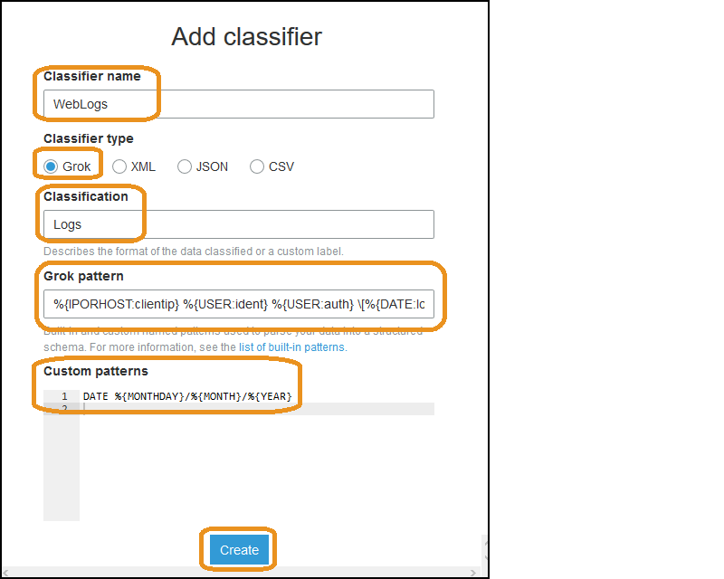
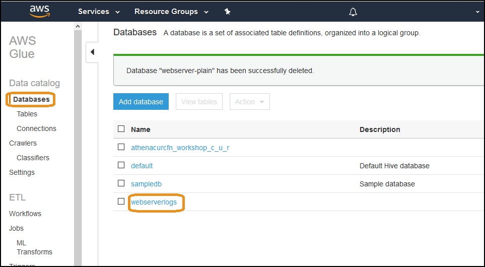
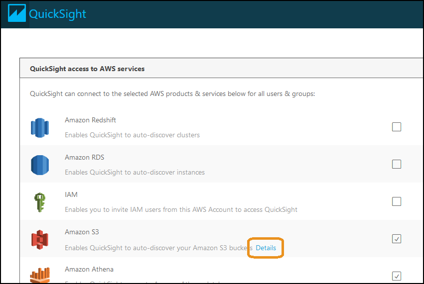
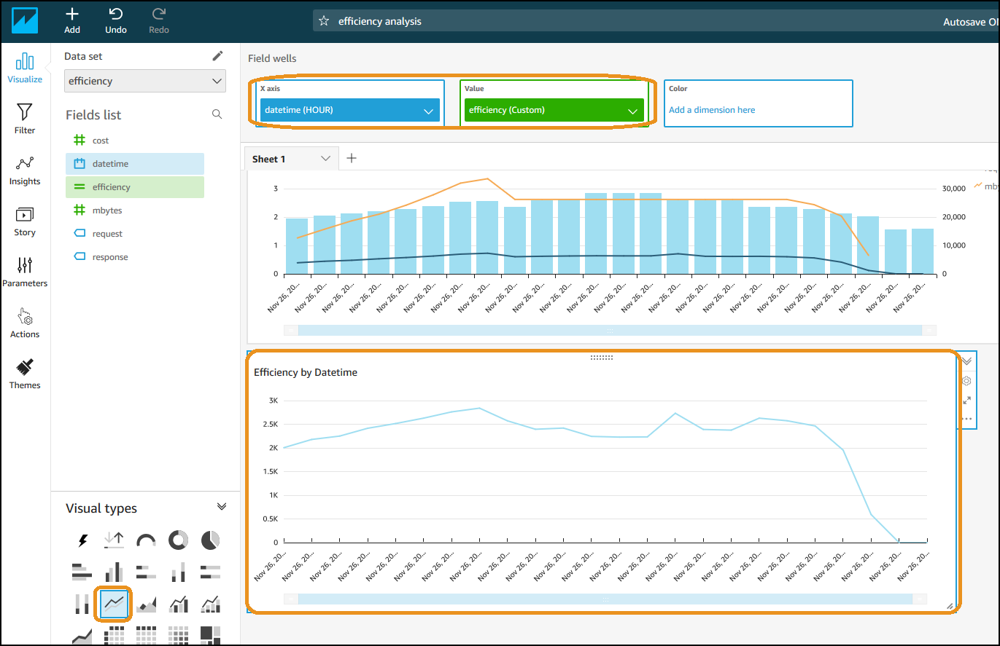

# Level 200: Workload Efficiency

## Authors
- Nathan Besh, Cost Lead, Well-Architected (AWS)

## Feedback
If you wish to provide feedback on this lab, there is an error, or you want to make a suggestion, please email: costoptimization@amazon.com

# Table of Contents
1. [Create the Data Sources](#data_sources)
2. [Create the efficiency data source](#efficiency_data)
3. [Create the visualizations](#visualizations)
4. [Teardown](#tear_down)
5. [Rate this Lab](#rate_lab)

## 1. Create the Data Sources
We first need to create data sources containing the application logs, and the cost and usage reports. In this lab we provide sample files, it is recommended you use these files initially, then use your own files after you are familiar with the requirements and process.

We place both logs into S3, crawl them with Glue and then use Athena to confirm a database is created that we can use.

### 1.1 Copy files into S3
We will create a bucket and folders in S3, then copy the sample application log files, and cost and usage reports into the folders.

**NOTE** Please read the steps carefully, as the naming is critical and any mistakes will require you to rebuild the lab or make significant and repetitive changes.

1. Log into the AWS console as an IAM user with the required permissions:

2. Make sure you run everything in a single region

3. Go to the **S3 console**, Create a new **S3 Bucket**, it can have any name, but make it start with **efficiencylab** to make it identifiable.

4. Create a folder in the new bucket with a name: **applogfiles_workshop**. 
 **NOTE**: You MUST name the folder **applogfiles_workshop**
 

5. Upload the application log file to the folder:
    - [Step1_access_log.gz](Code/Step1AccessLog.gz)

6. **READ ONLY - If using your own log files**

    

    
**READ ONLY** - Click here to see how to upload your own logs

    
        If you will be using your own application log files, systems manager can be used to run
        commands across your environment and copy files from multiple servers to S3.

        Depending on your operating system, you can execute CLI on your application servers to
        copy the **application log files** to your **S3 bucket**. The following Linux sample
        will copy all access logs from the httpd log directory to the s3 bucket created above
        using the hostname to separate each servers logs:

        HOSTNAME=$(hostname)
        aws s3 cp --recursive /var/log/httpd/ s3://applogfiles-workshop/$HOSTNAME --exclude "*" --include "access_log*"
    

7. Create a folder named **costusagefiles_workshop**, inside the same bucket. 

    **NOTE**: You MUST name the folder **costusagefiles_workshop**, this will make pasting the code faster.

8. Copy the sample file to your bucket into the **costusagefiles_workshop** folder:
    - [Step1CUR.gz](Code/Step1CUR.gz)

### 1.2 Create applicaton log file data source with Glue
We will create a database with the uploaded application logs, with AWS Glue. For the application log files, we show you how to write a custom classifier, so you can handle **any** log file format from any application.

For our sample application logs, we have supplied Apache web server log files. The in-bulit AWS Glue classifier **COMBINEDAPACHELOG** will recognize these files, for example, it will read the timestamp as a single string. We will customize the interpreter to break this up into a date column, timestamp column, and timezone column. This will demonstrate how to write a customer classifier. The reference for classifiers is here: [https://docs.aws.amazon.com/glue/latest/dg/custom-classifier.html](https://docs.aws.amazon.com/glue/latest/dg/custom-classifier.html)

A sample log file line is:

        10.0.1.80 - - [26/Nov/2019:00:00:07 +0000] "GET /health.html HTTP/1.1" 200 55 "-" "ELB-HealthChecker/2.0"

The original columns are:

    - Client IP
    - Ident
    - Auth
    - HTTP Timestamp*
    - Request
    - Response
    - Bytes
    - Referrer
    - Agent

Using the custom classifier, we will make it build the following columns instead:

    - Client IP
    - Ident
    - Auth
    - Date*
    - Time*
    - Timezone*
    - Request
    - Response
    - Bytes
    - Referrer
    - Agent

1. Go to the **Glue console** and click **Classifiers**:

2. Click **Add classifier** and create it with the following details:
    - Classifier name: WebLogs
    - Classifier type: Grok
    - Classification: Logs
    - Grok pattern: 

            %{IPORHOST:clientip} %{USER:ident} %{USER:auth} \[%{DATE:logdate}\:%{TIME:logtime} %{INT:tz}\] "(?:%{WORD:verb} %{NOTSPACE:request}(?: HTTP/%{NUMBER:httpversion})?|%{DATA:rawrequest})" %{NUMBER:response} (?:%{Bytes:bytes=%{NUMBER}|-}) %{QS:referrer} %{QS:agent}

    - Custom patterns:
 
            DATE %{MONTHDAY}/%{MONTH}/%{YEAR}

3. Click **Create**

    A classifier tells Glue how to interpret the log file lines, and how to create columns.  Each column is contained within %{}, and has the **pattern**, the **separator ':'**, and the **column name**.

    By using the custom classifier, we have separated the column timestamp into 3 columns of logdate, logtime and tz. You can compare the custom classifier we wrote with the COMBINEDAPACHELOG classifier:

        Custom - %{IPORHOST:clientip} %{USER:ident} %{USER:auth} \[%{DATE:logdate}\:%{TIME:logtime} %{INT:tz}\] "(?:%{WORD:verb} %{NOTSPACE:request}(?: HTTP/%{NUMBER:httpversion})?|%{DATA:rawrequest})" %{NUMBER:response} (?:%{Bytes:bytes=%{NUMBER}|-}) %{QS:referrer} %{QS:agent}

        Builtin - %{IPORHOST:clientip} %{USER:ident} %{USER:auth} \[%{HTTPDATE:timestamp}\] "(?:%{WORD:verb} %{NOTSPACE:request}(?: HTTP/%{NUMBER:httpversion})?|%{DATA:rawrequest})" %{NUMBER:response} (?:%{Bytes:bytes=%{NUMBER}|-}) %{QS:referrer} %{QS:agent}

4. Next we will create a crawler to read the log files, and build a database. Click on **Crawlers** and click **Add crawler**:

5. Configure the crawler:
    - **Crawler name** will be **ApplicationLogs**
    - Expand **Tags, description..** next to our **Weblogs** classifier, cilck **Add**
    - Click **Next**:

6. **Crawler source type** is Data stores, click **Next**:

7. Click the **folder icon** and expand your bucket created above, select the radio button next to the **applogfiles_workshop**.  Do **NOT** select the actual file or bucket, select the folder.  Click **Select**.

8. Click **Next**

9. Select **No** to not add another data store, click **Next**

10. **Create an IAM role** named AWSGlueServiceRole-**WebLogs** and click **Next**:

11. **Frequency** will be run on demand, click **Next**

12. Click **Add database**, you MUST name it **webserverlogs**, click **Create**.

13. Click **Next**:

14. Click **Finish**

15. Select and **Run crawler**, this will create a single database and table with our log files. We need to **wait until** the crawler has **finished**, this will take 1-2 minutes. Click refresh to check if it has finished.

16. We will confirm the database has built correctly. Click **Databases** on the left, and click on the database **webserverlogs**, you may need to click **refresh**:

17. Click **Tables in webserverlogs**, and click the table **applogfiles_workshop**

18. You can see the table is created, the **Name**, the **Location**, and the **recordCount** has a large number of records in it (the number may be different to the image below):

19. Scroll down and you can see the columns, and that they are all **string**. This will be a small hurdle for non-string columns like bytes if you want to perform a mathematical function on it.  We will work around this with Athena in our example.

20. **READ ONLY - If using your own log files**

    

    
**READ ONLY** - Click here to see how to use your own log files

            
        If using your own application files, you may wish to adjust the field
        types here. This will typically be anything numerical that
        you would do mathematical operations on, like a sum or average.
    

21. Go to the **Athena** service console, and select the **webserverlogs** database

22. Click the **three dots** next to the table **applogfiles_workshop**, and click **Preview table**:

23. View the results which will show 10 lines of your log. Note how there are separate columns **logdate**, **logtime** and **tz** that we created. The default classifier would have had a single column of text for the timestamp.

### 1.3 Create cost and usage data source with Glue
To measure efficiency we need to know the cost of the workload, so we will use the Cost and Usage Report. We will follow the process above to create 

1. **READ ONLY - If using your own CUR files**

    

    
**READ ONLY** - Click here to see how to use your own Cost and Usage Reports

            
        If you are using your own Cost and Usage Reports, you will need to have them already
         configured and delivered as per this lab: 
        https://wellarchitectedlabs.com/Cost/Cost_Fundamentals/200_4_Cost_and_Usage_Analysis/README.html
        
        The rest of this section is not required, as the Cost and Usage data will be correctly setup 
    

2. To use the files from this lab, follow the steps below:

3. Go into the **Glue** console, click **Crawlers**, and click **Add crawler**

4. Use the crawler name **CostUsage** and click **Next**
 
5. Select **Data stores** as the crawler source type, click **Next**

6. Click the **folder icon**, Select the **S3 folder** created above **costusagefiles-workshop**, make sure you dont select the bucket or file.

7. Click **Select**, then click **Next**

7. Select **No** do not another data store, click **Next**

8. Create an **IAM role** named AWSGlueServiceRole-**costusage**, click **Next**

9. Set the frequency to **run on demand**, click **Next**

10. Cilck **Add database**, it MUST be named **CostUsage**, and click **Create**

11. click **Next**

11. Review and click **Finish**

12. Run the crawler **CostUsage**, then use Athena to check the database **costusage** was created and has records in the table **costusagefiles_workshop**, as per the Application logs database setup above.

## 2 Create the efficiency data source
We will now build the efficiency data source, by combining the application logs with the cost data. When using your own application logs, you need to look through the logs and discover what the application is doing, and capture the log messages that indicate its various outputs, and what could consume resources of the system - as this will potentially indicate cost and usage of the system. Things to look for:

 - Successful requests: Valid requests that produce an output
 - Unsuccessful requests: Requests that require processing and resources, but dont produce an output
 - Errors: Do not procduce an output, but consume application resources
 - Types of requests: Different requests may require different resourcing, and costs
 - Data transfer: Similar to types of requests, the data going into a system may indicate processing requirements or cost

### 2.1 Review application logs
We will use Athena to analyze the application logs, and discover the relevant data and fields.

1. Go into Athena console
 
2. Run the following query to see a sample of all data available:

        SELECT * FROM "webserverlogs"."applogfiles_workshop" limit 10;

3. We can see interesting fields could be: **request**, **response**, **bytes**, as these indicate requests to the workload and could indicate the amount of processing the workload performs.

4. Run the following query to see the different types of **requests**:

        SELECT distinct request, count(*) FROM "webserverlogs"."applogfiles_workshop"
        group by request
        order by count(*) desc
        limit 1000;

5. We can see there are: **health checks**, **errors**, **image_file requests**, **index.html requests**

6. Run the following query to see the different types of responses:

        SELECT distinct response, count(*) FROM "webserverlogs"."applogfiles_workshop"
        group by response
        limit 100;

7. We can see most are **200 - success**, but there are a lot of **400 series** which are client errors

8. Lets look at bytes, **however**, large total bytes may come from small numbers of large byte requests, **or** large numbers of small byte requests. Lets look at the distribution and run the following query:

        SELECT distinct bytes, count(*) FROM "webserverlogs"."applogfiles_workshop"
        group by bytes
        order by count(*) desc
        limit 100;

9. We have both lots of small requests (55, 91 byets) and some large sized requests also.

10. We will choose the following fields for our efficiency data:
    - Request
    - Response
    - Bytes

### 2.2 Review the Cost and Usage Reports
We already know how to analyse the Cost and Usage reports, so lets use Athena to discover the relevant data and fields.

1. Go into Athena console
 
2. Run the following query to see a sample of all data available:

        SELECT * FROM "costusage"."costusagefiles_workshop" limit 10;

3. We know we need the unblended cost, the usage date and time, and also ensure that it is only costs for this specific workload. We tagged our resources,  so include the tag: **user application = ordering**

4. Run the following query to get a sample of our cost data for the application: 

        SELECT line_item_usage_start_date, sum(try_cast(line_item_unblended_cost as double)) as cost FROM "costusage"."costusagefiles_workshop"
        where resource_tags_user_application like 'ordering'
        group by line_item_usage_start_date
        limit 10

5. We now have our workload hourly costs, so lets combine that with our application logs and create an efficiency table. 

### 2.3 Create the efficiency data source 
We will combine the application logs and the hourly cost data with a view, to get an efficiency data source. First we'll create an hourly cost data set, then combine this with the application logs in another view.

1. Run the following query in Athena to create the hourly cost view:

        create view costusage.hourlycost as 
        SELECT line_item_usage_start_date, sum(try_cast(line_item_unblended_cost as double)) as cost FROM "costusage"."costusagefiles_workshop"
        where resource_tags_user_application like 'ordering'
        group by line_item_usage_start_date

2. Lets confirm its setup correctly & sample it, run the following query:

        select * from costusage.hourlycost

        
3. We can see the workload cost for every hour

4. We will combine the hourly cost table and the application log table using a union. This will basically copy the lines together in a single table. However, the columns wont match between the tables, so we will add NULL values where required.  We will also divide the bytes by **1048576** to get a more readable MBytes value. Copy the following query into Athena to create the efficiency table:

        create view costusage.efficiency AS 
        SELECT date_parse(concat(logdate, ' ', logtime), '%d/%b/%Y %H:%i:%S') as Datetime, request, response, try_cast(bytes as double)/1048576 as MBytes, NULL AS Cost from       webserverlogs.applogfiles_workshop
        union 
        select date_parse(line_item_usage_start_date, '%Y-%m-%d %H:%i:%s') as Datetime, NULL AS request, NULL AS         response, NULL AS MBytes, Cost from costusage.hourlycost

5. Lets check our new efficiency table. Run the following query:

        SELECT * FROM "costusage"."efficiency" 
        order by datetime asc
        limit 100;

6. We have our efficiency data source:

The first line is from our cost table, note the NULL values for requets, response and MBytes. The remaining lines will be from our application logs, and contain the data we need to measure efficiency.

## 3 Create the Visualizations
We will now create visualizations of our workload effiency. We will add the new dataset, and then build different visualizations to see what exactly impacts efficiency and where to look to improve it.

### 3.1 Basic Efficiency visualization
We will create a visualization from the application log files.

1. Go into **QuickSight**

2. Click on your user in the top right, and click **Manage QuickSight**:

3. Click on **Security and permissions** and click **Add or remove**:

4. Under **Amazon S3** click **Details**:

5. Click **Select S3 buckets**:

6. Select the bucket that has the application log files and the cost and usage files, click **Finish**

7. Select **Amazon Athena** and click **Update**:

8. Go to the **QuickSight home page**, click **Manage data**:

9. Click **New data set**:

10. Click **Athena**:

11. Enter the **Data source name**: **Efficiency**, and click **Create data source**

12. Select the **costusage Database**, and the **efficiency** Table and click **Select**

13. Select **Spice** and click **Edit/Preview data**

14. Make sure there is data in the bottom pane:

15. Ensure you have data and click **Save & visualize**:

16. Create a **Clustered bar combo chart**. Place **datetime (aggregate hour)** on the x-axis, **cost (sum)** in the bars column, add **request (count)** to the lines field

17. Label the chart **Requests vs Cost**:

18. We can see that it roughly follows the same pattern, however there are times when the trends change. Below you can see the requests increase, but the cost decreases. Also the requests remain the same, and the cost decreases:

19. Maybe it can be explained through something other than request count, lets add **mbytes (sum)** to the lines field well to see if there is correlation there: 

20. Again, similar trends and anomalies. MBytes remains constant and cost decreases:

21. Lets now create our efficiency visualition. Add a calculated field named **efficiency** with the formula below. Our efficiency metric will be requests per dollar:

        count(request) / sum(cost) 

22. Add a visualization, select a **Line chart**. Place **datetime (hour)** in the x-axis, **efficiency** as the value, 

23. We now have a chart showing our efficiency over time. Notice how the efficiency changes significantly at the end of the day:

24. You can now see increases and decreases in efficiency clearly, look when the output increases and cost remains the same, or the cost remains the same and the output decreases:

You now have a baseline efficiency metric. Use this to look for areas of low efficiency of your workload - this will provide areas to cost optimize.

## 3.2 Request visualization
Lets look deeper into the types of requests to see if we can get better insight into what is driving our costs and efficiency.

1. Lets look at a sample of a successful log request in our application log files:

        /index.php?name=Isabella,user=sponsored,work=26
        
2. We can see there are the fields:

    - Name
    - User
    - Work
    
3. Lets create a calculated field **RequestType** with the formula below. This will separate out the types of requests, health checks, image requests and other/errors from the request field:

        ifelse(locate(request,"index.html") > 0,split(request,',',2),ifelse(locate(request,"health.html") > 0,"HealthCheck",ifelse(locate(request,"image_file") > 0,"ImageFile","error")))

4. Create a **Cluster bar combo chart** visualization. Place **datetime (HOUR)** in the x-axis, add **Request (count)** in the bars, add **RequestType** in the Group/Color for bars, add **efficiency** to lines: 

5. We can see a correlation between the user type and the efficiency, when paid users increase the efficiency goes down, this indicates its more costly to service paid customers. Also look at the efficiency increase when there are large amounts of errors, you may which to filter and exclude low value outputs from the measures of efficiency. These insights can be used to categorize different types of requests in your workload and understand how to charge them back appropriately.

You can use this to increase your efficiency by removing unwanted requests, for example you may use CloudFront to more efficiency handle errors - instead of processing them on the web servers.

**Congratulations!**
You have now calculated the efficiency of a workload, you can see how your efficiency changes over time, and look into the types of requests to understand what contributes cost to your workload.

## 4. Teardown

The follwoing resources were created during this lab and can be deleted:

 - S3 bucket, name starting with **efficiencylab**
 - Glue Classifier **WebLogs**
 - Glue Crawler **ApplicationLogs**
 - IAM Role & Policy **AWSGlueServiceRole-WebLogs**
 - Glue Database **webserverlogs**
 - Crawler **CostUsage**
 - IAM Role & Policy **AWSGlueServiceRole-costusage**
 - Glue Database **CostUsage**
 - Athena table **costusagefiles_workshop.hourlycost**
 - Athena table **costusagefiles_workshop.efficiency**
 - QuickSight permissions **S3 folder efficiencylab**
 - QuickSight dataset **efficiency**
 - QuickSight Analysis **efficiency analysis**

## 5. Rate this lab

 
 

