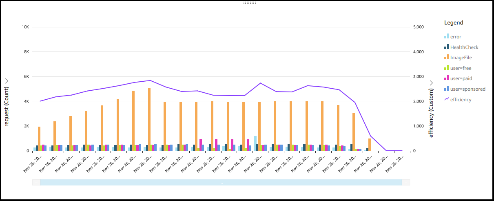

# Level 200: Measure Workload Efficiency
http://wellarchitectedlabs.com 

<video width="600" height="450" controls>
  <source src="https://d3h9zoi3eqyz7s.cloudfront.net/Cost/Videos/CostEfficiency.mp4" type="video/mp4">
  Your browser doesnt support video, or if you're on GitHub head to https://wellarchitectedlabs.com to watch the video.
</video> 

## Introduction
This hands-on lab will guide you through the steps to measure the efficiency of a workload. It shows you how to get the overall efficiency, then look deeper for patterns in usage to be able to allocate different weights to different outputs of a system.

The lab uses a simple web application to demonstrate the efficiency, but will teach you the techniques so that it can be applied to **ANY** workload you have, whether its born in the cloud or legacy.

The first time you perform this lab it is recommended to use the sample files supplied, then you can use your own application and billing files for each workload you have.

## Goals
- Setup the applicaion data source
- Combine the application and cost data sources
- Create the visualization for efficiency

## Prerequisites
- An AWS Account
- An Amazon QuickSight Account
- A Cost and Usage Report (CUR)
- Amazon Athena and QuickSight have been setup
- Completed the [Cost and Usage Analysis lab](../../Cost_Fundamentals/200_4_Cost_and_Usage_Analysis/README.md)
- Completed the [Cost and Usage Visualization lab](../../Cost_Fundamentals/200_5_Cost_Visualization/README.md)

## Permissions required
- Access to create an S3 bucket
- Access to your CUR files
- Create views in Athena (s3 write)
- Access to setup a data source and create a visualization in QuickSight

## Costs
- <$5 depending on the size of your data sources, and existing QuickSight subscription

## Time to complete
- The lab should take approximately 50-60 minutes to complete

 

 
  

***

## License
Licensed under the Apache 2.0 and MITnoAttr License.

Copyright 2018 Amazon.com, Inc. or its affiliates. All Rights Reserved.

Licensed under the Apache License, Version 2.0 (the "License"). You may not use this file except in compliance with the License. A copy of the License is located at

http://aws.amazon.com/apache2.0/

or in the "license" file accompanying this file. This file is distributed on an "AS IS" BASIS, WITHOUT WARRANTIES OR CONDITIONS OF ANY KIND, either express or implied. See the License for the specific language governing permissions and limitations under the License.
