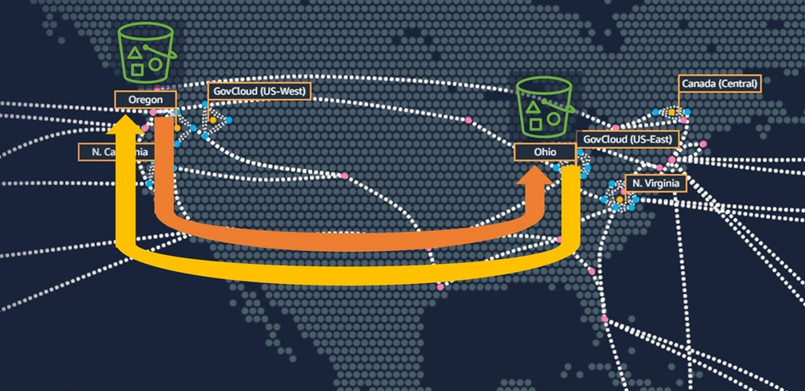
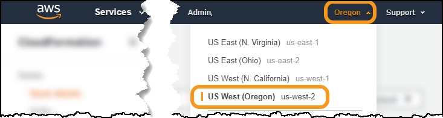
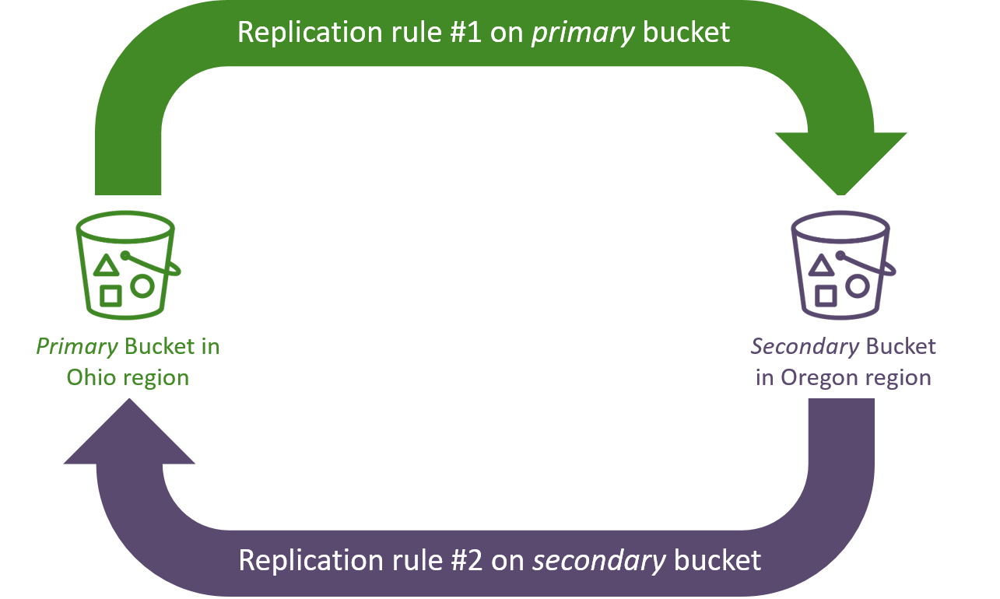
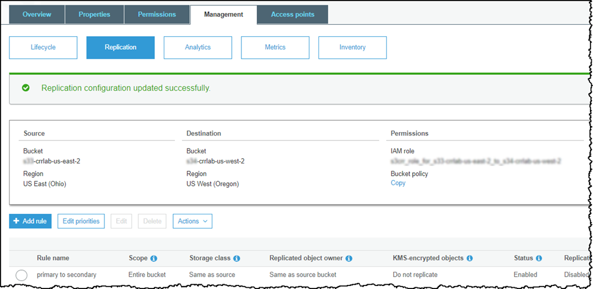
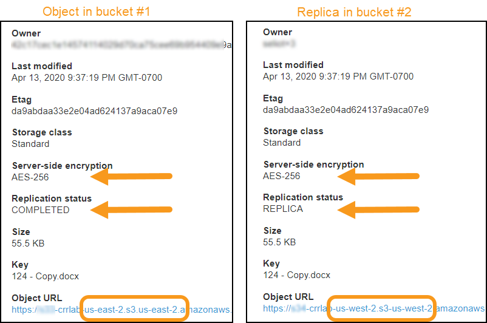
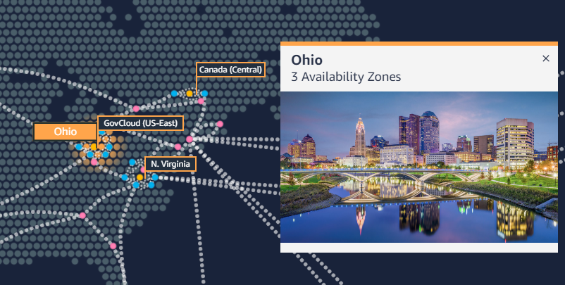

# Level 200: Implementing Bi-Directional Cross-Region Replication (CRR) for Amazon Simple Storage Service (Amazon S3)

## Author

* Seth Eliot, Principal Reliability Solutions Architect, AWS Well-Architected

## AWS Well-Architected

This lab illustrates best practices for reliability as described in the [AWS Well-Architected](https://aws.amazon.com/architecture/well-architected/) Reliability pillar. It addresses best practices to help answer the questions:

* How do you back up data?
* How do you plan for disaster recovery (DR)?

Upon completion of this lab, you will have created two S3 buckets in two different AWS regions. When a new object is put into one of them, it will be replicated to the other. Objects will be encrypted in both buckets. Objects will be replicated once -- replication "looping" is prevented.



This is a useful configuration for [multi-region strategies](#multi_region_strategy) that enable the workload to _failover_ from the primary to the secondary region (such as _pilot light_ or _warm standby_). All objects that were added to the primary region S3 bucket are asynchronously replicated to the secondary region S3 bucket. After a failover, when the workload is running in what was the secondary region, new objects added to the bucket in this region are _also_ asynchronously replicated back to what was the primary region bucket.

This is also useful for [_multi-region active-active_](#multi_region_strategy) strategies where both regions are actively used for read and write operations.

This bi-directional replication occurs automatically. Looping is prevented with this configuration -- an object replicated from an S3 bucket in one region to another S3 bucket in the other AWS region will _not_ be re-replicated back to the original bucket.

## Table of Contents

1. [Deploy the infrastructure](#deploy_infra)
1. [Configure bi-directional cross-region replication (CRR) for S3 buckets](#configure_replication)
1. [Test bi-directional cross-region replication (CRR)](#test_replication)
1. [Tear down this lab](#tear_down)

## 1. Deploy the infrastructure <a name="deploy_infra"></a>

You will create two Amazon S3 buckets in two different AWS regions. The **Ohio** region (also known as **us-east-2**) will be referred to throughout this lab as the _east_ S3 bucket, and **Oregon** (also known as **us-west-2**) will be referred to as the _west_ S3 bucket.

### 1.1 Log into the AWS console <a name="awslogin"></a>

**If you are attending an in-person workshop and were provided with an AWS account by the instructor**:

* Follow the instructions [here for accessing your AWS account](../../common/documentation/Workshop_AWS_Account.md)

**If you are using your own AWS account**:

* Sign in to the AWS Management Console as an IAM user who has PowerUserAccess or AdministratorAccess permissions, to ensure successful execution of this lab.

### 1.2 Deploy the infrastructure in two AWS Regions using an AWS CloudFormation template

You will deploy the infrastructure for two Amazon S3 buckets. Since these will be in two different regions, you will need to create an AWS CloudFormation stack in each region. You will use the same CloudFormation template for both regions.

* Download the [_s3_bucket.yaml_](https://raw.githubusercontent.com/awslabs/aws-well-architected-labs/master/Reliability/200_Bidirectional_Replication_for_S3/Code/CloudFormation/s3_bucket.yaml) CloudFormation template

#### 1.2.1 Deploy _east_ S3 bucket

1. It is recommended that you deploy the _east_ s3 bucket in the **Ohio** region.  This region is also known as **us-east-2**.
      * Use the drop-down to select this region
      
      * If you choose to use a different region, you will need to ensure future steps are consistent with your region choice.
1. On the AWS Console go to the [CloudFormation console](https://console.aws.amazon.com/cloudformation)
1. Select **Stacks**
1. Create a CloudFormation stack (with new resources) using the CloudFormation Template file and the **Upload a template file** option.
1. For **Stack name** use **`S3-CRR-lab-east`**
1. Under **Parameters** enter a **NamingPrefix**
      * This will be used to name your S3 buckets
      * Must be string consisting of lowercase letters, numbers, periods (.), and dashes (-) between five and 40 characters
      * This will be part of your Amazon S3 bucket name, which must be unique across all of S3.
      * Record this value in an accessible place -- you will need it again later in the lab.
1. Click **Next** until the last page
1. At the bottom of the page, select **I acknowledge that AWS CloudFormation might create IAM resources with custom names**
1. Click **Create stack**
1. You can go ahead and create the _west_ bucket before this CloudFormation stack completes

**Troubleshooting**: If your CloudFormation stack deployment fails with the error _\<bucket name\> already exists_

* You did not pick a unique enough **NamingPrefix**
* Delete the failed stack
* Start over and choose a more unique **NamingPrefix**
* Amazon S3 bucket names share a global name space across all of AWS (including all AWS regions)

#### 1.2.2 Deploy _west_ S3 bucket

1. It is recommended that you deploy the _west_ s3 bucket in the **Oregon** region for this lab.  This region is also known as **us-west-2**.
      * Use the drop-down to select this region
      
      * If you choose to use a different region, you will need to ensure future steps are consistent with your region choice.

1. On the AWS Console go to the [CloudFormation console](https://console.aws.amazon.com/cloudformation)
1. Select **Stacks**
1. Create a CloudFormation stack (with new resources) using the _same_ CloudFormation Template file as before, and the **Upload a template file** option.
1. For **Stack name** use **`S3-CRR-lab-west`**
1. Under **Parameters** enter a **NamingPrefix**
      * You must use the _same_ value as you did previously
1. Click **Next** until the last page
1. At the bottom of the page, select **I acknowledge that AWS CloudFormation might create IAM resources with custom names**
1. Click **Create stack**

#### 1.2.3 Get bucket information

1. Go back to the **Ohio** AWS Region and wait for the CloudFormation stack you created there to complete
1. Click on the **Outputs** tab and record the **Value** of the S3 bucket name in an accessible location as _east bucket_
1. Go to the the **Oregon** AWS Region and do the same thing, copying that S3 bucket name down as _west bucket_
1. Go to the [Amazon S3 console](https://s3.console.aws.amazon.com/s3/home) and verify that both buckets were created.
      * Although S3 buckets are specific to an AWS region, the Amazon S3 console shows all buckets from all AWS Regions
      * The two S3 buckets you will work with begin with `<your_naming_prefix>-crrlab`
      * Note the regions for the two S3 buckets your created
      * There are also two new `logging` buckets -- you will _not_ need to do any actions with these.
1. Click on either the _east_ region or _west_ region bucket, and note the following
      1. **This bucket is empty** - We will be adding objects to the bucket soon
      1. Click on **Properties** and note what properties are _Enabled_
      1. Why are these properties _Enabled_?

<!--- mkdocs cannot render markdown inside collapsed sections. Therefore using fenced code blocks-->
<details>
<summary>Click here to see why these properties are Enabled</summary>

```
1. Versioning is Enabled:
For S3 Replication, both source and destination buckets MUST have versioning enabled

2. Default encryption is Enabled:
In our exercise we are demonstrating replication of encrypted objects.
It is a best practice to encrypt your data at rest.

3. Object-level logging is Enabled:
This logging will be used later in the lab.
It is used to better understand replication operations AWS takes on your behalf.
```

</details>

## 2. Configure bi-directional cross-region replication (CRR) for S3 buckets <a name="configure_replication"></a>

Amazon S3 replication enables automatic, asynchronous copying of objects across Amazon S3 buckets. Buckets that are configured for object replication can be owned by the same AWS account or by different accounts. You can copy objects between different AWS Regions or within the same Region. You will setup bi-directional replication between S3 buckets in two different regions, owned by the same AWS account.

Replication is configured via _rules_. There is no rule for bi-directional replication. You will however setup a rule to replicate from the S3 bucket in the east AWS region to the west bucket, and you will setup a second rule to replicate going the opposite direction. These two rules will enable bi-directional replication across AWS regions.



### 2.1 Setup rule #1 to replicate objects from _east_ bucket to _west_ bucket

1. Go to the [Amazon S3 console](https://s3.console.aws.amazon.com/s3/home)
1. Click on the name of the _east_ bucket
      * if you used **Ohio** the name will be `<your_naming_prefix>-crrlab-us-east-2`
1. Click on the **Management** tab (Step A in screenshot)
1. Click **Replication** (Step B in screenshot)
1. Click **+ Add Rule** (Step C in screenshot)

      

1. For **Set source** select **Entire bucket**
1. For **Replication criteria** leave **Replicate objects encrypted with AWS KMS** _not_ selected
      * Our objects are encrypted using server-side encryption
      * However since you used SSE-S3 encryption, you do not need to select this option and do not need to provide a KMS key
      * SSE-S3 uses KMS keys, but these managed by Amazon S3 for the user
      * For more detail see [What Does Amazon S3 Replicate?](https://docs.aws.amazon.com/AmazonS3/latest/dev/replication-what-is-isnot-replicated.html)
1. Click **Next**
1. For **Destination bucket** leave **Buckets in this account** selected, and select the name of the _west_ bucket from the drop-down
      * If you used **Oregon** the name will be `<your_naming_prefix>-crrlab-us-west-2`
      * **Troubleshooting**: If you get an error saying _The bucket doesn’t have versioning enabled_ then you have chosen the wrong bucket. Double check the bucket name.
1. Click **Next**
1. For **IAM Role** select **\<your-naming-prefix\>-S3-Replication-Role-us-east-2** from the search results box
      * (If you chose a different region as your _east_ region, then look for that region at the end of the IAM role name)
1. For **Rule name** enter `east to west`
1. Leave **Status** set to **enabled**
1. Click **Next**
1. Review the configuration
1. Click **Save**

The screen should say **Replication configuration updated successfully.** and display the Source, Destination, and Permissions of your replication rule



### 2.2 Test replication rule #1 - replicate object from east bucket to west bucket

To test this rule you will upload an object into the east bucket and observe that it is replicated into the west bucket. For this step you will need a _test object_:

* This is a file that you will upload into the east S3 bucket.
* It should not be too big, as this will increase the time to upload it from your computer.
* If you do not have a file to use, you can [download this file](Images/TestObject_AmazonRufus.gif).

Right-click and **Save image as...** 🡲

1. Go to the [Amazon S3 console](https://s3.console.aws.amazon.com/s3/home), or if you are already there click on **Amazon S3** in the upper left corner
1. Click on the name of the _east_ bucket
      * if you used **Ohio** the name will be `<your_naming_prefix>-crrlab-us-east-2`
1. Click on **⬆ Upload**
1. Upload the file you will use as an object
      * Drag and drop the file or click **Add files**
      * Click **Upload** (note there is a **Next** button, but you do _not_ need to click it)
1. When the file is finished uploading, click on the filename
      * It will look like the _left_ side of the screenshot below
      * If **Replication status** is **PENDING**, wait and refresh until it says **COMPLETED** which should be just a few seconds.
1. At the top of the console click on **Amazon S3** and then click on the name of the _west_ bucket
      * If you used **Oregon** the name will be `<your_naming_prefix>-crrlab-us-west-2`
1. Click on the filename of the file that you just uploaded to the _other_ bucket (yes, it is here now too!)
      * It will look like the _right_ side of the screenshot below

      

1. Note the following in from the object details:
      * **Replication status**: Note the different values for the source (east) and destination (west) S3 buckets. The value **REPLICA** in the west bucket is part of the solution how the system recognizes it should not replicate this object back again to the east bucket, which would cause an infinite loop.
      * **Server-side encryption**: The object was encrypted in the source (east) bucket, and remains encrypted in the destination (west) bucket.

### 2.3 Setup rule #2 to replicate objects from _west_ bucket to _east_ bucket

After setting up the second rule, you will have completed configuration of bi-directional replication between our two Amazon S3 buckets.

1. Go to the [Amazon S3 console](https://s3.console.aws.amazon.com/s3/home), or if you are already there click on **Amazon S3** in the upper left corner
1. Click on the name of the _west_ bucket
      * if you used **Oregon** the name will be `<your_naming_prefix>-crrlab-us-west-2`
1. Click on the **Management** tab
1. Click **Replication**
1. Click **+ Add Rule**
1. For **Set source** select **Entire bucket**
1. For **Replication criteria** leave **Replicate objects encrypted with AWS KMS** _not_ selected
      * Our objects are encrypted using server-side encryption
      * However since you used SSE-S3 encryption, you do not need to select this option and do not need to provide a KMS key
      * SSE-S3 uses KMS keys, but these managed by Amazon S3 for the user
      * For more detail see [What Does Amazon S3 Replicate?](https://docs.aws.amazon.com/AmazonS3/latest/dev/replication-what-is-isnot-replicated.html)
1. Click **Next**
1. For **Destination bucket** leave **Buckets in this account** selected, and select the name of the _east_ bucket from the drop-down
      * If you used **Ohio** the name will be `<your_naming_prefix>-crrlab-us-east-2`
      * **Troubleshooting**: If you get an error saying _The bucket doesn’t have versioning enabled_ then you have chosen the wrong bucket. Double check the bucket name.
1. Click **Next**
1. For **IAM Role** select **\<your-naming-prefix\>-S3-Replication-Role-us-west-2** from the search results box
      * (If you chose a different region as your _west_ region, then look for that region at the end of the IAM role name)
1. For **Rule name** enter `west to east`
1. Leave **Status** set to **enabled**
1. Click **Next**
1. Review the configuration
1. Click **Save**

The screen should say **Replication configuration updated successfully.** and display the Source, Destination, and Permissions of your replication rule


## 3 Test bi-directional cross-region replication (CRR)

To test bi-directional replication using the two rules your created, you will upload another object into each of the east and west S3 buckets and observe it is replicated across to the other bucket. For this step you will need two more _test objects_:

* These are files that you will upload into each S3 bucket.
* They should not be too big, as this will increase the time to upload it from your computer.
* If you do not have files to use, you can [download file #1](Images/TestObject_OhioAwsEast.png) and [download file #2](Images/TestObject_OregonAwsWest.png)

| File #1 | File #2 |
|:---:|:---:|
|||

### 3.1 Upload objects to their respective Amazon S3 buckets

#### 3.1.1 Upload object #1 to the _east_ S3 bucket

1. Go to the [Amazon S3 console](https://s3.console.aws.amazon.com/s3/home), or if you are already there click on **Amazon S3** in the upper left corner
1. Click on the name of the _east_ bucket
      * if you used **Ohio** the name will be `<your_naming_prefix>-crrlab-us-east-2`
1. Click on **⬆ Upload**
1. Upload the file you will use as object #1
      * Drag and drop the file or click **Add files**
      * Click **Upload** (note there is a **Next** button, but you do _not_ need to click it)

#### 3.1.2 Upload object #2 to the _west_ S3 bucket

1. Click on **Amazon S3** in the upper left corner of the Amazon S3 console
1. Click on the name of the _west_ bucket
      * if you used **Oregon** the name will be `<your_naming_prefix>-crrlab-us-west-2`
1. Click on **⬆ Upload**
1. Upload the file you will use as object #2
      * Drag and drop the file or click **Add files**
      * Click **Upload** (note there is a **Next** button, but you do _not_ need to click it)

### 3.2 Verify bi-directional replication

1. You are already looking at the objects in the _west_ bucket
      * Verify that object #1, that you uploaded to the _east_ bucket is present here also
      * Note the **Replication status** is **REPLICA**
1. Click on **Amazon S3** in the upper left corner
1. Click on the name of the _east_ bucket
      * Verify that object #2, that you uploaded to the _west_ bucket is present here also
      * Note the **Replication status** is **REPLICA**

### 3.3 Explore which Amazon S3 events trigger replication and which do not

#### 3.3.1 Use CloudWatch Logs Insights to query the CloudTrail logs

AWS CloudTrail is a service that provides event history of your AWS account activity, including actions taken through the AWS Management Console, AWS SDKs, command line tools, and other AWS services. You will use AWS CloudTrail to explore which Amazon S3 events trigger replication to occur.

1. Change back to the _east_ AWS region
      * If you used the directions in this lab, then this is **Ohio (us-east-2)**
1. The CloudFormation template you deployed configured CloudTrail to deliver a trail to CloudWatch Logs. Therefore:
      * Go to the [CloudWatch console](https://console.aws.amazon.com/cloudwatch)
      * Click on **Insights** (under **Logs**) on the left
1. Where it says **Select log group(s)** select the one named _CloudTrail/logs/\<your_prefix_name\>_
1. Right below that is where you can enter a query
      * Delete the query that is there
      * and enter the following query. It returns all `PutObject` requests on S3 buckets

                  fields @timestamp, requestParameters.key AS key, 
                  | requestParameters.bucketName AS bucket, 
                  | userIdentity.invokedBy AS invokedBy,
                  | userIdentity.arn AS arn, 
                  | userIdentity.sessionContext.sessionIssuer.userName AS UserName
                  | filter eventName ='PutObject'
                  | sort @timestamp desc
                  | limit 20

1. Click **Run query**
1. Look at the results at the bottom of the screen

#### 3.3.2 Difference between uploaded and replicated objects in S3 bucket <a name="putobject_events"></a>

You are looking for three results, one for each of the test objects you uploaded.  Use the _key_ field to see the test object names.

* Troubleshooting: If your query returned less or more than three results then consult this [guide to tuning your Insights query](Documentation/TuneInsightsQuery.md)

* For these events look at the _tabular_ attributes returned by the query at the bottom of the page
     * However, if you want to see _all_ the attributes, you can click to the left of each event
* The three events correspond to each of the objects you put into the S3 buckets
     * The object you put into the _east_ bucket testing rule #1
     * The object you put into the _east_ bucket testing bi-directional replication
     * The object you put into the _west_ bucket testing bi-directional replication
          * Look at the bucket for this event. This event is for the _east_ bucket
          * This is actually the _replication_ event for the object you put into the _west_ bucket
* What is different between events where you uploaded the object into the bucket and events where the object was put into the bucket by replication?

<!--- mkdocs cannot render markdown inside collapsed sections. Therefore using fenced code blocks-->
<details>
<summary>Click here to see answers</summary>

```
Replicated objects have a userIdentity.invokedBy value of "AWS Internal"

The userIdentity is different - see the arn and username
```

</details>

The CloudWatch Logs Insights page should look like this:


The result is:

* For an object uploaded by you
     * Amazon S3 triggers the rule you configured to replicate it to another bucket
     * And sets **Replication status** to **COMPLETED**
* For an object replicated from another bucket
     * Amazon S3 knows _not_ to re-replicate the object
     * And sets **Replication status** to **REPLICA**

### 3.4 Additional exercises

These are _optional_. They help you to explore and understand bi-direction cross-region replication on Amazon S3.

* Look at the **Permissions** on the **\<your-naming-prefix\>-S3-Replication-Role-...** IAM Roles
     * Why do they have the policies that they do?

* What happens when you rename an object in one of the buckets?
     * Hint: if you cannot figure it out consider that versioning is enabled (and must be enabled for replication to work)

* Switch to the _west_ AWS region and run the same CloudWatch Insights Query there.
     * What do you expect?

### 3.5 Summary

You created two S3 buckets in two different AWS regions. You then setup bi-directional cross-region replication (CRR) between the two Amazon S3 buckets. Putting an object in either bucket resulted in the object asynchronously being backed up to the _other_ bucket. Objects encrypted in their original bucket are also encrypted in their replication bucket. Objects are replicated once -- replication "looping" is prevented.

## 4. Tear down this lab <a name="tear_down"></a>

**If you are attending an in-person workshop and were provided with an AWS account by the instructor**:

* There is no need to tear down the lab. Feel free to continue exploring. Log out of your AWS account when done.

**If you are using your own AWS account**:

* You may leave these resources deployed for as long as you want. When you are ready to delete these resources, see the following instructions

### Empty the S3 buckets

You cannot delete an Amazon S3 bucket unless it is empty, so you need to empty the buckets you created. There are a total of four buckets:

* Replication bucket in _east_ region: `<your_naming_prefix>-crrlab-us-east-2`
* Replication bucket in _west_ region: `<your_naming_prefix>-crrlab-us-west-2`
* Logging bucket in _east_ region: `logging-<your_naming_prefix>-us-east-2`
* Logging bucket in _west_ region: `logging-<your_naming_prefix>-us-west-2`

Go to the [Amazon S3 console](https://s3.console.aws.amazon.com/s3/home), or if you are already there click on **Amazon S3** in the upper left corner

**For _each_ of he four buckets do the following:**

1. Select the radio button next to the bucket
1. Click **Empty**
1. Type the bucket name in the confirmation box
1. Click **Empty**
1. After you see the message **Successfully emptied bucket** then click **Exit**
1. For the logging buckets it is also recommended your delete the bucket now to prevent the logs from writing more data there after you empty it
      * Follow the same steps as above, but click the **Delete** button (instead of Empty)

### Remove AWS CloudFormation provisioned resources

#### How to delete an AWS CloudFormation stack

If you are already familiar with how to delete an AWS CloudFormation stack, then skip to the next section: **Delete workshop CloudFormation stacks**

1. Go to the AWS CloudFormation console: <https://console.aws.amazon.com/cloudformation>
1. Select the CloudFormation stack to delete and click **Delete**
1. In the confirmation dialog, click **Delete stack**
1. The **Status** changes to _DELETE_IN_PROGRESS_
1. Click the refresh button to update and status will ultimately progress to _DELETE_COMPLETE_
1. When complete, the stack will no longer be displayed. To see deleted stacks use the drop down next to the Filter text box.
1. To see progress during stack deletion
      * Click the stack name
      * Select the Events column
      * Refresh to see new events

#### Delete workshop CloudFormation stacks

1. First delete the **S3-CRR-lab-east** CloudFormation stack in **Ohio** (**us-east-2**)
1. Then delete the **S3-CRR-lab-west** CloudFormation stack in **Oregon** (**us-west-2**)

---

## References & useful resources

* [What Is AWS Backup?](https://docs.aws.amazon.com/aws-backup/latest/devguide/whatisbackup.html?ref=wellarchitected) - For backing up AWS resources _other_ than S3
* [AWS re:Invent 2018: Architecture Patterns for Multi-Region Active-Active Applications (ARC209-R2)](https://youtu.be/2e29I3dA8o4?ref=wellarchitected)
* [AWS re:Invent 2019: Backup-and-restore and disaster-recovery solutions with AWS (STG208)](https://youtu.be/7gNXfo5HZN8?ref=wellarchitected)
* [S3: Cross-Region Replication](http://docs.aws.amazon.com/AmazonS3/latest/dev/crr.html?ref=wellarchitected)
* [Amazon S3 Replication Time Control for predictable replication time, backed by an SLA](https://aws.amazon.com/about-aws/whats-new/2019/11/amazon-s3-replication-time-control-for-predictable-replication-time-backed-by-sla?ref=wellarchitected)
* [Well-Architected Framework](https://aws.amazon.com/architecture/well-architected/) (see the Reliability pillar)
* [Well-Architected best practices for reliability](https://wa.aws.amazon.com/wat.pillar.reliability.en.html)
* [Our Friend Rufus](https://www.amazon.com/gp/help/customer/display.html?nodeId=3711811)

## Additional information on multi-region strategies for disaster recovery (DR)

### Recovery Time Objective (RTO) and Recovery Point Objective (RPO)

These terms are most often associated with Disaster Recovery (DR), which are a set of objectives and strategies to recover workload availability in the case of a disaster

* **Recovery time objective (RTO)** is the overall length of time that a workload’s components can be in the recovery phase, and therefore not available, before negatively impacting the organization’s mission or mission/business processes.
* **Recovery point objective (RPO**) is the overall length of time that a workload’s data can be unavailable, before negatively impacting the organization’s mission or mission/business processes.

### Use defined recovery strategies to meet defined recovery objectives <a name="multi_region_strategy"></a>

If necessary, when architecting a multi-region strategy for your workload, you should choose one of the following strategies. They are listed in increasing order of complexity, and decreasing order of RTO and RPO. _DR Region_ refers to an AWS Region other than the one used for your workload (or any AWS Region if your workload is on premises).


* **Backup and restore** (RPO in hours, RTO in 24 hours or less): Back up your data and applications into the DR Region. Restore this data when necessary to recover from a disaster.
* **Pilot light** (RPO in minutes, RTO in hours): Maintain a minimal version of an environment always running the most critical core elements of your system in the DR Region. When the time comes for recovery, you can rapidly provision a full-scale production environment around the critical core.
* **Warm standby** (RPO in seconds, RTO in minutes):  Maintain a scaled-down version of a fully functional environment always running in the DR Region. Business-critical systems are fully duplicated and are always on, but with a scaled down fleet. When the time comes for recovery, the system is scaled up quickly to handle the production load.
* **Multi-region active-active** (RPO is none or possibly seconds, RTO in seconds): Your workload is deployed to, and actively serving traffic from, multiple AWS Regions. This strategy requires you to synchronize users and data across the Regions that you are using. When the time comes for recovery, use services like Amazon Route 53 or AWS Global Accelerator to route your user traffic to where your workload is healthy.

The bi-directional cross-region replication that you created in this lab is helpful for **Pilot light**, **Warm standby**, and **Multi-region active-active** strategies.

---

## License

### Documentation License

Licensed under the [Creative Commons Share Alike 4.0](https://creativecommons.org/licenses/by-sa/4.0/) license.

### Code License

Licensed under the Apache 2.0 and MITnoAttr License.

Copyright 2020 Amazon.com, Inc. or its affiliates. All Rights Reserved.

Licensed under the Apache License, Version 2.0 (the "License"). You may not use this file except in compliance with the License. A copy of the License is located at

<https://aws.amazon.com/apache2.0/>

or in the ["license" file](../../LICENSE-Apache) accompanying this file. This file is distributed on an "AS IS" BASIS, WITHOUT WARRANTIES OR CONDITIONS OF ANY KIND, either express or implied. See the License for the specific language governing permissions and limitations under the License.
