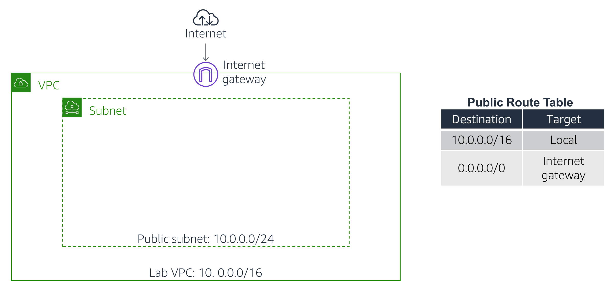

# Level 200: Deploy and Update CloudFormation

## AWS Well-Architected

This lab illustrates best practices for reliability as described in the [AWS Well-Architected](https://aws.amazon.com/architecture/well-architected/) Reliability pillar. It Illustrates the Reliability Design Principle:

**Manage change in automation**: Changes to your infrastructure should be made using automation. The changes that need to be managed include changes to the automation, which then can be tracked and reviewed.

And it addresses best practices to help answer the question:

* How do you implement change?
      * Deploy changes with automation

When this lab is completed, you will have @TODO

## Table of Contents

1. [Deploy a CloudFormation Stack](#deploy_infra)
1. [Add an Amazon S3 Bucket to the Stack](#add_s3)
1. [Add an Amazon EC2 Instance to the Stack](#add_ec2)
1. [Tear down this lab](#tear_down)

## 1. Deploy a CloudFormation Stack 

You will begin by deploying a CloudFormation stack that creates a VPC as shown
in this diagram:

1. Download the [_my_stack.yaml_](https://raw.githubusercontent.com/awslabs/aws-well-architected-labs/master/Reliability/200_Deploy_and_Update_CloudFormation/Code/CloudFormation/my_stack.yaml) CloudFormation template
1. Open this file in a Text Editor
      * Preferably use an editor that is [YAML](https://en.wikipedia.org/wiki/YAML) aware liek vi/vim or Notepad++
      * Do NOT use a Word Processor

Look through the file. You will notice several sections:

* The [Parameters
    section](https://docs.aws.amazon.com/AWSCloudFormation/latest/UserGuide/parameters-section-structure.html)
    is used to prompt for inputs that can be used elsewhere in the template. The
    template is asking for two IP address (CIDR) ranges for defining the VPC.

* The [Resources
    section](https://docs.aws.amazon.com/AWSCloudFormation/latest/UserGuide/resources-section-structure.html)
    is used to define the infrastructure to be deployed. The template is
    defining the VPC, an IAM Role and a Security Group.

* The [Outputs
    section](https://docs.aws.amazon.com/AWSCloudFormation/latest/UserGuide/outputs-section-structure.html)
    is used to provide selective information about resources in the stack. The
    template is providing the Default Security Group for the VPC that is
    created.

The template is written in a format called
[YAML](https://en.wikipedia.org/wiki/YAML), which is commonly used for
configuration files. The format of the file is important, including the indents
and hyphens. CloudFormation templates can also be written in JSON.

You will now use this **template** to launch a **CloudFormation stack**.

1. In the **AWS Management Console**, on the **Services** menu, click **CloudFormation**.

1. Click **Create stack** then:
      * Click **Upload a template to Amazon S3**
      * Click **Browse** or **Choose file** and upload the template file you
    downloaded earlier
      * Click **Next**

1. On the **Specify Details** page, configure:
      * **Stack name:** `Lab_Stack`
      * In the **Parameters** section, you will see that CloudFormation is prompting for
the IP address ('CIDR') range for the VPC and Subnet. A default value has been
specified by the template, so there is no need to modify these values.

1. Click **Next**
      * The **Configure stack options** page can be used to specify additional
parameters. You can browse the page, but leave settings at their default values.

1. Click **Next**
      * The **Review** page displays a summary of all settings. Some of the resources
are defined with *custom names*, which can lead to naming conflicts. Therefore,
CloudFormation prompts for an acknowledgement that custom names are being used.

1. Under **Capabilities**, click **I acknowledge...**

1. Click **Create stack**

The stack will now enter the *CREATE_IN_PROGRESS* status.

1. Click the **Events** tab and scroll through the listing.
      * The listing shows (in reverse order) the activities performed by CloudFormation,
such as starting to create a resource and then completing the resource creation.
Any errors encountered during the creation of the stack will be listed in this
tab.

1. Click the **Resources** tab.
      * The listing shows the resources that are being created. CloudFormation
determines the optimal order for resources to be created, such as creating the
VPC before the subnet.

1. Wait until the status changes to *CREATE_COMPLETE*. You can click
    **Refresh** occasionally to update the display.

1. Go to the VPC console to see the *Lab VPC* that was created. Then,
return to the CloudFormation console.

## 2. Add an Amazon S3 Bucket to the Stack

In this task, you will gain experience in editing a CloudFormation template.

Your objective is:

* Add an Amazon S3 bucket to the template
* Then **update the stack** with the revised template

This will result in a new bucket being deployed.

Rather than following pre-defined steps, you will need to discover how to
**update the template yourself**!

Here are some tips:

* You should edit the **my_stack.yaml** file you downloaded earlier to include an
    Amazon S3 bucket
* Use this documentation page for assistance: [Amazon S3 Template
    Snippets](https://docs.aws.amazon.com/AWSCloudFormation/latest/UserGuide/quickref-s3.html)
* Look at the **YAML example**
* Your code should go under the **Resources:** header in the template file
* **You do not require any Properties for this bucket resource**
* Indents are important in YAML -- use two spaces for each indent
* The correct solution is actually **only needs two lines** -- one for the
    identifier and one for the Type

Once you have edited the template, continue with the following steps to update
the stack.

1. In the CloudFormation console, select **Lab**.
1. Click **Update**
1. Select **Replace current template**
1. Select **Upload a template file**
1. Click **Browse** or **Choose file** and upload the template file that you
    edited.
1. Click **Next**
1. On the **Specify stack details** page, click **Next**
1. On the **Configure stack options** page, click **Next**

Wait for CloudFormation to calculate the changes. You should see something
similar to this:

This indicates that CloudFormation will **Add** an Amazon S3 bucket. All other
resources defined in the template will be **unchanged**. This demonstrates that
it is fast and easy to add additional resources to an existing stack, since
those resources do not need to be redeployed.

1.  Click **I acknowledge...**

2.  Click **Update stack**

After a minute, the stack will change from *UPDATE_IN_PROGRESS* to
*UPDATE_COMPLETE*.

1.  Click the **Resources** tab.

The bucket will now be displayed in the list of resources. CloudFormation will
have assigned it a random name so that it does not conflict with any existing
buckets.

If the bucket was not correctly created, please ask your instructor for
assistance.

To download a sample solution, right-click and download this link:
[task2.yaml](https://us-west-2-tcprod.s3.amazonaws.com/courses/ILT-TF-100-SYSOPS/v3.3.15/lab-8-cloudformation/scripts/task2.yaml)

**Optional:** Go to the S3 console to see the bucket that was created. Then,
return to the CloudFormation console.

## 3. Add an Amazon EC2 Instance to the Stack 

In this task, your objective is to **add an Amazon EC2 instance to the
template**, then update the stack with the revised template.

Whereas the bucket definition was rather simple (just two lines), defining an
Amazon EC2 instance is more complex because it needs to use associated
resources, such as an AMI, security group and subnet.

First, however, you will add a special parameter that is used to provide a value
for the Amazon Machine Image (AMI).

1.  Update the template by adding these lines in the **Parameters** section:

          AmazonLinuxAMIID: 
            Type: AWS::SSM::Parameter::Value\<AWS::EC2::Image::Id\>
            Default: /aws/service/ami-amazon-linux-latest/amzn2-ami-hvm-x86_64-gp2

This parameter uses the **AWS Systems Manager Parameter Store** to retrieve the
latest AMI (specified in the *Default* parameter, which in this case is *Amazon
Linux 2*) for the stack's region. This makes it easy to deploy stacks in
different regions without having to manually specify an AMI ID for every region.

For more details of this method, see: [AWS Compute Blog: Query for the latest
Amazon Linux AMI IDs using AWS Systems Manager Parameter
Store](https://aws.amazon.com/blogs/compute/query-for-the-latest-amazon-linux-ami-ids-using-aws-systems-manager-parameter-store/)

When writing CloudFormation templates, you can refer to other resources in the
template by using the keyword. For example, here is a portion of the
*my_stack.yaml* template that defines a VPC, then references the VPC within the
Route Table definition:

VPC: Type: AWS::EC2::VPC Properties: CidrBlock: 10.0.0.0/16 PublicRouteTable:
Type: AWS::EC2::RouteTable Properties: VpcId: !Ref VPC

Note that it uses to refer to the VPC resource. You will use this technique when
defining the EC2 instance.

1.  Use the tips below to update the template to **add an Amazon EC2 instance**
    with the following **Properties**:

* **IamInstanceProfile:** Refer to , which is defined elsewhere in the
    template

* **ImageId:** Refer to , which is the parameter added in the previous step

* **InstanceType:**

* **SecurityGroupIds:** Refer to , which is defined elsewhere in the template

* **SubnetId:** Refer to , which is defined elsewhere in the template

* **Tags:** Use this YAML block:

Tags: - Key: Name Value: App Server

Here are some tips:

* Use this documentation page for assistance:
    [AWS::EC2::Instance](https://docs.aws.amazon.com/AWSCloudFormation/latest/UserGuide/aws-properties-ec2-instance.html)

* Use the **YAML version**

* Your code should go under the **Resources:** header in the template file

* **Only add the six Properties listed above**, there is no need to include
    any other properties

* When referring to other resources in the same template, use — see the
    example at the beginning of this task

* When referring to **SecurityGroupIds**, the template is actually expecting a
    *list* of security groups. You therefore need to list the security group
    like this:

SecurityGroupIds: - !Ref AppSecurityGroup

1.  Once you have edited the template, update the stack with your revised
    template file.

You should see this before deploying the update:

If you are experiencing difficulties in editing the template, please ask your
instructor for assistance.

To download a sample solution, right-click and download this link:
[task3.yaml](https://us-west-2-tcprod.s3.amazonaws.com/courses/ILT-TF-100-SYSOPS/v3.3.15/lab-8-cloudformation/scripts/task3.yaml)

The instance will now be displayed in the **Resources** tab.

**Optional:** Go to the EC2 console to see the *App Server* that was created.
Then, return to the CloudFormation console.

## 4. Tear down this lab 

When a CloudFormation stack is deleted, CloudFormation will automatically delete
the resources that it created.

You will now delete the stack.

1.  In the CloudFormation console, select **Lab**.

2.  Click **Delete** then click **Delete stack**

The stack will show *DELETE_IN_PROGRESS*. After a few minutes, the stack will
disappear.

---

## License

### Documentation License

Licensed under the [Creative Commons Share Alike 4.0](https://creativecommons.org/licenses/by-sa/4.0/) license.

### Code License

Licensed under the Apache 2.0 and MITnoAttr License.

Copyright 2020 Amazon.com, Inc. or its affiliates. All Rights Reserved.

Licensed under the Apache License, Version 2.0 (the "License"). You may not use this file except in compliance with the License. A copy of the License is located at

<https://aws.amazon.com/apache2.0/>

or in the ["license" file](../../LICENSE-Apache) accompanying this file. This file is distributed on an "AS IS" BASIS, WITHOUT WARRANTIES OR CONDITIONS OF ANY KIND, either express or implied. See the License for the specific language governing permissions and limitations under the License.
