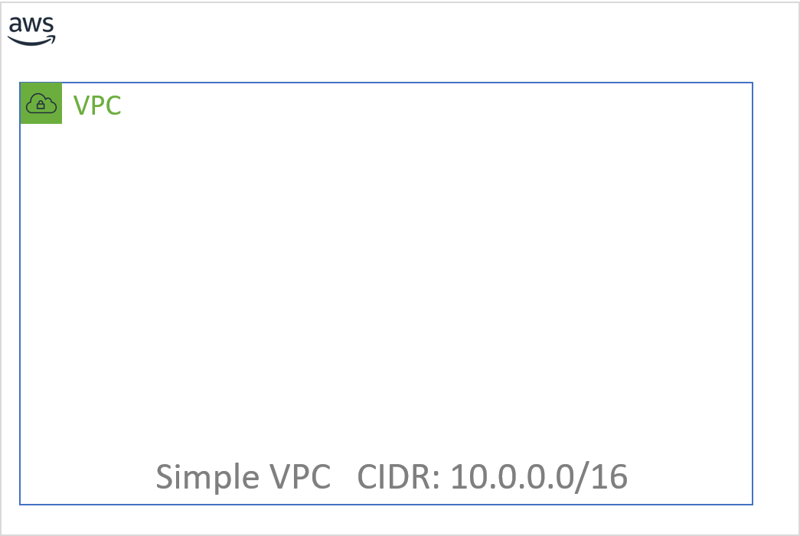
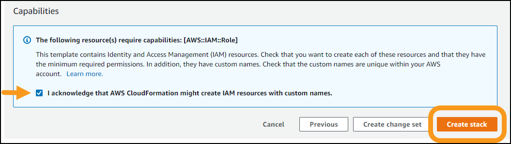
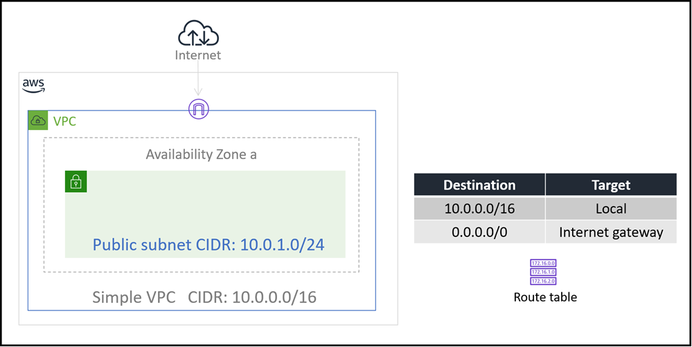

# Level 200: Deploy and Update CloudFormation

## AWS Well-Architected

This lab illustrates best practices for reliability as described in the [AWS Well-Architected](https://aws.amazon.com/architecture/well-architected/) Reliability pillar.

* Design Principle: **Manage change in automation**: Changes to your infrastructure should be made using automation. These changes then can be tracked and reviewed.
* Best practice: Deploy changes with automation when you need to implement change

When this lab is completed, you will have deployed and edited a CloudFormation template. Using this template you will deploy a VPC, an S3 bucket and an EC2 instance running a simple web server.

## Table of Contents

1. [Deploy a CloudFormation Stack](#deploy_infra)
1. [Configure Deployed Resources using Parameters](#cfn_params)
1. [Add an Amazon S3 Bucket to the Stack](#add_s3)
1. [Add an Amazon EC2 Instance to the Stack](#add_ec2)
1. [Tear down this lab](#tear_down)

## 1. Deploy a CloudFormation Stack 

### 1.1 The CloudFormation template

You will begin by deploying a CloudFormation stack that creates a simple VPC as shown in this diagram:

1. Download the [simple_stack.yaml](https://raw.githubusercontent.com/awslabs/aws-well-architected-labs/master/Reliability/200_Deploy_and_Update_CloudFormation/Code/CloudFormation/simple_stack.yaml) CloudFormation template
1. Open this file in a Text Editor
      * Preferably use an editor that is [YAML](https://en.wikipedia.org/wiki/YAML) aware liek vi/vim or Notepad++
      * Do NOT use a Word Processor

The template is written in a format called [YAML](https://en.wikipedia.org/wiki/YAML), which is commonly used for configuration files. The format of the file is important, especially indents and hyphens. CloudFormation templates can also be written in JSON.

Look through the file. You will notice several sections:

* The [Parameters section](https://docs.aws.amazon.com/AWSCloudFormation/latest/UserGuide/parameters-section-structure.html) is used to prompt for inputs that can be used elsewhere in the template. The template is asking for several inputs, but also provides default values for each one. Look through these and start to reason about what each one is.

* The [Conditions section](https://docs.aws.amazon.com/AWSCloudFormation/latest/UserGuide/conditions-section-structure.html) is where you can setup "if-then"-like control of what happens during template deployment. It defines the circumstances under which entities are created or configured.

* The [Resources section](https://docs.aws.amazon.com/AWSCloudFormation/latest/UserGuide/resources-section-structure.html) is the "heart" of the template. It is where you define the infrastructure to be deployed. Look at the first resource defined.
    * It is the VPC itself
    * It has a `Type` which tells CloudFormation which type of resource to create
    * And it has `Properties` that define the values used to create the VPC

* The [Outputs section](https://docs.aws.amazon.com/AWSCloudFormation/latest/UserGuide/outputs-section-structure.html) is used to display selective information about resources in the stack.

* The [Metadata section](https://docs.aws.amazon.com/AWSCloudFormation/latest/UserGuide/metadata-section-structure.html) here is used to group and order how the CloudFormation parameters are displayed when you deploy the template using the AWS Console

|CloudFormation tip|
|:---:|
|When editing CloudFormation templates written in YAML, be extra caution that you maintain the correct number of spaces for each indentation|

You will now use this **template** to launch a **CloudFormation stack** that will deploy AWS resources in your AWS account.

### 1.2 Deploying an AWS CloudFormation stack to create a simple VPC

1. Go to the AWS CloudFormation console at <https://console.aws.amazon.com/cloudformation> and click **Create Stack** > **With new resources**

1. Leave **Prepare template** setting as-is
      * 1 - For **Template source** select **Upload a template file**
      * 2 - Click **Choose file** and supply the CloudFormation template you downloaded: `simple_stack.yaml`
       

1. Click **Next**
1. For **Stack name** use **CloudFormationLab**
1. **Parameters**
    1. Look over the Parameters and their values. We will work with these later in the lab.
    1. Leave all Parameters with their default values and click **Next**
1. For **Configure stack options** click **Next**
1. For **Review CloudFormationLab**
    1. Review the contents of the page
    1. At the bottom of the page, select **I acknowledge that AWS CloudFormation might create IAM resources with custom names**
    1. Click **Create stack**
         
1. This will take you to the CloudFormation stack status page, showing the stack creation in progress.
    * Click on the **Events** tab
    * Scroll through the listing. It shows (in reverse order) the activities performed by CloudFormation, such as starting to create a resource and then completing the resource creation.
    * Any errors encountered during the creation of the stack will be listed in this tab.
    
  Deployment will take approximately 30 seconds to deploy. When it shows **status** _CREATE_COMPLETE_, then you are finished with this step.

1. Click the **Resources** tab. The listing shows all the resources that were created.

### 1.3 Understanding the deployment

* How many resources were created?
* Look at the `simple_stack.yaml` template (in your text editor). How many resources are defined here?
* Investigate:
    * Why did the deployment not create all of the resources?
    * After the horizontal rule below, this will be explained. Try to figure this out before continuing.

---

* The **Condition** `PublicEnabled` is set using the **Parameter** `PublicEnabledParam`
* Similarly the **Condition** `EC2SecurityEnabled` is set using the **Parameter** `EC2SecurityEnabledParam`
* The Default value for both of these **Parameters** is `false`
* Look in the template at how the `PublicEnabled` and `EC2SecurityEnabled` **Conditions** are used
* The `Condition: <Condition_Name>` statement on a resource means
    * If this condition is `true`
        * then create this resource
    * else
        * do not create this resource
* All resources _except_ the VPC have a `Condition` statement. Since the conditions were `false` only the VPC was created

---

1. Return to the [AWS CloudFormation console](https://console.aws.amazon.com/cloudformation)
1. Click the **Resources** tab for the **CloudFormationLab** stack. The listing shows all the resources that were created. In this case just the VPC
1. Note the **Logical ID** for the VPC is _SimpleVPC_. Look at the CloudFormation template file and determine where this name came from
1. Under the **Resources** tab click on the **Physical ID** link for_SimpleVPC_
    * This takes you to the VPC console where you can see the VPC you created
    * Select the checkbox next to your VPC (if not already selected)
    * Look at the VPC attributes under the **Description** tab.  How do these compare to the CloudFormation template?

## 2. Configure Deployed Resources using Parameters

In this task, you will gain experience changing CloudFormation stack parameters and updating your CloudFormation stack

* Your objective is to deploy additional resources used by the VPC to enable connection to the internet

### 2.1 Update Parameters

1. Go to the [AWS CloudFormation console](https://console.aws.amazon.com/cloudformation) (if not already there)
1. Click on **Stacks**
1. Click on the **CloudFormationLab** stack
1. Click **Update**
1. Leave **Use current template** selected. You have not changed the template
1. Click **Next**
1. On the **Specify stack details** screen you now have the opportunity to change the **Parameters**
    * Change **PublicEnabledParam** to `true`
1. Click **Next**
1. Click **Next** again, until you arrive at the **Review CloudFormationLab** screen
    1. Scroll down to **Change set preview** and note several resources are being added
    1. At the bottom of the page, select **I acknowledge that AWS CloudFormation might create IAM resources with custom names**
    1. Click **Create stack**
1. When stack **status** is _CREATE_COMPLETE_ for your update (about one minute) then continue

## 2.2 Understanding the deployment

* You did not change any contents of the the CloudFormation Template
* Changing only one parameter, you re-deployed the stack which resulted in additional resources deployed

1. Go to the [AWS CloudFormation console](https://console.aws.amazon.com/cloudformation) (if not already there)
1. Click the **Resources** tab for the **CloudFormationLab** stack. 
      * The listing now shows the VPC as before, plus additional resources required to enable us to deploy resources into the VPC that have access to the internet
      * Click through on several of the **Physical ID** links and explore these resources

The current deployment is now represented by this architecture diagram:

## 3. Add an Amazon S3 Bucket to the Stack

In this task, you will gain experience in editing a CloudFormation template and updating your CloudFormation stack

* Your objective is to deploy a new Amazon S3 bucket

### 3.1 Edit the CloudFormation template file

1. From the [Amazon S3 Template Snippets](https://docs.aws.amazon.com/AWSCloudFormation/latest/UserGuide/quickref-s3.html) documentation page, copy the _YAML_ example for **Creating an Amazon S3 Bucket with Defaults**
1 Edit the **simple_stack.yaml** file you downloaded earlier to include an Amazon S3 bucket
    * Under the **Resources** section add the snippet you copied
    * **You do not require any Properties for this bucket resource**
    * Indents are important in YAML -- use two spaces for each indent. Look at the other resources for guidance
    * The correct solution is actually **only needs two lines** -- one for the identifier and one for the Type
    * Save the template

Once you have edited the template, continue with the following steps to update
the stack.

### 3.2 Update the CloudFormation stack - specify updated template

1. Go to the [AWS CloudFormation console](https://console.aws.amazon.com/cloudformation)
1. Click on **Stacks**
1. Click on the **CloudFormationLab** stack
1. Click **Update**
1. Now click **Replace current template** selected. This is different from what you did for the last update.
1. Click **Upload a template file**
1. Click **Choose file**
    * Select `simple_stack,yaml`, your edited CloudFormation template file
1. Click **Next**

* At this point you may see an error:
    * You remain on the **Update stack** screen
    * A red banner across the top of the page alerts you to an error with your template 
* If you see **Template format error** then:
    * Check the indentation and punctuation in your `simple_stack,yaml` file
    * Once you have corrected the error, click **Choose file** again to reload you new corrected file
* If you see **Invalid template resource property**
    * Check that the properties you specified for the resource you added match the properties in the documentation.
    * Once you have corrected the error, click **Choose file** again to reload you new corrected file

If you did _not_ see an error you may proceed

### 3.3 Update the CloudFormation stack - complete the deployment

1. On the **Specify stack details** click **Next**
1. Click **Next** again, until you arrive at the **Review CloudFormationLab** screen
    1. Scroll down to **Change set preview** and note your S3 bucket is the only resource being added
    1. At the bottom of the page, select **I acknowledge that AWS CloudFormation might create IAM resources with custom names**
    1. Click **Create stack**
1. When stack **status** is _CREATE_COMPLETE_ for your update (about one minute) then continue
1. Click the **Resources** tab
    * Note your new S3 bucket is listed among the resources deployed 
    * Click on the **Physical ID** of the S3 bucket to view the bucket on the S3 console
    * Note the name is `cloudformationlab-mys3bucket-<some_random_string>`.

The name for the S3 bucket was auto-generated based on your CloudFormation stack name (converted to lowercase), plus the string "mys3bucket", plus a randomly generated string.
    * The name for an S3 bucket must be unique across all S3 buckets in AWS
    * Your bucket was assigned an auto-generated name because you did not specify a name in the S3 bucket properties in your CloudFormation template
    * In the next exercise you will add a name property for your S3 bucket and update the deployment

### 3.4 Assign name property for the S3 bucket

For this task you are going to add a Parameter where you can specify the bucket name, and a property on the S3 bucket resource that uses this paramter.

1. Under the **Parameters** section of your `simple_stack.yaml` template look at the **S3BucketName** parameter
    * It is not currently used in the template

            # S3 Bucket
            S3BucketName:
                Type: String
                Description: The name for the S3 bucket - must be unique across all of AWS (3-63 lowercase letters or numbers)
                AllowedPattern: '^[a-z0-9]{5,40}$'
                ConstraintDescription: 3-63 characters; must contain only lowercase letters or numbers
    * It is a string for which we have configured certain constraints
    * The **AllowedPattern** is a _regular expression_ specifying only lowercase letters or numbers and a string length between 3-63 characters
    * This satisfies the constraints on what is allowed in an S3 bucket name
    * It is actually more constrictive than what is allowed.  See **Rules for Bucket Naming** under [Bucket Restrictions and Limitations](https://docs.aws.amazon.com/AmazonS3/latest/dev/BucketRestrictions.html) for more details.
1. Add two more lines to your S3 bucket under in the **Resources** section of your template so it looks like this
    * Be caution to maintin the two-space indents where indicated

            MyS3Bucket:
                Type: AWS::S3::Bucket
                Properties:
                  BucketName: !Ref S3BucketName

    * The **Properties** label defines that the items that follow (indented underneath) are preopeties of the S3 bucket
    * For the **BucketName** property you are specifying a reference to another value in the template. Specifcially you are indicating that the string entered as the **S3BucketName** parameter should be used as the name of the bucket
1. Go to the [AWS CloudFormation console](https://console.aws.amazon.com/cloudformation)
1. Click on **Stacks**
1. Click on the **CloudFormationLab** stack
1. Click **Update**
1. Now click **Replace current template** selected. This is different from what you did for the last update.
1. Click **Upload a template file**
1. Click **Choose file**
    * Select `simple_stack,yaml`, your edited CloudFormation template file
1. Click **Next**  -- Look for any errors reported
1. On the **Specify stack details** look at the Parameters
    * You must enter a value for **S3BucketName**
    * Remember is must be a name that no other bucket in all of AWS already has
1. Click **Next** again, until you arrive at the **Review CloudFormationLab** screen
    1. Scroll down to **Change set preview** and note your S3 bucket will be modified
    1. At the bottom of the page, select **I acknowledge that AWS CloudFormation might create IAM resources with custom names**
    1. Click **Create stack**
1. When stack **status** is _CREATE_COMPLETE_ for your update (about one minute) then continue

* Under the resources see your newly named S3 bucket

**Troubleshooting**
* If your CloudFormation stack fails, then click on the **Events** tab and scroll down to find the source of the error
* If you see a message like `<your_chosen_bucket_name> already exists` then re-do the CloudFormation update steps, but specify a more unique bucket name

## 4. Add an Amazon EC2 Instance to the Stack 

In this task, your objective is to add an Amazon EC2 instance to the template, then update the stack with the revised template.

Whereas the bucket definition was rather simple (just two to four lines), defining an Amazon EC2 instance is more complex because it needs to use associated resources, such as an AMI, security group and subnet.

For this exercise we wil assume you now know how to edit your CloudFormation template and update your CloudFormation stack with the updated template

### 4.1 Get the latest AMI to use for your EC2 instance

In the **Parameters** section of your template, look at the **LatestAmiId** parameter.

    LatestAmiId:
        Description: Gets the latest AMI from Systems Manager Parameter store
        Type: 'AWS::SSM::Parameter::Value<AWS::EC2::Image::Id>'
        Default: '/aws/service/ami-amazon-linux-latest/amzn2-ami-hvm-x86_64-gp2'

This is a special parameter. This parameter uses the **AWS Systems Manager Parameter Store** to retrieve the latest AMI (specified in the *Default* parameter, which in this case is *Amazon Linux 2*) for the stack's region. This makes it easy to deploy stacks in different regions without having to manually specify an AMI ID for every region.

* Go to the [AWS CloudFormation console](https://console.aws.amazon.com/cloudformation)
    * Click on **Stacks**
    * Click on the **CloudFormationLab** stack
    * Click on the **Parameters** tab
* Look at the **Value** and **Resolved value** for **LatestAmiId**
    * You see here how it resolves to an AMI IS

For more details of this method, see: [AWS Compute Blog: Query for the latest Amazon Linux AMI IDs using AWS Systems Manager Parameter Store](https://aws.amazon.com/blogs/compute/query-for-the-latest-amazon-linux-ami-ids-using-aws-systems-manager-parameter-store/)

### 4.2 Add the EC2 instance resource to your CloudFormation template and deploy it

Use this documentation page for assistance:
    [AWS::EC2::Instance](https://docs.aws.amazon.com/AWSCloudFormation/latest/UserGuide/aws-properties-ec2-instance.html)
* Use the YAML format

You _only_ need to specify these six properties:

* **IamInstanceProfile:** Refer to `Web1InstanceInstanceProfile`, which is defined elsewhere in the template
* **ImageId:** Refer to `LatestAmiId`, which is the parameter discussed previously
* **InstanceType:** Refer to `InstanceType`, another parameter
* **SecurityGroupIds:** Refer to `PublicSecurityGroup`, which is defined elsewhere in the template
* **SubnetId:** Refer to `PublicSubnet1`, which is defined elsewhere in the template
* **Tags:** Use this YAML block:

      Tags:
        - Key: Name
          Value: Simple Server

Remember

* When referring to other resources in the same template, use `!Ref` see the `BucketName` example you already implemented
* When referring to **SecurityGroupIds**, the template is actually expecting a _list_ of security groups. You therefore need to list the security group like this:

      SecurityGroupIds: 
        - !Ref PublicSecurityGroup

To download a sample solution, right-click and download this link:
[simple_stack_plus_s3_ec2.yaml](https://raw.githubusercontent.com/awslabs/aws-well-architected-labs/master/Reliability/200_Deploy_and_Update_CloudFormation/Code/CloudFormation/simple_stack_plus_s3_ec2.yaml)

* Once you have edited the template, update the stack deployment with your revised template file.

| Important |
|:---:|
|When you initiate the update, change the **EC2SecurityEnabledParam** value on the **Parameters** screen to `true`|
|This will tell the template to create resouces your EC2 instance will need such as the Security Group and IAM Role|

* This deployment of the CloudFormation stack will take about three minutes

* The instance will now be displayed in the **Resources** tab.

* Go to the EC2 console to see the *Simple Server* that was created. Then, return to the CloudFormation console.

The final deployment is now represented by this architecture diagram:

## 5. Tear down this lab 

When a CloudFormation stack is deleted, CloudFormation will automatically delete
the resources that it created.

You will now delete the stack.

1. In the CloudFormation console, select **CloudFormationLab**.

2. Click **Delete** then click **Delete stack**

The stack will show *DELETE_IN_PROGRESS*. After a few minutes, the stack will disappear.

---

## References & useful resources

---

## License

### Documentation License

Licensed under the [Creative Commons Share Alike 4.0](https://creativecommons.org/licenses/by-sa/4.0/) license.

### Code License

Licensed under the Apache 2.0 and MITnoAttr License.

Copyright 2020 Amazon.com, Inc. or its affiliates. All Rights Reserved.

Licensed under the Apache License, Version 2.0 (the "License"). You may not use this file except in compliance with the License. A copy of the License is located at

<https://aws.amazon.com/apache2.0/>

or in the ["license" file](../../LICENSE-Apache) accompanying this file. This file is distributed on an "AS IS" BASIS, WITHOUT WARRANTIES OR CONDITIONS OF ANY KIND, either express or implied. See the License for the specific language governing permissions and limitations under the License.
