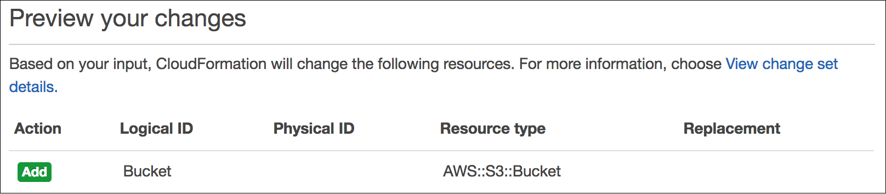
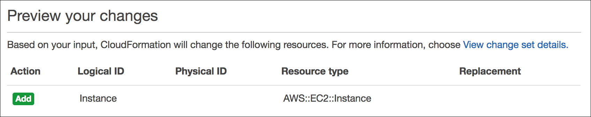

# Level 200: Deploy and Update CloudFormation

## AWS Well-Architected

This lab illustrates best practices for reliability as described in the [AWS Well-Architected](https://aws.amazon.com/architecture/well-architected/) Reliability pillar.

Design Principle:
* **Manage change in automation**: Changes to your infrastructure should be made using automation. These changes then can be tracked and reviewed.

Best practice:
* Deploy changes with automation when you need to implement change
    

When this lab is completed, you will have deployed and edited a CloudFormation template. Using this template you will deploy an S3 bucket and a simple web server

## Table of Contents

1. [Deploy a CloudFormation Stack](#deploy_infra)
1. [Configure Deployed Resources using Parameters](#cfn_params)
1. [Add an Amazon S3 Bucket to the Stack](#add_s3)
1. [Add an Amazon EC2 Instance to the Stack](#add_ec2)
1. [Tear down this lab](#tear_down)

## 1. Deploy a CloudFormation Stack 

### 1.1 The CloudFormation template

You will begin by deploying a CloudFormation stack that creates a simple VPC as shown in this diagram:

1. Download the [_simple_stack.yaml_](https://raw.githubusercontent.com/awslabs/aws-well-architected-labs/master/Reliability/200_Deploy_and_Update_CloudFormation/Code/CloudFormation/simple_stack.yaml) CloudFormation template
1. Open this file in a Text Editor
      * Preferably use an editor that is [YAML](https://en.wikipedia.org/wiki/YAML) aware liek vi/vim or Notepad++
      * Do NOT use a Word Processor

Look through the file. You will notice several sections:

* The [Parameters section](https://docs.aws.amazon.com/AWSCloudFormation/latest/UserGuide/parameters-section-structure.html) is used to prompt for inputs that can be used elsewhere in the template. The template is asking for several inputs, but also provides default values for each one. Look through these and start to reason about what each one is.

* The [Conditions section](https://docs.aws.amazon.com/AWSCloudFormation/latest/UserGuide/conditions-section-structure.html) is where you can setup "if-then"-like control of what happens during template deployment. It defines the circumstances under which entities are created or configured.

* The [Resources section](https://docs.aws.amazon.com/AWSCloudFormation/latest/UserGuide/resources-section-structure.html) is the "heart" of the template. It is where you define the infrastructure to be deployed. Look at the first resource defined.
    * It is the VPC itself
    * It has a `Type` which tells CloudFormation which type of resource to create
    * And it has `Properties` that define the values used to create the VPC

* The [Outputs section](https://docs.aws.amazon.com/AWSCloudFormation/latest/UserGuide/outputs-section-structure.html) is used to display selective information about resources in the stack.

* The [Metadata section](https://docs.aws.amazon.com/AWSCloudFormation/latest/UserGuide/metadata-section-structure.html) here is used to group and order how the CloudFormation parameters are displayed when you deploy the template using the AWS Console

The template is written in a format called [YAML](https://en.wikipedia.org/wiki/YAML), which is commonly used for configuration files. The format of the file is important, especially indents and hyphens.

|CloudFormation tip|
|:---:|
|When editing CloudFormation templates written in YAML, be extra caution that you maintain the correct number of spaces for each indentation|

CloudFormation templates can also be written in JSON.

You will now use this **template** to launch a **CloudFormation stack**.

### 1.2 Deploying an AWS CloudFormation stack to create a simple VPC

1. Go to the AWS CloudFormation console at <https://console.aws.amazon.com/cloudformation> and click **Create Stack** > **With new resources**

1. Leave **Prepare template** setting as-is
      * 1 - For **Template source** select **Upload a template file**
      * 2 - Click **Choose file** and supply the CloudFormation template you downloaded: `simple_stack.yaml`
       

1. Click **Next**
1. For **Stack name** use **CloudFormationLab**
1. **Parameters**
    1. Look over the Parameters and their values
    1. Leave all Parameters with their default values and click **Next**
1. For **Configure stack options** click **Next**
1. For **Review CloudFormationLab**
    1. Review the contents of the page
    1. At the bottom of the page, select **I acknowledge that AWS CloudFormation might create IAM resources with custom names**
    1. Click **Create stack**
         
1. This will take you to the CloudFormation stack status page, showing the stack creation in progress. 
    * Click on the **Events** tab
    * Scroll through the listing. It shows (in reverse order) the activities performed by CloudFormation, such as starting to create a resource and then completing the resource creation.
    * Any errors encountered during the creation of the stack will be listed in this tab.
    
  Deployment will take approximately 30 seconds to deploy. When it shows **status** _CREATE_COMPLETE_, then you are finished with this step.

1. Click the **Resources** tab. The listing shows all the resources that were created.

### 1.3 Understanding the deployment

* How many resources were created?
* Look at the `simple_stack.yaml` template (in your text editor). How many resources are defined here?
* Investigate:
    * Why did the deployment not create all of the resources?
    * After the break this will be explained. Try to figure this out before continuing.

---

* The **Condition** `PublicEnabled` is set using the **Parameter** `PublicEnabledParam`
* Similarly the **Condition** `EC2SecurityEnabled` is set using the **Parameter** `EC2SecurityEnabledParam`
* The Default value for both of these **Parameters** is `false`
* Look in the template at how the `PublicEnabled` and `EC2SecurityEnabled` **Conditions** are used
* The `Condition: <Condition_Name>` statement on a resource means
    * If this condition is `true`
        * then create this resource
    * else
        * do not create this resource
* All resources _except_ the VPC have a `Condition` statement. Since the conditions were `false` only the VPC was created

## 2. Configure Deployed Resources using Parameters)

@TODO new image

## 3. Add an Amazon S3 Bucket to the Stack

In this task, you will gain experience in editing a CloudFormation template.

Your objective is:

* Add an Amazon S3 bucket to the template
* Then **update the stack** with the revised template

This will result in a new bucket being deployed.

Rather than following pre-defined steps, you will need to discover how to
**update the template yourself**!

Here are some tips:

* You should edit the **simple_stack.yaml** file you downloaded earlier to include an
    Amazon S3 bucket
* Use this documentation page for assistance: [Amazon S3 Template
    Snippets](https://docs.aws.amazon.com/AWSCloudFormation/latest/UserGuide/quickref-s3.html)
* Look at the **YAML example**
* Your code should go under the **Resources:** header in the template file
* **You do not require any Properties for this bucket resource**
* Indents are important in YAML -- use two spaces for each indent
* The correct solution is actually **only needs two lines** -- one for the
    identifier and one for the Type

Once you have edited the template, continue with the following steps to update
the stack.

1. In the CloudFormation console, select **Lab**.
1. Click **Update**
1. Select **Replace current template**
1. Select **Upload a template file**
1. Click **Browse** or **Choose file** and upload the template file that you
    edited.
1. Click **Next**
1. On the **Specify stack details** page, click **Next**
1. On the **Configure stack options** page, click **Next**

Wait for CloudFormation to calculate the changes. You should see something
similar to this:

This indicates that CloudFormation will **Add** an Amazon S3 bucket. All other
resources defined in the template will be **unchanged**. This demonstrates that
it is fast and easy to add additional resources to an existing stack, since
those resources do not need to be redeployed.

1.  Click **I acknowledge...**

2.  Click **Update stack**

After a minute, the stack will change from *UPDATE_IN_PROGRESS* to
*UPDATE_COMPLETE*.

1.  Click the **Resources** tab.

The bucket will now be displayed in the list of resources. CloudFormation will
have assigned it a random name so that it does not conflict with any existing
buckets.

If the bucket was not correctly created, please ask your instructor for
assistance.

To download a sample solution, right-click and download this link:
[task2.yaml](https://us-west-2-tcprod.s3.amazonaws.com/courses/ILT-TF-100-SYSOPS/v3.3.15/lab-8-cloudformation/scripts/task2.yaml)

**Optional:** Go to the S3 console to see the bucket that was created. Then,
return to the CloudFormation console.

## 4. Add an Amazon EC2 Instance to the Stack 

In this task, your objective is to **add an Amazon EC2 instance to the
template**, then update the stack with the revised template.

Whereas the bucket definition was rather simple (just two lines), defining an
Amazon EC2 instance is more complex because it needs to use associated
resources, such as an AMI, security group and subnet.

First, however, you will add a special parameter that is used to provide a value
for the Amazon Machine Image (AMI).

1.  Update the template by adding these lines in the **Parameters** section:

          AmazonLinuxAMIID: 
            Type: AWS::SSM::Parameter::Value\<AWS::EC2::Image::Id\>
            Default: /aws/service/ami-amazon-linux-latest/amzn2-ami-hvm-x86_64-gp2

This parameter uses the **AWS Systems Manager Parameter Store** to retrieve the
latest AMI (specified in the *Default* parameter, which in this case is *Amazon
Linux 2*) for the stack's region. This makes it easy to deploy stacks in
different regions without having to manually specify an AMI ID for every region.

For more details of this method, see: [AWS Compute Blog: Query for the latest
Amazon Linux AMI IDs using AWS Systems Manager Parameter
Store](https://aws.amazon.com/blogs/compute/query-for-the-latest-amazon-linux-ami-ids-using-aws-systems-manager-parameter-store/)

When writing CloudFormation templates, you can refer to other resources in the
template by using the keyword. For example, here is a portion of the
*simple_stack.yaml* template that defines a VPC, then references the VPC within the
Route Table definition:

        Parameters:

        VPCCidrBlock:
            Description: VPC Cidr
            Type: String
            Default: 10.0.0.0/16

        Resources: 

        SimpleVPC:
            Type: AWS::EC2::VPC
            Properties:
            CidrBlock: !Ref VPCCidrBlock

        InternetRouteTable:
            Condition: PublicEnabled
            Type: AWS::EC2::RouteTable
            Properties:
            VpcId: !Ref SimpleVPC

Note that it uses to refer to the VPC resource. You will use this technique when
defining the EC2 instance.

1.  Use the tips below to update the template to **add an Amazon EC2 instance**
    with the following **Properties**:

* **IamInstanceProfile:** Refer to , which is defined elsewhere in the
    template

* **ImageId:** Refer to , which is the parameter added in the previous step

* **InstanceType:**

* **SecurityGroupIds:** Refer to , which is defined elsewhere in the template

* **SubnetId:** Refer to , which is defined elsewhere in the template

* **Tags:** Use this YAML block:

Tags: - Key: Name Value: App Server

Here are some tips:

* Use this documentation page for assistance:
    [AWS::EC2::Instance](https://docs.aws.amazon.com/AWSCloudFormation/latest/UserGuide/aws-properties-ec2-instance.html)

* Use the **YAML version**

* Your code should go under the **Resources:** header in the template file

* **Only add the six Properties listed above**, there is no need to include
    any other properties

* When referring to other resources in the same template, use `!Ref` see the
    example at the beginning of this task

* When referring to **SecurityGroupIds**, the template is actually expecting a
    *list* of security groups. You therefore need to list the security group
    like this:

SecurityGroupIds: - !Ref AppSecurityGroup

1.  Once you have edited the template, update the stack with your revised
    template file.

You should see this before deploying the update:

If you are experiencing difficulties in editing the template, please ask your
instructor for assistance.

To download a sample solution, right-click and download this link:
[task3.yaml](https://us-west-2-tcprod.s3.amazonaws.com/courses/ILT-TF-100-SYSOPS/v3.3.15/lab-8-cloudformation/scripts/task3.yaml)

The instance will now be displayed in the **Resources** tab.

**Optional:** Go to the EC2 console to see the *App Server* that was created.
Then, return to the CloudFormation console.

## 5. Tear down this lab 

When a CloudFormation stack is deleted, CloudFormation will automatically delete
the resources that it created.

You will now delete the stack.

1.  In the CloudFormation console, select **CloudFormationLab**.

2.  Click **Delete** then click **Delete stack**

The stack will show *DELETE_IN_PROGRESS*. After a few minutes, the stack will disappear.

---

## License

### Documentation License

Licensed under the [Creative Commons Share Alike 4.0](https://creativecommons.org/licenses/by-sa/4.0/) license.

### Code License

Licensed under the Apache 2.0 and MITnoAttr License.

Copyright 2020 Amazon.com, Inc. or its affiliates. All Rights Reserved.

Licensed under the Apache License, Version 2.0 (the "License"). You may not use this file except in compliance with the License. A copy of the License is located at

<https://aws.amazon.com/apache2.0/>

or in the ["license" file](../../LICENSE-Apache) accompanying this file. This file is distributed on an "AS IS" BASIS, WITHOUT WARRANTIES OR CONDITIONS OF ANY KIND, either express or implied. See the License for the specific language governing permissions and limitations under the License.
