# Level 200: Testing Backup and Restore of Data

## Authors

* Mahanth Jayadeva, Solutions Architect, Well-Architected

## Table of Contents

1. [Deploy the Infrastructure](#prerequisite)
2. [Create Backup Plan](#configure_backup_plan)
3. [Enable Notifications](#enable_notifications)
4. [Test Restore](#test_restore)
5. [Tear Down](#tear_down)

For many organizations, the data that they possess is one of the most valuable assets they have. Backing up data frequently is of vital importance for the long lasting success of any organization. However, a backup of data is only valuable if data can be recovered/restored from the backup. In the cloud, backing up data and testing the restore is easier compared to on-premises datacenters. Automating this process with appropriate notification systems will ensure that an organization's data is backed up frequently, the backups are tested to ensure expected recovery, and the appropriate people are notified in case of failures.

## 1. Setup 

You will use AWS CloudFormation to provision some resources needed for this lab. As part of this lab, the CloudFormation stack that you provision will create an EBS Volume, an SNS Topic, and a Lambda Function. **This lab will only work in us-east-1.**

If you are using the new CloudFormation console, click [here](https://console.aws.amazon.com/cloudformation/home?region=us-east-1#/stacks/quickcreate?templateUrl=https%3A%2F%2Fc3pio.s3.amazonaws.com%2Fbackup-test%2Fbackup-lab.json&stackName=WA-BACKUP-LAB) to deploy the stack.

If you are using the old CloudFormation console, click [here](https://console.aws.amazon.com/cloudformation/home?region=us-east-1#/stacks/create/review?filter=active&templateURL=https://c3pio.s3.amazonaws.com/backup-test/backup-lab.json&stackName=WA-BACKUP-LAB&param_TagKey=workload&param_TagValue=myapp) to deploy the stack.

Under **PARAMETERS**, specify an email address that you have access to for **NotificationEmail.**

Check the box **I acknowledge that AWS CloudFormation might create IAM resources.**

Click **CREATE** / **CREATE STACK.**

**MANUAL STEPS (New Console)**

1.  Use your administrator account to access the CloudFormation console - <https://console.aws.amazon.com/cloudformation/>.
2.  Click on **CREATE STACK**.
3.  Under **PREREQUISITE - PREPARE TEMPLATE**, select the option **TEMPLATE IS READY**.
4.  Under **SPECIFY TEMPLATE**, select the option **AMAZON S3 URL**, enter the link - https://c3pio.s3.amazonaws.com/backup-test/backup-lab.json and click **NEXT**.
5.  Enter a **STACK NAME** such as **WA**-**BACKUP-LAB**.
6.  For **NotificationEmail,** specify an email address that you have access to.
7.  Leave default values for the rest of the fields and click **NEXT**.
8.  No changes are needed on the **CONFIGURE STACK OPTIONS** page, click **NEXT**.
9.  Review the details of the stack, scroll down to **CAPABILITIES,** and check the box next to **I acknowledge that AWS CloudFormation might create IAM resources.**
10. Click **CREATE STACK**.

**Note:** Once stack creation starts, monitor the email address you entered. You should receive an email from SNS with the subject **AWS Notification - Subscription Confirmation.** Click on the link **Confirm subscription** to confirm the subscription of your email to the SNS Topic.

The stack takes about 3 mins to create all the resources. Periodically refresh the page until you see that the **STACK STATUS** is in **CREATE_COMPLETE**. Once the stack is in **CREATE_COMPLETE**, visit the **OUTPUTS** section for the stack and note down the **KEY** and **VALUE** for each of the outputs. This information will be used later in the lab.

## 2. Create a Backup Strategy 

A well thought out backup strategy is key to an Organization's success and is determined by a variety of factors. The biggest factors influencing a backup strategy is the Recovery Time Objective (RTO) and Recovery Point Objective (RPO) set for the workload. RTO and RPO are determined based on the criticality of the workload to the business, the SLAs that have been agreed upon, and the cost associated with achieving the RTO and RPO. RTO and RPO should be specific to each workload and not set for the entire organization/infrastructure.

In this lab, you will create a backup strategy by leveraging AWS Backup, a fully managed backup service that can automatically backup data from EBS Volumes, RDS Databases, DynamoDB Tables, EFS File Systems, and Storage Gateways.

1.  Use your administrator account to access the AWS Backup console - <https://us-east-1.console.aws.amazon.com/backup/home?region=us-east-1#backupplan>.
2.  Choose **CREATE BACKUP PLAN**.

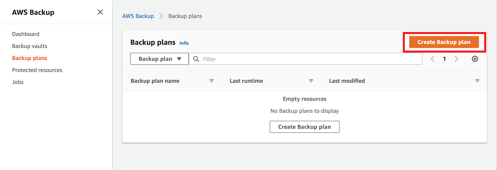

3.  Select the option to **BUILD A NEW PLAN**.
4.  Specify a **Backup plan name** such as **BACKUP-LAB**.

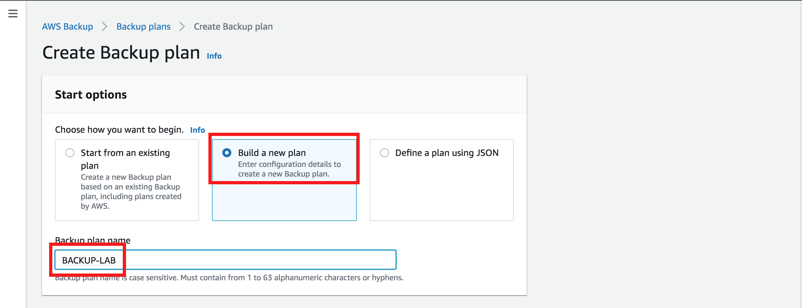

5.  Under **BACKUP RULE CONFIGURATION**, enter a **RULE NAME** such as **BACKUP-LAB-RULE**.
6.  To set a **SCHEDULE** for the backup, you can specify the **FREQUENCY** at which backups are taken. You can enter frequency as every 12 hours, Daily, Weekly, or Monthly. Alternatively, you can specify a custom **CRON EXPRESSION** for your backup frequency. For this exercise, select the **FREQUENCY** as **DAILY.**
7.  Once frequency has been established, you will need to specify a backup window - a period of time during which data is being backed up from your data sources. Keep in mind that creating backups could cause you data sources to be temporarily unavailable depending on the underlying configuration of those resources. It is best to create backups during scheduled downtimes/maintenance windows when user impact is minimal. For this exercise, select **Use backup window defaults - *recommended.*** The default backup window is set to start at 5 AM UTC time and last 8 hours. If you need to schedule backups at a different time, you can choose to customize the backup window.

8.  You can set lifecycle policies for your backups to transition them to cold storage or to expire these backups after a period of time to reduce costs and operational overhead. This is currently supported for backups of EFS only. For this exercise, set the values for **Transition to cold storage** and **Expire** both to **NEVER.**
9.  Under **BACKUP VAULT**, click on **CREATE NEW BACKUP VAULT**. It is recommended to use different Backup Vaults for different workloads.

10. On the pop-up screen, specify a **BACKUP VAULT NAME** such as **BACKUP-LAB-VAULT.**
11. You can choose to encrypt your backups for additional security by specifying a KMS key. You can choose the default key created and managed by AWS Backup or specify your own custom key. For this exercise, select the default key **(default) aws/backup**.
12. Click **CREATE BACKUP VAULT**.

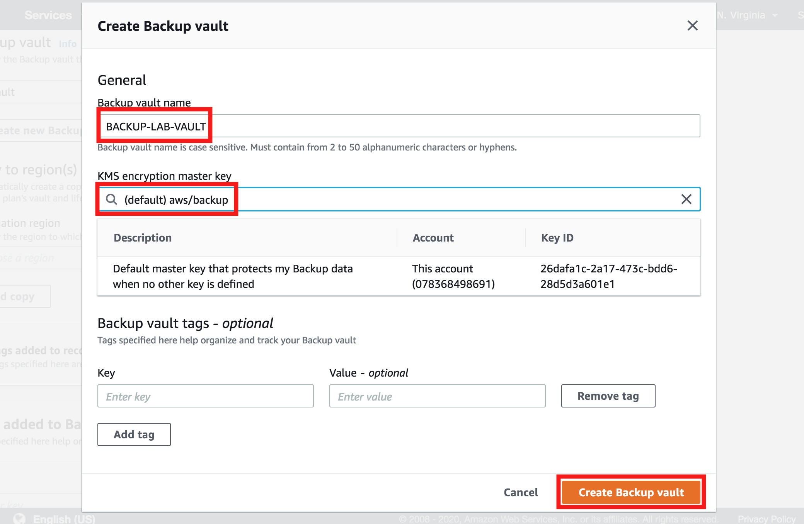

13. Additionally, you can choose to have your backups automatically copied to a different AWS Region.
14. You can add tags to your recovery points to help identify them.
15. Click **CREATE PLAN**.

Once the backup plan and the backup rule has been created, you can specify what resources should be backed up. You can select individual resources to be backed up, or specify a tag (key-value) associated with the resource. AWS Backup will execute backup jobs on all resources that match the tags specified.

1.  Click on **BACKUP PLANS** from the menu on the left side of the screen.
2.  Select the backup plan **BACKUP-LAB** that you just created.

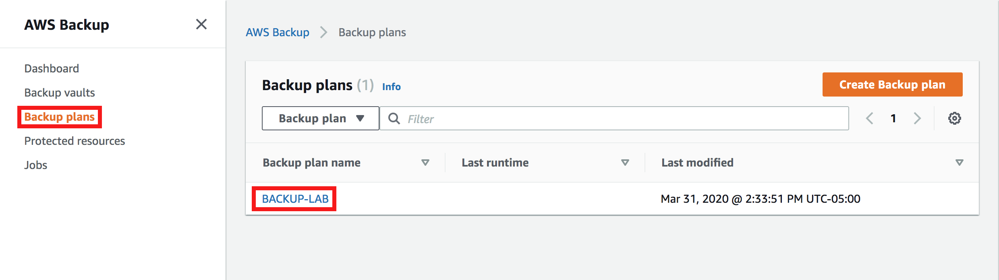

3.  Scroll down to the section titled **RESOURCE ASSIGNMENTS** and click on **ASSIGN RESOURCES**.

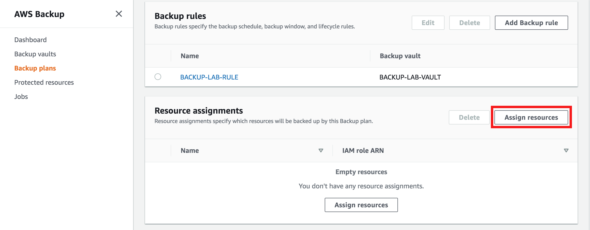

4.  Specify a **RESOURCE ASSIGNMENT NAME** such as **BACKUP-RESOURCES** to help identify the resources that are being backed up.
5.  Leave the **DEFAULT ROLE** selected for **IAM ROLE**. If a role does not already exist, the AWS Backup service will create one with the necessary permissions.
6.  Under **ASSIGN RESOURCES**, you can specify resources to be backed up individually by specifying the **RESOURCE TYPE** and **RESOURCE ID**, or select **TAGS** and enter the **TAG KEY** and the **TAG VALUE**. For this lab, select **TAGS** as the value for **ASSIGN BY**, and enter **workload** as the **KEY** and **myapp** as the **VALUE**. This tag and value was created by the CloudFormation stack. **Remember that tags are case sensitive and ensure that the values you enter are all in lower case.**
7.  Click on **ASSIGN RESOURCES**.

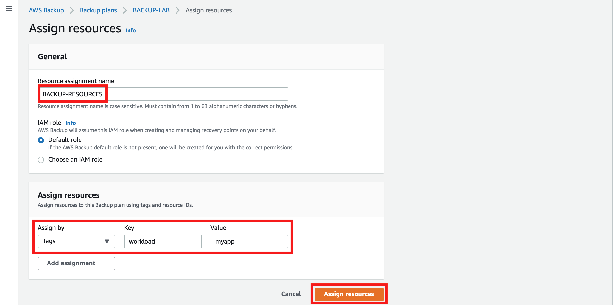

You have successfully created a backup plan for your data sources, and all supported resources with the tags **WORKLOAD-MYAPP** will be backed up automatically, at the frequency specified. In case of a disaster, these backups can be used to recover data to ensure business continuity. Since the entire process is automated, it will save considerable operational overhead for your Operations teams.

## 3. Enable Notifications 

In the cloud, setting up notifications to be aware of events within your workload is easily achieved. AWS Backup leverages AWS SNS to send notifications related to backup activities that are occurring. This will allow visibility into backup job statuses, restore job statuses, or any failures that may have occurred, allowing your Operations teams to respond appropriately.

1.  Open a terminal where you have access to the AWS CLI. Ensure that the CLI is up to date and that you have AWS Administrator Permissions to run AWS CLI commands. <https://docs.aws.amazon.com/cli/latest/userguide/cli-chap-install.html>
2.  Edit the following AWS CLI command and include the **ARN** of the **SNS TOPIC** that you created. Replace **<YOUR SNS TOPIC ARN>** with the **ARN** of the **SNS TOPIC** obtained from the outputs section of the CloudFormation Stack. **Note that the backup vault name is case sensitive.**

 `aws backup put-backup-vault-notifications --region us-east-1 --backup-vault-name BACKUP-LAB-VAULT --backup-vault-events BACKUP_JOB_COMPLETED RESTORE_JOB_COMPLETED --sns-topic-arn <YOUR SNS TOPIC ARN>`

3.  Once edited, run the above command, it will enable notifications with messages published to the **SNS TOPIC** every time a backup job is completed or a restore job is completed. This will ensure the Operations team is aware of any failures with backing up data or restoring from it.
4.  You can verify that notifications have been enabled by running the following command. The output will include a section called **SNSTopicArn** followed by the ARN of the SNS Topic that was created as part of the lab.

 `aws backup get-backup-vault-notifications --backup-vault-name BACKUP-LAB-VAULT --region us-east-1`

 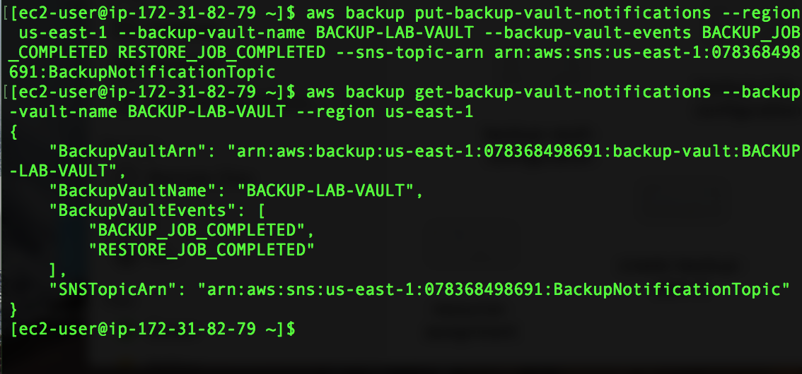

You have now successfully enabled notifications for the backup vault BACKUP-LAB-VAULT, ensuring that the Operations team is aware of all backup and restore activities involving this vault, and any failures associated with those activities.

## 4. Create a Restore Process 

A backup of a data source is useful only if data can be restored from it. If backups aren't tested, you might find yourself in a situation where your workload has been impacted by an event and you need to recover data from your backups, but the backups are faulty and restoring data is no longer feasible, or exceeds your RTO. To avoid situations like this, backups taken should always be tested to ensure they can be used to recover data.

In this lab, you will leverage Lambda to automatically test all backups created to ensure recovery is successful, and clean up any resources that were created during the restore test process to save on cost. This will ensure you are aware of any faulty backups that might be unusable to recover data from. Automating this process with notifications enabled will ensure there is minimal operational overhead and that the Operations teams are aware of backup and restore statuses.

### Testing Recovery

For the purpose of this lab, we will simulate the action performed by AWS Backup when creating backups of data sources by creating an on-demand backup to see if the backup is successful. Once the backup is completed, you will receive a notification stating that the backup job has completed and the lambda function will get invoked. The Lambda function will make API calls to start restoring data from the backup that was created. This will help ascertain that the backup is good. Once the restore process has been completed, you will receive another notification confirming this, and the lambda function will get invoked again to clean up new resources that were created as part of the restore. Once the cleanup has been completed, you will receive one last notification confirming cleanup.

1.  Use your administrator account to access the AWS Backup console - <https://us-east-1.console.aws.amazon.com/backup/home?region=us-east-1#home>
2.  Click on **CREATE AN ON-DEMAND BACKUP** in the middle of the screen.

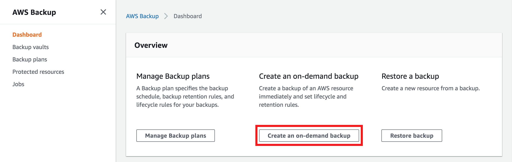

3.  Under **RESOURCE TYPE**, select **EBS**. Paste in the **Volume ID** obtained from the Output of the CloudFormation Stack.
4.  Under **BACKUP WINDOW**, ensure that the **CREATE BACKUP NOW** option is selected.

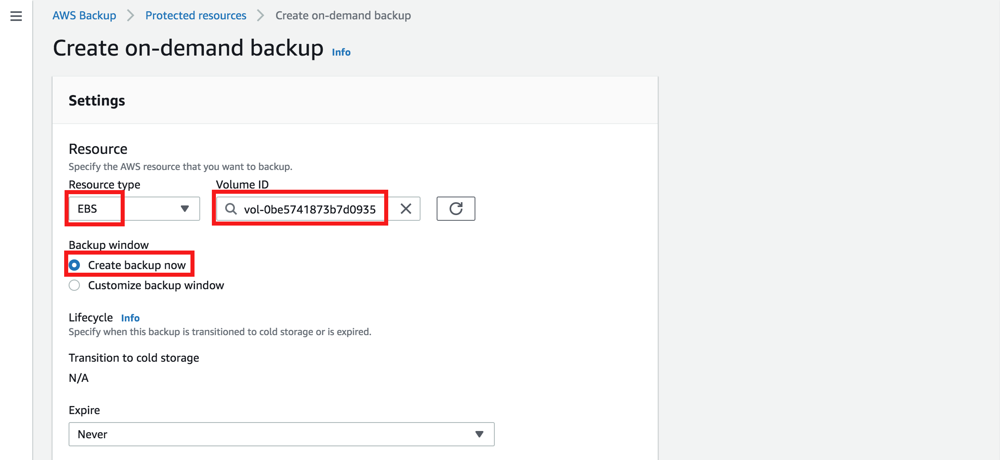

5.  Under **EXPIRE**, select the option **DAYS AFTER CREATION** and enter **1** for the value for this lab. This will ensure that the backup is deleted after 1 day.
6.  Under **Backup Vault**, select the **BACKUP-LAB-VAULT**.
7.  Leave the default IAM role selected.
8.  Click **CREATE ON-DEMAND BACKUP**.

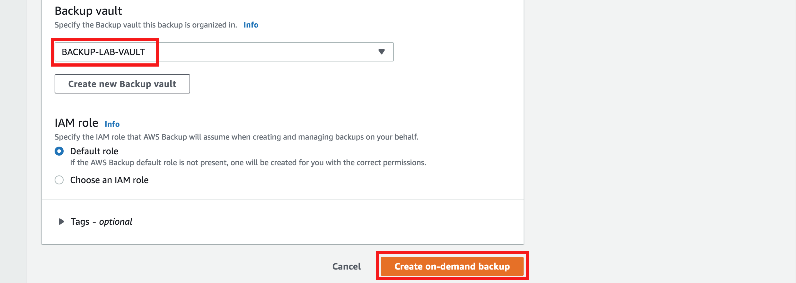

9.  Click on **JOBS** from the menu on the left and select **BACKUP JOBS**. You should see a new backup job started with the status of **RUNNING**. Click on the **RESTORE JOBS** tab, there shouldn't be any restore jobs running.

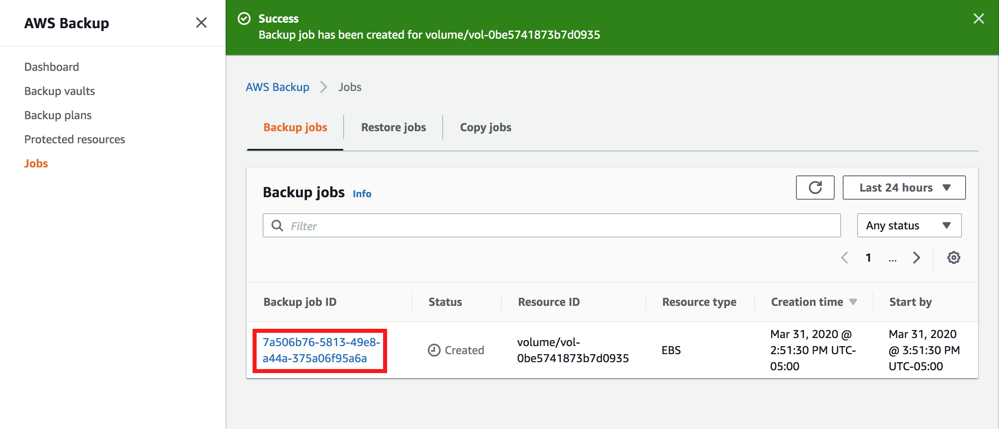

10. Periodically refresh the console until the **STATUS** changes to **COMPLETED**. It should take about 5-10 minutes to complete. While waiting for the job to finish and the notification to go out, you can review the lambda function code [here](Code/lambda_function.py) to understand what the lambda function is doing.
11. After the job is completed, click on the **JOB ID** and view the **DETAILS**. You should see the **Recovery Point ARN** that was created, the **RESOURCE ID** for which the backup was created, and the **RESOURCE TYPE** for which the backup was created.

12. Monitor your email to see if you receive a **Notification** **from AWS Backup**. Compare details in the email to what you see on the AWS Console, they should match. It takes about 10 mins for the email to show up once the backup job has completed.

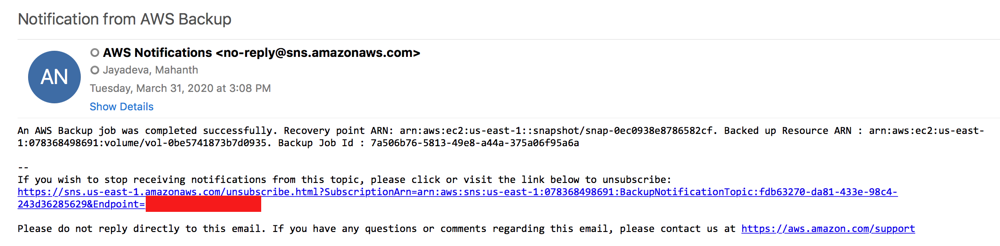

13. Go back to **JOBS** and switch to the **RESTORE JOBS** tab. You should see a **RESTORE JOB** running. The lambda function that was created as part of this lab has requested a restore job to ensure that the backup can be used to recover from.

14. Periodically refresh the console until the **STATUS** changes to **COMPLETED**. It should take about 5-10 minutes to complete.
15. After the job is completed, click on the **JOB ID** and view the **DETAILS**. You should see the **Recovery Point** **ARN** from which the restore was tested, the **RESOURCE ID** of the newly created EBS Volume, and the **RESOURCE TYPE** for which the restore was created.

16. Note down the **RESOURCE ID** of the newly created EBS Volume and verify that it exists from the EC2 Console - <https://console.aws.amazon.com/ec2/home?region=us-east-1#Volumes:sort=size>
17. Monitor your email to see if you have received a **Notification from AWS Backup** confirming the restore job was successful. Compare details in the email to what you see on the AWS Console, they should match. It takes about 10 mins for the email to show up once the restore job has completed.

18. Once it is established that the restore was successful, it is time to delete the new resource that was created to prevent unnecessary spend. This process is also automated using AWS Lambda.
19. Monitor your email to see if you have received a **Restore Test Status** notification confirming the deletion of the newly created resource. Check the EC2 Console to verify that the new EBS Volume has been deleted - <https://console.aws.amazon.com/ec2/v2/home?region=us-east-1#Volumes:sort=size>
20. Use your administrator account to access the AWS CloudWatch console - <https://console.aws.amazon.com/cloudwatch/home?region=us-east-1>
21. Click on **LOGS** from the menu on the left side.
22. For filter, paste the following string.

 `/aws/lambda/RestoreTestFunction`

23.  Click on the **LOG STREAM** and view the output of the Lambda function's execution.

### Review of Best Practices Implemented

**Identify all data that needs to be backed up and perform backups or reproduce the data from sources:** Back up important data using Amazon S3, Amazon EBS snapshots, or third-party software. Alternatively, if the data can be reproduced from sources to meet RPO, you may not require a backup.

**Perform data backup automatically or reproduce the data from sources automatically:** Automate backups or the reproduction from sources using AWS features (for example, snapshots of Amazon RDS and Amazon EBS, versions on Amazon S3, etc.), AWS Marketplace solutions, or third-party solutions.

**Perform periodic recovery of the data to verify backup integrity and processes:** Validate that your backup process implementation meets Recovery Time Objective and Recovery Point Objective through a recovery test.

## 5. Lab Cleanup 

The following instructions will remove the resources that you have created in this lab.

#### Cleaning up AWS Backup Resources

1.  Sign in to the AWS Management Console and navigate to the AWS Backup console - <https://us-east-1.console.aws.amazon.com/backup/home?region=us-east-1#home>
2.  Click on **BACKUP VAULTS** from the menu on the left side, and select **BACKUP-LAB-VAULT**.
3.  Under the section **BACKUPS**, delete all the **RECOVERY POINTS**.
4.  Once all the **RECOVERY POINTS** have been deleted, delete the **Backup Vault** by clicking on **DELETE** on the top right hand corner.
5.  Click on **BACKUP PLANS** from the menu on the left side, and select **BACKUP-LAB**.
6.  Scroll down to the section **RESOURCE ASSIGNMENTS**, and delete the resource assignment.
7.  Delete the **BACKUP PLAN** by clicking on **DELETE** on the upper right corner of the screen.

#### Cleaning up the CloudFormation Stack

1.  Sign in to the AWS Management Console and navigate to the AWS CloudFormation console - <https://console.aws.amazon.com/cloudformation/>
2.  Select the stack **WA-BACKUP-LAB**, and delete the stack.

#### Cleaning up the CloudWatch Logs

1. Sign in to the AWS Management Console, and open the CloudWatch console at [https://console.aws.amazon.com/cloudwatch/](https://console.aws.amazon.com/cloudwatch/).
2. Click **Logs** in the left navigation.
3. Click the radio button on the left of the **/aws/lambda/RestoreTestFunction**.
4. Click the **Actions Button** then click **Delete Log Group**.
5. Verify the log group name then click **Yes, Delete**.

### Thank you for using this lab.
