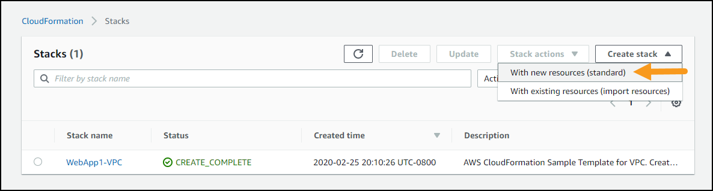

**UNDER CONSTRUCTION**

@TODO: update raw github links to master branch after merge

1. Download the CloudFormation template. (You can right-click then choose **Save link as**; or you can right click and copy the link to use with `wget`)
    * WebApp: [_staticwebapp.yaml_](https://raw.githubusercontent.com/awslabs/aws-well-architected-labs/healthchecklab/Reliability/300_Health_Checks_and_Dependencies/Code/CloudFormation/staticwebapp.yaml)

1. Go to the AWS CloudFormation console at <https://console.aws.amazon.com/cloudformation> and click **Create Stack**

1. Leave **Prepare template** setting as-is
      * 1 - For **Template source** select **Upload a template file**
      * 2 - Click **Choose file** and supply the CloudFormation template you downloaded, `staticwebapp.yaml`
       

1. Click **Next**. For **Stack name** use **`WebApp1-Website`**
    

1. On the same screen, for "Parameters" enter the appropriate values:
    * **If you are attending an in-person workshop and were provided with an AWS account by the instructor**: Leave all the parameters at their default values
    * **If you are using your own AWS account**: @TODO THIS ALL NEEDS TO CHANGE -- Set the [first three parameters using these instructions](../../common/documentation/Service_Linked_Roles.md#cfn_service_linked_roles) and leave all other parameters at their default values.
    * You optionally may review [the default values of this CloudFormation template here](Documentation/CFN_Parameters.md)

1. Click the “Next” button.
      * On the "Configure stack options" page, click “Next” again
      * On the "Review DeployResiliencyWorkshop" page, scroll to the bottom and tick the checkbox “I acknowledge that AWS CloudFormation might create IAM resources.”
      * Click the “Create stack” button.
     

1. This will take you to the CloudFormation stack status page, showing the stack creation in progress.  
    
  This will take approximately a minute to deploy.  When it shows status `CREATE_COMPLETE`, then you are finished with this step.

