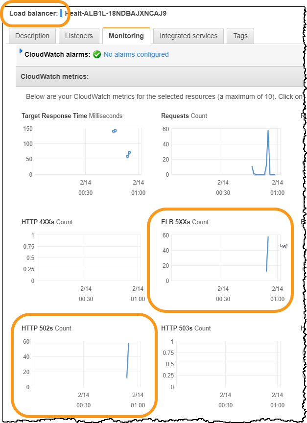
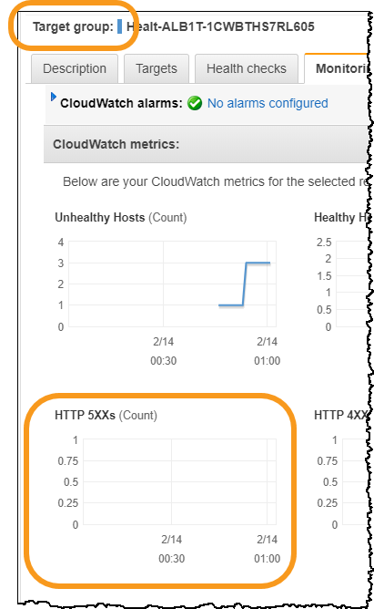
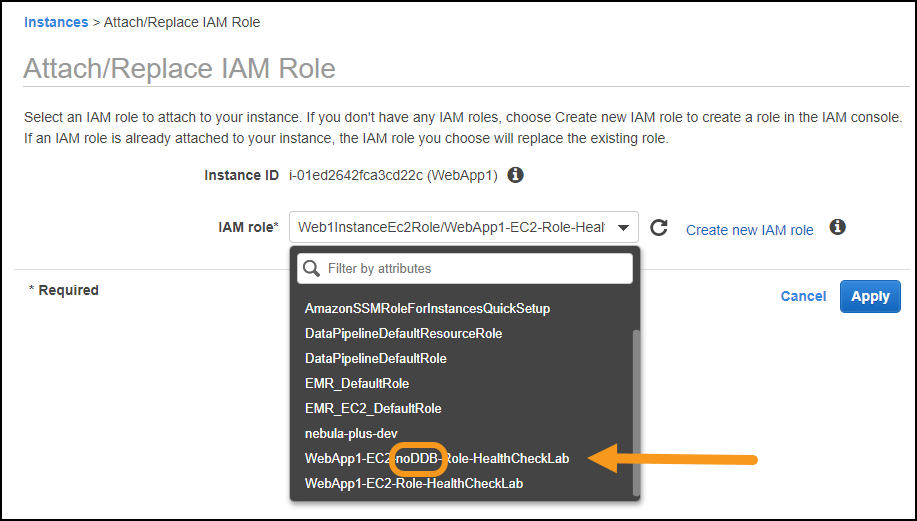

# Level 300: Implementing Health Checks and Managing Dependencies to Improve Reliability

## Author

* Seth Eliot, Reliability Lead, Well-Architected, AWS

## Amazon Builders' Library and AWS Well-Architected

This lab illustrates best practices as explained in the following:

* Amazon Builders' Library article: [Implementing health checks](https://aws.amazon.com/builders-library/implementing-health-checks/)
* [AWS Well-Architected](https://aws.amazon.com/architecture/well-architected/) Reliability pillar

## Table of Contents

1. [Deploy the application](#deploy_app)
1. [Handle failure of service dependencies](#handle_dependency)
1. [Implement deep health checks](#deep_healthcheck)
1. [Fail open when appropriate](#fail_open)
1. [Tear down this lab](#tear_down)

## 1. Deploy the application 

You will create a multi-tier architecture using AWS and run a simple service on it. The service is a web server running on Amazon EC2 fronted by an Elastic Load Balancer reverse-proxy, with a dependency on Amazon DynamoDB.

**Note**: The concepts covered by this lab apply whether your service dependency is an AWS resource like Amazon DynamoDB, or an external service called via API. The DynamoDB dependency here acts as a _mock_ for an external service called **RecommendationService**. The **getRecommendation** API of that service is a dependency for the web service used in this lab.

### 1.1 Log into the AWS console 

**If you are attending an in-person workshop and were provided with an AWS account by the instructor**:

* Follow the instructions [here for accessing your AWS account](../../common/documentation/Workshop_AWS_Account.md)

@TODO: Note to beta testers: links to relative resource like above will not work until this is part of the master branch. The above link will ultimately go [here](https://github.com/awslabs/aws-well-architected-labs/blob/master/common/documentation/Workshop_AWS_Account.md)

**If you are using your own AWS account**:

* Sign in to the AWS Management Console as an IAM user who has PowerUserAccess or AdministratorAccess permissions, to ensure successful execution of this lab.

### 1.2 Deploy the application using an AWS CloudFormation template

You will deploy the service infrastructure including simple service code and some sample data.

1. It is recommended that you use the **Ohio** region.  This region is also known as **us-east-2**, which you will see referenced throughout this lab.

      * If you choose to use a different region, you will need to ensure future steps are consistent with your region choice.

#### 1.2.1 Deploy the VPC infrastructure

* If you are comfortable deploying a CloudFormation stack, then use the **express steps** listed immediately below.
* If you need additional guidance in how to deploy a CloudFormation stack, then follow the directions for the [Automated Deployment of VPC](../../Security/200_Automated_Deployment_of_VPC/Lab_Guide.md) lab, and then return here for the next step: **1.2.2 Deploy the web service infrastructure and service**

##### Express Steps (Deploy the VPC infrastructure)

1. Download the [_vpc-alb-app-db.yaml_](https://raw.githubusercontent.com/awslabs/aws-well-architected-labs/master/Security/200_Automated_Deployment_of_VPC/Code/vpc-alb-app-db.yaml) CloudFormation template
1. Create a CloudFormation stack uploading this CloudFormation Template
1. For **Stack name** use **`WebApp1-VPC`** (case sensitive)
1. Leave all  CloudFormation Parameters at their default values
1. Click **Next** until the last page
1. At the bottom of the page, select **I acknowledge that AWS CloudFormation might create IAM resources with custom names**
1. Click **Create stack**

#### 1.2.2 Deploy the web service infrastructure and service

Wait until the VPC CloudFormation stack **status** is _CREATE_COMPLETE_, then continue.

* If you are comfortable deploying a CloudFormation stack, then use the **express steps** listed immediately below.
* If you need additional guidance in how to deploy a CloudFormation stack, then follow the directions for the [Create an AWS CloudFormation Stack from a template](../Documentation/CFNCreateStack.md) lab, and then return here for the next step: **1.3 View the website for web service**

##### Express Steps (Deploy the WebApp infrastructure and service)

1. Download the [_staticwebapp.yaml_](https://raw.githubusercontent.com/awslabs/aws-well-architected-labs/healthchecklab/Reliability/300_Health_Checks_and_Dependencies/Code/CloudFormation/staticwebapp.yaml) CloudFormation template
1. Create a CloudFormation stack uploading this CloudFormation Template
1. For **Stack name** use **`HealthCheckLab`**
1. Leave all  CloudFormation Parameters at their default values
1. Click **Next** until the last page
1. At the bottom of the page, select **I acknowledge that AWS CloudFormation might create IAM resources with custom names**
1. Click **Create stack**

@TODO: update raw github links to master branch after merge

### 1.3 View the website for web service 

1. Go to the AWS CloudFormation console at <https://console.aws.amazon.com/cloudformation>.
      * Wait until **HealthCheckLab** stack **status** is _CREATE_COMPLETE_ before proceeding. This should take about four minutes
      * Click on the **HealthCheckLab** stack
      * Click on the **Outputs** tab
      * For the Key **WebsiteURL** copy the value.  This is the URL of your test web service
          * _Hint_: it will start with _`http://healt-alb`_ and end in _`<aws region>.elb.amazonaws.com`_

1. Click the URL and it will bring up the website:  
      

1. The website simulates a recommendation engine making personalized suggestions for classic television shows. You should note the following features:
      * Area A shows the personalized recommendation
          * It shows first name of the user and the show that was recommended
          * The workshop simulation is simple. On every request it chooses a user at random, and shows a recommendation statically mapped to that user. The user names, show names, and this mapping are in a DynamoDB table, which is simulating the **RecommendationService**
      * Area B shows metadata which is useful to you during the lab
          * The **instance_id** and **availability_zone** enable you to see which EC2 server and Availability Zone were used for each request
          * There is one EC2 instance deployed per Availability Zone
          * Refresh the website several times, note that the EC2 instance and Availability Zone change from among the three available
          * This is Elastic Load Balancing (ELB) distributing these stateless requests among the available EC2 server instances across Availability Zones

    |Well-Architected for Reliability: Elastic Load Balancing (ELB)|
    |:---:|
    |Provides load balancing across Availability Zones, performs Layer 7 routing, integrates with AWS WAF, and integrates with Auto Scaling to help create a self-healing infrastructure and absorb increases in traffic while releasing resources when traffic decreases.|

    |Well-Architected for Reliability: Best practices|
    |:--:|
    |**Implement loosely coupled dependencies**: Dependencies such as queuing systems, streaming systems, workflows, and load balancers are loosely coupled|
    |**Deploy the workload to multiple locations**: Distribute workload load across multiple Availability Zones and AWS Regions. These locations can be as diverse as needed.|

## 2. Handle failure of service dependencies 

### 2.1 System initially healthy

1. You already observed that all three EC2 instances are successfully serving requests
1. In a new tab navigate to ELB Target Groups console
      * By [clicking here to open the AWS Management Console](http://console.aws.amazon.com/ec2/v2/home?region=us-east-2#TargetGroups:)
      * _or_ navigating through the AWS Management Console: **Services** > **EC2** > **Load Balancing** > **Target Groups**
      * Leave this tab open as you will be referring back to it multiple times
1. Click on the **Targets** tab (bottom half of screen)
1. Under **Registered Targets** observe the three EC2 instances serving your web service
1. Note that they are all _healthy_ (see **Status** and **Description**)
      * In this state the ELB will route traffic to any of the three servers

    

### 2.2 Simulate dependency not available

#### 2.2.1 Disable RecommendationService

You will now simulate a complete failure of the **RecommendationService**. Every request in turn makes a (simulated) call to the **getRecommendation** API on this service. These will all fail for every request on every server.

1. In a new tab, navigate to the Parameter Store on the AWS Systems Manager console
      * By [clicking here to open the AWS Management Console](https://console.aws.amazon.com/systems-manager/parameters)
      * _or_ navigating through the AWS Management Console: **Services** > **Systems Manager** > **Parameter Store**
      * Leave this tab open as you will be referring back to it one additional time
1. Click on **RecommendationServiceEnabled**
1. Click **Edit**
1. In the **Value** box, type **false**
1. Click **Save Changes**
      * A status message should say _Edit parameter request succeeded_

The **RecommendationServiceEnabled** parameter is used only for this lab. The server code reads its value, and simulates a failure in **RecommendationService** (all reads to the DynamoDB table simulating the service will fail) when it is **false**.

#### 2.2.2 Observe behavior when dependency not available

1. Refresh the test web service multiple times
      * Note that it fails with _502 Bad Gateway_
      * For each request one of the servers receiving the request attempts to call the **RecommendationService** but catastrophically fails and fails to return a reply (empty reply) to the load balancer, which interprets it as a http 502 failure.
1. You can observe this by opening a new tab and navigating to ELB Load Balancers console:
      * By [clicking here to open the AWS Management Console](http://console.aws.amazon.com/ec2/v2/home?region=us-east-2#LoadBalancers:)
      * _or_ navigating through the AWS Management Console: **Services** > **EC2** > **Load Balancing** > **Load Balancers**
1. Click on the **Monitoring** tab (bottom half of screen)
      * Observe the **ELB 5XXs (Count)** and **HTTP 502s (Count)** errors for the load balancer
      * It will take a minute for the metrics to show up.  Make sure you refresh the web service multiple times.
      * These are the error codes the load balancer returns on every request during this simulated outage

      

1. Compare these metrics to those for the target group (the EC2 servers)
      * Return to the **Target Groups** console and click the **Monitoring** tab there
      * Observe **HTTP 5XXs ( Count )** errors shows no data
      * The servers themselves are not returning actual http error codes, they are failing to return any data

      

1. Return to the tab with the ELB Target Groups console.  Note that all instances are _unhealthy_ with **Description** _Health checks failed with these codes: \[502\]_
1. From here click on the **Health checks** tab.  The health check returns _healthy_ when it received a http 200 response on the same port and path as our browser requests.

### 2.3 Update server code to handle dependency not available

The **getRecommendation** API is actually a `get_item` call on a DynamoDB table. Examine the server code to see how errors are currently handled

1. The server code running on each EC2 instance [can be viewed here](https://github.com/awslabs/aws-well-architected-labs/blob/healthchecklab/Reliability/300_Health_Checks_and_Dependencies/Code/Python/server_basic.py) (@TODO update to master branch)
1. Search for `get_item`. What happens if this call fails?
1. Choose _one_ of the options below (**Option 1 - Expert** or **Option 2 - Assisted**) to improve the code and handle the failure

#### 2.3.1 Option 1 - Expert option: make and deploy your changes to the code

@TODO instructions on how to update and deploy the code to a http/https readable location. List the requirements: Return static response (use recommendation_message); show diagnostic info

If you completed the **Expert option**, then skip the **Assisted option** section

#### 2.3.2 Option 2 - Assisted option: deploy workshop provided code

1. The new server code including error handling [can be viewed here](https://github.com/awslabs/aws-well-architected-labs/blob/healthchecklab/Reliability/300_Health_Checks_and_Dependencies/Code/Python/server_errorhandling.py) (@TODO update to master branch)
1. Search for `Error handling` in the comments (occurs twice). What will this code do now if the dependency call fails?

##### Deploy the new error handling code

1. Navigate to the AWS CloudFormation console
1. Click on the **HealthCheckLab** stack
1. Click **Update**
1. Leave **Use current template** selected and click **Next**
1. Find the **ServerCodeUrl** parameter and enter the following:

        https://aws-well-architected-labs-ohio.s3.us-east-2.amazonaws.com/Healthcheck/Code/server_errorhandling.py

1. Click **Next** until the last page
1. At the bottom of the page, select **I acknowledge that AWS CloudFormation might create IAM resources with custom names**
1. Click **Update stack**
1. Click on **Events**, and click the refresh icon to observe the stack progress
      * New EC2 instances running the error handling code are being deployed
      * When stack **status** is _CREATE_COMPLETE_ (about four minutes) then continue

@TODO consider server_errorhandling.py link to read from raw github instead of S3

#### 2.3.3 Error handling code

This is the error handling code from [_server_errorhandling.py_](https://github.com/awslabs/aws-well-architected-labs/blob/healthchecklab/Reliability/300_Health_Checks_and_Dependencies/Code/Python/server_errorhandling.py). The **Assisted option** uses this code. If you used the **Expert option**, you can consult this code as a guide.

Click here to see code

      # Error handling:
      # surround the call to RecommendationService in a try catch
      try:

          # Call the getRecommendation API on the RecommendationService
          response = call_getRecommendation(self.region, user_id)

          # Parses value of recommendation from DynamoDB JSON return value
          # {'Item': {
          #     'ServiceAPI': {'S': 'getRecommendation'}, 
          #     'UserID': {'N': '1'}, 
          #     'Result': {'S': 'M*A*S*H'},  ...
          tv_show = response['Item']['Result']['S']
          user_name = response['Item']['UserName']['S']
          message += recommendation_message (user_name, tv_show, True)

      # Error handling:
      # If the service dependency fails, and we cannot make a personalized recommendation
      # then give a pre-selected (static) recommendation
      # and report diagnostic information
      except Exception as e:
          message += recommendation_message ('Valued Customer', 'I Love Lucy', False)
          message += '   <h2>Diagnostic Info:</h2>'
          message += ' We are unable to provide personalized recommendations'
          message += ' If this persists, please report the following info to us:'
          message += str(traceback.format_exception_only(e.__class__, e))

#### 2.3.4 Observe behavior of web service with added error handling

1. After new code has successfully deployed, refresh the test web service multiple times. Observe:
      * It works. It no longer returns an error
      * All three EC2 instances and Availability Zones are being used
      * A default recommendation for **Valued Customer** is displayed instead of a user personalized one
      * There is now **Diagnostic Info**. What does it mean?
      * Check health status on the ELB Target Groups console (remember to refresh). What do those health checks now show?
1. Refer back to the newly deployed code to understand why the website behaves this way now

The Website is working again, but in a degraded capacity since it is no longer serving personalized recommendations. While this is less than ideal, it is much better than when it was failing with http 502 errors. The **RecommendationService** is not available, so the app instead returns a _static response_ (the default recommendation) instead of the data it would have obtained from **RecommendationService**.

|Well-Architected for Reliability: Best practice|
|:--:|
|**Implement graceful degradation to transform applicable hard dependencies into soft dependencies**: When a component's dependencies are unhealthy, the component itself does not report as unhealthy. It can continue to serve requests in a degraded manner.|

## 3. Implement deep health checks 

### 3.1 Re-enable the dependency service

For the next part of the lab restore access to the **getRecommendation** API on the **RecommendationService**

1. Return to the **AWS Systems Manager** > **Parameter Store** on the AWS Management Console
2. Set the value of **RecommendationServiceEnabled** back to **true** and **Save changes**
3. Confirm the web service is now returning "personalized" recommendations again

### 3.2 Inject fault on one of the servers 

Previously you simulated a failure of the service dependency. Now you will simulate a failure on a single server (of the three servers running). You will simulate a fault on this server that prevents only it from calling the otherwise healthy service dependency.

1. Navigate to the [EC2 Instances console](https://console.aws.amazon.com/ec2/v2/home?LoadBalancers:&region=us-east-2#Instances:)
      * There should be three EC2 instances with **Instance State** _running_, one in each Availability Zone (they will have **Name** _WebApp1_)
      * Click the gear icon in the upper-right and select **IAM Instance Profile Name** (in addition to what is already selected)
1. Select only the EC2 instance in **Availability Zone** _us-east-2c_
1. Click **Action** > **Instance Settings** > **Attach/Replace IAM Role**
1. From **IAM role**, click **WebApp1-EC2-noDDB-Role-HealthCheckLab**

      

1. Click **Apply**
1. Click **Close**
1. This will return you to the EC2 Instances console. Observe under **IAM Instance Profile Name** (it is one of the displayed columns) which IAM roles each EC2 instance has attached

The IAM role attached to an EC2 instance determines what permissions it has to access AWS resources. You changed the role of the us-east-2c instance to one that is almost the same as the other two, except it does not have access to DynamoDB. Since DynamoDB is used to mock our service dependency the us-east-2c server no longer has access to the service dependency (**RecommendationService**). Stale credentials is an actual fault that servers might experience. Your actions above simulate stale (invalid) credentials on the us-east-2c server.

### 3.4 Observe application behavior and determine how to fix it

* Observe the website behavior now
    * Refresh the website multiple times noting which Availability Zone the serving the request
    * The servers in us-east-2a and us-east-2b continue to function normally
    * The server in us-east-2c still succeeds, but it uses the static response. Why is this?
* The service dependency (**RecommendationServiceEnabled**) is still healthy
* It is the server in us-east-2c that is unhealthy - it has stale credentials
    * Return to the **Target Groups** and under the **Targets** tab observe the results of the ELB health checks
    * They are all **Status** _healthy_, and are therefore all receiving traffic
* The service would deliver a better experience if it:
    * Identified the us-east-2c server as unhealthy and did not route traffic to it
    * Replaced this server with a healthy one

    |Well-Architected for Reliability: Recovery-Oriented Computing (ROC)|
    |:---:|
    |In systems that apply a recovery-oriented approach, many different categories of failures are mapped to the same recovery strategy.  An instance may fail due to hardware failure, operating system bug, memory leak, or other causes. Rather than building custom remediation for each, treat any as an instance failure, terminate the instance, and replace the instance.|

* From the **Target Groups** console click on the  the **Health checks** tab
    * The ELB health check is configured to return _healthy_ when it receives an http 200 response on the same port and path as our browser requests
    * Since the server code handles the dependency access error, the _bad_ server still returns http 200 (with its default static response)

### 3.4 Create a deep healthcheck to identify bad servers

* Update server code to add a deep health check response
    * You will create and configure a new health check that will include a check on whether the server can access its dependency
    * This is a _deep health check_ -- it checks the actual function of the server including the ability to call service dependencies
* This will be implemented in two steps:
    1. Update the server code
    1. Reconfigure Elastic Load Balancer (ELB) to use the new deep health check

Choose _one_ of the options below (**Option 1 - Expert** or **Option 2 - Assisted**) to improve the code and add the deep health check.  Then continue to the next step [Reconfigure Elastic Load Balancer (ELB)](#reconfigure_elb).

#### 3.4.1 Option 1 - Expert option: make and deploy your changes to the code

@TODO instructions on how to update and deploy the code to a http/https readable location on path /healthcheck - list the requirements: return 503

If you completed the **Expert option**, then skip the **Assisted option** section

#### 3.4.2 Option 2 - Assisted option: deploy workshop provided code

1. The new server code including error handling [can be viewed here](https://github.com/awslabs/aws-well-architected-labs/blob/healthchecklab/Reliability/300_Health_Checks_and_Dependencies/Code/Python/server_healthcheck.py) (@TODO update to master branch)
1. Search for `Healthcheck request` in the comments. What will this code do now if called on this health check URL?

##### Deploy the new health check code

1. Navigate to the AWS CloudFormation console
1. Click on the **HealthCheckLab** stack
1. Click **Update**
1. Leave **Use current template** selected and click **Next**
1. Find the **ServerCodeUrl** parameter and enter the following:

        https://aws-well-architected-labs-ohio.s3.us-east-2.amazonaws.com/Healthcheck/Code/server_healthcheck.py

1. Click **Next** until the last page
1. At the bottom of the page, select **I acknowledge that AWS CloudFormation might create IAM resources with custom names**
1. Click **Update stack**
1. Click on **Events**, and click the refresh icon to observe the stack progress
      * New EC2 instances running the error handling code are being deployed
      * When stack **status** is _CREATE_COMPLETE_ (about four minutes) then continue

@TODO consider server_healthcheck.py link to read from raw github instead of S3

#### 3.4.3 Health check code

This is the health check code from [server_healthcheck.py_](https://github.com/awslabs/aws-well-architected-labs/blob/healthchecklab/Reliability/300_Health_Checks_and_Dependencies/Code/Python/server_healthcheck.py). The **Assisted option** uses this code. If you used the **Expert option**, you can consult this code as a guide.

Click here to see code

      # Healthcheck request - will be used by the Elastic Load Balancer
      elif self.path == '/healthcheck':

          is_healthy = False
          error_msg = ''
          TEST = 'test'

          # Make a request to RecommendationService using a predefined 
          # test call as part of health assessment for this server
          try:
              # call RecommendationService using the test user
              user_id = str(0)
              response = call_getRecommendation(self.region, user_id)

              # Parses value of recommendation from DynamoDB JSON return value
              tv_show = response['Item']['Result']['S']
              user_name = response['Item']['UserName']['S']
              
              # Server is healthy of RecommendationService returned the expected response
              is_healthy = (tv_show == TEST) and (user_name == TEST)

          # If the service dependency fails, capture diagnostic info
          except Exception as e:
              error_msg += str(traceback.format_exception_only(e.__class__, e))

          # Based on the health assessment
          # If it succeeded return a healthy code
          # If it failed return a server failure code            
          message = ""
          if (is_healthy):
              self.send_response(200)
              self.send_header('Content-type', 'text/html')
              self.end_headers()

              message += "<h1>Success</h1>"

              # Add metadata
              message += get_metadata()

          else:
              self.send_response(503)
              self.send_header('Content-type', 'text/html')
              self.end_headers()

              message += "<h1>Fail</h1>"
              message += "<h3>Error message:</h3>"
              message += error_msg

              # Add metadata
              message += get_metadata()            

          self.wfile.write(
              bytes(
                  html.format(Title="healthcheck", Content=message),
                  "utf-8"
              )
          )

#### 3.4.4 Reconfigure Elastic Load Balancer (ELB) to use the new deep health check 

1. From the **Target Groups** console click on the the **Health checks** tab
1. Click **Edit health check**
1. For **Path** enter **/healthcheck** (case-sensitive; and be sure to include the **/**)
1. Click **Save**
1. Click the **Targets** tab so you can monitor health check status

#### 3.4.5 Observe behavior of web service with added deep health check

* Continue the lab then the **HealthCheckLab** CloudFormation stack is complete.

The CloudFormation stack update reset the EC2 instance IAM roles, so the system is back to its original no-fault state. You will re-introduce the single-server fault and observe the new behavior.

1. Refresh the web service multiple times and note it is functioning without error
1. Copy the URL of the web service to a new tab and append `/healthcheck` to the end of the URL
      * The new URL should look like `http://healt-alb1l-<...>.elb.amazonaws.com/healthcheck`
      * Refresh several times and observe the health check on the three servers
      * Note the check is successful
      * Go to the **Target Groups** console click on the **Targets** tab and note the health status as per the ELB health checks.
1. To re-introduce the stale credentials fault, again change the IAM role for the EC2 instance in us-east-2c to **WebApp1-EC2-noDDB-Role-HealthCheckLab**
      * See [3.2 Inject fault on one of the servers](#change_role) if you need a reminder of how to do this.
1. Go to the **Target Groups** console click on the **Targets** tab and note the health status as per the ELB health checks (remember to refresh)
      * Note that the server in us-east-2c is now failing the health check with a http code 503 Service Not Available
      * The ELB has identified the us-east-2c server as unhealthy and will not route traffic to it
      * This is known as _fail-closed_ behavior

          

1. Refresh the web service multiple times and note it is however still functioning without error
      * And unlike before it is no longer returning a static response - it only returns personalized recommendations
      * Note that only the servers in us-east-2a and us-east-2b are serving requests

    |Well-Architected for Reliability: Best practices|
    |:--:|
    |**Automate healing on all layers**: Use automated capabilities upon detection of failure to perform an action to remediate.|
    |**Monitor all layers of the workload to detect failures**: Continuously monitor the health of your system and report degradation as well as complete failure.|

    |Well-Architected for Reliability: Health Checks|
    |:---:|
    |The load balancer will only route traffic to healthy application instances. The health check needs to be at the data plane/application layer indicating the capability of the application on the instance. This check should not be against the control plane. A health check URL for the web application will be present and configured for use by the load balancer|

##### Repair the server

1. Navigate to the EC2 Instances console and select only the instance in us-east-2c
1. Click **Action** > **Instance State** > **Terminate**
1. Click **Yes, Terminate**
      * The EC2 instance will shut down
      * Amazon EC2 Auto Scaling will recognize there are less then the three Desired Capacity and will start up a new EC2 instance
      * The new instance replaces the one with the stale credentials fault, and loads fresh credentials
1. From the **Target Groups** console **Targets** tab note the health check status of the new server in us-east-2c
      * The new instance in us-east-2c will first show **Description** _Target registration is in progress_
      * Then **Description** is _This target is currently passing target group's health checks_, then you may continue the workshop
      * (The **Description** may show _Health checks failed with these codes: [502]_, before getting to a healthy state. This is expected as the server initializes)
      * From the time you terminate the EC2 instance, it will take four to five minutes to get the new EC2 instance up and in a healthy state
1. Refresh the web service multiple times and note that personalized recommendations are once again being served from all three servers

## 4. Fail open when appropriate

### 4.1 Disable RecommendationService again

1. Confirm the service is healthy
      * Refresh the web service multiple times and note that personalized recommendations are being served from all three servers
1. You will now simulate another complete failure of the **RecommendationService**. Every request will fail for every request on every server
      * Return to the **AWS Systems Manager** > **Parameter Store** on the AWS Management Console
      * Set the value of **RecommendationServiceEnabled** once again to **false** and **Save changes**

What is the expected behavior? The previous time you simulated a complete failure of the **RecommendationService**

* The web service failed with a http 502 error
* Then you implemented error handling and the following were observed
    * The service returned a static response (as per the error handling code)
    * Since the AWS Elastic Load Balancer at that time was configured to look for http 200 on the same path as the service request, it reported _healthy_ status for all servers

Now, with the new deep health check in place...

* What status do you expect the elastic load balancer to report for the servers?
* How will the AWS Elastic Load Balancer handle traffic routing to the servers?

### 4.2 Observe fail-open behavior

1. Refresh the web service multiple times
      * Note that the service does not fail
      * But as expected (without access to **RecommendationServiceEnabled**) it serves static responses
1. Refresh the health check URL multiple times
      * The deep health detects that **RecommendationServiceEnabled** is not available and returns a failure code for all servers
1. From the **Target Groups** console **Targets** tab note the health check status of all the servers (you may need ot refresh)
      * They all report _unhealthy_ with http code 503. This is the code the deep health check is configured to return
      * Note the message at the top of the tab (if you do not see a message, try refreshing the entire page using the _browser_ refresh function)

          

          |The Amazon Builders' Library: Implementing health checks|
          |:---:|
          |When an individual server fails a health check, the load balancer stops sending it traffic. But when all servers fail health checks at the same time, the load balancer fails open, allowing traffic to all servers.|
          |When we rely on fail-open behavior, we make sure to test the failure modes of the dependency heath check.|

The AWS Application Load Balancer here exhibits this fail-open behavior and the service continues to serve requests instead of failing.

* Reset the value of **RecommendationServiceEnabled**  to **true** and observe that the service resumes serving personalized recommendations.

## 5. Tear down this lab 

**If you are attending an in-person workshop and were provided with an AWS account by the instructor**:

* There is no need to tear down the lab. Feel free to continue exploring. Log out of your AWS account when done.

**If you are using your own AWS account**:

* You may leave these resources deployed for as long as you want. When you are ready to delete these resources, see the following instructions

### Remove AWS CloudFormation provisioned resources

Click here to see detailed instruction on how to delete a CloudFormation stack

#### How to delete an AWS CloudFormation stack

1. Go to the AWS CloudFormation console: <https://console.aws.amazon.com/cloudformation>
1. Select the CloudFormation stack to delete and click **Delete**
1. In the confirmation dialog, click **Delete stack**
1. The _Status_ changes to **DELETE_IN_PROGRESS**
1. Click the refresh button to update and status will ultimately progress to **DELETE_COMPLETE**
1. When complete, the stack will no longer be displayed. To see deleted stacks use the drop down next to the Filter text box.
1. To see progress during stack deletion
      * Click the stack name
      * Select the Events column
      * Refresh to see new events

#### Delete workshop CloudFormation stacks

1. First delete the **HealthCheckLab** CloudFormation stack
1. Wait for the **HealthCheckLab** CloudFormation stack to complete (it will no longer be shown on the list of actice stacks)
1. Then delete the **WebApp1-VPC** CloudFormation stack

### Remove CloudWatch logs

After deletion of the **WebApp1-VPC** CloudFormation stack is complete then delete the CloudWatch Logs:

1. Open the CloudFormation console at [https://console.aws.amazon.com/cloudwatch/](https://console.aws.amazon.com/cloudwatch/).
1. Click **Logs** in the left navigation.
1. Click the radio button on the left of the **WebApp1-VPC-VPCFlowLogGroup-\<some unique ID\>**.
1. Click the **Actions Button** then click **Delete Log Group**.
1. Verify the log group name then click **Yes, Delete**.

---

## References & useful resources

* [Patterns for Resilient Architecture — Part 3](https://medium.com/@adhorn/patterns-for-resilient-architecture-part-3-16e8601c488e)
* Amazon Builders' Library: [Implementing health checks](https://aws.amazon.com/builders-library/implementing-health-checks/)
* [Well-Architected Framework](https://aws.amazon.com/architecture/well-architected/) (see the Reliability pillar)
* [Well-Architected best practices for reliability](https://wa.aws.amazon.com/wat.pillar.reliability.en.html)
* @TODO more

---

## License

### Documentation License

Licensed under the [Creative Commons Share Alike 4.0](https://creativecommons.org/licenses/by-sa/4.0/) license.

### Code License

Licensed under the Apache 2.0 and MITnoAttr License.

Copyright 2020 Amazon.com, Inc. or its affiliates. All Rights Reserved.

Licensed under the Apache License, Version 2.0 (the "License"). You may not use this file except in compliance with the License. A copy of the License is located at

<https://aws.amazon.com/apache2.0/>

or in the ["license" file](../../LICENSE-Apache) accompanying this file. This file is distributed on an "AS IS" BASIS, WITHOUT WARRANTIES OR CONDITIONS OF ANY KIND, either express or implied. See the License for the specific language governing permissions and limitations under the License.
