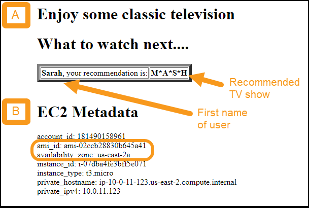

# Level 300: Implementing Health Checks and Managing Dependencies to Improve Reliability

## Author

* Seth Eliot, Reliability Lead, Well-Architected, AWS

## Amazon Builders' Library

* This lab follows best practices as described in the Amazon Builders' Library article: [Implementing health checks](https://aws.amazon.com/builders-library/implementing-health-checks/)

## Table of Contents

1. [Deploy the Application](#deploy_app)
1. [Handle Failure of Service Dependencies](#handle_dependency)
1. [Implement Deep Healthchecks](#deep_healthcheck)
1. [Fail Open when Appropriate](#fail_open)
1. [Tear down this lab](#tear_down)

## 1. Deploy the Application 

You will create a multi-tier architecture using AWS and run a simple service on it. The service is a web server running on Amazon EC2 fronted by an Elastic Load Balancer reverse-proxy, with a dependency on Amazon DynamoDB.

**Note**: The concepts covered by this lab apply whether your service dependency is an AWS resource like Amazon DynamoDB, or another service called via API. The DynamoDB dependency therefore acts as a _mock_ for the **RecommendationService** (**getRecommendation** API) dependency in this lab.

### 1.1 Log into the AWS console 

**If you are attending an in-person workshop and were provided with an AWS account by the instructor**:

* Follow the instructions [here for accessing your AWS account](../../common/documentation/Workshop_AWS_Account.md)

@TODO: if we do not need credentials, remove the following

* **Note**: As part of these instructions you are directed to copy and save **AWS credentials** for your account. Please do so as you will need them later

**If you are using your own AWS account**:

* Sign in to the AWS Management Console as an IAM user who has PowerUserAccess or AdministratorAccess permissions, to ensure successful execution of this lab.
* You will need the AWS credentials, `AWS_ACCESS_KEY_ID` and `AWS_SECRET_ACCESS_KEY`, of this IAM user for later use in this lab.
    * If you do not have this IAM user's credentials or you wish to create a new IAM user with needed permissions, follow the [instructions here to create them](Documentation/Self_AWS_Account.md)

### 1.2 Deploy the application using an AWS CloudFormation template

You will the service infrastructure including simple service code and some sample data.

@TODO: update raw github links to master branch after merge

1. It is recommended that you use the **Ohio** region.  This region is also known as **us-east-2**, which you will see referenced throughout this lab.

      * If you choose to use a different region, you will need to ensure future steps are consistent with your region choice.

#### 1.2.1 Deploy the VPC infrastructure

* If you are comfortable deploying a CloudFormation stack, then use the **express steps** listed immediately below.
* If you need additional guidance in how to deploy a CloudFormation stack, then follow the directions for the [Automated Deployment of VPC](../../Security/200_Automated_Deployment_of_VPC/Lab_Guide.md) lab, and then return here for the next step: **1.2 Deploy the WebApp infrastructure and service**

##### Express Steps (Deploy the VPC infrastructure)

1. Download the [_vpc-alb-app-db.yaml_](https://raw.githubusercontent.com/awslabs/aws-well-architected-labs/master/Security/200_Automated_Deployment_of_VPC/Code/vpc-alb-app-db.yaml) CloudFormation template
1. Create a CloudFormation stack uploading this CloudFormation Template
1. For **Stack name** use **`WebApp1-VPC`** (case sensitive)
1. Leave all  CloudFormation Parameters at their default values
1. Click **Next** until the last page
1. At the bottom of the page, select **I acknowledge that AWS CloudFormation might create IAM resources with custom names**
1. Click **Create stack**

#### 1.2.2 Deploy the WebApp infrastructure and service

Wait until the VPC CloudFormation stack **status** is _CREATE_COMPLETE_, then continue.

* If you are comfortable deploying a CloudFormation stack, then use the **express steps** listed immediately below.
* If you need additional guidance in how to deploy a CloudFormation stack, then follow the directions for the [Create an AWS CloudFormation Stack from a template](../Documentation/CFNCreateStack.md) lab, and then return here for the next step: **1.3 XXXXXXXXXX**

##### Express Steps (Deploy the WebApp infrastructure and service)

1. Download the [_staticwebapp.yaml_](https://raw.githubusercontent.com/awslabs/aws-well-architected-labs/healthchecklab/Reliability/300_Health_Checks_and_Dependencies/Code/CloudFormation/staticwebapp.yaml) CloudFormation template
1. Create a CloudFormation stack uploading this CloudFormation Template
1. For **Stack name** use **`HealthCheckLab`**
1. Leave all  CloudFormation Parameters at their default values
1. Click **Next** until the last page
1. At the bottom of the page, select **I acknowledge that AWS CloudFormation might create IAM resources with custom names**
1. Click **Create stack**

### 1.3 View website for test web service 

1. Go to the AWS CloudFormation console at <https://console.aws.amazon.com/cloudformation>.
      * Wait until **HealthCheckLab** stack **status** is _CREATE_COMPLETE_ before proceeding. This should take about four minutes
      * Click on the **HealthCheckLab** stack
      * Click on the "Outputs" tab
      * For the Key **WebsiteURL** copy the value.  This is the URL of your test web service.
          * _Hint_: it will end in _`<aws region>.elb.amazonaws.com`_

1. Click the URL and it will bring up the website:  
      

1. The website simulates a recommendation engine making personalized suggestions for classic television shows. PlYou should note:
      * Area A shows the personalized recommendation
          * It shows first name of the user and the show that was recommended
          * The workshop simulation is simple. On every request it chooses a user at random, and shows a recommendation statically mapped to that user. The user names, show names, and this mapping are in a DynamoDB table, which is simulating the **RecommendationService**
      * Area B shows metadata which is useful to you during the lab
          * The **instance_id** and **availability_zone** enable you to see which EC2 server and Availability Zone were used for each request
          * There is one EC2 instance deployed per Availability Zone
          * Refresh the website several times, note that the EC2 instance and Availability Zone change from among the three available
          * This is Elastic Load Balancing (ELB) distributing these stateless requests among the available EC2 server instances across Availability Zones

    |Reliability pro-tip: Elastic Load Balancing (ELB)|
    |:---:|
    |Provides load balancing across Availability Zones, performs Layer 7 routing, integrates with AWS WAF, and integrates with Auto Scaling to help create a self-healing infrastructure and absorb increases in traffic while releasing resources when traffic decreases.|

    |Best practices|
    |:--:|
    |**Implement loosely coupled dependencies**: Dependencies such as queuing systems, streaming systems, workflows, and load balancers are loosely coupled|
    |**Deploy the workload to multiple locations**: Distribute workload load across multiple Availability Zones and AWS Regions. These locations can be as diverse as needed.|

## 2. Handle Failure of Service Dependencies 

### 2.1 System initially healthy

1. You already observed that all three EC2 instances are serving requests
1. In a new tab navigate to ELB Target Groups console
      * By [clicking here to open the AWS Management Console](http://console.aws.amazon.com/ec2/v2/home?region=us-east-2#TargetGroups:)
      * _or_ navigating through the AWS Management Console: **Services** > **EC2** > **Load Balancing** > **Target Groups**
      * Leave this tab open as you will be referring back to it multiple times
1. Click on the **Targets** tab (bottom half of screen)
1. Under **Registered Targets** observe the three EC2 instances serving your Web App
1. Note that they are all _healthy_ (see **Status** and **Description**)
      * In this state the ELB will route traffic to any of the three servers

    

### 2.2 Dependency not available - All servers fail

#### 2.2.1 Disable RecommendationService

You will now simulate a complete failure of the **RecommendationService**. Every request to a server makes a (simulated) call to the **getRecommendation** API. These will all fail for every request on every server.

1. In a new tab, navigate to the Parameter Store on the AWS Systems Manager console
      * By [clicking here to open the AWS Management Console](https://us-east-2.console.aws.amazon.com/systems-manager/parameters)
      * _or_ navigating through the AWS Management Console: **Services** > **Systems Manager** > **Parameter Store**
      * Leave this tab open as you will be referring back to it one additional time
1. Click on **RecommendationServiceEnabled**
2. Click **Edit**
3. In the **Value** box, type **false**
4. Click **Save Changes**
      * A status message should say _Edit parameter request succeeded_

The **RecommendationServiceEnabled** parameter is used only for this lab. The server code reads its value, and simulates a failure in **RecommendationService** (fails to read the DynamoDB table simulating the service) when it is **false**.

#### 2.2.2 Observe behavior when dependency not available

1. Refresh the test web service multiple times
      * Note that it fails with _502 Bad Gateway_
      * For each request one of the servers attempts to call the **RecommendationService** but catastrophically fails and returns the http 502 code to the load balancer
      * You can observe this by opening a new tab and navigating to ELB Load Balancers console:
          * By [clicking here to open the AWS Management Console](http://console.aws.amazon.com/ec2/v2/home?region=us-east-2#LoadBalancers:)
          * _or_ navigating through the AWS Management Console: **Services** > **EC2** > **Load Balancing** > **Load Balancers**
1. Click on the **Monitoring** tab (bottom half of screen)
1. Observe that ELB 5XXs (Count) corresponds to the same number of HTTP 502s (Count)

    

1. Return to the tab with the ELB Target Groups console.  Note that all instances are _unhealthy_ with **Description** _Health checks failed with these codes: \[502\]_
1. From here click on the **Health checks** tab.  The health check registers _healthy_ when it received a http 200 response on the same port and path as our browser requests.

### 2.3 Update server code to handle dependency not available

The **getRecommendation** API is actually a `get_item` call on a DynamoDB table. Examine the server code to see how errors are currently handled

1. The server code running on each EC2 instance [can be viewed here](https://github.com/awslabs/aws-well-architected-labs/blob/healthchecklab/Reliability/300_Health_Checks_and_Dependencies/Code/Python/server_basic.py) (@TODO update to master branch)
1. Search for `get_item`. What happens if this call fails?
1. Choose _one_ of the options below (**Expert** or **Assisted**) to improve the code and handle the failure

#### 2.3.1 Expert option: make and deploy your changes to the code

@TODO instructions on how to update and deploy the code to a http/https readable location

#### 2.3.2 Assisted option: deploy workshop code

1. The new server code including error handling [can be viewed here](https://github.com/awslabs/aws-well-architected-labs/blob/healthchecklab/Reliability/300_Health_Checks_and_Dependencies/Code/Python/server_errorhandling.py) (@TODO update to master branch)
1. Search for `Error handling` in the comments (occurs twice). Now, what happens if this call fails?
1. Deploy the new code
      1. Navigate to the AWS CloudFormation console
      1. Click on the **HealthCheckLab** stack
      1. Click **Update**
      1. Leave **Use current template** selected and click **Next**
      1. Find the **ServerCodeUrl** parameter and enter the following:

              https://aws-well-architected-labs-ohio.s3.us-east-2.amazonaws.com/Healthcheck/Code/server_errorhandling.py

      1. Click **Next** until the last page
      1. At the bottom of the page, select **I acknowledge that AWS CloudFormation might create IAM resources with custom names**
      1. Click **Update stack**
      1. Click on **Events**, and click the refresh icon to observe the stack progress
            * New EC2 instances running the new code are being deployed
            * When stack **status** is _CREATE_COMPLETE_ then continue.
      1. Refresh the test web service multiple times. Observe:
            * It works!
            * All three EC2 instances and Availability Zones are being used
            * A static default recommendation for **Valued Customer** is displayed instead of a user personalized one.
            * There is now **Diagnostic Info**. What does it say?
            * Check health status on the ELB Target Groups console. What do those health checks say?
      1. Refer back to the newly deployed code to understand why the website behaves this way now.

The Website is working again, but in a degraded capacity, no longer serving personalized recommendations. While this is less then ideal, it is much better than when it was failing with http 502 errors.

|Best practice|
|:--:|
|**Implement graceful degradation to transform applicable hard dependencies into soft dependencies**: When a component's dependencies are unhealthy, the component itself does not report as unhealthy. It can continue to serve requests in a degraded manner.|

@TODO consider code link to read from raw github

## 3. Implement Deep Healthchecks 

|Best practice|
|:--:|
|**Automate healing on all layers**: Use automated capabilities upon detection of failure to perform an action to remediate.|
|**Monitor all layers of the workload to detect failures**: Continuously monitor the health of your system and report degradation as well as complete failure.|

## 4. Fail Open when Appropriate

## 5. Tear down this lab 

## 3. Test Resiliency Using Failure Injection 

**Failure injection** (also known as **chaos testing**) is an effective and essential method to validate and understand the resiliency of your workload and is a recommended practice of the [AWS Well-Architected Reliability Pillar](https://aws.amazon.com/architecture/well-architected/). Here you will initiate various failure scenarios and assess how your system reacts.

### Preparation

Before testing, please prepare the following:

1. Region must be **Ohio**
      * We will be using the AWS Console to assess the impact of our testing
      * Throughout this lab, make sure you are in the **Ohio** region

        

1. Get VPC ID
      * A VPC (Amazon Virtual Private Cloud) is a logically isolated section of the AWS Cloud where you have deployed the resources for your service
      * For these tests you will need to know the **VPC ID** of the VPC you created as part of deploying the service
      * Navigate to the VPC management console: <https://console.aws.amazon.com/vpc>
      * In the left pane, click **Your VPCs**
      * 1 - Tick the checkbox next to **ResiliencyVPC**
      * 2 - Copy the **VPC ID**

    

     * Save the VPC ID - you will use later whenever `<vpc-id>` is indicated in a command

1. Get familiar with the service website
      1. Point a web browser at the URL you saved from earlier. (If you do not recall this, then [see these instructions](#website))
      1. Note the **availability_zone** and **instance_id**
      1. Refresh the website several times watching these values
      1. Note the values change. You have deployed one web server per each of three Availability Zones.
         * The AWS Elastic Load Balancer (ELB) sends your request to any of these three healthy instances.
         * Refer to the diagram at the start of this Lab Guide to review your deployed system architecture.

    | |
    |:---:|
    |**Availability Zones** (**AZ**s) are isolated sets of resources within a region, each with redundant power, networking, and connectivity, housed in separate facilities. Each Availability Zone is isolated, but the Availability Zones in a Region are connected through low-latency links. AWS provides you with the flexibility to place instances and store data across multiple Availability Zones within each AWS Region for high resiliency.|
    |*__Learn more__: After the lab [see this whitepaper](https://docs.aws.amazon.com/whitepapers/latest/aws-overview/global-infrastructure.html) on regions and availability zones*|

### 3.1 EC2 failure injection

This failure injection will simulate a critical problem with one of the three web servers used by your service.

1. Before starting, view the deployment machine in the [AWS Step Functions console](https://console.aws.amazon.com/states) to verify the deployment has reached the stage where you can start testing:
    * **single region**: `WaitForWebApp` shows completed (green)
    * **multi region**: `WaitForWebApp1` shows completed (green)

1. Navigate to the EC2 console at <http://console.aws.amazon.com/ec2> and click **Instances** in the left pane.

1. There are three EC2 instances with a name beginning with **WebServerforResiliency**. For these EC2 instances note:
      1. Each has a unique *Instance ID*
      1. There is one instance per each Availability Zone
      1. All instances are healthy

    

1. Open up two more console in separate tabs/windows. From the left pane, open **Target Groups** and **Auto Scaling Groups** in separate tabs. You now have three console views open

    

1. To fail one of the EC2 instances, use the VPC ID as the command line argument replacing `<vpc-id>` in _one_ (and only one) of the scripts/programs below. (choose the language that you setup your environment for)

    | Language   | Command                                         |
    | :--------- | :---------------------------------------------- |
    | Bash       | `./fail_instance.sh <vpc-id>`                   |
    | Python     | `python fail_instance.py <vpc-id>`              |
    | Java       | `java -jar app-resiliency-1.0.jar EC2 <vpc-id>` |
    | C#         | `.\AppResiliency EC2 <vpc-id>`                  |
    | PowerShell | `.\fail_instance.ps1 <vpc-id>`                  |

1. The specific output will vary based on the command used, but will include a reference to the ID of the EC2 instance and an indicator of success.  Here is the output for the Bash command. Note the `CurrentState` is `shutting-down`

        $ ./fail_instance.sh vpc-04f8541d10ed81c80
        Terminating i-0710435abc631eab3
        {
            "TerminatingInstances": [
                {
                    "CurrentState": {
                        "Code": 32,
                        "Name": "shutting-down"
                    },
                    "InstanceId": "i-0710435abc631eab3",
                    "PreviousState": {
                        "Code": 16,
                        "Name": "running"
                    }
                }
            ]
        }

1. Go to the *EC2 Instances* console which you already have open (or [click here to open a new one](http://console.aws.amazon.com/ec2/v2/home?region=us-east-2#Instances:))

      * Refresh it. (_Note_: it is usually more efficient to use the refresh button in the console, than to refresh the browser)

           

      * Observe the status of the instance reported by the script. In the screen cap below it is _shutting down_ as reported by the script and will ultimately transition to _terminated_.

        

### 3.2 System response to EC2 instance failure

Watch how the service responds. Note how AWS systems help maintain service availability. Test if there is any non-availability, and if so then how long.

#### 3.2.1 System availability

Refresh the service website several times. Note the following:

* Website remains available
* The remaining two EC2 instances are handling all the requests (as per the displayed `instance_id`)

#### 3.2.2 Load balancing

Load balancing ensures service requests are not routed to unhealthy resources, such as the failed EC2 instance.

1. Go to the **Target Groups** console you already have open (or [click here to open a new one](http://console.aws.amazon.com/ec2/v2/home?region=us-east-2#TargetGroups:))
     * If there is more than one target group, select the one with the **Load Balancer** named **ResiliencyTestLoadBalancer**

1. Click on the **Targets** tab and observe:
      * Status of the instances in the group. The load balancer will only send traffic to healthy instances.
      * When the auto scaling launches a new instance, it is automatically added to the load balancer target group.
      * In the screen cap below the _unhealthy_ instance is the newly added one.  The load balancer will not send traffic to it until it is completed initializing. It will ultimately transition to _healthy_ and then start receiving traffic.
      * Note the new instance was started in the same Availability Zone as the failed one. Amazon EC2 Auto Scaling automatically maintains balance across all of the Availability Zones that you specify.

          

1. From the same console, now click on the **Monitoring** tab and view metrics such as **Unhealthy hosts** and **Healthy hosts**

      

#### 3.2.3 Auto scaling

Autos scaling ensures we have the capacity necessary to meet customer demand. The auto scaling for this service is a simple configuration that ensures at least three EC2 instances are running. More complex configurations in response to CPU or network load are also possible using AWS.

1. Go to the **Auto Scaling Groups** console you already have open (or [click here to open a new one](http://console.aws.amazon.com/ec2/autoscaling/home?region=us-east-2#AutoScalingGroups:))
      * If there is more than one auto scaling group, select the one with the name that starts with **WebServersforResiliencyTesting**

1. Click on the **Activity History** tab and observe:
      * The screen cap below shows that all three instances were successfully started at 17:25
      * At 19:29 the instance targeted by the script was put in _draining_ state and a new instance ending in _...62640_ was started, but was still initializing. The new instance will ultimately transition to _Successful_ status

          

_Draining_ allows existing, in-flight requests made to an instance to complete, but it will not send any new requests to the instance. *__Learn more__: After the lab [see this blog post](https://aws.amazon.com/blogs/aws/elb-connection-draining-remove-instances-from-service-with-care/) for more information on _draining_.*

*__Learn more__: After the lab see [Auto Scaling Groups](https://docs.aws.amazon.com/autoscaling/ec2/userguide/AutoScalingGroup.html) to learn more how auto scaling groups are setup and how they distribute instances, and [Dynamic Scaling for Amazon EC2 Auto Scaling](https://docs.aws.amazon.com/autoscaling/ec2/userguide/as-scale-based-on-demand.html) for more details on setting up auto scaling that responds to demand*

#### 3.2.4 EC2 failure injection - conclusion

Deploying multiple servers and Elastic Load Balancing enables a service suffer the loss of a server with no availability disruptions as user traffic is automatically routed to the healthy servers. Amazon Auto Scaling ensures unhealthy hosts are removed and replaced with healthy ones to maintain high availability.

### 3.3 RDS failure injection

This failure injection will simulate a critical failure of the Amazon RDS DB instance.

1. Before starting, view the deployment machine in the [AWS Step Functions console](https://console.aws.amazon.com/states) to verify the deployment has reached the stage where you can start testing:
    * **single region**: `WaitForMultiAZDB` shows completed (green)
    * **multi region**: both `WaitForRDSRRStack1` and `CheckRDSRRStatus1` show completed (green)

1. Before you initiate the failure simulation, refresh the service website several times. Every time the image is loaded, the website writes a record to the Amazon RDS database

1. Click on **click here to go to other page** and it will show the latest ten entries in the Amazon RDS DB
      1. The DB table shows "hits" on our _image page_
      1. Website URL access requests are shown here for traffic against the _image page_. These include IPs of browser traffic as well as IPs of load balancer health checks
      1. For each region the AWS Elastic Load Balancer makes these health checks, so you will see three IP addresses from these
      1. Click on **click here to go to other page** again to return to the _image page_

1. Go to the RDS Dashboard in the AWS Console at <http://console.aws.amazon.com/rds>

1. From the RDS dashboard
      * Click on "DB Instances (_n_/40)"
      * Click on the DB identifier for your database (if you have more than one database, refer to the **VPC ID** to find the one for this workshop)
      * If running the **multi-region** deployment, select the DB instance with Role=**Master**
      * Select the **Configuration** tab

1. Look at the configured values. Note the following:
      * Value of the **Info** field is **Available**
      * RDS DB is configured to be **Multi-AZ**.  The _primary_ DB instance is in AZ **us-east-2a** and the _standby_ DB instance is in AZ **us-east-2b**
        

1. To failover of the RDS instance, use the VPC ID as the command line argument replacing `<vpc-id>` in _one_ (and only one) of the scripts/programs below. (choose the language that you setup your environment for)

    | Language   | Command                                         |
    | :--------- | :---------------------------------------------- |
    | Bash       | `./failover_rds.sh <vpc-id>`                    |
    | Python     | `python fail_rds.py <vpc-id>`                   |
    | Java       | `java -jar app-resiliency-1.0.jar RDS <vpc-id>` |
    | C#         | `.\AppResiliency RDS <vpc-id>`                  |
    | PowerShell | `.\failover_rds.ps1 <vpc-id>`                   |

1. The specific output will vary based on the command used, but will include some indication that the your Amazon RDS Database is being failedover: `Failing over mdk29lg78789zt`

### 3.4 System response to RDS instance failure

Watch how the service responds. Note how AWS systems help maintain service availability. Test if there is any non-availability, and if so then how long.

#### 3.4.1 System availability

1. The website is _not_ available. Some errors you might see reported:
      * **No Response / Timeout**: Request was successfully sent to EC2 server, but server no longer has connection to an active database
      * **504 Gateway Time-out**: Amazon Elastic Load Balancer did not get a response from the server.  This can happen when it has removed the servers that are unable to respond and added new ones, but the new ones have not yet finished initialization, and there are no healthy hosts to receive the request
      * **502 Bad Gateway**: The Amazon Elastic Load Balancer got a bad request from the server
      * An error you will _not_ see is **This site can’t be reached**. This is because the Elastic Load Balancer has a node in each of the three Availability Zones and is always available to serve requests.

1. Continue on to the next steps, periodically returning to attempt to refresh the website.

#### 3.4.2 Failover to standby

1. On the database console **Configuration** tab
      1. Refresh and note the values of the **Info** field. It will ultimately return to **Available** when the failover is complete.
      1. Note the AZs for the _primary_ and _standby_ instances. They have swapped as the _standby_ has no taken over _primary_ responsibility, and the former _primary_ has been restarted.

         

   1. From the AWS RDS console, click on the **Logs & events** tab and scroll down to **Recent events**. You should see entries like those below. In this case failover took less than a minute.

          Mon, 14 Oct 2019 19:53:37 GMT - Multi-AZ instance failover started.
          Mon, 14 Oct 2019 19:53:45 GMT - DB instance restarted
          Mon, 14 Oct 2019 19:54:21 GMT - Multi-AZ instance failover completed

#### 3.4.2 EC2 server replacement

1. From the AWS RDS console, click on the **Monitoring** tab and look at **DB connections**
      * As the failover happens the existing three servers all cannot connect to the DB
      * AWS Auto Scaling detects this (any server not returning an http 200 status is deemed unhealthy), and replaces the three EC2 instances with new ones that establish new connections to the new RDS _primary_ instance
      * The graph shows an unavailability period of about four minutes until at least one DB connection is re-established

        

1. [optional] Go to the [Auto scaling group](http://console.aws.amazon.com/ec2/autoscaling/home?region=us-east-2#AutoScalingGroups:) and AWS Elastic Load Balancer [Target group](http://console.aws.amazon.com/ec2/v2/home?region=us-east-2#TargetGroups:) consoles to see how EC2 instance and traffic routing was handled

#### 3.4.3 RDS failure injection - conclusion

* AWS RDS Database failover took less than a minute
* Time for AWS Auto Scaling to detect that the instances were unhealthy and to start up new ones took four minutes. This resulted in a four minute non-availability event.

*__Learn more__: After the lab see [High Availability (Multi-AZ) for Amazon RDS](https://docs.aws.amazon.com/AmazonRDS/latest/UserGuide/Concepts.MultiAZ.html) for more details on high availability and failover support for DB instances using Multi-AZ deployments.*

### 3.6 AZ failure injection

This failure injection will simulate a critical problem with one of the three AWS Availability Zones (AZs) used by your service. AWS Availability Zones are  powerful tools for helping build highly available applications. If an application is partitioned across AZs, companies are better isolated and protected from issues such as lightning strikes, tornadoes, earthquakes and more.

1. Go to the RDS Dashboard in the AWS Console at <http://console.aws.amazon.com/rds> and note which Availability Zone the AWS RDS _primary_ DB instance is in.
      * **Note**: If you previously ran the **RDS Failure Injection test**, you must wait until the console shows the AZs for the _primary_ and _standby_ instances as swapped, before running this test
      * A good way to run the AZ failure injection is first in an AZ _other_ than this - we'll call this **Scenario 1**
      * Then try it again in the _same_ AZ as the AWS RDS _primary_ DB instance - we'll call this **Scenario 2**
      * Taking down two out of the three AZs this way is an unlikely use case, however it will show how AWS systems work to maintain service integrity despite extreme circumstances.
      * And executing this way illustrates the impact and response under the two different scenarios.

1. To simulate failure of an AZ, select one of the Availability Zones used by your service (`us-east-2a`, `us-east-2b`, or `us-east-2c`) as `<az>`
      * For **scenario 1** select an AZ that is neither _primary_ nor _secondary_ for your RDS DB instance. Given the following RDS console you would choose `us-east-2c`
      * For **scenario 2** select the AZ that is _primary_ for your RDS DB instance. Given the following RDS console you would choose `us-east-2b`

      

1. use your VPC ID as `<vpc-id>`

1. Select _one_ (and only one) of the scripts/programs below. (choose the language that you setup your environment for).

    | Language   | Command                                             |
    | :--------- | :-------------------------------------------------- |
    | Bash       | `./fail_az.sh <az> <vpc-id>`                        |
    | Python     | `python fail_az.py <vpc-id> <az>`                   |
    | Java       | `java -jar app-resiliency-1.0.jar AZ <vpc-id> <az>` |
    | C#         | `.\AppResiliency AZ <vpc-id> <az>`                  |
    | PowerShell | `.\fail_az.ps1 <az> <vpc-id>`                       |

1. The specific output will vary based on the command used.
      * Note whether an RDS failover was initiated.  This would be the case if you selected the AZ containing the AWS RDS _primary_ DB instance

### 3.7 System response to AZ failure

Watch how the service responds. Note how AWS systems help maintain service availability. Test if there is any non-availability, and if so then how long.

#### 3.7.1 System availability

Refresh the service website several times

* **Scenario 1**: If you selected an AZ _not_ containing the AWS RDS _primary_ DB instance then you should see uninterrupted availability
* **Scenario 2**: If you selected the AZ containing the AWS RDS _primary_ DB instance, then an availability loss similar to what you saw with RDS fault injection testing will occur.

#### 3.7.2 Scenario 1 - Load balancer and web server tiers

This scenario is similar to the EC2 failure injection test because there is only one EC2 server per AZ in our architecture. Look at the same screens you as for that test:

* [EC2 Instances](http://console.aws.amazon.com/ec2/v2/home?region=us-east-2#Instances:)
* Load Balancer [Target group](http://console.aws.amazon.com/ec2/v2/home?region=us-east-2#TargetGroups:)
* [Auto Scaling Groups](http://console.aws.amazon.com/ec2/autoscaling/home?region=us-east-2#AutoScalingGroups:)

One difference from the EC2 failure test that you will observe is that auto scaling will bring up the replacement EC2 instance in an AZ that already has an EC2 instance as it attempts to balance the requested three EC2 instances across the remaining AZs.

#### 3.7.3 Scenario 2 - Load balancer, web server, and data tiers

This scenario is similar to a combination of the RDS failure injection along with EC2 failure injection. In addition to the EC2 related screens look at the [Amazon RDS console](http://console.aws.amazon.com/rds), navigate to your DB screen and observe the following tabs:

* Configuration
* Monitoring
* Logs & Events

#### 3.7.4 AZ failure injection - conclusion

This similarity between **scenario 1** and the EC2 failure test, and between **scenario 2** and the RDS failure test is illustrative of how an AZ failure impacts your system. The resources in that AZ will have no or limited availability. With the strong partitioning and isolation between Availability Zones however, resources in the other AZs continue to provide your service with needed functionality. **Scenario 1** results in loss of the load balancer and web server capabilities in one AZ, while **Scenario 2** adds to that the additional loss of the data tier. By ensuring that every tier of your system is in multiple AZs, you create a partitioned architecture resilient to failure.

#### 3.7.4 AZ failure recovery

This step is optional. To simulate the AZ returning to health do the following:

1. Go to the [Auto Scaling Group console](http://console.aws.amazon.com/ec2/autoscaling/home?region=us-east-2#AutoScalingGroups:)
1. Select the **WebServersforResiliencyTesting** auto scaling group
1. Actions >> Edit
1. In the **Subnet** field add any **ResiliencyVPC-PrivateSubnet**s that are missing (there should be three total) and **Save**
1. Go to the [Network ACL console](https://us-east-2.console.aws.amazon.com/vpc/home?region=us-east-2#acls:)
1. Look at the NACL entries for the VPC called **ResiliencyVPC**
1. For any of these NACLs that are _not_ _Default_ do the following
      1. Select the NACL
      1. **Actions** >> **Edit subnet associations**
      1. Uncheck all boxes and click **Edit**
      1. **Actions** >> **Delete network ACL**

* Note how the auto scaling redistributes the EC2 serves across the availability zones

### 3.8 S3 failure injection

1. Failure of S3 means that the image will not be available
1. You may ONLY do this testing if you supplied your own `websiteimage` reference to an S3 bucket you control

#### 3.8.1 Bucket name

You will need to know the bucket name where your image is. For example if the `websiteimage` value you supplied was `"https://s3.us-east-2.amazonaws.com/my-awesome-bucketname/my_image.jpg"`, then the bucket name is `my-awesome-bucketname`

For this failure simulation it is most straightforward to use the AWS Console as follows.  (If you are interested in doing this [using the AWS CLI then see here](Documentation/S3_with_AWS_CLI.md) - choose _either_ AWS Console or AWS CLI)

##### AWS Console

  1. Navigate to the S3 console: <https://console.aws.amazon.com/s3>
  1. Select the bucket name where the image is located
  1. Select the object, then select the "Permissions" tab
  1. Select the "Public Access" radio button, and deselect the "Read object" checkbox and Save
  1. To re-enable access (after testing), do the same steps, tick the "Read object" checkbox and Save

#### 3.8.3 System response to S3 failure 

What is the expected effect? How long does it take to take effect?

* Note that due to browser caching you may still see the image on refreshing the site. On most systems Shift-F5 does a clean refresh with no cache

How would you diagnose if this is a larger problem than permissions?

### 3.9 More testing you can do

You can use drift detection in the CloudFormation console to see what had changed, or work on code to heal the failure modes.

---

## 4. Tear down this lab 

**If you are attending an in-person workshop and were provided with an AWS account by the instructor**:

* There is no need to tear down the lab. Feel free to continue exploring. Log out of your AWS account when done.

**If you are using your own AWS account**:

* You may leave these resources deployed for as long as you want. When you are ready to delete these resources, see the following instructions

### Remove manually provisioned resources

Some resources were created by the failure simulation scripts. You need to remove these first

1. Go to the [Network ACL console](https://us-east-2.console.aws.amazon.com/vpc/home?region=us-east-2#acls:)
1. Look at the NACL entries for the VPC called **ResiliencyVPC**
1. For any of these NACLs that are _not_ _Default_ do the following
      1. Select the NACL
      1. **Actions** >> **Edit subnet associations**
      1. Uncheck all boxes and click **Edit**
      1. **Actions** >> **Delete network ACL**

### Remove AWS CloudFormation provisioned resources

As part of lab setup you have deployed several AWS CloudFormation stacks. These directions will show you:

* How to delete an AWS CloudFormation stack
* In what specific order the stacks must be deleted

#### How to delete an AWS CloudFormation stack

1. Go to the AWS CloudFormation console: <https://console.aws.amazon.com/cloudformation>
1. Select the CloudFormation stack to delete and click **Delete**

    

1. In the confirmation dialog, click **Delete stack**
1. The _Status_ changes to **DELETE_IN_PROGRESS**
1. Click the refresh button to update and status will ultimately progress to **DELETE_COMPLETE**
1. When complete, the stack will no longer be displayed. To see deleted stacks use the drop down next to the Filter text box.

    

1. To see progress during stack deletion
      * Click the stack name
      * Select the Events column
      * Refresh to see new events

### Delete workshop CloudFormation stacks

* Since AWS resources deployed by AWS CloudFormation stacks may have dependencies on the stacks that were created before, then deletion must occur in the opposite order they were created
* Stacks with the same ordinal can be deleted at the same time. _All_ stacks for a given ordinal must be **DELETE_COMPLETE** before moving on to the next ordinal

#### Single region

If you deployed the **single region** option, then delete your stacks in the following order

|Order|CloudFormation stack|
|:---:|:---|
|1|WebServersforResiliencyTesting|
|1|MySQLforResiliencyTesting|
|  |  |
|2|ResiliencyVPC|
|2|DeployResiliencyWorkshop|

#### Multi region

If you deployed the **multi region** option, then [see these instructions for the order in which to delete the CloudFormation stacks](Documentation/Multi_Region_Stack_Deletion.md)

### Delete remaining resources

#### Delete Lambda execution role used to create custom resource

This role was purposely not deleted by the CloudFormation stack, because CloudFormation needs it to delete the custom resource it was used to create.  _Choose ONE_: AWS CLI **or** AWS Console.

* Do this step only after ALL CloudFormation stacks are **DELETE_COMPLETE**

Using AWS CLI:

    aws iam delete-role-policy --role-name LambdaCustomResourceRole-SecureSsmForRds --policy-name LambdaCustomResourcePolicy

    aws iam delete-role --role-name LambdaCustomResourceRole-SecureSsmForRds

Using AWS Console:

1. Go to the IAM Roles Console: <https://console.aws.amazon.com/iam/home#/roles>
1. Search for `SecureSsmForRds`
1. Check the box next to `LambdaCustomResourceRole-SecureSsmForRds`
1. Click **Delete role** button
1. Click **Yes, delete** button

#### Delete Systems Manager parameter

The password(s) for your Amazon RDS instances were stored in AWS Systems Manager secure parameter store. These steps will verify the parameter(s) were deleted, and if not then guide you to deleting them. _Choose ONE_: AWS CLI **or** AWS Console.

* **single region** You only need to do the following steps in **us-east-2**
* **multi region** Do the following steps for both **us-east-2** and **us-west-**2

Using AWS CLI:

* In the following command use the [workshop name supplied in step 1.4.4.](#deployinfra) when you ran the step function state machine. If you kept the defaults, the command will work as-is:

        aws ssm delete-parameter --name 300-ResiliencyofEC2RDSandS3

If you get `ParameterNotFound` then the password was already deleted by the CloudFormation stack (as expected).

Using AWS Console:

1. Select the region
1. Wait until **ResiliencyVPC** CloudFormation stack is **DELETE_COMPLETE** in the region
1. Go to the [AWS Console for AWS Systems Manager parameter store](https://console.aws.amazon.com/systems-manager/parameters/)
1. Look for the parameter created for your infrastructure. If you used our default values, this will be named **300-ResiliencyofEC2RDSandS3**
1. If it is not present (check all regions you deployed to) then you are finished
1. If it is present then
      1. Click on the parameter name
      1. Click the **Delete** button
      1. Click **Delete** again

---

## References & useful resources

* EC2 [Auto Scaling Groups](https://docs.aws.amazon.com/autoscaling/ec2/userguide/AutoScalingGroup.html)
* [What Is an Application Load Balancer?](https://docs.aws.amazon.com/elasticloadbalancing/latest/application/introduction.html)
* [High Availability (Multi-AZ) for Amazon RDS](https://docs.aws.amazon.com/AmazonRDS/latest/UserGuide/Concepts.MultiAZ.html)
* [Amazon RDS Under the Hood: Multi-AZ](https://aws.amazon.com/blogs/database/amazon-rds-under-the-hood-multi-az/)
* [Regions and Availability Zones](https://docs.aws.amazon.com/AmazonRDS/latest/UserGuide/Concepts.RegionsAndAvailabilityZones.html)
* [Injecting Chaos to Amazon EC2 using AWS System Manager](https://medium.com/@adhorn/injecting-chaos-to-amazon-ec2-using-amazon-system-manager-ca95ee7878f5)
* [Build a serverless multi-region, active-active backend solution in an hour](https://read.acloud.guru/building-a-serverless-multi-region-active-active-backend-36f28bed4ecf)

---

## License

### Documentation License

Licensed under the [Creative Commons Share Alike 4.0](https://creativecommons.org/licenses/by-sa/4.0/) license.

### Code License

Licensed under the Apache 2.0 and MITnoAttr License.

Copyright 2019 Amazon.com, Inc. or its affiliates. All Rights Reserved.

Licensed under the Apache License, Version 2.0 (the "License"). You may not use this file except in compliance with the License. A copy of the License is located at

<https://aws.amazon.com/apache2.0/>

or in the ["license" file](../../LICENSE-Apache) accompanying this file. This file is distributed on an "AS IS" BASIS, WITHOUT WARRANTIES OR CONDITIONS OF ANY KIND, either express or implied. See the License for the specific language governing permissions and limitations under the License.
