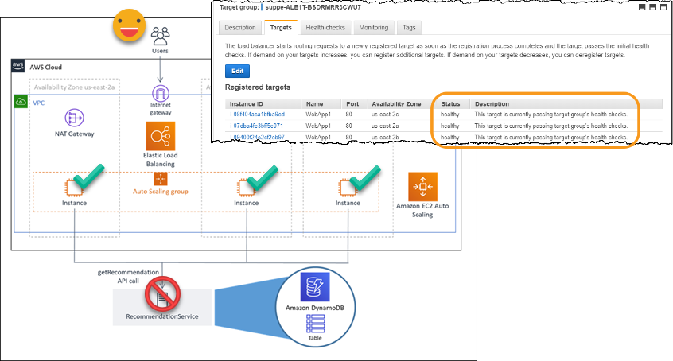

# Level 300: Implementing Health Checks and Managing Dependencies to improve Reliability

<https://wellarchitectedlabs.com>

## Introduction

This hands-on lab will guide you through the steps to improve reliability of a service by decoupling service dependencies, using health checks, and demonstrating when to use fail-open and fail-closed behaviors.

The skills you learn will help you build resilient workloads in alignment with the [AWS Well-Architected Framework](https://aws.amazon.com/architecture/well-architected/)

## Amazon Builders' Library

This lab additionally illustrates best practices as described in the Amazon Builders' Library article: [Implementing health checks](https://aws.amazon.com/builders-library/implementing-health-checks/)

## Goals

After you have completed this lab, you will be able to:

* Implement graceful degradation to transform applicable hard dependencies into soft dependencies
* Monitor all layers of the workload to detect failures
* Route traffic only to healthy application instances
* Configure fail-open and fail-closed behaviors as appropriate in response to detected faults
* Use AWS services to reduce mean time to recovery (MTTR)

## Prequisites

If you are running the at an AWS sponsored workshop then you may be provided with an AWS Account to use, in which case the following pre-requisites will be satisfied by the provided AWS account.  If you are running this using your own AWS Account, then please note the following prerequisites:

* An [AWS Account](https://portal.aws.amazon.com/gp/aws/developer/registration/index.html) that you are able to use for testing. This account MUST NOT be used for production or other purposes.
* An Identity and Access Management (IAM) user or federated credentials into that account that has permissions to create Amazon Virtual Private Cloud(s) (VPCs), including subnets and route tables, Security Groups, Internet Gateways, NAT Gateways, Elastic IP Addresses, IAM Roles, instance profiles, AWS Auto Scaling launch configurations, Application Load Balancers, Auto Scaling Groups, DynamoDB tables, SSM Parameters, and EC2 instances.

NOTE: You will be billed for any applicable AWS resources used if you complete this lab that are not covered in the [AWS Free Tier](https://aws.amazon.com/free/).

## [Start the Lab!](Lab_Guide.md)

***

## License

### Documentation License

Licensed under the [Creative Commons Share Alike 4.0](https://creativecommons.org/licenses/by-sa/4.0/) license.

### Code LicenseLicensed under the Apache 2.0 and MITnoAttr License

Copyright 2020 Amazon.com, Inc. or its affiliates. All Rights Reserved.

Licensed under the Apache License, Version 2.0 (the "License"). You may not use this file except in compliance with the License. A copy of the License is located at

    https://aws.amazon.com/apache2.0/

or in the "license" file accompanying this file. This file is distributed on an "AS IS" BASIS, WITHOUT WARRANTIES OR CONDITIONS OF ANY KIND, either express or implied. See the License for the specific language governing permissions and limitations under the License.
