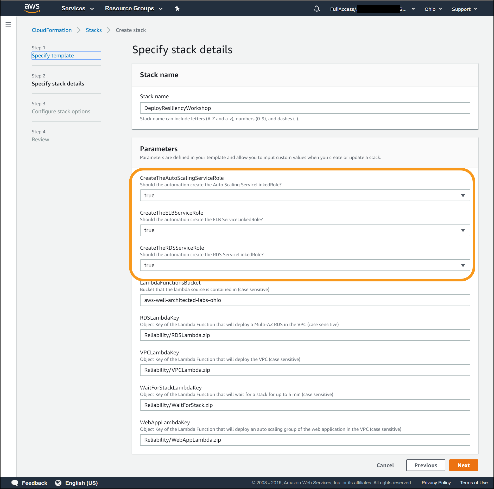

# Service-Linked Roles

## Does AWS account already have service-linked roles

AWS requires “service-linked” roles for AWS Auto Scaling, Elastic Load Balancing, and Amazon RDS to create the services and metrics they manage. If your AWS account has been previously been used, then these roles may already exist as they would have been automatically created for you. You will determine if any of the following three IAM service-linked roles already exists in the AWS account you are using for this workshop:

* `AWSServiceRoleForElasticLoadBalancing`
* `AWSServiceRoleForAutoScaling`
* `AWSServiceRoleForRDS`

1. Open the IAM console at [https://console.aws.amazon.com/iam/](https://console.aws.amazon.com/iam/)

2. In the navigation pane, click **Roles**.  
  

1. In the filter box, type “Service” to find the service linked roles that exist in your account and look for the three roles. In this screenshot, the service linked role for AutoScaling exists (`AWSServiceRoleForAutoScaling`), but the roles for Elastic Load Balancing and RDS do not. Note which roles already exist as you will use this information when performing the next step.  
 

**STOP HERE and return to the [Lab Guide](../Lab_Guide.md)**

---
*__Learn more__: After the lab see [the AWS documentation on Service-Linked Roles](https://docs.aws.amazon.com/IAM/latest/UserGuide/using-service-linked-roles.html)*

---
## Setup CloudFormation for service-linked roles 

**If you are using your own AWS account**: Then use these instructions when entering CloudFormation parameters

**If you are attending an in-person workshop and were provided with an AWS account by the instructor**: Skip this step and go to back to the [Lab Guide](../Lab_Guide.md)

| If you already have this role           | ...then set this parameter **`false`** |
| --------------------------------------- | ----------------------------------- |
| `AWSServiceRoleForElasticLoadBalancing` | `CreateTheELBServiceRole`           |
| `AWSServiceRoleForAutoScaling`          | `CreateTheAutoScalingServiceRole`   |
| `AWSServiceRoleForRDS`                  | `CreateTheRDSServiceRole`           |

* If the service-linked role does not already exist, then leave the parameter value as **`true`**

* Leave all the other parameter values at their default values

**[Click here to return to Lab Instructions](../Lab_Guide.md)**