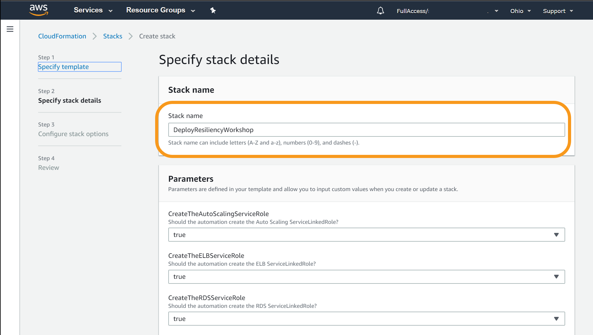
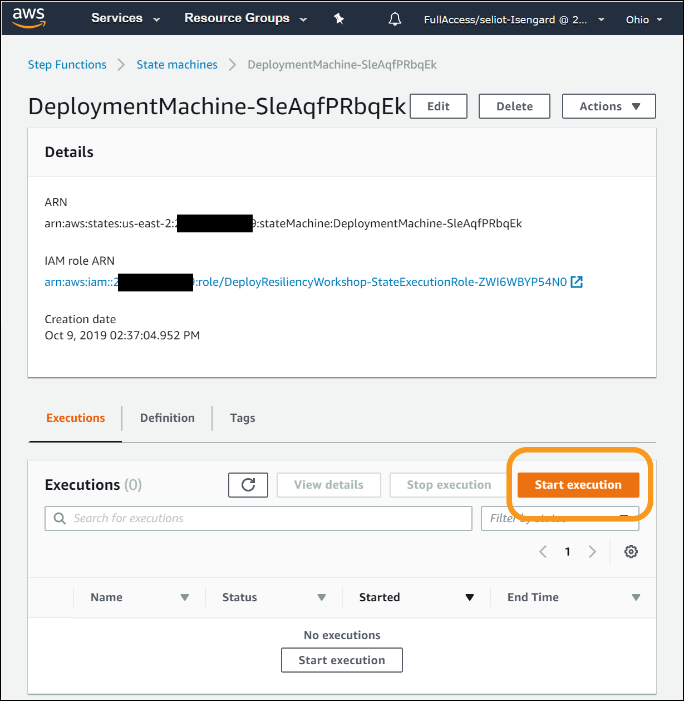
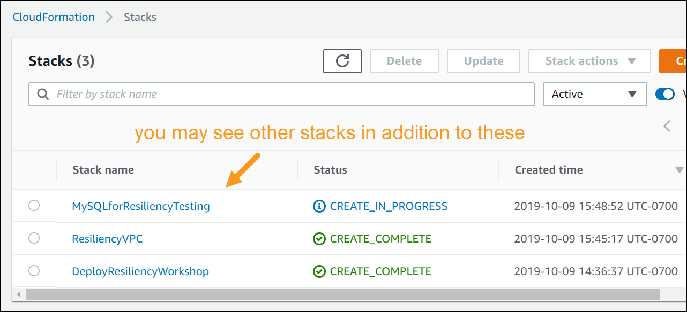

# Level 300: Performing Resiliency Testing for EC2, RDS, and S3

## Authors

* Rodney Lester, Reliability Lead, Well-Architected, AWS

## Table of Contents

1. [Deploy the Infrastructure](#deploy_infra)
1. [Configure Execution Environment](#configure_env)
1. [Test Resiliency Using Failure Injection](#failure_injection)
1. [Tear down](#tear_down)

## 1. Deploy the Infrastructure 

You will create a multi-tier architecture using AWS and run a simple service on it. The service is a web server running on Amazon EC2 fronted by an Elastic Load Balancer reverse-proxy, with a data store on Amazon Relational Database Service (RDS).

### 1.1 Log into the AWS console

**If you are attending an in-person workshop and were provided with an AWS account by the instructor**:

* Follow the instructions [here for accessing your AWS account](Documentation/Workshop_AWS_Account.md)
* **Note**: As part of these instructions you are directed to copy and save **AWS credentials** for your account. Please do so as you will need them later

**If you are using your own AWS account**:

* Sign in to the AWS Management Console as an IAM user or using a federated role
* You will need AWS credentials with which you can access your account. For example you can use an `AWS_ACCESS_KEY_ID` and `AWS_SECRET_ACCESS_KEY` from an IAM User you control.
  * If you do not have these credentials, follow the [instructions here to create them](Documentation/Self_AWS_Account.md)

### 1.2 Checking for existing service-linked roles

**If you are attending an in-person workshop and were provided with an AWS account by the instructor**: Skip this step and go to directly to step [Create the "deployment machine"](#create_statemachine).

**If you are using your own AWS account**: [Follow these steps](Documentation/Service_Linked_Roles.md#exist_service_linked_roles), and then return here and resume with the following instructions.

### 1.3 Create the "deployment machine" 

Here you will build a state machine using AWS Step Functions and AWS Lambda that orchestrates the deployment of the multi-tier infrastructure. This is not the service infrastructure itself, but meta-infrastructure we use to build the actual infrastructure.

*__Learn more__: After the lab see [this blog post](https://aws.amazon.com/blogs/devops/using-aws-step-functions-state-machines-to-handle-workflow-driven-aws-codepipeline-actions/) on how AWS Step Functions and AWS CodePipelines can work together to deploy your infrastructure*

1. Choose a deployment option. This lab can be run as **single region** *or* **multi region** (two region) deployment.
    * **single region** is faster to get up and running
    * **multi region** enables you to test some additional aspects of cross-regional resilience.
    * Choose one of these options and follows the instructions for it. If you are attending an in-person workshop, your instructor will specify which to use.
1. Ensure you have selected the **Ohio** region.  This region is also known as **us-east-2**, which you will see referenced throughout this lab.
  
1. Go to the AWS CloudFormation console at <https://console.aws.amazon.com/cloudformation> and click “Create Stack:”.  
  
1. Leave "Prepare template" and "Template source" settings as-is, and for "Amazon S3 URL" enter:
    * **single region**: <https://s3.us-east-2.amazonaws.com/aws-well-architected-labs-ohio/Reliability/lambda_functions_for_deploy.json>
    * **multi region**: <https://s3.us-east-2.amazonaws.com/aws-well-architected-labs-ohio/Reliability/lambda_functions_for_deploy_two_regions.json>
    
1. Click the “Next” button. For "Stack name" enter:

        DeployResiliencyWorkshop
    
1. On the same screen, for "Parameters" enter the appropriate values:
    * **If you are attending an in-person workshop and were provided with an AWS account by the instructor**: Leave all the parameters at their default values
    * **If you are using your own AWS account**: Set the [first three parameters using these instructions](Documentation/Service_Linked_Roles.md#cfn_service_linked_roles) and leave all other parameters at their default values.
    * You optionally may review [the default values of this CloudFormation template here](Documentation/CFN_Parameters.md)

1. Click the “Next” button.
   * On the "Configure stack options" page, click the “Next” again
   * On the "Review DeployResiliencyWorkshop" page, scroll to the bottom and tick the checkbox “I acknowledge that AWS CloudFormation might create IAM resources.”
   * Click the “Create stack” button.
  

1. This will take you to the CloudFormation stack status page, showing the stack creation in progress.  
    
  This will take approximately a minute to deploy.  When it shows status `CREATE_COMPLETE`, then you are finished with this step.

### 1.4 Deploy infrastructure and run the service

1. Go to the AWS Step Function console at <https://console.aws.amazon.com/states>

1. On the Step Functions dashboard, you will see “State Machines” and you will have a new one named “DeploymentMachine-*random characters*.” Click on that state machine. This will bring up an execution console. Click on the “Start execution” button.

1. On the "New execution" dialog, for "Enter an execution name" delete the auto-generated name and replace it with:  `BuildResiliency`

1. Then for "Input" enter JSON that will be used to supply parameter values to the Lambdas in the workflow.
   * **single region** uses the following values:

          {
            "log_level": "DEBUG",
            "region_name": "us-east-2",
            "secondary_region_name": "us-west-2",
            "cfn_region": "us-east-2",
            "cfn_bucket": "aws-well-architected-labs-ohio",
            "folder": "Reliability/",
            "workshop": "300-ResiliencyofEC2RDSandS3",
            "boot_bucket": "aws-well-architected-labs-ohio",
            "boot_prefix": "Reliability/",
            "websiteimage" : "https://s3.us-east-2.amazonaws.com/arc327-well-architected-for-reliability/Cirque_of_the_Towers.jpg"
          }

   * **multi region** uses the [values here](Documentation/Multi_Region_Event_Data.md)
   * **Note**: for `websiteimage` you can supply an alternate link to a public-read-only image in an S3 bucket you control. This will allow you to run S3 resiliency tests as part of the lab
   * Then click the “Start Execution” button.

        

1. The "deployment machine" is now deploying the infrastructure and service you will use for resiliency testing.
     * **single region**: approximately 20-25 minutes to deploy
     * **multi region**: approximately 45-50 minutes to deploy. In about 25-30 minutes you can start executing lab exercises.

1. You can watch the state machine as it executes by clicking the icon to expand the visual workflow to the full screen.  

1. You can also watch the CloudFormation stacks as they are created and transition from `CREATE_IN_PROGRESS` to `CREATE_COMPLETE`.

1. Note: If you are in a workshop, the instructor will share background and technical information while your service is deployed.

1. You can resume testing when the web tier has been deployed in the Ohio region. Look for the `WaitForWebApp` step (for **single region**) or `WaitForWebApp1` step (for **multi region**) to have completed successfully.  This will look something like this on the visual workflow.

    
   * Above screen shot is for **single region**. for **multi region** see [Multi_Region_State_Machine](Documentation/Multi_Region_State_Machine.md)

1. Go to the AWS CloudFormation console at <https://console.aws.amazon.com/cloudformation>.
   * click on the `WebServersforResiliencyTesting` stack
   * click on the "Outputs" tab
   * For the Key `WebSiteURL` copy the value.  This is the URL of your test web service.
   

1. Click the value and it will bring up the website:  

(image will vary depending on what you supplied for `websiteimage`)

## 2. Configure Execution Environment 

Failure injection is a means of testing resiliency by which a specific failure type is simulated on a service and its response is assessed.

There is a choice of environments to execute these failure injections. From a Linux command line bash scripts are provided you can execute. If you prefer Python, Java, Powershell, or C# instructions for these will also be provided.

### 2.1 Setting Up the bash environment

1. Prerequisites
   * `awscli` AWS CLI installed

          $ aws --version
          aws-cli/1.16.249 Python/3.6.8...
        * AWS CLI version 1.0 or higher is fine
        * If you instead got `command not found` then [see instructions here to install `awscli`](Documentation/Software_Install.md#awscli)
   * `jq` command-line JSON processor installed.

          $ jq --version
          jq-1.5-1-a5b5cbe
        * Any version is fine.
        * If you instead got `command not found` then [see instructions here to install `jq`](Documentation/Software_Install.md#jq)

1. Run the `aws configure` command to provide the AWS CLI with configuration and credentials information it needs to access the AWS account you are using for the workshop. You will AWS credentials in the form of an `AWS_ACCESS_KEY_ID` and `AWS_SECRET_ACCESS_KEY` for this step
   * **If you are attending an in-person workshop and were provided with an AWS account by the instructor**
     * See the instructions [here for obtaining your AWS credentials](Documentation/Workshop_AWS_Account.md)
   * **If you are using your own AWS account**
     * If you do not have these credentials, follow the [instructions here to create obtain your AWS credentials](Documentation/Self_AWS_Account.md)

1. Run `aws configure` and provide the following values: 

        $ aws configure
        AWS Access Key ID [*************xxxx]: <Your AWS Access Key ID>
        AWS Secret Access Key [**************xxxx]: <Your AWS Secret Access Key>
        Default region name: [us-east-2]: us-east-2
        Default output format [None]: json

1. Download the [resiliency bash scripts from GitHub](https://github.com/awslabs/aws-well-architected-labs/tree/master/Reliability/300_Testing_for_Resiliency_of_EC2_RDS_and_S3/Code/FailureSimulations/bash) and set them up to be executable.  You may use the following commands to do this, or any other means.

        $ # The wget commands have a lot of output, which is omitted here

        $ wget https://raw.githubusercontent.com/awslabs/aws-well-architected-labs/master/Reliability/300_Testing_for_Resiliency_of_EC2_RDS_and_S3/Code/FailureSimulations/bash/fail_instance.sh
        ...
        2019-10-12 19:38:47 (77.2 MB/s) - ‘fail_instance.sh’ saved [1611/1611]

        $ wget https://raw.githubusercontent.com/awslabs/aws-well-architected-labs/master/Reliability/300_Testing_for_Resiliency_of_EC2_RDS_and_S3/Code/FailureSimulations/bash/failover_rds.sh
        ...
        2019-10-12 19:39:36 (56.8 MB/s) - ‘failover_rds.sh’ saved [1633/1633]

        $ wget https://raw.githubusercontent.com/awslabs/aws-well-architected-labs/master/Reliability/300_Testing_for_Resiliency_of_EC2_RDS_and_S3/Code/FailureSimulations/bash/fail_az.sh
        ...
        2019-10-12 19:32:32 (28.4 MB/s) - ‘fail_az.sh’ saved [6140/6140]

        $ # Now make these executable

        $ chmod u+x fail_instance.sh
        $ chmod u+x failover_rds.sh
        $ chmod u+x fail_az.sh

### 2.2 Setting up a Programming Language Based Environment

You will need the same files that the AWS command line uses for credentials. You can either install the command line and use the ‘aws configure’ command as outlined in the bash set up, or you can manually create the configuration files. To create the files manually, create a .aws folder/directory in your home directory.  

1. Bash and powershell use the same command.  

        mkdir ~/.aws

2. Change directory to that directory to create the configuration file.  

    Bash

        cd ~/.aws

    Powershell

        cd ~\.aws

3. Use a text editor (vim, emacs, notepad) to create a text file (no extension) named “credentials”. In this file you should have the following text.  

        [default]
        aws_access_key_id = <Your access key>
        aws_secret_access_key = <Your secret key>

4. Create a text file (no extension) named "config". In this file you should have the following text:

        [default]
        region = us-east-2
        output = json

### 2.3 Setting Up the Python Environment

1. The scripts are written in python with boto3. On Amazon Linux, this is already installed. Use your local operating system instructions to install boto3: [https://github.com/boto/boto3](https://github.com/boto/boto3)
2. Download the zip file of the resiliency scripts at the following URL.[https://s3.us-east-2.amazonaws.com/aws-well-architected-labs-ohio/Reliability/pythonresiliency.zip](https://s3.us-east-2.amazonaws.com/aws-well-architected-labs-ohio/Reliability/pythonresiliency.zip)
3. Unzip the folder in a location convenient for you to execute the scripts.  

### 2.4 Setting Up the Java Environment

1. The command line utility in Java requires Java 8 SE. In Amazon Linux, you need to install Java 8 and remove Java 7.  

        $ sudo yum install java-1.8.0-openjdk
        $ sudo yum remove java-1.7.0-openjdk

2. Download the zipfile of the executables at the following URL [https://s3.us-east-2.amazonaws.com/aws-well-architected-labs-ohio/Reliability/javaresiliency.zip](https://s3.us-east-2.amazonaws.com/aws-well-architected-labs-ohio/Reliability/javaresiliency.zip).
3. Unzip the folder in a location convenient for you to execute the command line programs.  

### 2.5 Setting Up the C# Environment

1. Download the zipfile of the executables at the following URL. [https://s3.us-east-2.amazonaws.com/aws-well-architected-labs-ohio/Reliability/csharpresiliency.zip](https://s3.us-east-2.amazonaws.com/aws-well-architected-labs-ohio/Reliability/csharpresiliency.zip)  
2. Unzip the folder in a location convenient for you to execute the command line programs.  

### 2.6 Setting up the Powershell Environment

1. If you do not have the AWS Tools for Powershell, download and install them following the instructions here. [https://aws.amazon.com/powershell/](https://aws.amazon.com/powershell/)  
2. Follow the “Getting Started” instructions for configuring credentials. [https://docs.aws.amazon.com/powershell/latest/userguide/pstools-getting-started.html](https://docs.aws.amazon.com/powershell/latest/userguide/pstools-getting-started.html)
3. Download the zipfile of the scripts at the following URL. [https://s3.us-east-2.amazonaws.com/aws-well-architected-labs-ohio/Reliability/powershellresiliency.zip](https://s3.us-east-2.amazonaws.com/aws-well-architected-labs-ohio/Reliability/powershellresiliency.zip)  
4. Unzip the folder in a location convenient for you to execute the scripts.

## 3. Test Resiliency Using Failure Injection 

### 3.1 EC2 Failure Mode

1. The first failure mode will be to fail a web server. To prepare for this, you should have two consoles open: VPC and EC2. From the AWS Console, click the downward facing icon to the right of the word “Services.” This will bring up the list of services. Type “EC2” in the search box and press the enter key.  
  
2. You also need the VPC Console. From the AWS Console, click the downward facing icon to the right of the word “Services.” This will bring up the list of services. Type “VPC” in the search box, then right click on the “VPC Isolated Cloud Resources” text and open the link in a new tab or window. You can then click the upward facing icon to the right of the word “Services” to make the menu of services disappear.  
  
3. On the EC2 Console, click “Instances” on the left side to bring up the list of instances.  

4. On the VPC console, copy the VPC ID by first selecting the VPC named
   "ResiliencyVPC", and then clicking the icon to copy the VPC ID

5. Use this VPC ID as the command line argument (vpc-id) to the scripts/programs below.  
   * Instance Failure in bash: Execute the failure mode script for failing an instance:

          $./fail_instance.sh <vpc-id>

If you get an error `command not found` or `permission denied`, you may need to
setup your scripts to enable execution.  From the same directory as the scripts,
      execute the command `chmod u+x *.sh`

* Instance Failure in Python: Execute the failure mode script for failing an instance:

        $ python fail_instance.py <vpc-id>

* Instance Failure in Java: Execute the failure mode program for failing an instance:

        $ java -jar app-resiliency-1.0.jar EC2 <vpc-id>

* Instance Failure in C#: Execute the failure mode program for failing an instance:

        $ .\AppResiliency EC2 <vpc-id>

* Instance Failure in Powershell: Execute the failure mode script for failing an instance:

        $ .\fail_instance.ps1 <vpc-id>

1. Watch the behavior of the Load Balancer Target Group and its Targets in the EC2 Console. See it get marked unhealthy and replaced by the Auto Scaling Group.  
  

### 3.2 RDS Failure Mode

1. From the AWS EC2 Console (you will still need the VPC ID from the VPC Console), click the downward facing icon to the right of the word “Services.” This will bring up the list of services. Type “RDS” in the search box and press the enter key.  

2. From the RDS dashboard click on "DB Instances (1/40)" and then on the DB
   identifier for your database. Note the value of the "Info" field
3. Continue to use the same VPC ID as the command line argument to the scripts/programs below.  

* RDS Instance Failure in bash: Execute the failure mode script for failing over an RDS instance:

        $./failover_rds.sh <vpc-id>

* RDS Instance Failure in Python: Execute the failure mode script for failing an instance:

        $ python fail_rds.py <vpc-id>

* RDS Instance Failure in Java: Execute the failure mode program for failing an instance:

        $ java -jar app-resiliency-1.0.jar RDS <vpc-id>

* RDS Instance Failure in C#: Execute the failure mode program for failing an instance:

        $ .\AppResiliency RDS <vpc-id>

* RDS Instance Failure in Powershell: Execute the failure mode script for failing an instance:

        $ .\failover_rds.ps1 <vpc-id>

Watch the behavior of the website. What happens?  On the database console how does the "Info" field change? Click on the "Logs & events" sub-tab and look at "Recent events".  Be sure to click through to the
latest page of events. Be sure to re-check the behavior of the website.

### 3.3 AZ Failure

1. Availability zone failure.

* AZ Failure in bash: Execute the following script for failing over an Availability Zone:

        $./fail_az.sh <az> <vpc-id>

* AZ Failure in Python: Execute the failure mode script for failing an instance:

        $ python fail_az.py <vpc-id> <az>

* AZ Failure in Java: Execute the failure mode script for failing an instance:

        $ java -jar app-resiliency-1.0.jar AZ <vpc-id> <az>

* AZ Failure in C#: Execute the failure mode script for failing an instance:

        $ .\AppResiliency AZ <vpc-id> <az>
        # <az> is a value like us-east-2b

* AZ Failure in Powershell: Execute the failure mode script for failing an instance:

        $ .\fail_az.ps1 <az> <vpc-id>

What is the expected effect? How long does it take to take effect? Look at the Target Group Targets to see them go unhealthy, also watch the EC2 instances to see the one in the target AZ shutdown and be restarted in one of the other AZs.
What would you do if the ASG was only in one AZ? You could call the AutoScaling SuspendProcesses and then get the list of instances in the group and call EC2 StopInstances or TerminateInstances. How would you undo all these changes?

### 3.4 Failure of S3

1. Failure of S3 means that the image will not be available.

* Failure in bash: The bash commands available do not allow for modification of the access permissions, so you'll have to do the work in the console.
  1. Navigate to the S3 console: <https://s3.console.aws.amazon.com/s3/home>
  1. Select the bucket where the image is located. In my example, this is the bucket "arc327-well-architected-for-reliability"
  1. Select the object, then select the "Permissions" tab:
  1. Select the "Public Access" radio button, and deselect the "Read object" box:

What is the expected effect? How long does it take to take effect? How would you diagnose if this is a larger problem than permissions?

### 3.5 More testing you can do

You can use drift detection in the CloudFormation console to see what had changed, or work on code to heal their failure modes.  

1. Remove the network ACLs they added  
2. Reconfigure the AutoScaling Groups to use the AZ  

***

## 4. Tear down this lab 

In order to take down the lab environment, you will need to remove the association of the Network ACL that was added to fail the AZ, and delete the Network ACL in the console. You can then delete the CloudFormation stacks (in both AWS regions) that were created. Here are the instructions for how to do that.

1. Navigate to the VPC Console. From the AWS Console, click the downward facing icon to the right of the word “Services.” This will bring up the list of services. Type “VPC” in the search box, then press enter.  
  
2. On the VPC Console, click on Network ACLs and select the Network ACL that is associated with 4 subnets in the ResiliencyVPC. Click the “Subnet Associations” tab and then Click the “Edit button.  
  
3. You need to associate the 2 subnets that were changed to the blocking Network ACL back to this default Network ACL. Select the 2 subnets available, then click the “Save” button.  
  
4. Now select the Network ACL that is associated with 0 Subnets and click the “Delete” button to delete this Network ACL.  
  
5. If you have deployed into 2 regions, you have to delete the Database Migration Service and RDS Read Replicas before you can delete the RDS instances.  You can delete the DMS (in Oregon) and read replica at the same time, but the console only allows you to select one of the stacks at a time. Select the “DMSforResiliencyTesting” stack, then click the “Actions” button, and click “DeleteStack:”.  
  
6. You can then select the “MySQLReadReplicaResiliencyTesting” stack, click the “Actions” button, and click “Delete Stack” to simultaneously delete the RDS Read Replica instance.  
  
7. If you have deployed in 2 regions, Navigate to the other region (Ohio, if you started in Oregon, and Oregon, if you started in Ohio), and perform the same deletion steps above for the RDS read replica and DMS, if in Oregon. Wait for the read replicas to be deleted. You can delete the web servers and RDS at the same time, but the console only allows you to select one of the stacks at a time. Select the “WebServersForResiliencyTesting” stack, then click the “Actions” button, and click “Delete Stack:”.  
  
8. You can then select the “ MySQLforResiliencyTesting” stack, click the “Actions” button, and click “Delete Stack” to simultaneously delete the RDS instance.  
  
9. You can then select the “DeployResiliencyWorkshop” stack, click the “Actions” button, and click “Delete Stack” to simultaneously delete the deployment machine and Lambda functions.  
  
10. Once all these stacks have deleted, you can then select the “ResiliencyVPC” stack, click the “Actions” button, and click “Delete Stack” to delete the VPC and remove the last piece of infrastructure.  
  
11. When it is delete complete, you are done.  

***

## References & useful resources

***

## License

### Documentation License

Licensed under the [Creative Commons Share Alike 4.0](https://creativecommons.org/licenses/by-sa/4.0/) license.

### Code License

Licensed under the Apache 2.0 and MITnoAttr License.

Copyright 2018 Amazon.com, Inc. or its affiliates. All Rights Reserved.

Licensed under the Apache License, Version 2.0 (the "License"). You may not use this file except in compliance with the License. A copy of the License is located at

<https://aws.amazon.com/apache2.0/>

or in the "license" file accompanying this file. This file is distributed on an "AS IS" BASIS, WITHOUT WARRANTIES OR CONDITIONS OF ANY KIND, either express or implied. See the License for the specific language governing permissions and limitations under the License.
