# Level 300: Performing Resiliency Testing for EC2, RDS, and S3

## Authors

* Rodney Lester, Reliability Lead, Well-Architected, AWS

## Table of Contents

1. [Deploying the infrastructure](#deploy_infra)
2. [Discussion and Example Failure Scenarios](#failure_scenarios)
3. [Failure modes](#failure_modes)
4. [Tear Down](#tear_down)

## 1. Deploying the infrastructure 

AWS requires “Service-Linked” Roles for AWS Auto Scaling, Elastic Load Balancing, and Amazon RDS to create the services and metrics they manage. In the past, these Roles may have been created automatically for you, or we may need to create them. Here is how to find which roles you need to create.  

### 1.1 Checking for Existing Service-Linked Roles

1. Sign in to the AWS Management Console as an IAM user with MFA enabled or in a federated Role, and open the IAM console at [https://console.aws.amazon.com/iam/](https://console.aws.amazon.com/iam/).
2. In the navigation pane, click **Roles**.  
  
3. In the filter box, type “Service” to find the service linked roles that exist in your account and look for “AutoScaling,” “ELB” or “ElasticLoadBalancing,” and “RDS.” In this screenshot, the service linked role for AutoScaling exists, but the roles for ELB and RDS do not. Note which roles will need to be created as you will use this information when performing the next step.  
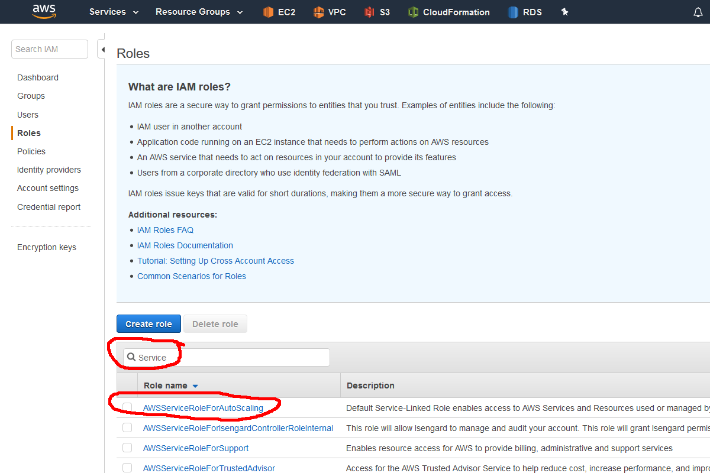  
4. In the AWS Services Search Box, type “CloudFormation” and click enter.  
5. You will need to download the CloudFormation template that will deploy the lambda functions and step functions state machine. Change the region to **Ohio** and navigate to the CloudFormation console.  
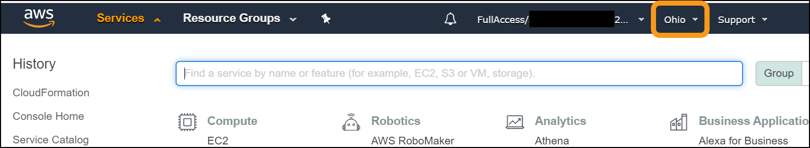  
6. On the CloudFormation console, click “Create Stack:”.  
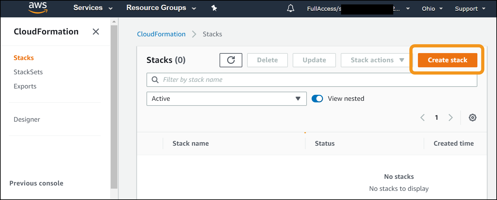  
7. There are two versions that can be deployed. You can deploy in one AWS region, which will allow you start testing sooner, or you can deploy into 2 AWS regions, which will enable you to test some additional aspects of S3, as well as as simulation a regional failure of your application
    1. For a single region deployment, select the option to “Specify an Amazon S3 template" and enter **<https://s3.us-east-2.amazonaws.com/aws-well-architected-labs-ohio/Reliability/lambda_functions_for_deploy.json>**  

    2. For a two region deployment, select the option to “Specify an Amazon S3 template" and enter **<https://s3.us-east-2.amazonaws.com/aws-well-architected-labs-ohio/Reliability/lambda_functions_for_deploy_two_regions.json>**  
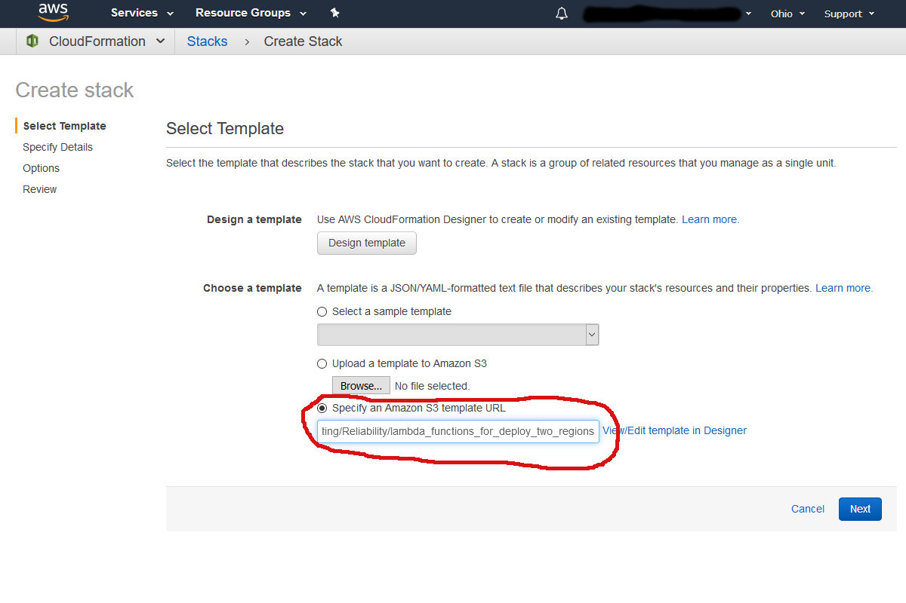
8. Click the “Next” button. On this page you will enter the following information:
    1. For the single region deployment:
         1. Stack name: “DeployResiliencyWorkshop” <-No spaces!
         2. EnableAutoScalingServiceRole: “false” or “true,” depending on whether it exists. In the example, this will be false since it already exists.
         3. EnableELBServiceRole: “false” or “true,” depending on whether it exists. In the example, this will be true because it does not exist.
         4. EnableRDSServiceRole: “false” or “true,” depending on whether it exists. In the example, this will be true because it does not exist.
         5. LambdaFunctionsBucket: “aws-well-architected-labs-ohio” <-Case sensitive!
         6. RDSLambdaKey: “Reliability/RDSLambda.zip” <-Case sensitive!
         7. VPCLambdaKey: “Reliability/VPCLambda.zip” <-Case sensitive!
         8. WaitForStackLambdaKey: “Reliability/WaitForStack.zip” <-Case sensitive!
         9. WebAppLambdaKey: “Reliability/WebAppLambda.zip” <-Case sensitive!
        
    2. For the two region deployment:

         1. Stack name: “DeployResiliencyWorkshop” <-No spaces!
         2. DMSLambdaKey: “Reliability/DMSLambda.zip” <-Case sensitive!
         3. EnableAutoScalingServiceRole: “false” or “true,” depending on whether it exists. In the example, this will be false since it already exists.
         4. EnableELBServiceRole: “false” or “true,” depending on whether it exists. In the example, this will be true because it does not exist.
         5. EnableRDSServiceRole: “false” or “true,” depending on whether it exists. In the example, this will be true because it does not exist.
         6. LambdaFunctionsBucket: “aws-well-architected-labs-ohio” <-Case sensitive!
         7. RDSLambdaKey: “Reliability/RDSLambda.zip” <-Case sensitive!
         8. RDSRRLambdaKey: "Reliability/RDSReadReplicaLambda.zip" <-Case sensitive!
         9. VPCLambdaKey: “Reliability/VPCLambda.zip” <-Case sensitive!
         10. WaitForStackLambdaKey: “Reliability/WaitForStack.zip” <-Case sensitive!
         11. WebAppLambdaKey: “Reliability/WebAppLambda.zip” <-Case sensitive!
        

9. Click the “Next” button. On the “Options” page, click the “Next” button at the bottom of the page. On the “Review” page, scroll to the bottom and select the option “I acknowledge that AWS CloudFormation might create IAM resources.” Click the “Create” button. This will take you to the summary with the stack creation in progress.  
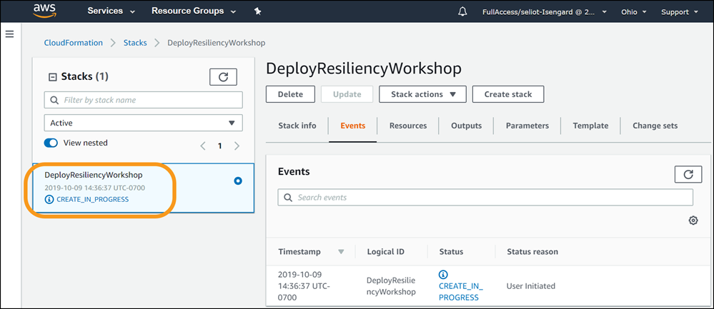  
10. This will take approximately a minute to deploy. You now need to navigate to the Step Functions console. At the top of the window, click the downward facing icon to the right of the word “Services.” This will bring up the list of services. Type “Step Functions” in the search box and press the enter key.  
  
11. On the Step Functions dashboard, you will see “State Machines” and you will have a new one named “DeploymentMachine-<random characters>.” Click on that state machine. This will bring up an execution console. Click on the “Start execution” button.  
  
12. For input to the execution name, use “BuildResiliency.”
    1. **One Region Deployment:** For Input, use the following: **Note:** If you want to test failure of S3, then you should use an image in S3 that you control, and it should have public read access only.

            {
              "log_level": "DEBUG",
              "region_name": "us-east-2",
              "secondary_region_name": "us-west-2",
              "cfn_region": "us-east-2",
              "cfn_bucket": "aws-well-architected-labs-ohio",
              "folder": "Reliability/",
              "workshop": "300-ResiliencyofEC2RDSandS3",
              "boot_bucket": "aws-well-architected-labs-ohio",
              "boot_prefix": "Reliability/",
              "boot_object": "bootstrap300Resiliency.sh",
              "websiteimage" : "https://s3.us-east-2.amazonaws.com/arc327-well-architected-for-reliability/Cirque_of_the_Towers.jpg"
            }

        Then click the “Start Execution” button.  

        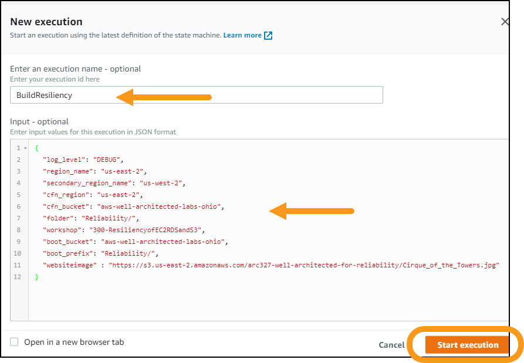  

    1. **Two Region Deployment:** For Input, use the following: **Note:** If you want to test failure of S3, then you should use an image in S3 that you control, and it should have public read access only.

            {
              "region1": {
                "log_level": "DEBUG",
                "region_name": "us-east-2",
                "secondary_region_name": "us-west-2",
                "cfn_region": "us-east-2",
                "cfn_bucket": "aws-well-architected-labs-ohio",
                "folder": "Reliability/",
                "workshop": "300-ResiliencyofEC2RDSandS3",
                "boot_bucket": "aws-well-architected-labs-ohio",
                "boot_prefix": "Reliability/",
                "boot_object": "bootstrap300Resiliency.sh",
                "websiteimage" : "https://s3.us-east-2.amazonaws.com/arc327-well-architected-for-reliability/Cirque_of_the_Towers.jpg"
              },
              "region2": {
                "log_level": "DEBUG",
                "region_name": "us-west-2",
                "secondary_region_name": "us-east-2",
                "cfn_region": "us-east-2",
                "cfn_bucket": "aws-well-architected-labs-ohio",
                "folder": "Reliability/",
                "workshop": "300-ResiliencyofEC2RDSandS3",
                "boot_bucket": "aws-well-architected-labs-ohio",
                "boot_prefix": "Reliability/",
                "boot_object": "bootstrap300Resiliency.sh",
                "websiteimage" : "https://s3.us-east-2.amazonaws.com/arc327-well-architected-for-reliability/Cirque_of_the_Towers.jpg"
              }
            }

        Then click the “Start Execution” button.  

          

13.  This will take approximately 20-25 minutes for one region to deploy and approximately 45-50 minutes for two regions to deploy. You will have enough to start executing the lab exercises for the two region in 25-30 minutes. You can watch the state machine as it executes by clicking the icon to expand the visual workflow to the full screen.  
    1. One Region:
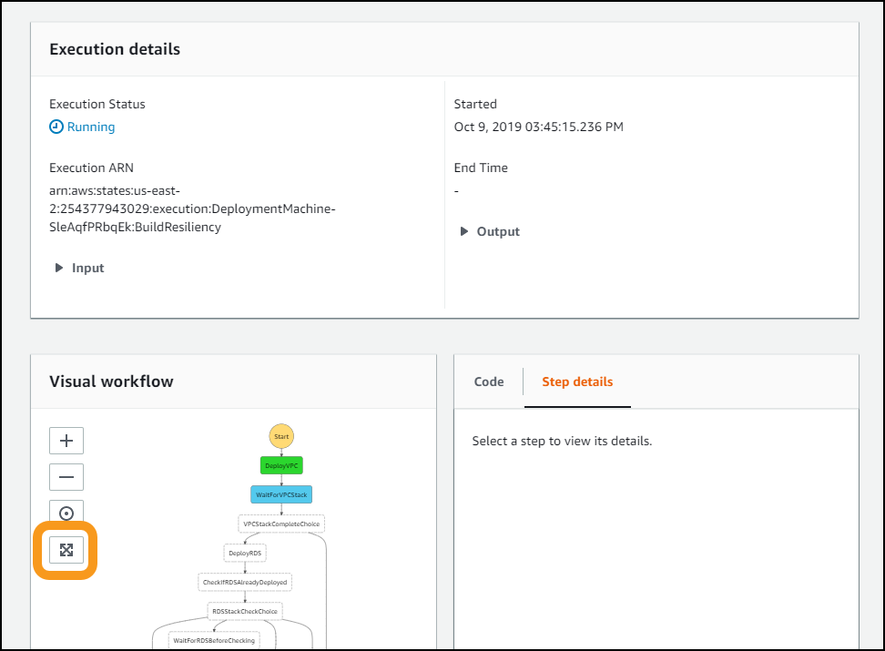
    1. Two Regions:
  
16. You can also watch the CloudFormation stacks as they are created. If you are in a workshop, the instructor will have some background information to share while this is created. You can resume testing when the web tier has been deployed in the Ohio region. This will look something like this on the visual workflow.  
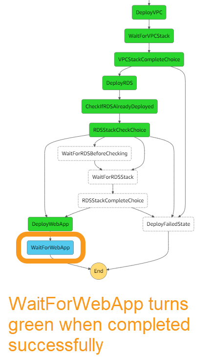  
17. You can start testing:
    1. When the WaitForWebApp step for a single region deployment is completed, return to the CloudFormation console and select the “WebServersforResiliencyTesting” stack and then the Outputs tab at bottom.  
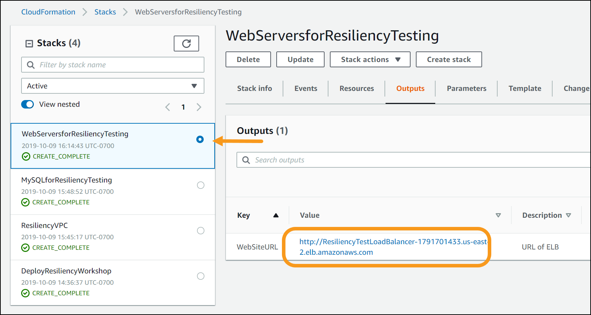
    1. When the WaitForWebApp1 step for a two region deployment is completed, return to the CloudFormation console and select the “WebServersforResiliencyTesting” stack and then the Outputs tab at bottom.

16. Click the value and it will bring up the website:  
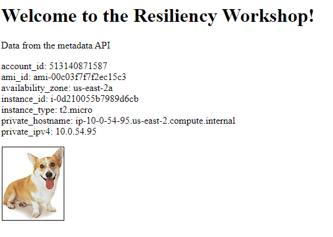

## 2. Discussion and Example Failure Scenarios 

There is a choice of environments to execute the failure simulations in. Linux command line (bash), Python, Java, and C#.  The instructions for each environment are in separate sections.

### 2.1 Setting Up the bash Environment

All the command line scripts use a utility called jq. You can download it from the site and leave it in your local directory, as long as that is in your execution path:  
[https://stedolan.github.io/jq/](https://stedolan.github.io/jq/)  

1. You can find out what your execution path is with the following command.

        $ echo $PATH
        /usr/local/bin:/bin:/usr/bin:/usr/local/sbin:/usr/sbin:/sbin:/opt/aws/bin:/home/ec2-user/.local/bin:/home/ec2-user/bin

1. If you have sudo rights, then copy the executable to /usr/local/bin/jq and make it executable.  

        $ sudo cp jq-linux64 /usr/local/bin/jq
        $ sudo chmod 755 /usr/local/bin/jq

2. If you do not have sudo rights, then copy it into your home directory under a /bin directory. In Amazon linux, this is typically /home/ec2-user/bin.  

        $ cp jq-linux64 ~/bin/jq
        $ chmod 755 ~/bin/jq

4. Install the AWS Command Line Interface (CLI) if you do not have it installed (it is installed by default on Amazon Linux).  
[https://aws.amazon.com/cli/](https://aws.amazon.com/cli/)

5. Run the aws configure command to configure your command line options. This will prompt you for the AWS Access Key ID, AWS Secret Access Key, and default region name. Enter the key information if you do not already have them installed, and set the default region to “us-east-2” and set the default output format as “json”.  

        $ aws configure
        AWS Access Key ID [*************xxxx]: <Your AWS Access Key ID>
        AWS Secret Access Key [**************xxxx]: <Your AWS Secret Access Key>
        Default region name: [us-east-2]: us-east-2
        Default output format [None]: json

6. Download the zip file of the resiliency bash scripts at the following URL:  
[https://s3.us-east-2.amazonaws.com/aws-well-architected-labs-ohio/Reliability/bashresiliency.zip](https://s3.us-east-2.amazonaws.com/aws-well-architected-labs-ohio/Reliability/bashresiliency.zip)
7. Unzip the folder in a location convenient for you to execute the scripts.  
8. They are also available in the [Code/FailureSimulations/bash/](Code/FailureSimulations/bash/) directory.

### 2.2 Setting up a Programming Language Based Environment

You will need the same files that the AWS command line uses for credentials. You can either install the command line and use the ‘aws configure’ command as outlined in the bash set up, or you can manually create the configuration files. To create the files manually, create a .aws folder/directory in your home directory.  

1. Bash and powershell use the same command.  

        mkdir ~/.aws

2. Change directory to that directory to create the configuration file.  

    Bash

        cd ~/.aws

    Powershell

        cd ~\.aws

3. Use a text editor (vim, emacs, notepad, wordpad) to create a text file (no extension) named “credentials”. In this file you should have the following text.  

        [default]
        aws_access_key_id = <Your access key>
        aws_secret_access_key = <Your secret key>

4. Create a text file (no extension) named "config". In this file you should have the following text:

        [default]
        region = us-east-2
        output = json

### 2.3 Setting Up the Python Environment

1. The scripts are written in python with boto3. On Amazon Linux, this is already installed. Use your local operating system instructions to install boto3: [https://github.com/boto/boto3](https://github.com/boto/boto3)
2. Download the zip file of the resiliency scripts at the following URL.[https://s3.us-east-2.amazonaws.com/aws-well-architected-labs-ohio/Reliability/pythonresiliency.zip](https://s3.us-east-2.amazonaws.com/aws-well-architected-labs-ohio/Reliability/pythonresiliency.zip)   
3. Unzip the folder in a location convenient for you to execute the scripts.  

### 2.4 Setting Up the Java Environment

1. The command line utility in Java requires Java 8 SE. In Amazon Linux, you need to install Java 8 and remove Java 7.  

        $ sudo yum install java-1.8.0-openjdk
        $ sudo yum remove java-1.7.0-openjdk

2. Download the zipfile of the executables at the following URL [https://s3.us-east-2.amazonaws.com/aws-well-architected-labs-ohio/Reliability/javaresiliency.zip](https://s3.us-east-2.amazonaws.com/aws-well-architected-labs-ohio/Reliability/javaresiliency.zip).   
3. Unzip the folder in a location convenient for you to execute the command line programs.  

### 2.5 Setting Up the C# Environment

1. Download the zipfile of the executables at the following URL. [https://s3.us-east-2.amazonaws.com/aws-well-architected-labs-ohio/Reliability/csharpresiliency.zip](https://s3.us-east-2.amazonaws.com/aws-well-architected-labs-ohio/Reliability/csharpresiliency.zip)  
2. Unzip the folder in a location convenient for you to execute the command line programs.  

### 2.6 Setting up the Powershell Environment

1. If you do not have the AWS Tools for Powershell, download and install them following the instructions here. [https://aws.amazon.com/powershell/](https://aws.amazon.com/powershell/)  
2. Follow the “Getting Started” instructions for configuring credentials. [https://docs.aws.amazon.com/powershell/latest/userguide/pstools-getting-started.html](https://docs.aws.amazon.com/powershell/latest/userguide/pstools-getting-started.html)
3. Download the zipfile of the scripts at the following URL. [https://s3.us-east-2.amazonaws.com/aws-well-architected-labs-ohio/Reliability/powershellresiliency.zip](https://s3.us-east-2.amazonaws.com/aws-well-architected-labs-ohio/Reliability/powershellresiliency.zip)  
4. Unzip the folder in a location convenient for you to execute the scripts.

## 3. Failure modes 

### 3.1 EC2 Failure Mode

1. The first failure mode will be to fail a web server. To prepare for this, you should have two consoles open: VPC and EC2. From the AWS Console, click the downward facing icon to the right of the word “Services.” This will bring up the list of services. Type “EC2” in the search box and press the enter key.  
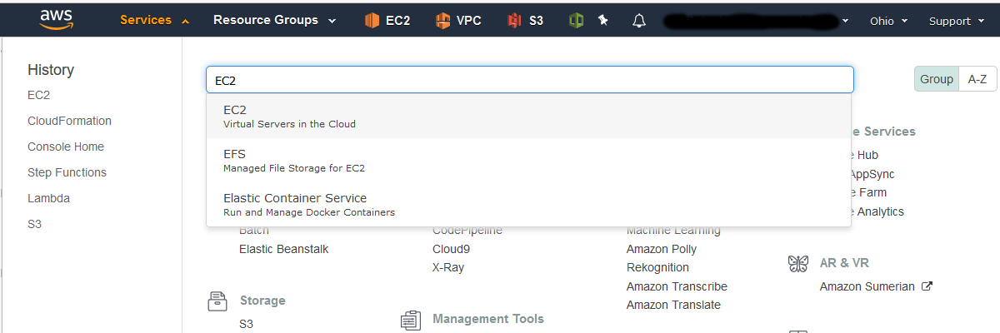  
2. You also need the VPC Console. From the AWS Console, click the downward facing icon to the right of the word “Services.” This will bring up the list of services. Type “VPC” in the search box, then right click on the “VPC Isolated Cloud Resources” text and open the link in a new tab or window. You can then click the upward facing icon to the right of the word “Services” to make the menu of services disappear.  
  
3. On the EC2 Console, click “Instances” on the left side to bring up the list of instances.  

4. On the VPC console, copy the VPC ID by first selecting the VPC named
   "ResiliencyVPC", and then clicking the icon to copy the VPC ID 

5. Use this VPC ID as the command line argument (vpc-id) to the scripts/programs below.  
   * Instance Failure in bash: Execute the failure mode script for failing an instance:

          $./fail_instance.sh <vpc-id>

If you get an error `command not found` or `permission denied`, you may need to
setup your scripts to enable execution.  From the same directory as the scripts,
      execute the command `chmod u+x *.sh`

* Instance Failure in Python: Execute the failure mode script for failing an instance:

        $ python fail_instance.py <vpc-id>

* Instance Failure in Java: Execute the failure mode program for failing an instance:

        $ java -jar app-resiliency-1.0.jar EC2 <vpc-id>

* Instance Failure in C#: Execute the failure mode program for failing an instance:

        $ .\AppResiliency EC2 <vpc-id>

* Instance Failure in Powershell: Execute the failure mode script for failing an instance:

        $ .\fail_instance.ps1 <vpc-id>

6. Watch the behavior of the Load Balancer Target Group and its Targets in the EC2 Console. See it get marked unhealthy and replaced by the Auto Scaling Group.  
  

### 3.2 RDS Failure Mode

1. From the AWS EC2 Console (you will still need the VPC ID from the VPC Console), click the downward facing icon to the right of the word “Services.” This will bring up the list of services. Type “RDS” in the search box and press the enter key.  
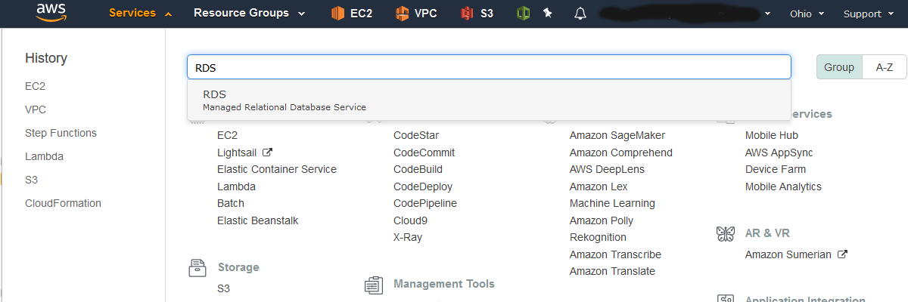 

2. From the RDS dashboard click on "DB Instances (1/40)" and then on the DB
   identifier for your database. Note the value of the "Info" field
3. Continue to use the same VPC ID as the command line argument to the scripts/programs below.  

* RDS Instance Failure in bash: Execute the failure mode script for failing over an RDS instance:

        $./failover_rds.sh <vpc-id>

* RDS Instance Failure in Python: Execute the failure mode script for failing an instance:

        $ python fail_rds.py <vpc-id>

* RDS Instance Failure in Java: Execute the failure mode program for failing an instance:

        $ java -jar app-resiliency-1.0.jar RDS <vpc-id>

* RDS Instance Failure in C#: Execute the failure mode program for failing an instance:

        $ .\AppResiliency RDS <vpc-id>

* RDS Instance Failure in Powershell: Execute the failure mode script for failing an instance:

        $ .\failover_rds.ps1 <vpc-id>

Watch the behavior of the website. What happens?  On the database console how does the "Info" field change? Click on the "Logs & events" sub-tab and look at "Recent events".  Be sure to click through to the
latest page of events. Be sure to re-check the behavior of the website.

### 3.3 AZ Failure

1. Availability zone failure.

* AZ Failure in bash: Execute the following script for failing over an Availability Zone:

        $./fail_az.sh <az> <vpc-id>

* AZ Failure in Python: Execute the failure mode script for failing an instance:

        $ python fail_az.py <vpc-id> <az>

* AZ Failure in Java: Execute the failure mode script for failing an instance:

        $ java -jar app-resiliency-1.0.jar AZ <vpc-id> <az>

* AZ Failure in C#: Execute the failure mode script for failing an instance:

        $ .\AppResiliency AZ <vpc-id> <az>

* AZ Failure in Powershell: Execute the failure mode script for failing an instance:

        $ .\fail_az.ps1 <az> <vpc-id>

What is the expected effect? How long does it take to take effect? Look at the Target Group Targets to see them go unhealthy, also watch the EC2 instances to see the one in the target AZ shutdown and be restarted in one of the other AZs.
What would you do if the ASG was only in one AZ? You could call the AutoScaling SuspendProcesses and then get the list of instances in the group and call EC2 StopInstances or TerminateInstances. How would you undo all these changes?

### 3.4 Failure of S3

1. Failure of S3 means that the image will not be available.

* Failure in bash: The bash commands available do not allow for modification of the access permissions, so you'll have to do the work in the console.
  1. Navigate to the S3 console: [https://s3.console.aws.amazon.com/s3/home](https://s3.console.aws.amazon.com/s3/home]
  1. Select the bucket where the image is located. In my example, this is the bucket "arc327-well-architected-for-reliability"
  1. Select the object, then select the "Permissions" tab:
  1. Select the "Public Access" radio button, and deselect the "Read object" box:

What is the expected effect? How long does it take to take effect? How would you diagnose if this is a larger problem than permissions?

### 3.5 Looking for more to do?

You can use drift detection in the CloudFormation console to see what had changed, or work on code to heal their failure modes.  

1. Remove the network ACLs they added  
2. Reconfigure the AutoScaling Groups to use the AZ  

***

## 4. Tear down this lab 

In order to take down the lab environment, you will need to remove the association of the Network ACL that was added to fail the AZ, and delete the Network ACL in the console. You can then delete the CloudFormation stacks (in both AWS regions) that were created. Here are the instructions for how to do that.

1. Navigate to the VPC Console. From the AWS Console, click the downward facing icon to the right of the word “Services.” This will bring up the list of services. Type “VPC” in the search box, then press enter.  
  
2. On the VPC Console, click on Network ACLs and select the Network ACL that is associated with 4 subnets in the ResiliencyVPC. Click the “Subnet Associations” tab and then Click the “Edit button.  
  
3. You need to associate the 2 subnets that were changed to the blocking Network ACL back to this default Network ACL. Select the 2 subnets available, then click the “Save” button.  
  
4. Now select the Network ACL that is associated with 0 Subnets and click the “Delete” button to delete this Network ACL.  
  
5. If you have deployed into 2 regions, you have to delete the Database Migration Service and RDS Read Replicas before you can delete the RDS instances.  You can delete the DMS (in Oregon) and read replica at the same time, but the console only allows you to select one of the stacks at a time. Select the “DMSforResiliencyTesting” stack, then click the “Actions” button, and click “DeleteStack:”.  
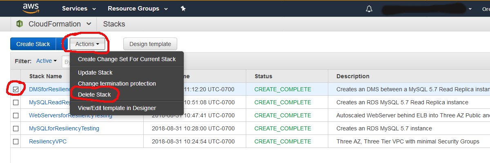  
6. You can then select the “MySQLReadReplicaResiliencyTesting” stack, click the “Actions” button, and click “Delete Stack” to simultaneously delete the RDS Read Replica instance.  
  
7. If you have deployed in 2 regions, Navigate to the other region (Ohio, if you started in Oregon, and Oregon, if you started in Ohio), and perform the same deletion steps above for the RDS read replica and DMS, if in Oregon. Wait for the read replicas to be deleted. You can delete the web servers and RDS at the same time, but the console only allows you to select one of the stacks at a time. Select the “WebServersforResiliencyTesting” stack, then click the “Actions” button, and click “Delete Stack:”.  
  
8. You can then select the “ MySQLforResiliencyTesting” stack, click the “Actions” button, and click “Delete Stack” to simultaneously delete the RDS instance.  
  
9. You can then select the “DeployResiliencyWorkshop” stack, click the “Actions” button, and click “Delete Stack” to simultaneously delete the deployment machine and Lambda functions.  
  
10. Once all these stacks have deleted, you can then select the “ResiliencyVPC” stack, click the “Actions” button, and click “Delete Stack” to delete the VPC and remove the last piece of infrastructure.  
  
11. When it is delete complete, you are done.  

***

## References & useful resources:

***

## License

### Documentation License

Licensed under the [Creative Commons Share Alike 4.0](https://creativecommons.org/licenses/by-sa/4.0/) license.

### Code License

Licensed under the Apache 2.0 and MITnoAttr License. 

Copyright 2018 Amazon.com, Inc. or its affiliates. All Rights Reserved.

Licensed under the Apache License, Version 2.0 (the "License"). You may not use this file except in compliance with the License. A copy of the License is located at

<https://aws.amazon.com/apache2.0/>

or in the "license" file accompanying this file. This file is distributed on an "AS IS" BASIS, WITHOUT WARRANTIES OR CONDITIONS OF ANY KIND, either express or implied. See the License for the specific language governing permissions and limitations under the License.
