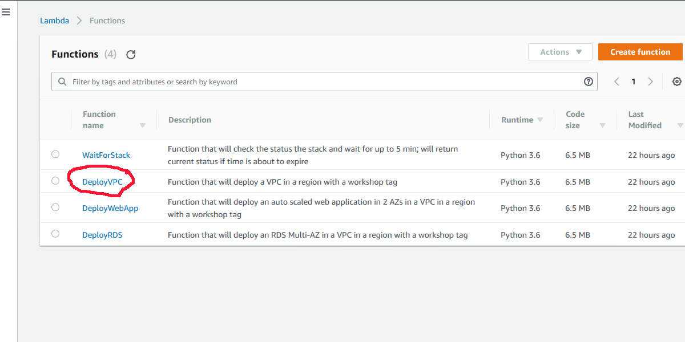
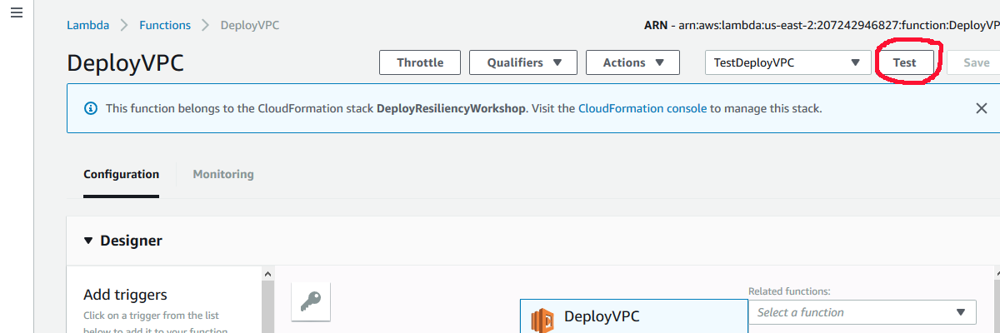

Troubleshooting Guide for 300 - Testing for Resiliency of EC2, RDS, and S3
==========================================================================

Introduction
------------

The purpose of this guide is to prepare for the expected questions and problems.

Common AWS Account Problems
---------------------------

If running these labs on your own, you will need to use an AWS account that meets the following qualifications. If you are at a live workshop, you may have been supplied with an AWS account for the lab. If not, and you cannot remedy your account issues, please see a proctor who can help pair you with another student who does have these permissions and you can “pair lab”.

You will need to be able to log into the console as a user with permissions to run CloudFormation. If you do not have permission to run CloudFormation, please create a new IAM User with these permissions or use a different AWS account.

The next most common problem in deploying the test application is exceeding the default limit of 5 Elastic IPs in an account. The VPC is created with 3 NAT Gateways, which each require an EIP. You will either will have to release some that you are using, or use a different AWS account.

The service linked roles may exist already in an account. If they do, you will see a failure to deploy the first CFN stack for `lambda_functions_for_deploy.json`. You should delete the stack and redeploy it, but please make sure you are appropriately setting the Boolean parameters of the deployment machine stack. If at a live workshop, please see a proctor if you need more help with this.

Problems with Service Linked Roles
----------------------------------

If you don’t see the existing service linked IAM Role and try to create it in the deployment machine, it will not deploy. It will fail back with an error that the Role already exists under another name. Simply set the parameter to **false** and redeploy.

Problems with the Step Functions State Machine and/or Lambda Functions
----------------------------------------------------------------------

The state machine is idempotent and can be re-run if something times out.

If a function fails, you can debug it by creating a test for the Lambda Function. For example, to the test the `DeployVPC` Lambda function, navigate to the StepFunctions console, and select the `DeployVPC` function in the Visual Workflow, and click on the Input in the Step details on the right:


Once you’ve clicked the Input, you can select the input and copy it into the copy buffer:


Then navigate to the Lambda console and click on the `DeployVPC` Lambda Function:



You can then click the down arrow to the left of the “Test” button with the
grayed text “Select a test event..” and click on “Configure test events:”


Name the event `TestDeployVPC` and insert the copied input from the step
function, then click “Create:”


Now you can click the “Test” button to execute the test:



After execution, you can click on the “Details” and see the log of the function to determine what went wrong:


You can also go to the CloudWatch logs to see details of the execution.

Problems Executing the Scripts
------------------------------

If you are not using Amazon Linux, you will need to install the AWS CLI.

Installing `jq` is pretty easy, just download the executable and install it
where the PATH will see it.

Older versions of bash and the windows bash implementation complain about the `{` and `}` characters in the sed commands. They can be deleted in older version of bash (but note that they are required in newer versions of bash).

Assisting with the Failure Tests
--------------------------------

### Failure modes individual

The shell script will delete the first instance it finds running the VPC. There shouldn’t be a problem with the jq parser of the JSON returned from the `ec2 describe-instances` but it is theoretically possible. If you get a `jq` error, it is more likely the web layer has not actually been created correctly.

If you see `null`s in output messages, it is possible that you are not specifying the correct VPC ID.

Installing `boto3` via `pip` on an Amazon Linux instance will cause you to have errors on the command line:

```
$ aws help

Traceback (most recent call last):

File "/usr/local/bin/aws", line 19, in \<module\>

import awscli.clidriver

File "/usr/local/lib/python2.7/dist-packages/awscli/clidriver.py", line 19, in
\<module\>

from botocore.hooks import AliasedEventEmitter

ImportError: cannot import name AliasedEventEmitter
```

To fix this, you need to remove the `aws-cli`, downgrade `boto`, and install an older version of the `aws-cli`:

```
$ sudo yum remove aws-cli

$ sudo yum downgrade python27-botocore 1.8

$ sudo yum install aws-cli-1.14.9
```

#### EC2 Instance Failure

Some additional questions to ask yourself:

1.  Open  `fail_instance.sh/fail_instance.py/InstanceFailover.java/InstanceFailover.cs` in an editor. How could you make this randomly select an instance?

2.  What are the concerns if you have hundreds or thousands of instances?

3.  What if you don’t have an Auto Scaling group? How could you recover?

4.  How do they test EC2 AutoRecovery? The answer is to open a support ticket.
    This requires extra effort on our side.

5.  How would you “undo” this failure mode?

#### RDS Failover

The console does not update the active AZ of the RDS instance until an unknown amount of time passes (~5 min). This can make it appear it didn’t fail over, but it did. You can see the failover in the events log of RDS.

If you see nulls in output messages, it is possible that you are not specifying the correct VPC ID.

Some additional questions to ask yourself:

1.  Why didn’t the Auto Scaling Group terminate them and replace the instances? Or why did it?

2.  How could you make the application resilient to the transient failure?

3.  What if this was a single AZ RDS?

4.  How would you fail the S3 portion of the application?

#### AZ Failure

The Java and C# implementations have some improved error checking over the bash implementation, but essentially perform the same logic.

This is what the failure simulation does:

1.  Loop through all the Auto Scaling Groups by calling Auto Scaling’s
    `DescribeAutoScalingGroups`; for each group, look at the AZs it is
    configured for. If the desired AZ in in the list, we can reconfigure the
    group by calling `UpdateAutoScalingGroup` to update the AZs to the list
    without this AZ in it.

2.  Call EC2’s `DescribeSubnets` to identify the subnets in the AZ desired
    within the VPC. It then creates a NACL, adds entries to block ingress and
    egress of all ports and protocols, then calls EC2’s
    `ReplaceNetworkAclAssociation` to associate the subnets with the NACL.
    This will cause the ELB to route traffic to the other AZs since it has Cross
    AZ enabled.

3.  Loop through all the RDS Instances by calling RDS `DescribeInstances`. If this instance’s `AvailabilityZone` is this AZ, then if it is an RDS
    Multi-AZ, call RDS `RebootDBInstance` with `ForceFailover` set to
    `True`.

Some additional questions to ask yourself:

1.  What is the expected effect? How long does it take to take effect? Look at the Target Group Targets to see them go unhealthy, also watch the EC2 instances to see the one in the target AZ shutdown and be restarted in one of the other AZs.

2.  What would you do if the ASG was only in one AZ? You could call the    AutoScaling SuspendProcesses and then get the list of instances in the group and call EC2 StopInstances or TerminateInstances

3.  How would you undo all these changes?

#### Region Failure

Unfortunately, you need a DNS domain registered to effect a Region failover, so you won’t be able to perform this failure. However, you can think about how you would simulate it.

Route53 uses HealthChecks to see if the destination is available. You could use the network ACL modification above that relates to the AZ to specify that change on the health check endpoint. (A `SecurityGroup` modification would likely work as well). This would cause the HeathCheck to fail and the record set to use the second region. You would want to also have an alert fire on this and send a call to DMS `StopReplicationTask` to stop the replication if you are using DMS to replicate data to an instance in a second AWS Region.

Some additional questions to ask yourself:

How would you fail back? You could set up a DMS instance that is configured for the source and target going the other way, then recover by call `StartReplicationTask`, using a load and cdc configuration.
