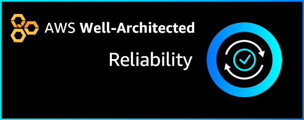

# AWS Well-Architected Reliability Labs

This repository contains documentation and code for hands-on-labs to help you learn how to learn, measure, and build using AWS Well-Architected best practices for reliability. The labs are categorized into levels, where 100 is introductory, 200/300 is intermediate and 400 is advanced.

**Reliability** is the ability of a workload to perform its intended function correctly and consistently when it’s expected to. This includes the ability to operate and test the workload through its total lifecycle

For more information about Reliability, read the
[AWS Well-Architected Reliability whitepaper](https://d1.awsstatic.com/whitepapers/architecture/AWS-Reliability-Pillar.pdf).

## Reliability Labs

* Implement change:
    * [Level 200: Deploy and Update CloudFormation](200_Deploy_and_Update_CloudFormation/README.md)
* Mitigate or withstand failures:
    * [Level 300: Implementing Health Checks and Managing Dependencies to Improve Reliability](300_Health_Checks_and_Dependencies/README.md)
* Data backup and disaster recovery (DR):
    * [Level 200: Testing Backup and Restore of Data](200_Testing_Backup_and_Restore_of_Data/README.md)
    * [Level 200: Implementing Bi-Directional Cross-Region Replication for Amazon Simple Storage Service (Amazon S3)](200_Bidirectional_Replication_for_S3/README.md)
* Testing resiliency and chaos engineering:
    * [Level 200: Testing for Resiliency of EC2](200_Testing_for_Resiliency_of_EC2/README.md)
    * [Level 300: Testing for Resiliency of EC2, RDS, and S3](300_Testing_for_Resiliency_of_EC2_RDS_and_S3/README.md)
        * Note: The 300 lab _includes_ all the contents of the 200 lab

## License

### Documentation License

Licensed under the [Creative Commons Share Alike 4.0](https://creativecommons.org/licenses/by-sa/4.0/) license.

### Code LicenseLicensed under the Apache 2.0 and MITnoAttr License

Copyright 2019 Amazon.com, Inc. or its affiliates. All Rights Reserved.

Licensed under the Apache License, Version 2.0 (the "License"). You may not use this file except in compliance with the License. A copy of the License is located at

    https://aws.amazon.com/apache2.0/

or in the "license" file accompanying this file. This file is distributed on an "AS IS" BASIS, WITHOUT WARRANTIES OR CONDITIONS OF ANY KIND, either express or implied. See the License for the specific language governing permissions and limitations under the License.
