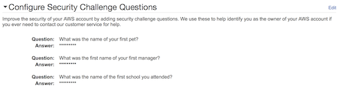
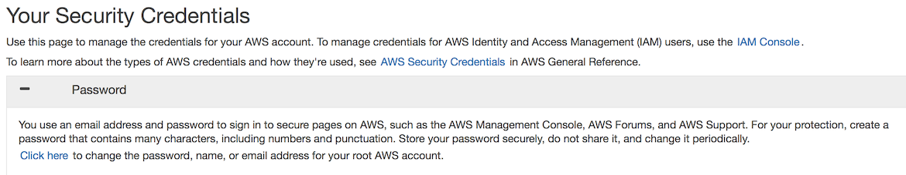

# Level 100: AWS Account & Root User: Lab Guide

## 1. Account Settings & Root User Security
When you first create an Amazon Web Services (AWS) account, you begin with a single sign-in identity that has complete access to all AWS services and resources in the account. This identity is called the AWS account root user and is accessed by signing in with the email address and password that you used to create the account.
We strongly recommend that you do not use the root user for your everyday tasks, even the administrative ones. Instead, adhere to the best practice of using the root user only to create your first IAM user. Then securely lock away the root user credentials and use them to perform only a few account and service management tasks. To view the tasks that require you to sign in as the root user, see [AWS Tasks That Require Root User](http://docs.aws.amazon.com/general/latest/gr/aws_tasks-that-require-root.html).

### 1.1 Generate and Review the AWS Account Credential Report
You should audit your security configuration in the following situations:
 
* On a periodic basis. You should perform the steps described in this document at regular intervals as a best practice for security.
* If there are changes in your organization, such as people leaving.
* If you have stopped using one or more individual AWS services. This is important for removing permissions that users in your account no longer need.
* If you've added or removed software in your accounts, such as applications on Amazon EC2 instances, AWS OpsWorks stacks, AWS CloudFormation templates, etc.
* If you ever suspect that an unauthorized person might have accessed your account.
As you review your account's security configuration, follow these guidelines:
* **Be thorough**. Look at all aspects of your security configuration, including those you might not use regularly.
* **Don't assume**. If you are unfamiliar with some aspect of your security configuration (for example, the reasoning behind a particular policy or the existence of a role), investigate the business need until you are satisfied.
* **Keep things simple**. To make auditing (and management) easier, use IAM groups, consistent naming schemes, and straightforward policies.

*More information can be found at [https://docs.aws.amazon.com/general/latest/gr/aws-security-audit-guide.html*](https://docs.aws.amazon.com/general/latest/gr/aws-security-audit-guide.html)

You can use the AWS Management Console to download a credential report as a comma-separated values (CSV) file.
To download a credential report using the AWS Management Console:

1. Sign in to the AWS Management Console and open the IAM console at [https://console.aws.amazon.com/iam/](https://console.aws.amazon.com/iam/).
2. In the navigation pane, click Credential report.
3. Click Download Report.

*Further information about the report can be found at https://docs.aws.amazon.com/IAM/latest/UserGuide/id_credentials_getting-report.html*

### 1.2 Configure Account Security Challenge Questions
Configure account security challenge questions because they are used to verify that you own an AWS account.

1. Sign in to the AWS Management Console and open the AWS account settings page at [https://console.aws.amazon.com/billing/home?#/account/](https://console.aws.amazon.com/billing/home?#/account/).
2. Navigate to security challenge questions configuration section.
3. Select three challenge questions and enter answers for each.

4. Securely store the questions and answers as you would passwords or other credentials.
5. Click update.

### 1.3 Enable a Virtual MFA Device for Your AWS Account Root User
You can use IAM in the AWS Management Console to configure and enable a virtual MFA device for your root user. To manage MFA devices for the AWS account, you must be signed in to AWS using your root user credentials. You cannot manage MFA devices for the root user using other credentials.

If your MFA device is lost, stolen, or not working, you can still sign in using alternative factors of authentication. To do this, you must verify your identity using the email and phone that are registered with your account. This means that if you can't sign in with your MFA device, you can sign in by verifying your identity using the email and phone that are registered with your account. Before you enable MFA for your root user, review your account settings and contact information to make sure that you have access to the email and phone number. To learn about signing in using alternative factors of authentication, see [What If an MFA Device Is Lost or Stops Working](https://docs.aws.amazon.com/IAM/latest/UserGuide/id_credentials_mfa_lost-or-broken.html)?. To disable this feature, contact [AWS Support](https://console.aws.amazon.com/support/home#/).

1. Sign in to the AWS Management Console and open the IAM console at https://console.aws.amazon.com/iam/.
2. Do one of the following:

   * **Option 1**: Choose Dashboard, and under Security Status, expand Activate MFA on your root user.

   * **Option 2**: On the right side of the navigation bar, choose your account name, and choose Security Credentials. If necessary, choose Continue to Security Credentials. Then expand the Multi-Factor Authentication (MFA) section on the page.
        

3. Choose Manage MFA or Activate MFA, depending on which option you chose in the preceding step.
4. In the wizard, choose A virtual MFA device and then choose Next Step.
5. Confirm that a virtual MFA app is installed on the device, and then choose Next Step. IAM generates and displays configuration information for the virtual MFA device, including a QR code graphic. The graphic is a representation of the secret configuration key that is available for manual entry on devices that do not support QR codes.
6. With the Manage MFA Device wizard still open, open the virtual MFA app on the device.
7. If the virtual MFA software supports multiple accounts (multiple virtual MFA devices), then choose the option to create a new account (a new virtual device).
8. The easiest way to configure the app is to use the app to scan the QR code. If you cannot scan the code, you can type the configuration information manually.
   * To use the QR code to configure the virtual MFA device, follow the app instructions for scanning the code. For example, you might need to tap the camera icon or tap a command like Scan account barcode, and then use the device's camera to scan the QR code.
   * If you cannot scan the code, type the configuration information manually by typing the Secret Configuration Key value into the app. For example, to do this in the AWS Virtual MFA app, choose Manually add account, and then type the secret configuration key and choose Create.

    **Important**

    Make a secure backup of the QR code or secret configuration key, or make sure that you enable multiple virtual MFA devices for your account. A virtual MFA device might become unavailable, for example, if you lose the smartphone where the virtual MFA device is hosted). If that happens, you will not be able to sign in to your account and you will have to contact customer service to remove MFA protection for the account.

    **Note**

    The QR code and secret configuration key generated by IAM are tied to your AWS account and cannot be used with a different account. They can, however, be reused to configure a new MFA device for your account in case you lose access to the original MFA device.

    The device starts generating six-digit numbers.

9. In the Manage MFA Device wizard, in the Authentication Code 1 box, type the six-digit number that's currently displayed by the MFA device. Wait up to 30 seconds for the device to generate a new number, and then type the new six-digit number into the Authentication Code 2 box.

   **Important**

   Submit your request immediately after generating the codes. If you generate the codes and then wait too long to submit the request, the MFA device successfully associates with the user but the MFA device is out of sync. This happens because time-based one-time passwords (TOTP) expire after a short period of time. If this happens, you can resync the device.

10. Choose Next Step, and then choose Finish.

The device is ready for use with AWS. For information about using MFA with the AWS Management Console, see [Using MFA Devices With Your IAM Sign-in Page](https://docs.aws.amazon.com/IAM/latest/UserGuide/console_sign-in-mfa.html).

### 1.4 Remove Your AWS Account Root User Access Keys
You use an access key (an access key ID and secret access key) to make programmatic requests to AWS. However, **do not** use your AWS account root user access key. The access key for your AWS account gives full access to all your resources for all AWS services, including your billing information. You cannot restrict the permissions associated with your AWS account access key.

* Check in the credential report; if you don't already have an access key for your AWS account, don't
create one unless you absolutely need to. Instead, use your account email address and password to sign
in to the AWS Management Console and create an IAM user for yourself that has administrative privileges.
This will be explained in a later section.
* If you do have an access key for your AWS account, delete it unless you have a specific requirement. To delete or rotate your AWS account access keys, go to the [Security Credentials](https://console.aws.amazon.com/iam/home?#security_credential) page in the AWS Management Console and sign in with your account's email address and password. You can manage your access keys in the Access keys section.

* Never share your AWS account password or access keys with anyone.

### 1.5 Periodically Change the AWS Account Root User Password
You must be signed in as the AWS account root user in order to change the password. To learn how to reset a forgotten root user password, see [Resetting Your Lost or Forgotten Passwords or Access Keys](https://docs.aws.amazon.com/IAM/latest/UserGuide/id_credentials_access-keys_retrieve.html).

To change the password for the root user:

1. Use your AWS account email address and password to sign in to the AWS Management Console as the root user.

   **Note**

     If you previously signed in to the console with IAM user credentials, your browser might remember this preference and open your account-specific sign-in page. You cannot use the IAM user sign-in page to sign in with your AWS account root user credentials. If you see the IAM user sign-in page, choose Sign-in using root account credentials near the bottom of the page to return to the main sign-in page. From there, you can type your AWS account email address and password.

2. In the upper right corner of the console, choose your account name or number and then choose My Account.
3. On the right side of the page, next to the Account Settings section, choose Edit.
4. On the Password line choose Click here to change your password.

5. Choose a strong password. Although you can set an account password policy for IAM users, that policy does not apply to your AWS account root user.

   AWS requires that your password meet these conditions:

   * have a minimum of 8 characters and a maximum of 128 characters
   * include a minimum of three of the following mix of character types: uppercase, lowercase, numbers, and `! @ # $ % ^ & * () <> [] {} | _ + - =` symbols
   * not be identical to your AWS account name or email address

    **Note**

   AWS is rolling out improvements to the sign-in process. One of those improvements is to enforce a more secure password policy for your account. If your account has been upgraded, you are required to meet the password policy above. If your account has not yet been upgraded, then AWS does not enforce this policy, but highly recommends that you follow its guidelines for a more secure password.

    To protect your password, it's important to follow these best practices:

   * Change your password periodically and keep your password private, since anyone who knows your password
   can access your account.
   * Use a different password on AWS than you use on other sites.
   * Avoid passwords that are easy to guess. These include passwords such as secret, password, amazon, or 123456. They also include things like a dictionary word, your name, email address, or other personal information that can easily be obtained.

### 1.6 Configure a Strong Password Policy for Your Users
You can set a password policy on your AWS account to specify complexity requirements and mandatory rotation periods for your IAM users' passwords. The IAM password policy does not apply to the AWS root account password.

To create or change a password policy:

1. Sign in to the AWS Management Console and open the IAM console at https://console.aws.amazon.com/iam/.
2. In the navigation pane, click Account Settings.
3. In the Password Policy section, select the options you want to apply to your password policy.
4. Click Apply Password Policy.

### 1.7 AWS CloudFormation to Configure Customized AWS CloudTrail
[AWS CloudTrail](https://aws.amazon.com/cloudtrail/) is a service that enables governance, compliance, operational auditing, and risk auditing of your AWS account. With CloudTrail, you can log, continuously monitor, and retain account activity related to actions across your AWS infrastructure. CloudTrail provides event history of your AWS account activity, including actions taken through the AWS Management Console, AWS SDKs, command line tools, and other AWS services.
Using [AWS CloudFormation](https://aws.amazon.com/cloudformation/), we are going to create a new Amazon
S3 bucket, and configure CloudTrail to send events to the bucket and to [Amazon CloudWatch Logs](https://aws.amazon.com/cloudwatch/)
for further analysis.

1. Sign in to the AWS Management Console, select your preferred region, and open the CloudFormation console at https://console.aws.amazon.com/cloudformation/.
2. Click Create New Stack.
3. Select Specify an Amazon S3 template URL and enter the following URL for the template: `https://s3-us-west-2.amazonaws.com/aws-well-architected-labs/Security/Code/baseline-cloudtrail.yaml` and click Next.
4. Enter the following details:
  * Stack name: The name of this stack. For this lab, use `cloudtrail`.
  * CloudTrailBucketName: The name of the new S3 bucket to create for CloudTrail to send logs to.  **IMPORTANT** Specify a bucket name that is unique. The default bucket name likely has already been created.  
  * S3AccessLogsBucketName: The name of an existing S3 bucket for storing S3 access logs (optional).
  * CloudWatchLogsRetentionTime: Number of days to retain logs in CloudWatch Logs.
  * EncryptLogs: (optional) Use AWS KMS to encrypt logs stored in Amazon S3. A new KMS key will be created.
  * BucketPolicyExplicitDeny: (optional) Explicitly deny destructive actions to the bucket. AWS root user will be required to modify this bucket if configured.
  * ExpirationDays: Number of days to retain logs in the S3 bucket before they are automatically deleted.
5. Click Next.

6. In this scenario, we won't add any tags or other options. Click Next. Tags, which are key-value pairs, can help you identify your stacks. For more information, see [Adding Tags to Your AWS CloudFormation Stack](http://docs.aws.amazon.com/AWSCloudFormation/latest/UserGuide//cfn-console-add-tags.html).
7. Review the information for the stack. When you're satisfied with the settings, click Next.
8. Select I acknowledge that AWS CloudFormation might create IAM resources with custom names, and click
Create.
9. After a few minutes the stack status should change from CREATE_IN_PROGRESS to CREATE_COMPLETE.
You have now set up CloudTrail to log to your bucket and retain events, giving you the ability to search history and later enable pro-active monitoring of your AWS account!

***

## 2. IAM Users & Groups
As a best practice, do not use the AWS account root user for any task where it's not required. Instead, create a new IAM user for each person that requires administrator access. Then make those users administrators by placing the users into an "Administrators" group to which you attach the AdministratorAccess managed policy.
Thereafter, the users in the administrators group should set up the groups, users, and so on, for the AWS account. All future interaction should be through the AWS account's users and their own keys instead of the root user.

### 2.1 Create Administrator IAM User and Group
To create an administrator user for yourself and add the user to an administrators group:

1. Use your AWS account email address and password to sign in as the AWS account root user to the IAM console at https://console.aws.amazon.com/iam/.
2. In the navigation pane, choose Users and then choose Add user.

3. For User name, type a user name, such as Administrator. The name can consist of letters, digits, and the following characters: plus `(+)`, equal `(=)`, comma `(,)`, period `(.)`, at `(@)`, underscore `(_)`, and hyphen `(-)`. The name is not case sensitive and can be a maximum of 64 characters in length.
4. Select the check box next to AWS Management Console access, select Custom password, and then type your new password in the text box. If you're creating the user for someone other than yourself, you can optionally select Require password reset to force the user to create a new password when first signing in.

5. Choose Next: Permissions.
6. On the Set permissions for user page, choose Add user to group.
7. Choose Create group.
8. In the Create group dialog box, type the name for the new group. The name can consist of letters, digits, and the following characters: `plus (+), equal (=), comma (,), period (.), at (@), underscore (_), and hyphen (-).` The name is not case sensitive and can be a maximum of 128 characters in length.
9. In the policy list, select the check box next to AdministratorAccess. Then choose Create group.
10. Back in the list of groups, select the check box for your new group. Choose Refresh if necessary to see the group in the list.

11. Choose Next: Review to see the list of group memberships to be added to the new user. When you are ready to proceed, choose Create user.

You can use this same process to create more groups and users and to give your users access to your AWS account resources. To learn about using policies that restrict user permissions to specific AWS resources, see [Access Management](https://docs.aws.amazon.com/IAM/latest/UserGuide/access.html) and [Example Policies](https://docs.aws.amazon.com/IAM/latest/UserGuide/access_policies_examples.html). To add users to the group after it's created, see [Adding and Removing Users in an IAM Group](https://docs.aws.amazon.com/IAM/latest/UserGuide/id_groups_manage_add-remove-users.html).
12. Configure MFA on your new administrator user by choosing Users from the navigation pane.
13. In the User Name list, choose the name of the intended MFA user.
14. Choose the Security credentials tab. Next to Assigned MFA device, choose the edit icon.

15. You can now use this administrator user instead of your root user for this AWS account.

### 2.2 AWS CloudFormation to Create a Group, Policies and Roles with MFA Enforced
Using [AWS CloudFormation](https://aws.amazon.com/cloudformation/) we are going to deploy a set of groups,
roles, and managed policies that will help with your "baseline" of your AWS account.

1. Sign in to the AWS Management Console, select your preferred region, and open the CloudFormation console at [https://console.aws.amazon.com/cloudformation/](https://console.aws.amazon.com/cloudformation/).
2. Click Create New Stack.
3. Select Specify an Amazon S3 template URL and enter the following URL for the template: `https://s3-us-west-2.amazonaws.com/aws-well-architected-labs/Security/Code/baseline-iam.yaml` and click Next.
4. Enter the following details:
  * Stack name: The name of this stack. For this lab, use `baseline-iam`.
  * AllowRegion: A single region to restrict access, for future use.
  * BaselineExportName: The CloudFormation export name prefix used with the resource name for the resources
  created, for example, Baseline-PrivilegedAdminRole.
  * BaselineNamePrefix: The prefix for roles, groups, and policies created by this stack.
  * IdentityManagementAccount: (optional) AccountId that is trusted to assume all roles, or blank for no cross-account trust. Note that the trusted account also needs to be appropriately secured.
  * OrganizationsRootAccount: (optional) AccountId that is trusted to assume Organizations role, or blank for no cross-account trust. Note that the trusted account also needs to be appropriately secured.
  * ToolingManagementAccount: AccountId that is trusted to assume the ReadOnly and StackSet roles, or blank for no cross-account trust. Note that the trusted account also needs to be appropriately secured.
5. Click Next.
6. In this scenario, we won't add any tags or other options. Click Next. Tags, which are key-value pairs, can help you identify your stacks. For more information, see [Adding Tags to Your AWS CloudFormation Stack](http://docs.aws.amazon.com/AWSCloudFormation/latest/UserGuide//cfn-console-add-tags.html).
7. Review the information for the stack. When you're satisfied with the settings, click Next.
8. Select I acknowledge that AWS CloudFormation might create IAM resources with custom names, and click
Create.
9. After a few minutes, the stack status should change from CREATE_IN_PROGRESS to CREATE_COMPLETE.
10. You have now set up a number of managed polices, groups, and roles that you can test to improve your
AWS account security!

### 2.3 Use Restricted Administrator Role in Console
A *role* specifies a set of permissions that you can use to access AWS resources that you need. In that sense, it is similar to a user in AWS Identity and Access Management (IAM). When you sign in as a user, you get a specific set of permissions. However, you don't sign in to a role, but once signed in you can switch to a role. This temporarily sets aside your original user permissions and instead gives you the permissions assigned to the role. The role can be in your own account or any other AWS account. By default, your AWS Management Console session lasts for one hour.

  **Important**

    The permissions of your IAM user and any roles that you switch to are not cumulative. Only one set of permissions is active at a time. When you switch to a role, you temporarily give up your user permissions and work with the permissions that are assigned to the role. When you exit the role, your user permissions are automatically restored.

1. Sign in to the AWS Management Console as an IAM user https://console.aws.amazon.com.
2. In the IAM console, choose your user name on the navigation bar in the upper right. It typically looks like this: `username@account_ID_number_or_alias`.
3. Choose Switch Role. If this is the first time choosing this option, a page appears with more information. After reading it, choose Switch Role. If you clear your browser cookies, this page can appear again.
4. On the Switch Role page, type the account ID number or the account alias and the name of the role that
you created for the Restricted Admin in the previous step, for example, `arn:aws:iam::account_ID:role/Baseline-RestrictedAdmin`.
5. (Optional) Type text that you want to appear on the navigation bar in place of your user name when this role is active. A name is suggested, based on the account and role information, but you can change it to whatever has meaning for you. You can also select a color to highlight the display name. The name and color can help remind you when this role is active, which changes your permissions. For example, for a role that gives you access to the test environment, you might specify a Display Name of Test and select the green Color. For the role that gives you access to production, you might specify a Display Name of Production and select red as the Color.
6. Choose Switch Role. The display name and color replace your user name on the navigation bar, and you can start using the permissions that the role grants you.

    **Tip**

	The last several roles that you used appear on the menu. The next time you need to switch to one of those roles, you can simply choose the role you want. You only need to type the account and role information manually if the role is not displayed on the Identity menu.
7. You are now using the role with the granted permissions!
	**To stop using a role**
    In the IAM console, choose your role's Display Name on the right side of the navigation bar.
    Choose Back to UserName. The role and its permissions are deactivated, and the permissions associated with your IAM user and groups are automatically restored.

***

### 3. Tear down this lab
The following instructions will remove the resources that have a cost for running them. Please note that
the changes you made to the root login, users, groups, and policies have no charges associated with them.

Delete the CloudTrail stack:
1. Sign in to the AWS Management Console, and open the CloudFormation console at https://console.aws.amazon.com/cloudformation/.
2. Select the `cloudtrail` stack.
3. Click the Actions button then click Delete Stack.
4. Confirm the stack and then click the Yes, Delete button.

Empty and delete the CloudTrail bucket:
1. Sign in to the AWS Management Console, and open the S3 console at https://console.aws.amazon.com/s3/.
2. Select the bucket name you previously created without clicking the name.
  
3. Click Empty bucket and enter the bucket name in the confirmation box.  
  
4. Click Confirm and the bucket will be emptied when the bottom task bar has 0 operations in progress.  
  
5. With the bucket now empty, click Delete bucket.

6. Enter the bucket name in the confirmation box and click Confirm.
  
7. The bucket will then be removed from the console.

***

## References & useful resources:
[AWS Identity and Access Management User Guide](https://docs.aws.amazon.com/IAM/latest/UserGuide/introduction.html)  
[IAM Best Practices and Use Cases](https://docs.aws.amazon.com/IAM/latest/UserGuide/IAMBestPracticesAndUseCases.html)  
[AWS CloudTrail User Guide](https://docs.aws.amazon.com/awscloudtrail/latest/userguide/cloudtrail-user-guide.html)  
[AWS CloudFormation User Guide](https://docs.aws.amazon.com/AWSCloudFormation/latest/UserGuide/Welcome.html)  

***

## License
Licensed under the Apache 2.0 and MITnoAttr License. 

Copyright 2018 Amazon.com, Inc. or its affiliates. All Rights Reserved.

Licensed under the Apache License, Version 2.0 (the "License"). You may not use this file except in compliance with the License. A copy of the License is located at

    http://aws.amazon.com/apache2.0/

or in the "license" file accompanying this file. This file is distributed on an "AS IS" BASIS, WITHOUT WARRANTIES OR CONDITIONS OF ANY KIND, either express or implied. See the License for the specific language governing permissions and limitations under the License.
