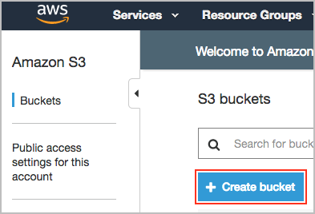
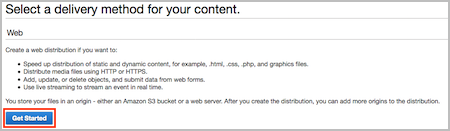

# Level 100: CloudFront with S3 Bucket Origin: Lab Guide

## 1. Create S3 bucket
Create an Amazon S3 bucket to host static content using the Amazon S3 console.
For more information about Amazon S3, see [Introduction to Amazon S3](https://docs.aws.amazon.com/AmazonS3/latest/dev/Introduction.html).

1. Open the Amazon S3 console at [https://console.aws.amazon.com/s3/](https://console.aws.amazon.com/s3/).  
2. From the console dashboard, choose **Create bucket**.  

3. Enter a name for your bucket, type a unique DNS-compliant name for your new bucket. Follow these naming guidelines:

  * The name must be unique across all existing bucket names in Amazon S3.
  * The name must not contain uppercase characters.
  * The name must start with a lowercase letter or number.
  * The name must be between 3 and 63 characters long.  

4. Choose an AWS Region where you want the bucket to reside. Choose a Region close to you to minimize latency and costs, or to address regulatory requirements.  
  Note that for this example we will accept the default settings and this bucket is secure by default. Consider enabling additional security options such as logging and encryption, the S3 documentation has additional information such as [Protecting Data in Amazon S3](https://docs.aws.amazon.com/AmazonS3/latest/dev/DataDurability.html).
5. Click **Create**.  


***


## 2. Upload example index.html file
1. Create a simple index.html file, you can create by coping the following text into your favourite text editor.
```
 <!DOCTYPE html>
<html>
<head>
<title>Example</title>
</head>
<body>

<h1>Example Heading</h1>
<p>Example paragraph.</p>

</body>
</html> 
```
2. Open the Amazon S3 console at [https://console.aws.amazon.com/s3/](https://console.aws.amazon.com/s3/).  
3. In the console click the name of your bucket you just created.  
4. Click the **Upload** button.  
  
5. Click the **Add files** button, select your index.html file, then click the **Upload** button.  
  
5. Your index.html file should now appear in the list.  
  
 

***


## 3. Configure Amazon CloudFront
Using the AWS Management Console, we will create a CloudFront distribution, and configure it to serve the S3 bucket we previously created.

1. Open the Amazon CloudFront console at [https://console.aws.amazon.com/cloudfront/home](https://console.aws.amazon.com/cloudfront/home).
2. From the console dashboard, click **Create Distribution**.  
  
3. Click **Get Started** in the Web section.  
  
4. Specify the following settings for the distribution:
  * In the **Origin Domain Name** field Select the S3 bucket you created previously.
  * In **Restrict Bucket Access** click the **Yes** radio then click **Create a New Identity**.
  * Click the **Yes, Update Bucket Policy Button**.
    
  * Scroll down to the **Distribution Settings** section, in the **Default Root Object** field enter *index.html*
  * Click Create Distribution.
  * To return to the main CloudFront page click **Distributions** from the left navigation menu.
  * For more information on the other configuration options, see [Values That You Specify When You Create or Update a Web Distribution](https://docs.aws.amazon.com/AmazonCloudFront/latest/DeveloperGuide/distribution-web-values-specify.html) in the CloudFront documentation.
5. After CloudFront creates your distribution which may take approximately 10 minutes, the value of the Status column for your distribution will change from **In Progress** to **Deployed**.
  
6. When your distribution is deployed, confirm that you can access your content using your new CloudFront **Domain Name** which you can see in the console. Copy the Domain Name into a web browser to test.
  
For more information, see [Testing a Web Distribution](https://docs.aws.amazon.com/AmazonCloudFront/latest/DeveloperGuide/distribution-web-testing.html) in the CloudFront documentation.
7. You now have content in a private S3 bucket, that only CloudFront has secure access to. CloudFront then serves the requests, effectively becoming a secure, reliable static hosting service with additional features available such as [custom certificates](https://docs.aws.amazon.com/AmazonCloudFront/latest/DeveloperGuide/using-https.html) and alternate [domain names](https://docs.aws.amazon.com/AmazonCloudFront/latest/DeveloperGuide/CNAMEs.html).

For more information on configuring CloudFront, see [Viewing and Updating CloudFront Distributions](https://docs.aws.amazon.com/AmazonCloudFront/latest/DeveloperGuide/HowToUpdateDistribution.html) in the CloudFront documentation.


***


### 4. Tear down this lab
The following instructions will remove the CloudFront distribution and S3 bucket created in this lab.

Delete the CloudFront distribution:

1. Open the Amazon CloudFront console at https://console.aws.amazon.com/cloudfront/home.
2. From the console dashboard, select the distribution you created earlier and click the Disable button.
To confirm, click the Yes, Disable button.
3. After approximately 15 minutes when the status is **Disabled**, select the distribution and click the **Delete**.
button, and then to confirm click the Yes, Delete button.

Delete the S3 bucket:

1. Open the Amazon S3 console at [https://console.aws.amazon.com/s3/](https://console.aws.amazon.com/s3/).  
2. Check the box next to the bucket you created previously, then click **Empty** from the menu.
3. Confirm the bucket you are emptying.  
4. Once the bucket is empty check the box next to the bucket, then click **Delete** from the menu.  
5. Confirm the bucket you are deleting.  


***

## References & useful resources:
[Amazon S3 Developer Guide](https://docs.aws.amazon.com/AmazonS3/latest/dev/Welcome.html)  
[Amazon CloudFront Developer Guide](https://docs.aws.amazon.com/AmazonCloudFront/latest/DeveloperGuide/Introduction.html)  

***

## License
Licensed under the Apache 2.0 and MITnoAttr License. 

Copyright 2019 Amazon.com, Inc. or its affiliates. All Rights Reserved.

Licensed under the Apache License, Version 2.0 (the "License"). You may not use this file except in compliance with the License. A copy of the License is located at

    https://aws.amazon.com/apache2.0/

or in the "license" file accompanying this file. This file is distributed on an "AS IS" BASIS, WITHOUT WARRANTIES OR CONDITIONS OF ANY KIND, either express or implied. See the License for the specific language governing permissions and limitations under the License.


