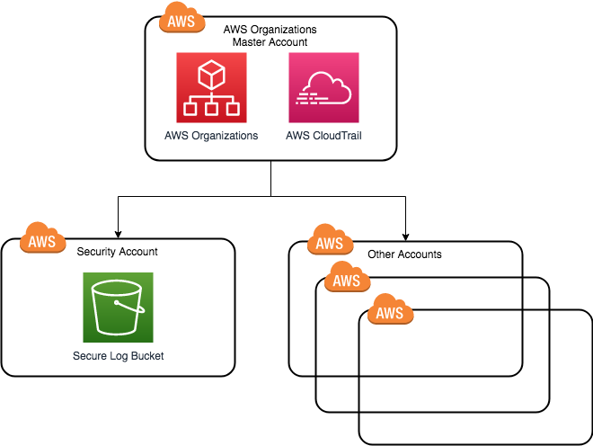

# Level 100: Create a Data Bunker Account

## Overview

In this lab we will create a secure data bunker. A data bunker is a secure account which will hold important security data in a secure location. Ensure that only members of your security team have access to this account. In this lab we will create a new security account, create a secure S3 bucket in that account and then turn on CloudTrail for our organisation to send these logs to the bucket in the secure data account. You may want to also think about what other data you need in there such as secure backups.



## Prerequisites

* An multi-account structure with AWS Organizations has been setup for your organization
* You have access to a role with administrative access to the root account for your AWS Organization

NOTE: You will be billed for the AWS CloudTrail logs and Amazon S3 storage setup as part of this lab. See [AWS CloudTrail Pricing](https://aws.amazon.com/cloudtrail/pricing/) and [Amazon S3 Pricing](https://aws.amazon.com/s3/pricing/) for further details.

## Detailed Instructions

### 1. (Highly reccomended) Create a Security account from the organizations master account
Best practice is to have a seperate security account for your data bunker. This account should only be accessible by folks in your security group with a read only role. How you create this account will depend on your organization's policies, the instructions below are guidance on how to do this. If you do not currently have organizations setup see the quest [Quick Steps to Security Success](../quest_100_Quick_Steps_to_Security_Success/README.md) or read [the multi account strategy whitepaper](https://d0.awsstatic.com/aws-answers/AWS_Multi_Account_Security_Strategy.pdf) for a more in-depth discussion.

1. Login to the master account of your AWS Organization
2. If you do not have an account within your organization to store security logs. Navigate to AWS Organizations and select **Create Account**. Include a cross account access role and note it's name (default is OrganizationAccountAccessRole) - we will modify this later to remove unnecessary access
3. (Optional) If your role does not have permission to assume any role you will also have to add an IAM policy. The AWS administrator policy has this by default, otherwise follow the steps in the [AWS Organizations Documentation](https://docs.aws.amazon.com/organizations/latest/userguide/orgs_manage_accounts_access.html#orgs_manage_accounts_access-cross-account-role) to grant permissions to access the role
4. Consider applying best practices as a baseline such as [lock away your AWS account root user access keys](https://docs.aws.amazon.com/IAM/latest/UserGuide/best-practices.html#lock-away-credentials) and [using multi-factor authentication](https://docs.aws.amazon.com/IAM/latest/UserGuide/id_credentials_mfa.html)
5. Navigate to **Settings** and take a note of your Organization ID

### 2. Create the bucket for CloudTrail logs
1. Swtich roles into the security account for your organization 
1. Navigate to S3
2. Press **Create Bucket**
3. Enter a *name* for your bucket, make note of it and click **Next**
4. Under configuration options *enable versioning* and *enable object lock*. This will prevent our logs from being deleted. Press **Next**
5. Do not modify any permissions - press **Next**
6. Press **Create Bucket**
7. Press the bucket we just create and navigate to the **Properties** tab
8. Under **Object Lock**, *enable compliance mode* and set a *retention period*. The length of the retention period will depend on your organisational requirements. If you are enabling this just for baseline security start with 31 days to keep one month of logs
9. Under the **Permissions** tab, replace the Bucket Policy with the following, replacing [bucket] and [organization id]. Pres **Save**
```json
{
    "Version": "2012-10-17",
    "Statement": [
        {
            "Sid": "AWSCloudTrailAclCheck20150319",
            "Effect": "Allow",
            "Principal": {
                "Service": "cloudtrail.amazonaws.com"
            },
            "Action": "s3:GetBucketAcl",
            "Resource": "arn:aws:s3:::[bucket]"
        },
        {
            "Sid": "AWSCloudTrailWrite20150319",
            "Effect": "Allow",
            "Principal": {
                "Service": "cloudtrail.amazonaws.com"
            },
            "Action": "s3:PutObject",
            "Resource": "arn:aws:s3:::[bucket]/AWSLogs/*",
            "Condition": {
                "StringEquals": {
                    "s3:x-amz-acl": "bucket-owner-full-control"
                }
            }
        },
        {
            "Sid": "AWSCloudTrailWrite20150319",
            "Effect": "Allow",
            "Principal": {
                "Service": "cloudtrail.amazonaws.com"
            },
            "Action": "s3:PutObject",
            "Resource": "arn:aws:s3:::[bucket]/AWSLogs/[organization id]/*",
            "Condition": {
                "StringEquals": {
                    "s3:x-amz-acl": "bucket-owner-full-control"
                }
            }
        }
    ]
}
```
10. (Optional) Next we will add a lifecycle policy to clean up old logs. Navigate to **Management**
11. (Optional) Add a lifecycle rule named *Delete old logs*, press **Next**
12. (Optional) Add a transition rule for both the current and previous versions to move to Glacier after 32 days. Press **Next**
13. (Optional) Select the current and previous versions and set them to delete after *365* days
### 3. (Highly recommended) Ensure cross account access is read-only
These instructions outline how to modify the cross account access created in step 1 is read-only. As with step 1, this will depend on how your organization's policies. The key is that our security team are not able to modify data in our data bunker. Human access should only be in a break-glass emergency situation.

1. Navigate to **IAM** and select **Roles**
2. Select the organizations account access role for your orgainzation: Note: the default is *OrganizationAccountAccessRole*
3. Press **Attach Policy** and attach the AWS managed *ReadOnlyAccess* Policy
4. Navigate back to the *OrganizationAccountAccessRole* and press the **X** to remove the *AdministratorAccess* policy

### 4. Turn on CloudTrail from the root account
1. Switch back to the root account
2. Navigate to **CloudTrail**
3. Select **Trails** from the menu on the left
4. Press **Create Trail**
5. Enter a name for the trail such as *OrganizationTrail*
5. Select *Yes* next to *Apply trail to my organization*
6. Under *Storage location*, select *No* for *Create new S3 bucket* and enter the *bucket name* of the bucket created in step 2

### Verification

1. Switch back to the Security account
2. Navigate to the S3 bucket previously created
3. (Optional) You can start to [explore the logs using CloudTrail](https://docs.aws.amazon.com/athena/latest/ug/cloudtrail-logs.html)

***

## License

Licensed under the Apache 2.0 and MITnoAttr License.

Copyright 2019 Amazon.com, Inc. or its affiliates. All Rights Reserved.

Licensed under the Apache License, Version 2.0 (the "License"). You may not use this file except in compliance with the License. A copy of the License is located at

    https://aws.amazon.com/apache2.0/

or in the "license" file accompanying this file. This file is distributed on an "AS IS" BASIS, WITHOUT WARRANTIES OR CONDITIONS OF ANY KIND, either express or implied. See the License for the specific language governing permissions and limitations under the License.
