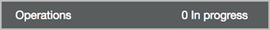
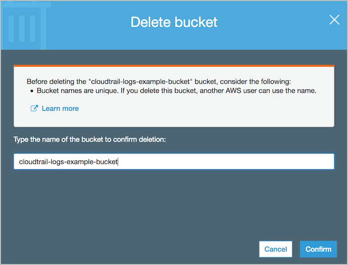

# Level 200: Automated Deployment of Detective Controls: Lab Guide

## Authors
- Ben Potter, Security Lead, Well-Architected

## Table of Contents
1. [Deployment](#deployment)
2. [Tear Down](#tear_down)

## 1. AWS CloudFormation to donfigure AWS CloudTrail, AWS Config, and Amazon GuardDuty 
[AWS CloudTrail](https://aws.amazon.com/cloudtrail/) is a service that enables governance, compliance, operational auditing, and risk auditing of your AWS account. With CloudTrail, you can log, continuously monitor, and retain account activity related to actions across your AWS infrastructure. CloudTrail provides event history of your AWS account activity, including actions taken through the AWS Management Console, AWS SDKs, command line tools, and other AWS services.  
[Amazon GuardDuty](https://aws.amazon.com/guardduty/) is a threat detection service that continuously monitors for malicious or unauthorized behavior to help you protect your AWS accounts and workloads. It monitors for activity such as unusual API calls or potentially unauthorized deployments that indicate a possible account compromise. GuardDuty also detects potentially compromised instances or reconnaissance by attackers.
Using [AWS CloudFormation](https://aws.amazon.com/cloudformation/), we are going to configure GuardDuty, and configure alerting to your email address.  
[AWS Config](https://aws.amazon.com/config/) is a service that enables you to assess, audit, and evaluate the configurations of your AWS resources. Config continuously monitors and records your AWS resource configurations and allows you to automate the evaluation of recorded configurations against desired configurations.
1. Sign in to the AWS Management Console, select your preferred region, and open the CloudFormation console at https://console.aws.amazon.com/cloudformation/. Note if your CloudFormation console does not look the same, you can enable the redesigned console by clicking **New Console** in the **CloudFormation** menu.
2. Click **Create stack**.  
  
3. Enter the following **Amazon S3 URL**: `https://s3-us-west-2.amazonaws.com/aws-well-architected-labs/Security/Code/cloudtrail-config-guardduty.yaml` and click **Next**.  
   
4. Enter the following details:  
  **General**  
  * Stack name: The name of this stack. For this lab, use `DetectiveControls`.
  * CloudTrail: Enable CloudTrail Yes/No. If you already have CloudTrail enabled select No.
  * Config: Enable Config Yes/No. If you already have Config enabled select No.
  * GuardDuty: Enable GuardDuty Yes/No. If you already have GuardDuty enabled select No. Note that GuardDuty will create and leave an IAM role the first time its enabled.
  * S3BucketPolicyExplicitDeny: (Optional) Explicitly deny destructive actions to the bucket. AWS root user will be required to modify this bucket if configured.
  * S3AccessLogsBucketName: (Optional) The name of an existing S3 bucket for storing S3 access logs.  
  **CloudTrail**  
  * CloudTrailBucketName: The name of the new S3 bucket to create for CloudTrail to send logs to.  **IMPORTANT** Specify a bucket name that is unique.  
  * CloudTrailCWLogsRetentionTime: Number of days to retain logs in CloudWatch Logs.
  * CloudTrailS3RetentionTime: Number of days to retain logs in the S3 bucket before they are automatically deleted.
  * CloudTrailEncryptS3Logs: (Optional) Use AWS KMS to encrypt logs stored in Amazon S3. A new KMS key will be created.
  * CloudTrailLogS3DataEvents: (Optional) These events provide insight into the resource operations performed on or within S3.  
  **Config**  
  * ConfigBucketName: The name of the new S3 bucket to create for Config to save config snapshots to.  **IMPORTANT** Specify a bucket name that is unique.  
  * ConfigSnapshotFrequency: AWS Config configuration snapshot frequency
  * ConfigS3RetentionTime: Number of days to retain logs in the S3 bucket before they are automatically deleted.  
  **Guard Duty**  
  * GuardDutyEmailAddress: The email address you own that will receive the alerts, you must have access to this address for testing.
5. At the bottom of the page click **Next**.
6. In this lab, we won't add any tags or other options. Click Next. Tags, which are key-value pairs, can help you identify your stacks. For more information, see [Adding Tags to Your AWS CloudFormation Stack](http://docs.aws.amazon.com/AWSCloudFormation/latest/UserGuide//cfn-console-add-tags.html).  
7. Review the information for the stack. When you're satisfied with the configuration, check **I acknowledge that AWS CloudFormation might create IAM resources with custom names** then click **Create stack**.  
  
8. After a few minutes the stack status should change from *CREATE_IN_PROGRESS* to *CREATE_COMPLETE*.  
You have now set up detective controls to log to your buckets and retain events, giving you the ability to search history and later enable pro-active monitoring of your AWS account!  
9. You should receive an email to confirm the SNS email subscription, you must confirm this. Note as the email is directly from GuardDuty via SNS is will be JSON format.  

***

### 2. Tear down this lab 
The following instructions will remove the resources that have a cost for running them.

Delete the stack:
1. Sign in to the AWS Management Console, and open the CloudFormation console at https://console.aws.amazon.com/cloudformation/.
2. Select the `DetectiveControls` stack.
3. Click the Actions button then click Delete Stack.
4. Confirm the stack and then click the Yes, Delete button.

Empty and delete the S3 buckets:
1. Sign in to the AWS Management Console, and open the S3 console at https://console.aws.amazon.com/s3/.
2. Select the CloudTrail bucket name you previously created without clicking the name.
  
3. Click Empty bucket and enter the bucket name in the confirmation box.  
  
4. Click Confirm and the bucket will be emptied when the bottom task bar has 0 operations in progress.  
  
5. With the bucket now empty, click Delete bucket.

6. Enter the bucket name in the confirmation box and click Confirm.
  
7. Repeat steps 2 to 6 for the Config bucket you created.

***

## References & useful resources:
[AWS CloudTrail User Guide](https://docs.aws.amazon.com/awscloudtrail/latest/userguide/cloudtrail-user-guide.html)  
[AWS CloudFormation User Guide](https://docs.aws.amazon.com/AWSCloudFormation/latest/UserGuide/Welcome.html)  
[Amazon GuardDuty User Guide](https://docs.aws.amazon.com/guardduty/latest/ug/what-is-guardduty.html)  
[AWS Config User Guide](https://docs.aws.amazon.com/config/latest/)  

***

## License
Licensed under the Apache 2.0 and MITnoAttr License. 

Copyright 2019 Amazon.com, Inc. or its affiliates. All Rights Reserved.

Licensed under the Apache License, Version 2.0 (the "License"). You may not use this file except in compliance with the License. A copy of the License is located at

    http://aws.amazon.com/apache2.0/

or in the "license" file accompanying this file. This file is distributed on an "AS IS" BASIS, WITHOUT WARRANTIES OR CONDITIONS OF ANY KIND, either express or implied. See the License for the specific language governing permissions and limitations under the License.
