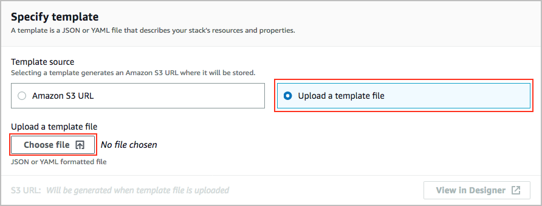
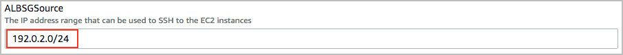
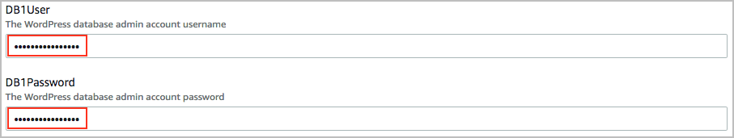

# Level 200: Automated Deployment of EC2 Web Application

## Authors
- Ben Potter, Security Lead, Well-Architected
- Rodney Lester, Reliability Lead, Well-Architected
# Table of Contents
1. [Create Web Stack](#create_web_stack)
2. [Tear Down](#tear_down)

## 1. Create Web Stack 
Please note a prerequisite to this lab is that you have deployed the CloudFormation VPC stack in the lab [Automated Deployment of VPC](../200_Automated_Deployment_of_VPC) with the default parameters and recommended stack name, and have an [EC2 SSH key](https://docs.aws.amazon.com/AWSEC2/latest/UserGuide/ec2-key-pairs.html#having-ec2-create-your-key-pair) created for instances. This step will create the web application and all components using the example CloudFormation template, inside the VPC you have created previously. 
1. Choose the version of the CloudFormation template from [/Code](Code/) to your computer:
   - wordpress.yaml to create a wordpress site, including an RDS database
   - staticwebapp.yaml to create a multi-AZ static web application that simply displays the instance ID for the instance it is running upon
2. Sign in to the AWS Management Console, select your preferred region, and open the CloudFormation console at [https://console.aws.amazon.com/cloudformation/](https://console.aws.amazon.com/cloudformation/).
3. Click Create Stack.  
  
4. Click **Upload a template file** and then click **Choose file**.  
  
5. Choose the CloudFormation template you downloaded in step 1, return to the CloudFormation console page and click **Next**.
5. Enter the following details:
  * Stack name: The name of this stack. For this lab, use *WebApp1-WordPress* or *WebApp1-Static* and match the case.  
    
  * ALBSGSource: Your current IP address in CIDR notation which will be allowed to connect to the application load balancer, this secures your web application from the public while you are configuring and testing.  
    
  * DB1User: User name of your choice for the RDS database that must contain 1 to 16 alphanumeric characters. first character must be a letter, cannot be a word reserved by the database engine.
  * DB1Password: Password of your choice for the RDS database that can be any printable ASCII character except "/", """, or "@". and contain 8 to 41 characters.
    
  The remaining parameters may be left as defaults, you can find out more in the description for each.  
6. At the bottom of the page click **Next**.
7. In this lab, we won't add any tags or other options. Click **Next**. Tags, which are key-value pairs, can help you identify your stacks. For more information, see [Adding Tags to Your AWS CloudFormation Stack](http://docs.aws.amazon.com/AWSCloudFormation/latest/UserGuide//cfn-console-add-tags.html).
8. Review the information for the stack. When you're satisfied with the configuration, check **I acknowledge that AWS CloudFormation might create IAM resources with custom names** then click **Create stack**.  
  
9. After a number of minutes the final stack status should change from *CREATE_IN_PROGRESS* to *CREATE_COMPLETE*.  
   
You have now created the WordPress stack (well actually CloudFormation did it for you).  
10. In the stack click the **Outputs** tab, and open the *WebsiteURL* value in your web browser, this is how to access what you just created.

***

### 2. Tear down this lab
The following instructions will remove the resources that you have created in this lab.

Delete the WordPress or Static Web Application CloudFormation stack:
1. Sign in to the AWS Management Console, select your preferred region, and open the CloudFormation console at [https://console.aws.amazon.com/cloudformation/](https://console.aws.amazon.com/cloudformation/).
2. Click the radio button on the left of the *WebApp1-WordPress* or *WebApp1-Static* stack.
3. Click the **Actions** button then click **Delete stack**.
4. Confirm the stack and then click **Delete** button.
5. Access the Key Management Service (KMS) console [https://console.aws.amazon.com/cloudformation/](https://console.aws.amazon.com/cloudformation/)

***

## References & useful resources:
[AWS CloudFormation User Guide](https://docs.aws.amazon.com/AWSCloudFormation/latest/UserGuide/Welcome.html)  
[Amazon EC2 User Guide for Linux Instances](https://docs.aws.amazon.com/AWSEC2/latest/UserGuide/concepts.html)

***

## License
Licensed under the Apache 2.0 and MITnoAttr License. 

Copyright 2019 Amazon.com, Inc. or its affiliates. All Rights Reserved.

Licensed under the Apache License, Version 2.0 (the "License"). You may not use this file except in compliance with the License. A copy of the License is located at

    http://aws.amazon.com/apache2.0/

or in the "license" file accompanying this file. This file is distributed on an "AS IS" BASIS, WITHOUT WARRANTIES OR CONDITIONS OF ANY KIND, either express or implied. See the License for the specific language governing permissions and limitations under the License.
