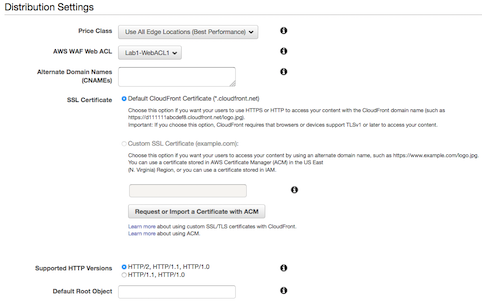

# Level 200: Automated Deployment of Web Application Firewall: Lab Guide

## Authors
- Ben Potter, Security Lead, Well-Architected

## Table of Contents
1. [Configure WAF](#waf)
2. [Configure CloudFront for WAF](#cloudfront)
3. [Tear Down](#tear_down)

***

## 1. Configure AWS WAF 
Using [AWS CloudFormation](https://aws.amazon.com/cloudformation/), we are going to deploy a basic example
AWS WAF configuration for use with CloudFront.

1. Sign in to the AWS Management Console, select your preferred region, and open the CloudFormation console at https://console.aws.amazon.com/cloudformation/. Note if your CloudFormation console does not look the same, you can enable the redesigned console by clicking **New Console** in the **CloudFormation** menu.
2. Click **Create stack**.  
  
3. Enter the following **Amazon S3 URL**:  `https://s3-us-west-2.amazonaws.com/aws-well-architected-labs/Security/Code/waf-global.yaml` and click **Next**.  
   
4. Enter the following details:
  * Stack name: The name of this stack. For this lab, use `waf`.
  * WAFName: Enter the base name to be used for resource and export names for this stack. For this lab, you can use `Lab1`.
  * WAFCloudWatchPrefix: Enter the name of the CloudWatch prefix to use for each rule using alphanumeric
  characters only. For this lab, you can use `Lab1`.
  The remainder of the parameters can be left as defaults.
    
5. At the bottom of the page click **Next**.
6. In this lab, we won't add any tags or other options. Click Next. Tags, which are key-value pairs, can help you identify your stacks. For more information, see [Adding Tags to Your AWS CloudFormation Stack](https://docs.aws.amazon.com/AWSCloudFormation/latest/UserGuide//cfn-console-add-tags.html).
7. Review the information for the stack. When you're satisfied with the configuration, click **Create stack**.  
8. After a few minutes the stack status should change from *CREATE_IN_PROGRESS* to *CREATE_COMPLETE*.
10. You have now set up a basic AWS WAF configuration ready for CloudFront to use!

## 2. Configure Amazon CloudFront 
Using the AWS Management Console, we will create a CloudFront distribution, and link it to the AWS WAF
ACL we previously created.

1. Open the Amazon CloudFront console at https://console.aws.amazon.com/cloudfront/home.
2. From the console dashboard, choose Create Distribution.

3. Click Get Started in the Web section.

4. Specify the following settings for the distribution:
  * In **Origin Domain Name** enter the DNS or domain name from your elastic load balancer or EC2 instance.
  
  * In the distribution Settings section, click AWS WAF Web ACL, and select the one you created previously.
  
  * Click Create Distrubution.
  * For more information on the other configuration options, see [Values That You Specify When You Create or Update a Web Distribution](https://docs.aws.amazon.com/AmazonCloudFront/latest/DeveloperGuide/distribution-web-values-specify.html) in the CloudFront documentation.
5. After CloudFront creates your distribution, the value of the Status column for your distribution will change from In Progress to Deployed.  
  
6. When your distribution is deployed, confirm that you can access your content using your new CloudFront URL or CNAME. Copy the Domain Name into a web browser to test.  
  
For more information, see [Testing a Web Distribution](https://docs.aws.amazon.com/AmazonCloudFront/latest/DeveloperGuide/distribution-web-testing.html) in the CloudFront documentation.
7. You have now configured Amazon CloudFront with basic settings and AWS WAF.

For more information on configuring CloudFront, see [Viewing and Updating CloudFront Distributions](https://docs.aws.amazon.com/AmazonCloudFront/latest/DeveloperGuide/HowToUpdateDistribution.html) in the CloudFront documentation.

***

### 3. Tear down this lab 
The following instructions will remove the resources that have a cost for running them. Please note that
Security Groups and SSH key will exist. You may remove these also or leave for future use.

Delete the CloudFront distribution:

1. Open the Amazon CloudFront console at https://console.aws.amazon.com/cloudfront/home.
2. From the console dashboard, select the distribution you created earlier and click the Disable button.
To confirm, click the Yes, Disable button.
3. After approximately 15 minutes when the status is Deployed, select the distribution and click the Delete
button, and then to confirm click the Yes, Delete button.

Delete the AWS WAF stack:

1. Sign in to the AWS Management Console, and open the CloudFormation console at https://console.aws.amazon.com/cloudformation/.
2. Select the `waf-cloudfront` stack.
3. Click the Actions button, and then click Delete Stack.
4. Confirm the stack, and then click the Yes, Delete button.

***

## References & useful resources:
[Amazon Elastic Compute Cloud User Guide for Linux Instances](https://docs.aws.amazon.com/AWSEC2/latest/UserGuide/concepts.html)  
[Amazon CloudFront Developer Guide](https://docs.aws.amazon.com/AmazonCloudFront/latest/DeveloperGuide/Introduction.html)  
[Tutorial: Configure Apache Web Server on Amazon Linux 2 to Use SSL/TLS](https://docs.aws.amazon.com/AWSEC2/latest/UserGuide/SSL-on-an-instance.html)  
[AWS WAF, AWS Firewall Manager, and AWS Shield Advanced Developer Guide](https://docs.aws.amazon.com/waf/latest/developerguide/waf-chapter.html)  

***

## License
Licensed under the Apache 2.0 and MITnoAttr License. 

Copyright 2019 Amazon.com, Inc. or its affiliates. All Rights Reserved.

Licensed under the Apache License, Version 2.0 (the "License"). You may not use this file except in compliance with the License. A copy of the License is located at

    https://aws.amazon.com/apache2.0/

or in the "license" file accompanying this file. This file is distributed on an "AS IS" BASIS, WITHOUT WARRANTIES OR CONDITIONS OF ANY KIND, either express or implied. See the License for the specific language governing permissions and limitations under the License.

