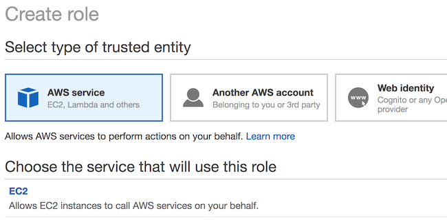
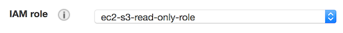
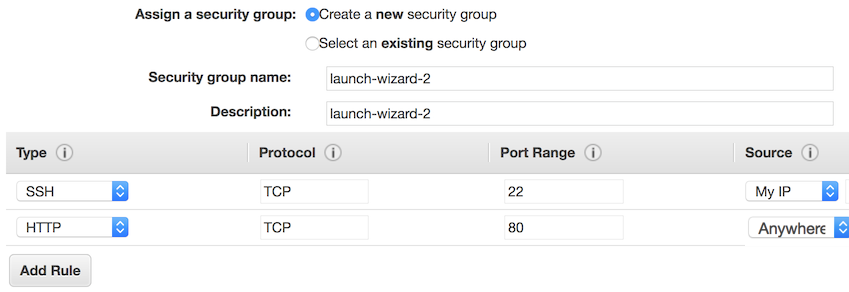
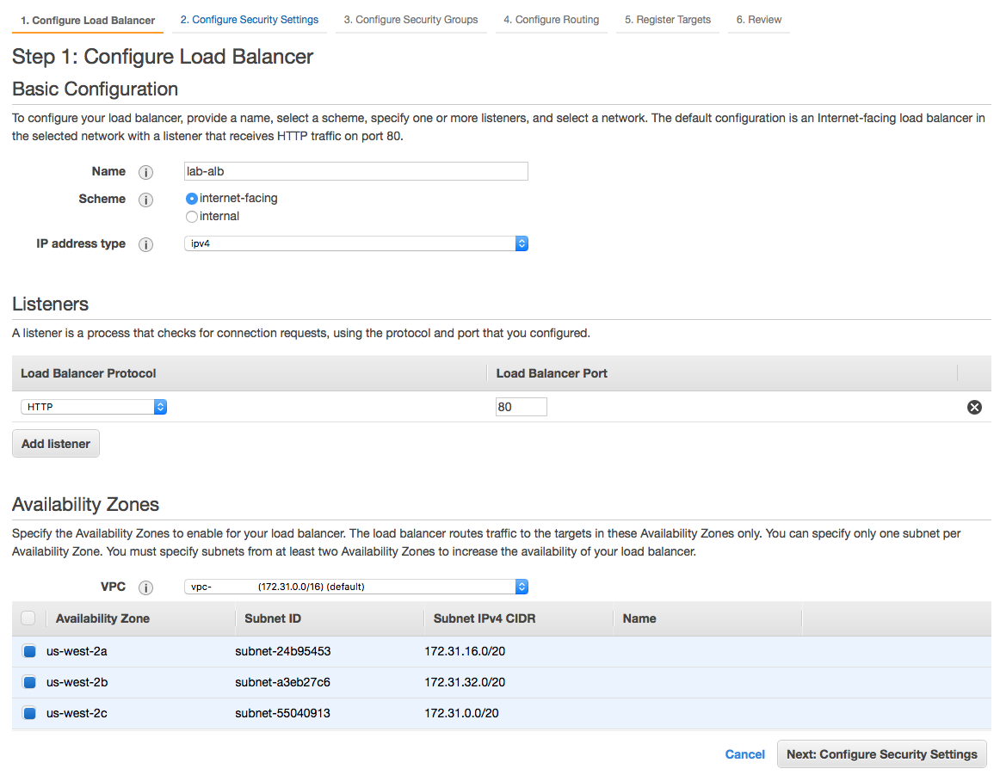
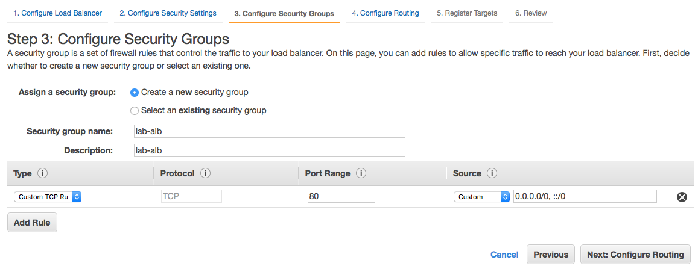
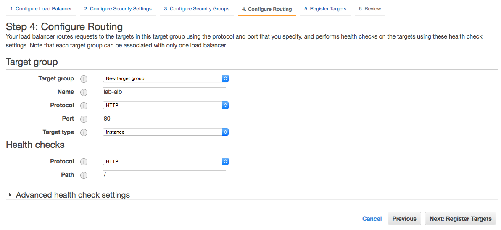
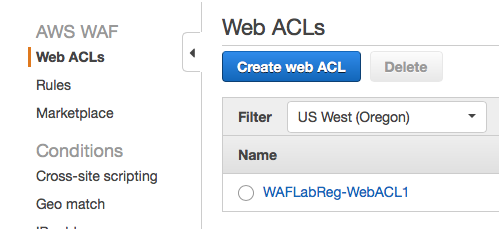
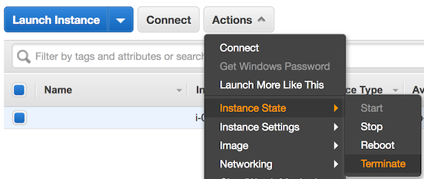

# Level 200: EC2 Web Infrastructure Protection: Lab Guide

## 1. Launch Instance
For launching your first instance, we are going to use the launch wizard in the Amazon EC2 console.

### 1.1 Launch Single Linux Instance
You can launch a Linux instance using the AWS Management Console. This tutorial is intended to help you launch your first instance quickly, so it doesn't cover all possible options. For more information about the advanced options, see [Launching an Instance](https://docs.aws.amazon.com/AWSEC2/latest/UserGuide/launching-instance.html).
Launch an instance:

1. Open the Amazon EC2 console at https://console.aws.amazon.com/ec2/.
2. From the console dashboard, choose Launch Instance.  

3. The choose an Amazon Machine Image (AMI) page displays a list of basic configurations, called Amazon Machine Images (AMIs), that serve as templates for your instance. Select the HVM edition of the Amazon Linux AMI (not Amazon Linux 2).  

4. On the Choose an Instance Type page, you can select the hardware configuration of your instance. Select the t2.micro type, which is selected by default. Notice that this instance type is eligible for the free tier. Then select Next: Configure Instance Details.  
  
5. On the Configure Instance Details page, make the following changes:  
  5.1 Select Create new IAM role.  
    
  5.2	In the new tab that opens, select Create role.  
    
  5.3	With AWS service pre-selected, select EC2 from the top of the list, then click Next: Permissions.  
    
  5.4	Enter `s3` in the search and select AmazonS3ReadOnlyAccess from the list of policies, then click
  Next: Review. This policy will give this EC2 instance access to read and list any objects in Amazon
  S3 within your AWS account.  
    
  5.5	Enter a role name, such as `ec2-s3-read-only-role`, and then click Create role.  
    
  5.6	Back on the EC2 launch web browser tab, select the refresh button next to Create new IAM role,
  and click the role you just created.  
    
  5.7 Scroll down and expand the Advanced Details section. Enter the following in the User Data test box to automatically install Apache web server and apply basic configuration when the instance is launched:
  	```
	#!/bin/bash
	yum update -y
	yum install -y httpd
	service httpd start
	chkconfig httpd on
	groupadd www
	usermod -a -G www ec2-user
	chown -R root:www /var/www
	chmod 2775 /var/www
	find /var/www -type d -exec chmod 2775 {} +
	find /var/www -type f -exec chmod 0664 {} +
   	```
6. Accept defaults and Choose Next: Add tags.
7. Click Next: Configure Security Group.
	7.1 On type SSH, select Source as `My IP`
	7.2 Click Add Rule, select Type as HTTP and source as `Anywhere`
	Note that best practice is to have an Elastic Load Balancer inline or the EC2 instance not directly
  exposed. However, for simplicity in this lab, we are opening the access to anywhere. Later modules will
  secure access with Elastic Load Balancer.
	7.2 Select Add Rule to add both SSH and HTTP, and on source, select `My IP`.  
	
	7.3 Click Review and Launch.  
	
8. On the Review Instance Launch page, check the details, and then click Launch.
9. If you do not have an existing key pair for access instances, a prompt will appear. Click Create New,
then type a name such as `lab`, click Download Key Pair, and then click Launch Instances.  

    **Important**

    This is the only chance to save the private key file. You'll need to provide the name of your key
    pair when you launch an instance, and you'll provide the corresponding private key each time you connect
    to the instance.

10. Click View Instances.
11. When your instance is launched, its status will change to running, and it will need a few minutes to apply patches and install Apache web server.  

12. You can connect to the Apache test page by entering the public DNS, which you can find on the description
tab or instances list. Take note of this public DNS value.


***


## 2. Create AWS WAF Rules

### 2.1 AWS CloudFormation to create AWS WAF ACL for Application Load Balancer
Using [AWS CloudFormation](https://aws.amazon.com/cloudformation/), we are going to deploy a basic example
AWS WAF configuration for use with Application Load Balancer.

1. Sign in to the AWS Management Console, select your preferred region, and open the CloudFormation console at https://console.aws.amazon.com/cloudformation/. Note if your CloudFormation console does not look the same, you can enable the redesigned console by clicking **New Console** in the **CloudFormation** menu.
2. Click Create New Stack.
3. Select Specify an Amazon S3 template URL and enter the following URL for the template: `https://s3-us-west-2.amazonaws.com/aws-well-architected-labs/Security/Code/waf-regional.yaml` and click Next.
4. Enter the following details:
  * Stack name: The name of this stack. For this lab, use `lab-waf-regional`.
  * WAFName: Enter the base name to be used for resource and export names for this stack. For this lab, you can use `WAFLabReg`.
  * WAFCloudWatchPrefix: Enter the name of the CloudWatch prefix to use for each rule using alphanumeric
  characters only. For this lab, you can use `WAFLabReg`.
  The remainder of the parameters can be left as defaults.
  
5. Click Next.
6. In this scenario, we won't add any tags or other options. Click Next.
7. Review the information for the stack. When you're satisfied with the settings, click Create.
8. After a few minutes, the stack status should change from CREATE_IN_PROGRESS to CREATE_COMPLETE.
9. You have now set up a basic AWS WAF configuration ready for Application Load Balancer to use!


***


## 3. Create Application Load Balancer with WAF integration
Using the AWS Management Console, we will create an Application Load Balancer, link it to the AWS WAF
ACL we previously created and test.

### 3.1 Create Application Load Balancer
1. Open the Amazon EC2 console at https://console.aws.amazon.com/ec2/.
2. From the console dashboard, choose Load Balancers from the Load Balancing section.
3. Click Create Load Balancer.

4. Click Create under the Application Load Balancer section.

5. Enter Name for Application Load Balancer such as `lab-alb`. Select all availability zones in your region then click Next. You will need to click Next again to accept your load balancer is using insecure listener.

6. Click Create a new security group and enter name and description such as `lab-alb` and accept default of open to internet.

7. Accept defaults and enter Name such as `lab-alb` and click Next.

8. From the list of instances click the check box and then Add to registered button. Then click Next.

9. Review the details and click Create.

10. A successfull message should appear, click Close.
11. Take not of the DNS name under the Description tab, you will need this for testing.

### 3.2 Configure Application Load Balancer with WAF
1. Open the AWS WAF console at https://console.aws.amazon.com/waf/.
2. In the navigation pane, choose Web ACLs.

3. Choose the web ACL that you want to associate with the Application Load Balancer.
4. On the Rules tab, under AWS resources using this web ACL, choose Add association.

5. When prompted, use the Resource list to choose the Application Load Balancer that you want to associate this web ACL  such as `lab-alb` and click Add.

6. The Application Load Balancer should now appear under resources using.

7. You can now test access by entering the DNS name of your load balancer in a web browser.


***


### 4. Tear down this lab
The following instructions will remove the resources that have a cost for running them. Please note that
Security Groups and SSH key will exist. You may remove these also or leave for future use.

Terminate the instance:

1. Sign in to the AWS Management Console, and open the Amazon EC2 console at https://console.aws.amazon.com/ec2/.
2. From the left console instance menu, select Instances.
3. Select the instance you created to terminate.
4. From the Actions button (or right click) select Instance State > Terminate.

5. Verify this is the instance you want terminated, then click the Yes, Terminate button.

Delete the Application Load Balancer:

1. Open the Amazon EC2 console at https://console.aws.amazon.com/ec2/.
2. From the console dashboard, choose Load Balancers from the Load Balancing section.
3. Choose the load balancer you created previously such as `lab-alb` and click Actions, then Delete.
4. Confirm by clicking Yes, Delete.
5. From the console dashboard, choose Target Groups from the Load Balancing section.
3. Choose the target group you created previously such as `lab-alb` and click Actions, then Delete.

Delete the AWS WAF stack:

1. Open the CloudFormation console at https://console.aws.amazon.com/cloudformation/.
2. Select the `lab-waf-regional` stack.
3. Click the Actions button, and then click Delete Stack.
4. Confirm the stack, and then click the Yes, Delete button.

***

## References & useful resources:
[Amazon Elastic Compute Cloud User Guide for Linux Instances](https://docs.aws.amazon.com/AWSEC2/latest/UserGuide/concepts.html)   
[Tutorial: Configure Apache Web Server on Amazon Linux 2 to Use SSL/TLS](https://docs.aws.amazon.com/AWSEC2/latest/UserGuide/SSL-on-an-instance.html)  
[AWS WAF, AWS Firewall Manager, and AWS Shield Advanced Developer Guide](https://docs.aws.amazon.com/waf/latest/developerguide/waf-chapter.html)  

***

## License
Licensed under the Apache 2.0 and MITnoAttr License. 

Copyright 2018 Amazon.com, Inc. or its affiliates. All Rights Reserved.

Licensed under the Apache License, Version 2.0 (the "License"). You may not use this file except in compliance with the License. A copy of the License is located at

    https://aws.amazon.com/apache2.0/

or in the "license" file accompanying this file. This file is distributed on an "AS IS" BASIS, WITHOUT WARRANTIES OR CONDITIONS OF ANY KIND, either express or implied. See the License for the specific language governing permissions and limitations under the License.


