# Level 300: IAM Permission Boundaries Delegating Role Creation

## Authors
- Ben Potter, Security Lead, Well-Architected

# Table of Contents
1. [Create IAM Policies](#create_policies)
2. [Create and Test Developer Role](#developer_role)
3. [Create and Test Region Restricted User Role](#user_role)
4. [Knowledge Check](#knowledge_check)
5. [Tear Down](#tear_down)

The following image shows what you will be doing in this lab.

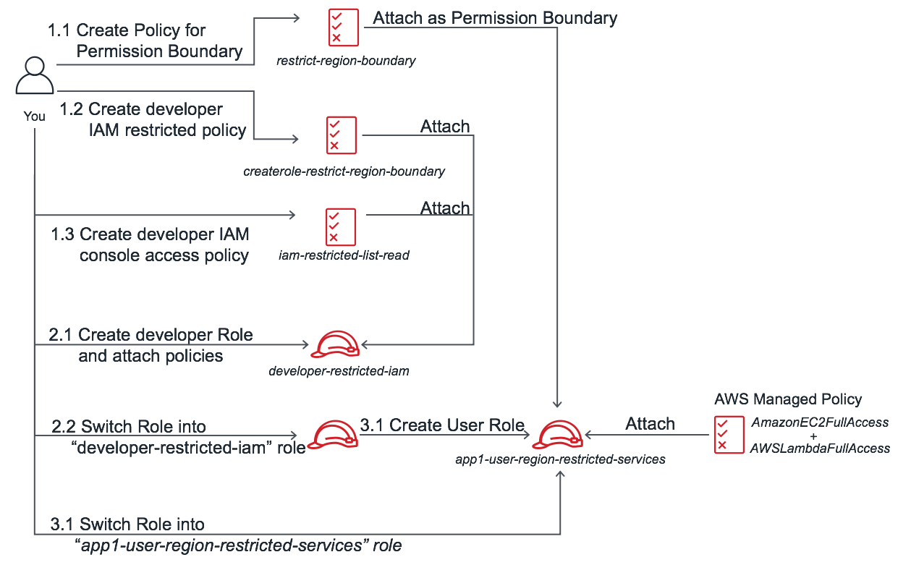

## 1. Create IAM policies <a name="create_policies"></a>
### 1.1 Create policy for permission boundary
This policy will be used for the permission boundary when the developer role creates their own user role with their delegated permissions. In this lab using AWS IAM we are only going to allow the us-east-1 (North Virginia) and us-west-1 (North California) regions, optionally you can change these to your favourite regions and add / remove as many as you need. The only service actions we are going to allow in these regions are AWS EC2 and AWS Lambda, note that these services require additional supporting actions if you were to re-use this policy after this lab, depending on your requirements.

1. Sign in to the AWS Management Console as an IAM user with MFA enabled that can assume roles in your AWS account, and open the IAM console at [https://console.aws.amazon.com/iam/](https://console.aws.amazon.com/iam/).  
If you need to enable MFA follow the [IAM User Guide](https://docs.aws.amazon.com/IAM/latest/UserGuide/id_credentials_mfa.html). You will need to log out and back in again with MFA so your session has MFA active.
2. In the navigation pane, click **Policies** and then click **Create policy**.  
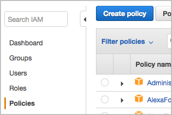  
3. On the Create policy page click the **JSON** tab.
  
4. Replace the example start of the policy that is already in the editor with the policy below.
```
{
    "Version": "2012-10-17",
    "Statement": [
        {
            "Sid": "EC2RestrictRegion",
            "Effect": "Allow",
            "Action": "ec2:*",
            "Resource": "*",
            "Condition": {
                "StringEquals": {
                    "aws:RequestedRegion": [
                        "us-east-1",
                        "us-west-1"
                    ]
                }
            }
        },
        {
            "Sid": "LambdaRestrictRegion",
            "Effect": "Allow",
            "Action": "lambda:*",
            "Resource": "*",
            "Condition": {
                "StringEquals": {
                    "aws:RequestedRegion": [
                        "us-east-1",
                        "us-west-1"
                    ]
                }
            }
        }
    ]
}
```
5. Click **Review policy**.
6. Enter the name of *restrict-region-boundary* and any description to help you identify the policy, verify the summary and then click **Create policy**.
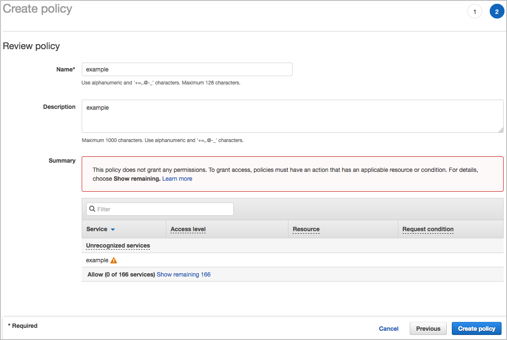

### 1.2 Create developer IAM restricted policy
This policy will be attached to the developer role, and will allow the developer to create policies and roles with a name prefix of *app1*, and only if the permission boundary *restrict-region-boundary* is attached. You will need to change the account id placeholders of *123456789012* to your account number in 5 places. You can find your account id by navigating to [https://console.aws.amazon.com/billing/home?#/account](https://console.aws.amazon.com/billing/home?#/account) in the console. Naming prefixes are useful when you have different teams or in this case different applications running in the same AWS account. They can be used to keep your resources looking tidy, and also in IAM policy as the resource as we are doing here.

1. Create a managed policy using the JSON policy below and name of *createrole-restrict-region-boundary*.

```
{
    "Version": "2012-10-17",
    "Statement": [
        {
            "Sid": "CreatePolicy",
            "Effect": "Allow",
            "Action": [
                "iam:CreatePolicy",
                "iam:CreatePolicyVersion",
                "iam:DeletePolicyVersion"
            ],
            "Resource": "arn:aws:iam::123456789012:policy/app1*"
        },
        {
            "Sid": "CreateRole",
            "Effect": "Allow",
            "Action": [
                "iam:CreateRole"
            ],
            "Resource": "arn:aws:iam::123456789012:role/app1*",
            "Condition": {
                "StringEquals": {
                    "iam:PermissionsBoundary": "arn:aws:iam::123456789012:policy/restrict-region-boundary"
                }
            }
        },
        {
            "Sid": "AttachDetachRolePolicy",
            "Effect": "Allow",
            "Action": [
                "iam:DetachRolePolicy",
                "iam:AttachRolePolicy"
            ],
            "Resource": "arn:aws:iam::123456789012:role/app1*",
            "Condition": {
                "ArnEquals": {
                    "iam:PolicyARN": [
                        "arn:aws:iam::123456789012:policy/*",
                        "arn:aws:iam::aws:policy/*"
                    ]
                }
            }
        }        
    ]
}
```

### 1.3 Create developer IAM console access policy
This policy allows list and read type IAM service actions so you can see what you have created using the console. Note that it is not a requirement if you simply wanted to create the role and policy, or if you were using the Command Line Interface (CLI) or CloudFormation.

1. Create a managed policy using the JSON policy below and name of *iam-restricted-list-read*.

```
{
    "Version": "2012-10-17",
    "Statement": [
        {
            "Sid": "Get",
            "Effect": "Allow",
            "Action": [
                "iam:ListPolicies",
                "iam:GetRole",
                "iam:GetPolicyVersion",
                "iam:ListRoleTags",
                "iam:GetPolicy",
                "iam:ListPolicyVersions",
                "iam:ListAttachedRolePolicies",
                "iam:ListRoles",
                "iam:ListRolePolicies",
                "iam:GetRolePolicy"
            ],
            "Resource": "*"
        }
    ]
}
```

## 2. Create and Test Developer Role <a name="developer_role"></a>
### 2.1 Create Developer Role
Create a role for developers that will have permission to create roles and policies, with the permission boundary and naming prefix enforced:

1. Sign in to the AWS Management Console as an IAM user with MFA enabled that can assume roles in your AWS account, and open the IAM console at [https://console.aws.amazon.com/iam/](https://console.aws.amazon.com/iam/).
2. In the navigation pane, click **Roles** and then click **Create role**.  
  
3. Click Another AWS account, then enter your account ID and tick Require MFA, then click **Next: Permissions**. We enforce MFA here as it is a best practice.    
4. In the search field start typing *createrole* then check the box next to the *createrole-restrict-region-boundary* policy.
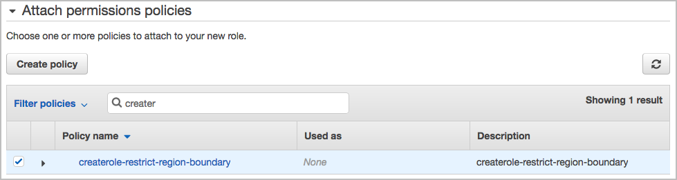  
5. Erase your previous search and start typing *iam-res* then check the box next to the *iam-restricted-list-read* policy and then click **Next: Tags**.
  
6. For this lab we will not use IAM tags, click **Next: Review**.
7. Enter the name of *developer-restricted-iam* for the **Role name** and click **Create role**.
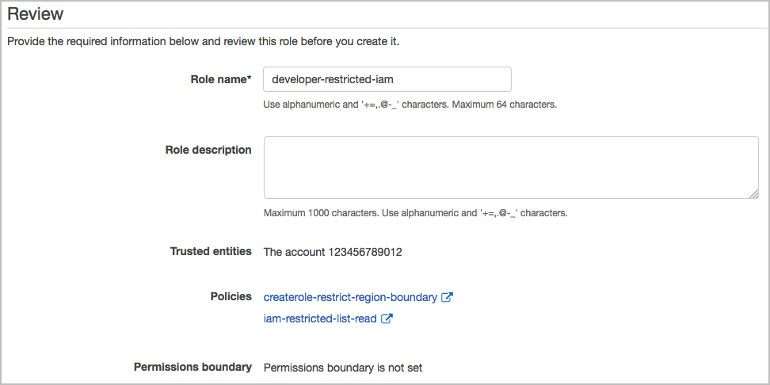  
8. Check the role you have created by clicking on *developer-restricted-iam* in the list. Record both the Role ARN and the link to the console.
9. The role is now created, ready to test!


### 2.2. Test Developer Role
Now you will use an existing IAM user with MFA enabled to assume the new *developer-restricted-iam* role.

1. Sign in to the AWS Management Console as an IAM user with MFA enabled. [https://console.aws.amazon.com](https://console.aws.amazon.com).
2. In the console, click your user name on the navigation bar in the upper right. It typically looks like this: `username@account_ID_number_or_alias`then click **Switch Role**. Alternatively you can paste the link in your browser that you recorded earlier.
3. On the Switch Role page, type the account ID number or the account alias and the name of the role *developer-restricted-iam* that you created in the previous step. (Optional) Type text that you want to appear on the navigation bar in place of your user name when this role is active. A name is suggested, based on the account and role information, but you can change it to whatever has meaning for you. You can also select a color to highlight the display name.
4. Click **Switch Role**. If this is the first time choosing this option, a page appears with more information. After reading it, click Switch Role. If you clear your browser cookies, this page can appear again.
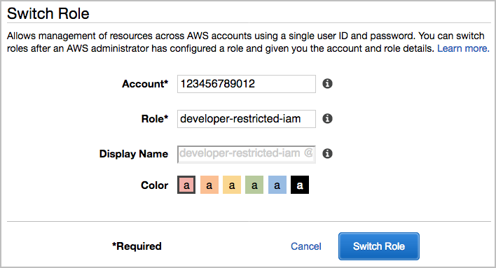  
5. The display name and color replace your user name on the navigation bar, and you can start using the permissions that the role grants you replacing the permission that you had as the IAM user.

    **Tip**

	The last several roles that you used appear on the menu. The next time you need to switch to one of those roles, you can simply click the role you want. You only need to type the account and role information manually if the role is not displayed on the Identity menu.
6. You are now using the developer role with the granted permissions, stay logged in using the role for the next section.

## 3. Create and Test User Role <a name="user_role"></a>
### 3.1 Create User Role
While you are still assuming the *developer-restricted-iam* role you created in the previous step, create a new user role with the boundary policy attached and name it with the prefix. We will use AWS managed policies for this user role, however the *createrole-restrict-region-boundary* policy will allow us to create and attach our own policies, only if they have a prefix of *app1*.

1. Verify that you are Using the developer role previously created by checking the top bar it should look like 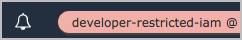 and open the IAM console at [https://console.aws.amazon.com/iam/](https://console.aws.amazon.com/iam/). You will notice a number of permission denied messages as this developer role is restricted. Least privilege is a best practice!
2. In the navigation pane, click **Roles** and then click **Create role**.  
  
3. Click **Another AWS account**, then enter your account ID that you have been using for this lab and tick **Require MFA**, then click **Next: Permissions**.   
4. In the search field start typing *ec2full* then check the box next to the *AmazonEC2FullAccess* policy.
  
5. Erase your previous search and start typing *lambda* then check the box next to the *AWSLambdaFullAccess* policy.
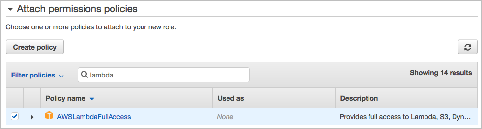  
6. Expand the bottom section **Set permissions boundary** and click **Use a permissions boundary to control the maximum role permissions**. In the search field start typing *boundary* then click the radio button for *restrict-region-boundary* and then click **Next: Tags**.
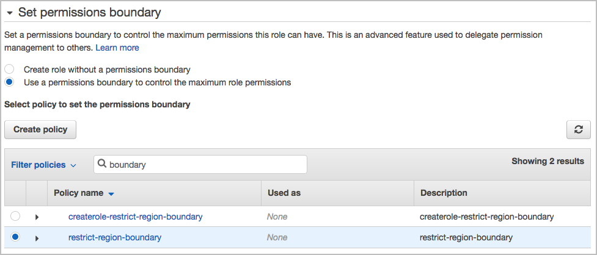  
7. For this lab we will not use IAM tags, click **Next: Review**.
8. Enter the **Role name** of *app1-user-region-restricted-services* for the role and click **Create role**.
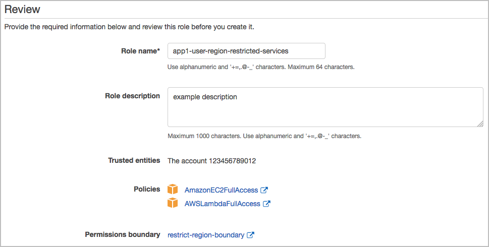  
9. The role should create successfully if you followed all the steps. Record both the Role ARN and the link to the console.  
If you receive an error message a common mistake is not changing the account number in the policies in the previous steps.

### 3.2 Test User Role
Now you will use an existing IAM user to assume the new *app1-user-region-restricted-services* role, as if you were a user who only needs to administer EC2 and Lambda in your allowed regions.

1. In the console, click your role's Display Name on the right side of the navigation bar. Click Back to your previous *username*. You are now back to using your original IAM user.
2. In the console, click your user name on the navigation bar in the upper right. Alternatively you can paste the link in your browser that you recorded earlier for the *app1-user-region-restricted-services* role.
3. On the Switch Role page, type the account ID number or the account alias and the name of the role *app1-user-region-restricted-services* that you created in the previous step.
5. Select a different color to before, otherwise it will overwrite that profile in your browser.
6. Click **Switch Role**. The display name and color replace your user name on the navigation bar, and you can start using the permissions that the role grants you.  
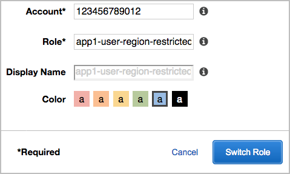  
7. You are now using the user role with the only actions allowed of EC2 and Lambda in us-east-1 (North Virginia) and us-west-1 (North California) regions!
8. Navigate to the EC2 Management Console in the us-east-1 region [https://us-east-1.console.aws.amazon.com/ec2/v2/home?region=us-east-1](https://us-east-1.console.aws.amazon.com/ec2/v2/home?region=us-east-1). The EC2 Dashboard should display a summary list of resources with the only error being *Error retrieving resource count* from Elastic Load Balancing as that requires additional permissions.   
9. Navigate to the EC2 Management Console in a region that is not allowed, such as ap-southeast-2 (Sydney) [https://ap-southeast-2.console.aws.amazon.com/ec2/v2/home?region=ap-southeast-2](https://ap-southeast-2.console.aws.amazon.com/ec2/v2/home?region=ap-southeast-2). The EC2 Dashboard should display a number of unauthorized error messages.   
10. Congratulations! You have now learnt about IAM permission boundaries and have one working!


## 4. Knowledge Check <a name="knowledge_check"></a>
The security best practices followed in this lab are: <a name="best_practices"></a>

* [Manage credentials and authentication](https://wa.aws.amazon.com/wat.question.SEC_1.en.html) Use of MFA for access to provide additional access control.
* [Grant access through roles or federation:](https://wa.aws.amazon.com/wat.question.SEC_3.en.html) Roles with associated policies have been used to define appropriate permission boundaries.
* [Grant least privileges:](https://wa.aws.amazon.com/wat.question.SEC_3.en.html) The roles are scoped with minimum privileges to accomplish the task.

***


## 5. Tear down this lab <a name="tear_down"></a>
Please note that the changes you made to the users, groups, and roles have no charges associated with them.

1. Using the original IAM user, for each of the roles you created select them in the IAM console at [https://console.aws.amazon.com/iam/](https://console.aws.amazon.com/iam/) and click  **Delete role**.  
The roles created are:  
*app1-user-region-restricted-services*  
*developer-restricted-iam*
2. For each of the policies you created, one at a time select the radio button then **Policy actions** drop down menu then **Delete**.  
The policies created are:  
*restrict-region-boundary*  
*createrole-restrict-region-boundary*  
*iam-restricted-list-read*

***


## References & useful resources:
[Permissions Boundaries for IAM Entities](https://docs.aws.amazon.com/IAM/latest/UserGuide/access_policies_boundaries.html)  
[AWS Identity and Access Management User Guide](https://docs.aws.amazon.com/IAM/latest/UserGuide/introduction.html)  
[IAM Best Practices and Use Cases](https://docs.aws.amazon.com/IAM/latest/UserGuide/IAMBestPracticesAndUseCases.html)  
[Become an IAM Policy Master in 60 Minutes or Less](https://youtu.be/YQsK4MtsELU)  
[Actions, Resources, and Condition Keys for Identity And Access Management](https://docs.aws.amazon.com/IAM/latest/UserGuide/list_identityandaccessmanagement.html)
***


## License
Licensed under the Apache 2.0 and MITnoAttr License. 

Copyright 2018 Amazon.com, Inc. or its affiliates. All Rights Reserved.

Licensed under the Apache License, Version 2.0 (the "License"). You may not use this file except in compliance with the License. A copy of the License is located at

    https://aws.amazon.com/apache2.0/

or in the "license" file accompanying this file. This file is distributed on an "AS IS" BASIS, WITHOUT WARRANTIES OR CONDITIONS OF ANY KIND, either express or implied. See the License for the specific language governing permissions and limitations under the License.
