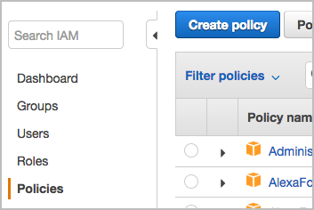
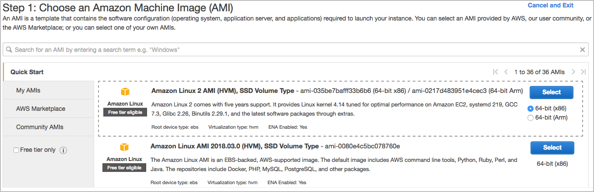
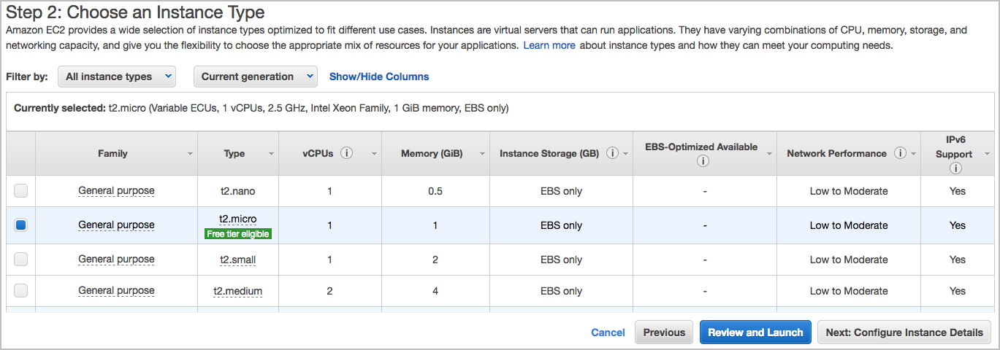
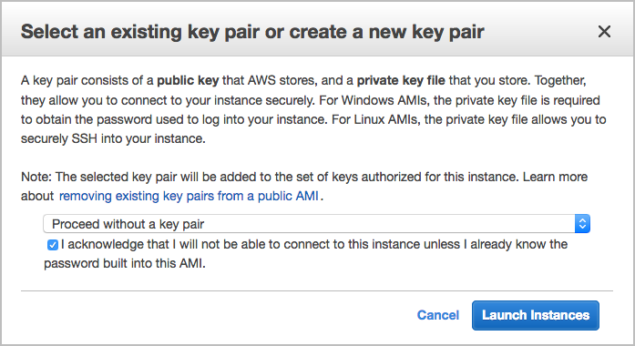
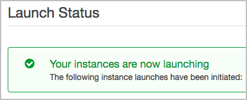

# Level 300: IAM Tag Based Access Control for EC2

## Authors
- Ben Potter, Security Lead, Well-Architected
# Table of Contents
1. [Create IAM Policies](#create_policies)
2. [Create IAM Role](#create_role)
3. [Test](#test_role)
4. [Knowledge Check](#knowledge_check)
5. [Tear Down](#tear_down)

In this lab we use the RequestTag [condition key](https://docs.aws.amazon.com/IAM/latest/UserGuide/reference_policies_condition-keys.html) to require specific tag value during create actions in the EC2 service. This allows users to create tags when creating resources only if they meet specific requirements. To control which existing resources users can modify tags on we use a combination of RequestTag and ResourceTag conditions. To control resources users can manage based on tag values we use ResourceTag based on a tag that exists on a resource. You can think of RequestTag condition key is for new resources when you are creating, and ResourceTag is the tag that already exists on the resource.

## 1. Create IAM managed policies <a name="create_policies"></a>
The policies are split into five different functions for demonstration purposes, you may like to modify and combine them to use after this lab to your exact requirements. In addition to enforcing tags, a region restriction only allow regions us-east-1 (North Virginia) and us-west-1 (North California).  
### 1.1 Create policy named *ec2-list-read*
This policy allows read only permissions with a region condition. The only service actions we are going to allow are EC2, note that you typically require additional supporting actions such as Elastic Load Balancing if you were to re-use this policy after this lab, depending on your requirements.
1. Sign in to the AWS Management Console as an IAM user with MFA enabled that can assume roles in your AWS account, and open the IAM console at [https://console.aws.amazon.com/iam/](https://console.aws.amazon.com/iam/).  
If you need to enable MFA follow the [IAM User Guide](https://docs.aws.amazon.com/IAM/latest/UserGuide/id_credentials_mfa.html). You will need to log out and back in again with MFA so your session has MFA active.
2. In the navigation pane, click **Policies** and then click **Create policy**.  
  
3. On the Create policy page click the **JSON** tab.
  
4. Replace the example start of the policy that is already in the editor with the policy below.
```
{
    "Version": "2012-10-17",
    "Statement": [
        {
            "Sid": "ec2listread",
            "Effect": "Allow",
            "Action": [
                "ec2:Describe*",
                "ec2:Get*"
            ],
            "Resource": "*",
            "Condition": {
                "StringEquals": {
                    "aws:RequestedRegion": [
                        "us-east-1",
                        "us-west-1"
                    ]
                }
            }
        }
    ]
}
```
5. Click **Review policy**.
6. Enter the name of *ec2-list-read* and any description to help you identify the policy, verify the summary and then click **Create policy**.


### 1.2 Create policy named *ec2-create-tags*
This policy allows the creation of tags for EC2, with a condition of the action being [RunInstances](https://docs.aws.amazon.com/AWSEC2/latest/APIReference/API_RunInstances.html), which is launching an instance.  
1. Create a managed policy using the JSON policy below and name of *ec2-create-tags*.
```
{
    "Version": "2012-10-17",
    "Statement": [
        {
            "Sid": "ec2createtags",
            "Effect": "Allow",
            "Action": "ec2:CreateTags",
            "Resource": "*",
            "Condition": {
                "StringEquals": {
                    "ec2:CreateAction": "RunInstances"
                }
            }
        }
    ]
}
```

### 1.3 Create policy named *ec2-create-tags-existing*
This policy allows creation (and overwriting) of EC2 tags only if the resources are already tagged **Team / Alpha**.  
1. Create a managed policy using the JSON policy below and name of *ec2-create-tags-existing*.
```
{
    "Version": "2012-10-17",
    "Statement": [
        {
            "Sid": "ec2createtagsexisting",
            "Effect": "Allow",
            "Action": "ec2:CreateTags",
            "Resource": "*",
            "Condition": {
                "StringEquals": {
                    "ec2:ResourceTag/Team": "Alpha"
                },
                "ForAllValues:StringEquals": {
                    "aws:TagKeys": [
                        "Team",
                        "Name"
                    ]
                },
                "StringEqualsIfExists": {
                    "aws:RequestTag/Team": "Alpha"
                }
            }
        }
    ]
}
```

### 1.4 Create policy named *ec2-run-instances*
This first section of this policy allows instances to be launched, only if the conditions of region and specific tag keys are matched. The second section allows other resources to be created at instance launch time with region condition.  
1. Create a managed policy using the JSON policy below and name of *ec2-run-instances*.
```
{
    "Version": "2012-10-17",
    "Statement": [
        {
            "Sid": "ec2runinstances",
            "Effect": "Allow",
            "Action": "ec2:RunInstances",
            "Resource": "arn:aws:ec2:*:*:instance/*",
            "Condition": {
                "StringEquals": {
                    "aws:RequestedRegion": [
                        "us-east-1",
                        "us-west-1"
                    ],
                    "aws:RequestTag/Team": "Alpha"
                },
                "ForAllValues:StringEquals": {
                    "aws:TagKeys": [
                        "Name",
                        "Team"
                    ]
                }
            }
        },
        {
            "Sid": "ec2runinstancesother",
            "Effect": "Allow",
            "Action": "ec2:RunInstances",
            "Resource": [
                "arn:aws:ec2:*:*:subnet/*",
                "arn:aws:ec2:*:*:key-pair/*",
                "arn:aws:ec2:*::snapshot/*",
                "arn:aws:ec2:*:*:launch-template/*",
                "arn:aws:ec2:*:*:volume/*",
                "arn:aws:ec2:*:*:security-group/*",
                "arn:aws:ec2:*:*:placement-group/*",
                "arn:aws:ec2:*:*:network-interface/*",
                "arn:aws:ec2:*::image/*"
            ],
            "Condition": {
                "StringEquals": {
                    "aws:RequestedRegion": [
                        "us-east-1",
                        "us-west-1"
                    ]
                }
            }
        }
    ]
}
```
### 1.5 Create policy named *ec2-manage-instances*
This policy allows reboot, terminate, start and stop of instances, with a condition of the key **Team** is **Alpha** and region.  
1. Create a managed policy using the JSON policy below and name of *ec2-manage-instances*.

```
{
    "Version": "2012-10-17",
    "Statement": [
        {
            "Sid": "ec2manageinstances",
            "Effect": "Allow",
            "Action": [
                "ec2:RebootInstances",
                "ec2:TerminateInstances",
                "ec2:StartInstances",
                "ec2:StopInstances"
            ],
            "Resource": "*",
            "Condition": {
                "StringEquals": {
                    "ec2:ResourceTag/Team": "Alpha",
                    "aws:RequestedRegion": [
                        "us-east-1",
                        "us-west-1"
                    ]
                }
            }
        }
    ]
}
```

## 2. Create Role <a name="create_role"></a>
Create a role for EC2 administrators, and attach the managed policies previously created.
1. Sign in to the AWS Management Console as an IAM user with MFA enabled that can assume roles in your AWS account, and open the IAM console at [https://console.aws.amazon.com/iam/](https://console.aws.amazon.com/iam/).
2. In the navigation pane, click **Roles** and then click **Create role**.  
  
3. Click Another AWS account, then enter the account ID of the account you are using now and tick Require MFA, then click **Next: Permissions**. We enforce MFA here as it is a best practice.    
4. In the search field start typing *ec2-* then check the box next to the policies you just created: *ec2-create-tags*, *ec2-create-tags-existing*, *ec2-list-read*, *ec2-manage-instances*, *ec2-run-instances*. and then click **Next: Tags**.  
  
5. For this lab we will not use IAM tags, click **Next: Review**.
6. Enter the name of *ec2-admin-team-alpha* for the **Role name** and click **Create role**.
  
8. Check the role you have created by clicking on *ec2-admin-team-alpha* in the list. Record both the Role ARN and the link to the console.
9. The role is now created, ready to test!

## 3. Test Role<a name="test_role"></a>
### 3.1 Assume **ec2-admin-team-alpha** Role
Now you will use an existing IAM user with MFA enabled to assume the new *ec2-admin-team-alpha* role.
1. Sign in to the AWS Management Console as an IAM user with MFA enabled. [https://console.aws.amazon.com](https://console.aws.amazon.com).
2. In the console, click your user name on the navigation bar in the upper right. It typically looks like this: `username@account_ID_number_or_alias`then click **Switch Role**. Alternatively you can paste the link in your browser that you recorded earlier.
3. On the Switch Role page, type you account ID number in the **Account** field,  and the name of the role *ec2-admin-team-alpha* that you created in the previous step in the **Role** field. (Optional) Type text that you want to appear on the navigation bar in place of your user name when this role is active. A name is suggested, based on the account and role information, but you can change it to whatever has meaning for you. You can also select a color to highlight the display name.
4. Click **Switch Role**. If this is the first time choosing this option, a page appears with more information. After reading it, click Switch Role. If you clear your browser cookies, this page can appear again.
  
5. The display name and color replace your user name on the navigation bar, and you can start using the permissions that the role grants you replacing the permission that you had as the IAM user.

    **Tip**

	The last several roles that you used appear on the menu. The next time you need to switch to one of those roles, you can simply click the role you want. You only need to type the account and role information manually if the role is not displayed on the Identity menu.
	
### 3.2 Launch Instance With & Without Tags
1. Navigate to the EC2 Management Console in the us-east-2 (Ohio) region [https://us-east-2.console.aws.amazon.com/ec2/v2/home?region=us-east-2](https://us-east-2.console.aws.amazon.com/ec2/v2/home?region=us-east-2). The EC2 Dashboard should display a list of errors including *You are not authorized*. This is the first test passed, as us-east-2 region is not allowed.  

2. Navigate to the EC2 Management Console in the us-east-1 (North Virginia) region [https://us-east-1.console.aws.amazon.com/ec2/v2/home?region=us-east-1](https://us-east-1.console.aws.amazon.com/ec2/v2/home?region=us-east-1). The EC2 Dashboard should display a summary list of resources with the only error being *Error retrieving resource count* from Elastic Load Balancing as that requires additional permissions.  
  
3. Click *Launch Instance* button to start the wizard.  
4. Click *Select* next to the first Amazon Linux 2 Amazon Machine Image to launch.  
  
5. Accept the default instance size by clicking *Next: Configure Instance Details*.  
  
6. Accept default details by clicking *Next: Add Storage*.  
  
7. Accept default storage options by clicking *Next: Add Tags*.  
  
8. Lets add an incorrect tag now that will fail to launch. Click *Add Tag* enter *Key* of **Name** and *Value* of **Example**. Repeat to add *Key* of **Team** and *Value* of **Beta**. Note: Keys and values are case sensitive! Click *Next: Configure Security Group*.  
  
9. Click *Select an existing security group*, click the check box next to security group with name *default*, then click *Review and Launch*.  
  
10. Click *Launch* then click the option to *Proceed without a key pair*. Tick the *I acknowledge* box then click *Launch Instances*.  
  
11. The launch should fail, if it succeeded verify the role you are using and the managed roles you have attached as per previous steps.  
  
12. Click *Back to Review Screen* then click *Edit tags* to modify the tags. Change the *Team* key to a value of **Alpha** which matches the IAM policy previously created then click *Review and Launch*.  
  
13. On the review launch page once again click *Launch* then click the option to *Proceed without a key pair*. Tick the *I acknowledge* box then click *Launch Instances*.  
14. You should see a message that the instance is now launching. Click *View Instances* and do not terminate it just yet.  
  

### 3.3 Modify Tags On Instances
1. Continuing from 3.2 in the EC2 Management Console instances view, click the check box next to the instance named *Example* then the *Tags* tab.  
  
2. Click *Add/Edit Tags*, try changing the *Team* key to a value of **Test** then click *Save*. An error message should appear.
3. Change the *Team* key back to Alpha, and edit the *Name* key to a value of **Test** and click *Save*. The request should succeed.

### 3.4 Manage Instances
1. Continuing from 3.3 in the EC2 Management Console instances view, click the check box next to the instance named *Test*. Click *Actions* button then expand out *Instance State* then *Terminate*. Check the instance is the one you wish to terminate by it's name and click *Yes, Terminate*. The instance should now terminate.  

10. Congratulations! You have now learnt about IAM tag based permissions for EC2!

## 4. Knowledge Check <a name="knowledge_check"></a>
The security best practices followed in this lab are: <a name="best_practices"></a>
* [Grant least privileges:](https://wa.aws.amazon.com/wat.question.SEC_3.en.html) The roles are scoped with minimum privileges to accomplish the task.

***

## 5. Tear down this lab <a name="tear_down"></a>
Please note that the changes you made to the policies and roles have no charges associated with them.
1. Using the original IAM user, select the *ec2-admin-team-alpha* role in the IAM console at [https://console.aws.amazon.com/iam/](https://console.aws.amazon.com/iam/) and click  **Delete role**.  
2. For each of the policies you created, one at a time select the radio button then **Policy actions** drop down menu then **Delete**.  
The policies created are:  
*ec2-create-tags*  
*ec2-create-tags-existing*  
*ec2-list-read*  
*ec2-manage-instances*  
*ec2-run-instances*  

***

## References & useful resources:
[AWS Identity and Access Management User Guide](https://docs.aws.amazon.com/IAM/latest/UserGuide/introduction.html)  
[IAM Best Practices and Use Cases](https://docs.aws.amazon.com/IAM/latest/UserGuide/IAMBestPracticesAndUseCases.html)  
[Become an IAM Policy Master in 60 Minutes or Less](https://youtu.be/YQsK4MtsELU)  
[Actions, Resources, and Condition Keys for Identity And Access Management](https://docs.aws.amazon.com/IAM/latest/UserGuide/list_identityandaccessmanagement.html)

***

## License
Licensed under the Apache 2.0 and MITnoAttr License. 

Copyright 2018 Amazon.com, Inc. or its affiliates. All Rights Reserved.

Licensed under the Apache License, Version 2.0 (the "License"). You may not use this file except in compliance with the License. A copy of the License is located at

    http://aws.amazon.com/apache2.0/

or in the "license" file accompanying this file. This file is distributed on an "AS IS" BASIS, WITHOUT WARRANTIES OR CONDITIONS OF ANY KIND, either express or implied. See the License for the specific language governing permissions and limitations under the License.
