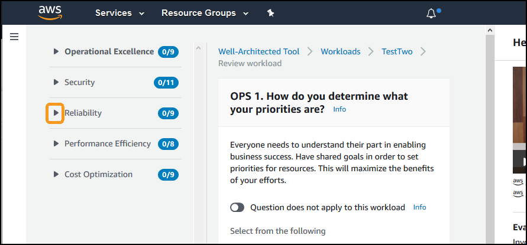
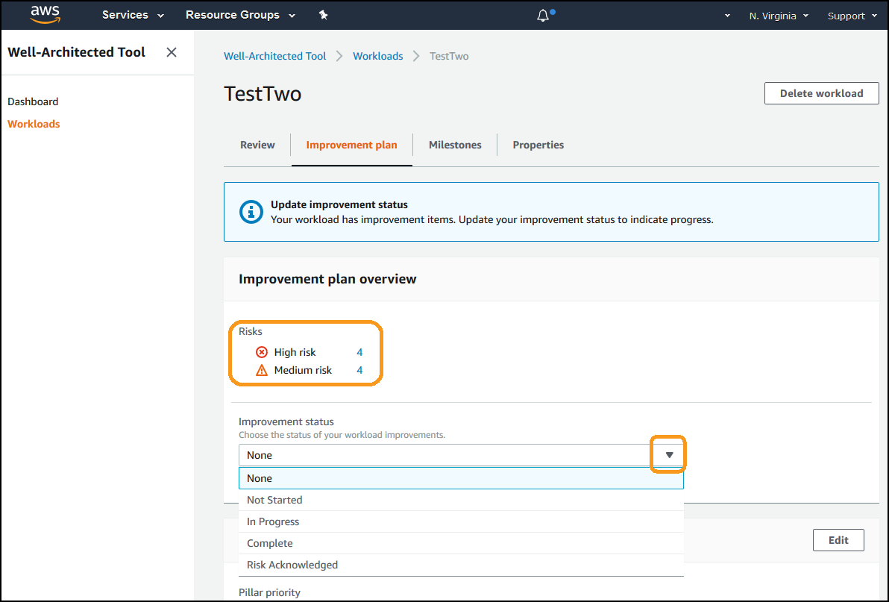
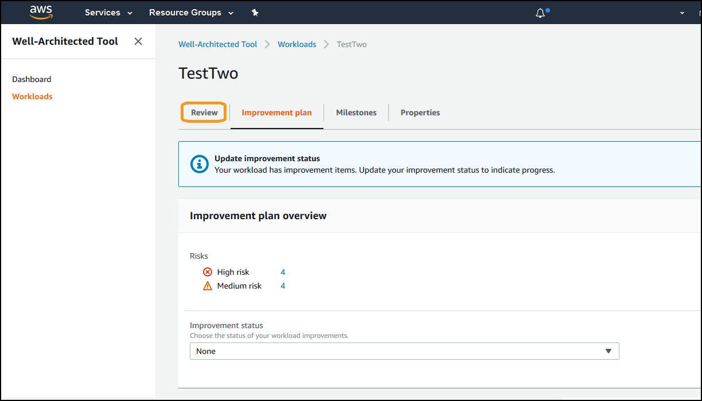
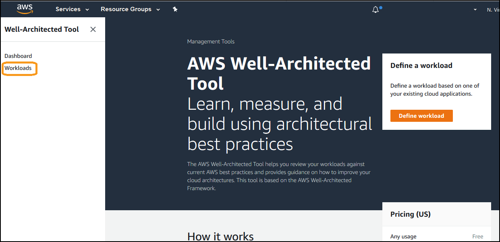

# Level 100: Walkthrough of the Well-Architected Tool

## Authors
- Rodney Lester, Reliability Lead, Well-Architected, AWS
# Table of Contents
1. [Navigating to the console](#nav_console)
2. [Creating a workload](#create_workload)
3. [Performing a review](#perform_review)
4. [Saving a milestone](#save_milestone)
5. [Viewing and downloading the report](#view_report) 
6. [Tear Down](#tear_down)

## 1. Navigating to the console 
The AWS Well-Architected Tool is in the AWS Console. You simply need to login to the console and navigate to the tool.
1. Sign in to the AWS Management Console as an IAM user with MFA enabled or in a federated Role, and open the Well-Architected console at [https://console.aws.amazon.com/wellarchitected/](https://console.aws.amazon.com/wellarchitected/).

2. If you are already in the console, click **Services** on the tool bar along the top of the console to bring up the service search. Start typing **Well Architected** into the search box and select the **AWS Well-Architected Tool**:  

## 2. Creating a workload 
Well-Architected Reviews are conducted per [workload](https://wa.aws.amazon.com/wat.concept.workload.en.html). A workload identifies a set of components that deliver business value. The workload is usually the level of detail that business and technology leaders communicate about.

1. Click the **Define Workload** button on the landing page:

2. If you had existing workloads, then you will land at the Workloads listing. In this interface, click the **Define Workload** button:

3. On the Define Workload interface, enter the necessary information:

- Name: Workload for AWS Workshop  
- Description: This is an example for the AWS Workshop  
- Industry Type: InfoTech  
- Industry: Internet  
- Environment: Select "Pre-production"  
- Regions: Select AWS Regions, and choose US West (Oregon)/us-west-2  

4. Click on the **Define workload** button:

## 3. Performing a review 
1. From the detail page for the workload, click the **Start review** button:
  

2. In this walkthrough, we are only going to complete the Reliability Pillar questions. Collapse the Operational Excellence questions by selecting the **collapsing icon** on the left of the words **Operation Excellence** on the left:

3. Expand the Reliability Questions by selecting the **expanding icon** to the left of the word **Reliability**:

4. Select the first question: **REL 1. How do you manage service limits?**

5. Answer the REL 1 to REL 9 questions as you understand your current ability. You can use the **Info** links to help you understand what the answers mean, and watch the video to get more context on the questions.

6. As you complete the question, select the **Next** Button at the bottom of the answers:

7. When you get to the last Reliability question, or the first Performance Pillar question, select **Save and Exit:** 

## 4. Saving a milestone 
1. From the detail page for the workload, click the **Save milestone button**:
  

2. Enter a name for the milestone as **AWS Workshop Milestone** and click the **Save** button:

3. Click on the **Milestones** tab:

4. This will display the milestone and data about it:

## 5. Viewing and downloading the report 
1. From the detail page for the workload, click the **Improvement Plan** tab:
  

2. This will display the number of high and medium risk items and allow you to update the Improvement status:

3. You can also edit the improvement plan configuration. Click on the **Edit** button next to the words **Improvement plan configuration**:

4. Move the **Reliability** Pillar up by clicking the up icon to the right of the word, **Reliability:**

5. Click the **Save** button to save this configuration:

6. Click on the **Review** tab to get the option to download the improvement plan:

7. Click the **Generate report** button to generate and download the report:

8. You can either open the file or save it to view it.

## 6. Tear down this lab 
In order to take down the lab environment, you simply delete the workload you created.
1. Select **Workloads** on the left navigation:

2. Select the radio button next to the **Workload for AWS Workshop** and then click the **Delete** button.

3. Confirm the deletion by clicking the **Delete** button on the dialog:

***

## References & useful resources:

***

## License

### Documentation License

Licensed under the [Creative Commons Share Alike 4.0](https://creativecommons.org/licenses/by-sa/4.0/) license.

### Code License
Licensed under the Apache 2.0 and MITnoAttr License. 

Copyright 2018 Amazon.com, Inc. or its affiliates. All Rights Reserved.

Licensed under the Apache License, Version 2.0 (the "License"). You may not use this file except in compliance with the License. A copy of the License is located at

    https://aws.amazon.com/apache2.0/

or in the "license" file accompanying this file. This file is distributed on an "AS IS" BASIS, WITHOUT WARRANTIES OR CONDITIONS OF ANY KIND, either express or implied. See the License for the specific language governing permissions and limitations under the License.
