# Level 100: AWS Account Setup: Lab Guide

## Authors
- Nathan Besh, Cost Lead Well-Architected
- Spencer Marley, Commercial Architect

## Feedback
If you wish to provide feedback on this lab, there is an error, or you want to make a suggestion, please email: costoptimization@amazon.com


# Table of Contents
1. [Configure IAM access](#IAM_access)
2. [Create an account structure](#account_structure)
3. [Configure account settings](#account_settings)
4. [Configure Cost and Usage reports](#CUR)
5. [Enable AWS Cost Explorer](#cost_explorer)
6. [Enable AWS-Generated Cost Allocation Tags](#cost_tags)
7. [Create a cost optimization team](#create_team)
8. [Tear down](#tear_down)
9. [Rate this Lab](#rate_lab) 


## 1. Configure IAM access to your billing<a name="IAM_access"></a>
**NOTE**: You will need to sign into the account with root account credentials to perform this action. You need to enter in the account email and password for root access.

You need to enable IAM access to your billing so the correct IAM users can access the information. This allows other users (non-root) to access billing information in the master account. It is also required if you wish for member accounts to see their usage and billing information. This step will not provide access to the information, that is configured through IAM policies.


1. Log in to your Master account as the root user, Click on the account name in the top right, and click on **My Account** from the menu:


2. Scroll down to **IAM User and Role Access to Billing Information**, and click **Edit**:


3. Select **Activeate IAM Access** and click on **Update**:


4. Confirm that **IAM user/role access to billing information is activated**:
 

You will now be able to provide access to non-root users to billing information via IAM policies.

**NOTE:** Logout as the root user before continuing.


## 2. Create an account structure<a name="account_structure"></a>
**NOTE**: Do NOT do this step if you already have an organization and consolidated billing setup.

You will create an AWS Organization, and join one or more accounts to the master account. An organization will allow you to centrally manage multilpe AWS accounts efficiently and consistently. It is recommended to have a master account that is primarily used for billing and does not contain any resources, all resources and workloads will reside in the member accounts. You will need organizations:CreateOrganization access, and 2 or more AWS accounts. When you create a new master account, it will contain all billing information for member accounts, member accounts will no longer have any billing information, including historical billing information.  Ensure you backup or export any reports or data.  

### 2.1 Create an AWS Organization
You will create an AWS Organization with the master account. 

1. Login to the AWS console as an IAM user with the required permissions, start typing *AWS Organizations* into the **Find Services** box and click on **AWS Organizations**:


2. Click on **Create organization**:


3. To create a fully featured organization, Click on **Create organization**


4. You will receive a verification email, click on **Verify your email address** to verify your account:


5. You will then see a verification message in the console for your organization:


You now have an organization that you can join other accounts to.

### 2.2 Join member accounts
You will now join other accounts to your organization.

1. From the AWS Organizations console click on **Add account**:


2. Click on **Invite account**:


3. Enter in the **Email or account ID**, enter in any relevant **Notes** and click **Invite**:


4. You will then have an open request:
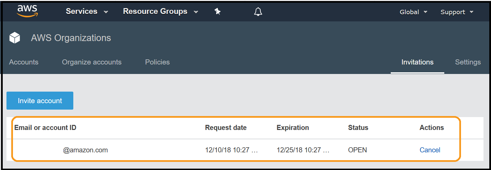

5. Log in to your **member account**, and go to **AWS Organizations**:


6. You will see an invitation in the menu, click on **Invitations**:


7. Verify the details in the request (they are blacked out here), and click on **Accept**: 


8. Verify the Organization ID (blacked out here), and click **Confirm**:


9. You are shown that the account is now part of your organization:


10. The member account will receive an email showing success:


11. The master account will also receive email notification of success:
 

Repeat the steps above (exercise 1.2) for each additional account in your organization. 


## 3. Configure billing account settings<a name="account_settings"></a>
It is important to ensure your account contacts are up to date and correct. This allows AWS to be able to contact the correct people in your organization if required. It is recommended to use a mailing list or shared email that is accessible by muptile team members for redudancy. Ensure the email accounts are actively monitored.

1. Log in to your Master account as an IAM user with the required permissions, Click on the account name in the top right, and click on **My Account** from the menu:


2. Scroll down to **Alternate Contacts** and click on **Edit**:


3. Enter information into each of the fields for **Billing**, **Operations** and **Security**, and click **Update**:


## 4. Configure Cost and Usage Reports<a name="CUR"></a>
Cost and Usage Reports provide the most detailed information on your usage and bills. They can be configured to deliver 1 line per resource, for every hour of the day. They must be configured to enable you to access and analyze your usage and billing information. This will allow you to make modifications to your usage, and make your applications more efficient.


### 4.1 Configure a Cost and Usage Report
If you configure multilpe Cost and Usage Reports (CURs), then it is recommended to have 1 CUR per bucket. If you **must** have multilpe CURs in a single bucket, ensure you use a different **report path prefix** so it is clear they are different reports.

1. Log in to your Master account as an IAM user with the required permissions, and go to the **Billing** console:
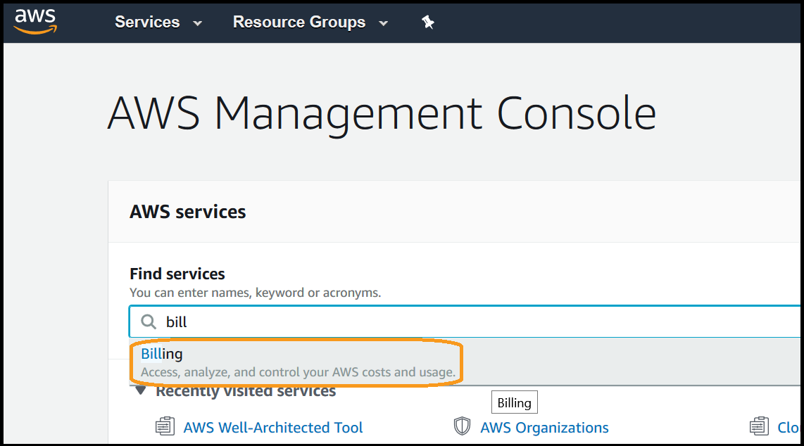 

2. Select **Cost & Usage Reports** from the left menu:
 

3. Click on **Create report**:
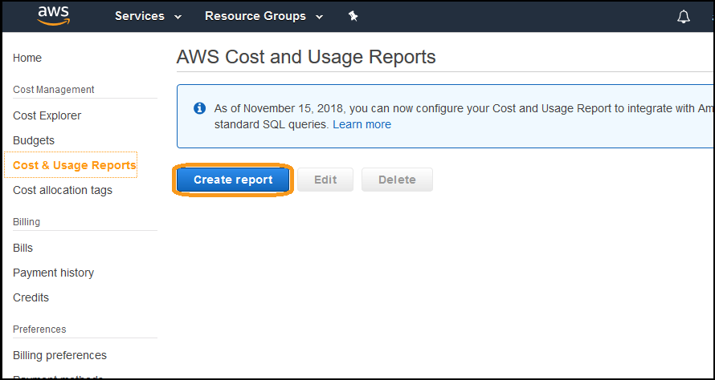

4. Enter a **Report name** (it can be any name), ensure you have selected **Include resource IDs** and **Data refresh settings**, then click on **Next**:


5. Click on **Configure**:


6. Enter a unique bucket name, and ensure the region is correct, click **Next**:
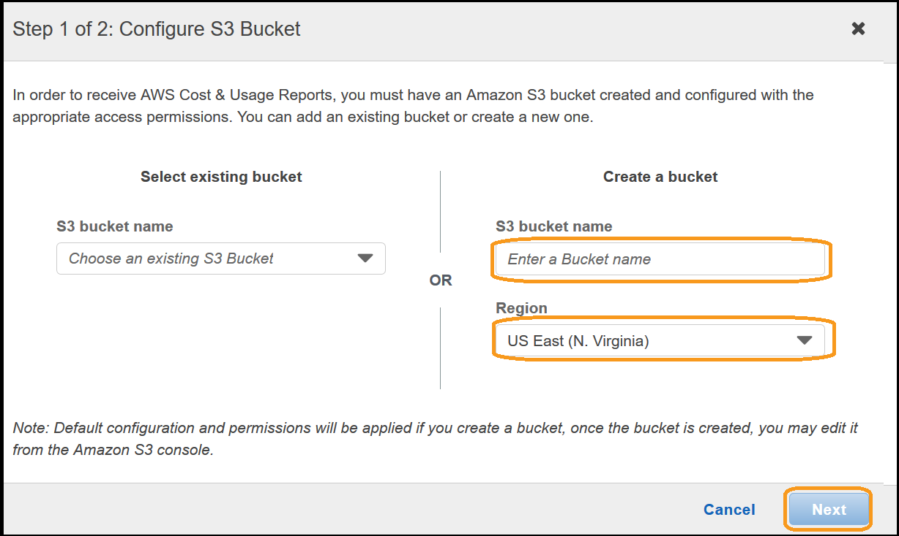

7. Read and verify the policy, this will allow AWS to deliver billing reports to the bucket. Click on **I have confirmed that this policy is correct**, then click **Save**:


8. Esure your bucket is a **Valid Bucket** (if not, verify the bucket policy). Enter a **Report path prefix** (it can be any word) without any '/' characters, ensure the **Time Granularity** is **Hourly**, **Report Versioning** is set to **Overwrite existing report**, under **Enable report data integration for** select **Amazon Athena**, and click **Next**:


9. Review the configuration, scroll to the bottom and click on **Review and Complete**:
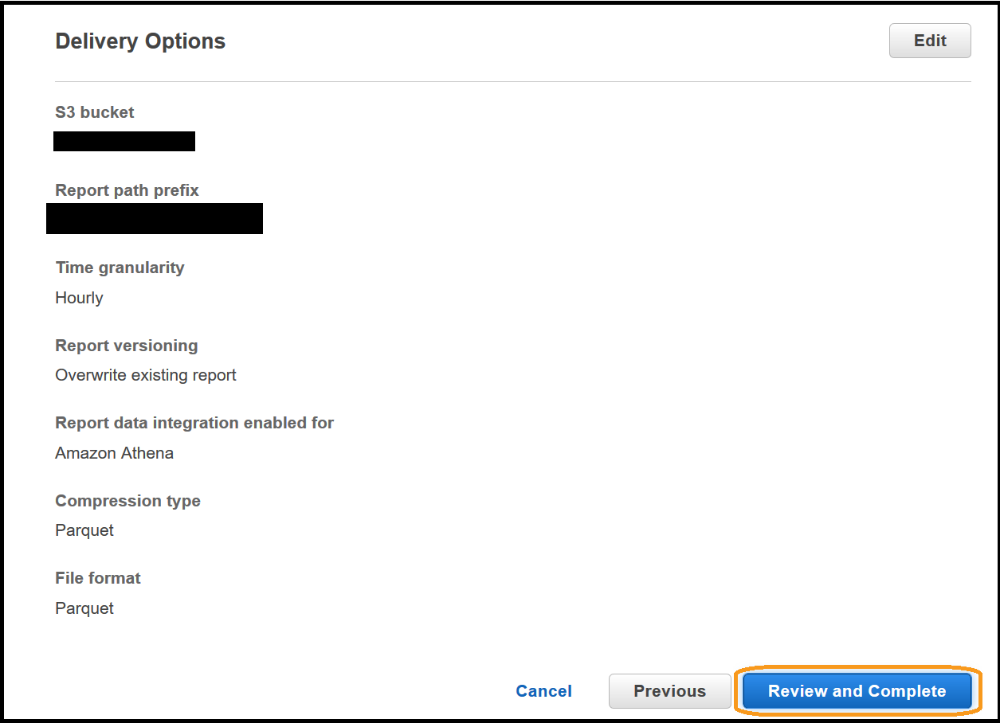

You have successfully configured a Cost and Usage Report to be delivered.  It may take up to 24hrs for the first report to be delivered.

### 4.2 Enable monthly billing report
The monthly billing report contains estimated AWS charges for the month. It contains line items for each unique combination of AWS product, usage type, and operation that the account uses.
**NOTE**: Billing files will only be delivered from the current month onwards. It will not generate previous months billing files.

1. Go to the billng console:


2. Click on **Billing preferences** from the left menu:


3. Scroll down, and click on **Receive Billing Reports**, then click on **Configure**:


4. From the left dropdown, select your S3 billing bucket configured above:


5. Click on **Next**:


6. Read and verify the policy, this will allow AWS to deliver billing reports to the bucket. Click on **I have confirmed that this policy is correct**, then click **Save**:


7. Ensure only **Monthly report** is selected, and uncheck all other boxes.  Click on **Save preferences**:


## 5. Enable AWS Cost Explorer<a name="cost_explorer"></a>
AWS Cost Explorer has an easy-to-use interface that lets you visualize, understand, and manage your AWS costs and usage over time. You must enable it before you can use it within your accounts.
 
1. Log in to your Master account as an IAM user with the required permissions, and go to the **Billing** console:


2. Select **Cost Explorer** from the left menu:


3. Click on **Enable Cost Explorer**:
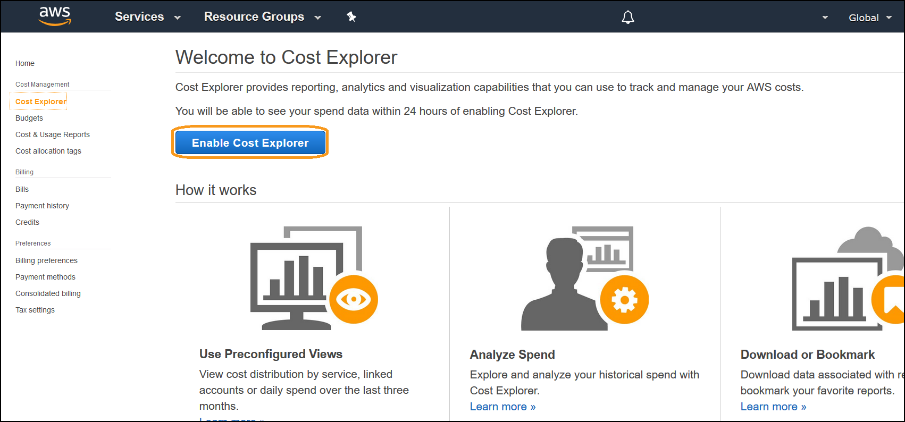

4. You will receive notification that Cost Explorer has been enabled, and data will be populated:
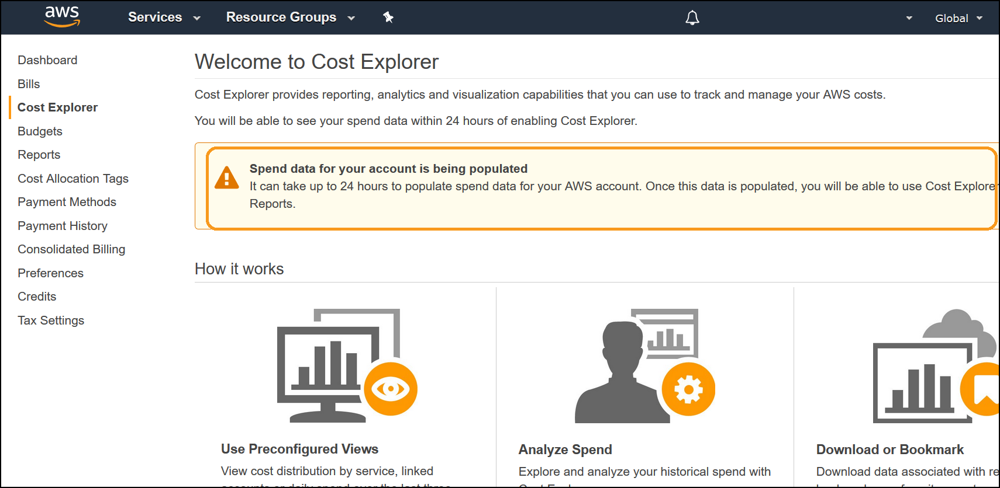


## 6. Enable AWS-Generated Cost Allocation Tags<a name="cost_tags"></a>
Enabling AWS-Generated Cost Allocation Tags, generates a cost allocation tag containing resource creator information that is automatically applied to resources that are created within your account. This allows you to view and allocate costs based on who created a resource. 

1. Log in to your Master account as an IAM user with the required permissions, and go to the **Billing** console:
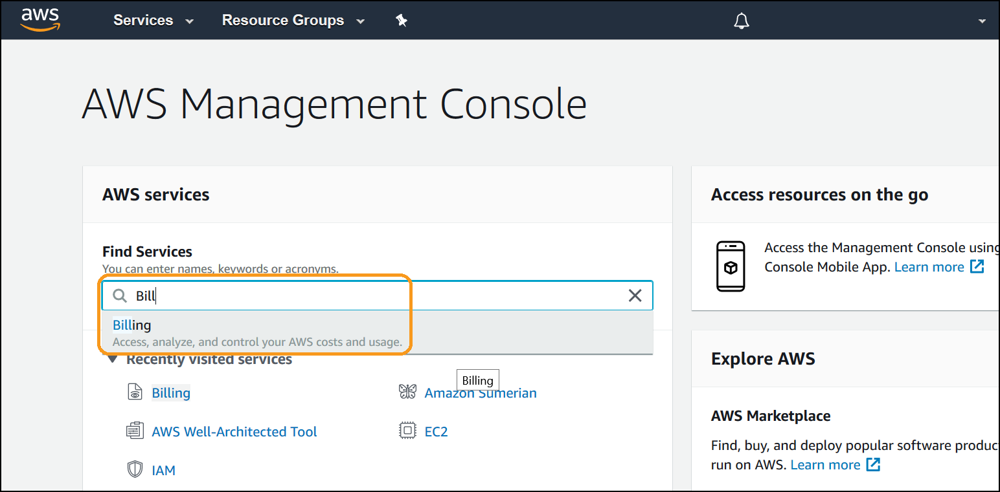

2. Select **Cost Allocation Tags** from the left menu:
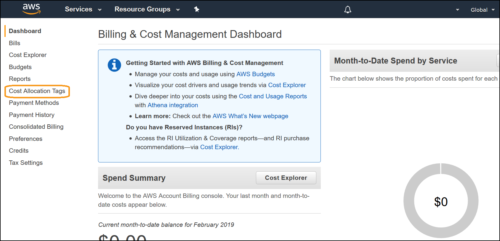

3. Click on **Activate** to enable the tags:
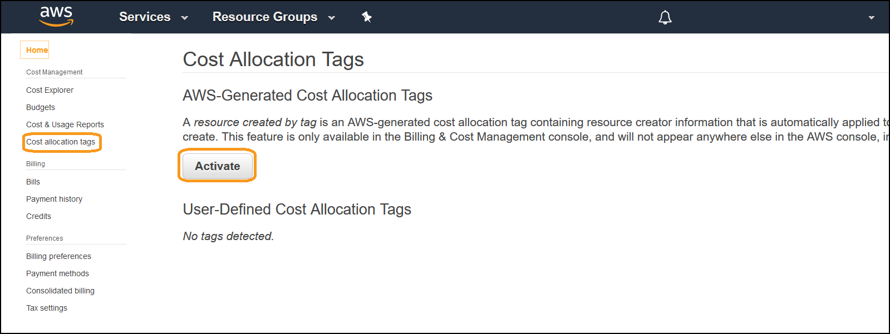

4. You will see that it is activated: 
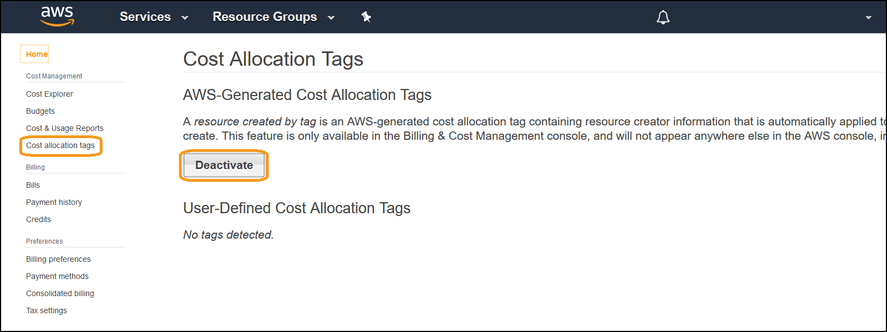


## 7. Create a cost optimization team <a name="create_team"></a>
We are going to create a cost optimization team within your master/payer account - which is where the billing information is. Within your organization there needs to be a team of people that are focused around costs and usage. This exercise will create the users and the group, then assign all the access they need.
This team will then be able to manage the organizations cost and usage, and start to implement optimization mechanisms.

Log into the console as an IAM user with the required permissions, as per:
- [./Code/IAM_policy](./Code/IAM_policy.md) IAM policy required for this lab
      
### 7.1 Create an IAM policy for the team
This provides access to allow the cost optimization team to perform their work, namely the Labs in the 100 level fundamental series. This is the minimum access the team requires.

1. Log in and go to the **IAM** Service page:


2. Select **Policies** from the left menu:


3. Select **Create Policy**:

  
4. Select the **JSON** tab:

  
5. Copy & paste the following policy into the the field:
**NOTE**: Ensure you copy the entire policy, everything including the first '{' and last '}'
```
{
    "Version": "2012-10-17",
    "Statement": [
        {
            "Sid": "VisualEditor0",
            "Effect": "Allow",
            "Action": [
                "aws-portal:ViewUsage",
                "aws-portal:ModifyBilling",
                "aws-portal:ViewBilling",
                "aws-portal:ViewAccount",
                "budgets:*"
            ],
            "Resource": "*"
        }
    ]
}
```
6. Click **Review policy**: 


7. Enter a **Name** and **Description** for the policy and click **Create policy**:


You have successfully created the cost optimization teams policy.
  
    
### 7.2 Create an IAM Group
This group will bring together IAM users and apply the required policies.

1. While in the IAM console, select **Groups** from the left menu:


2. Click on **Create New Group**:


3. Enter a **Group Name** and click **Next Step**:


4. Click **Policy Type** and select **Customer Managed**:


5. Select the **CostOptimization_Summit** policy (created previously):


6. Click **Create Group**:


You have now successfully created the cost optimization group, and attached the required policies.


### 7.3 Create an IAM User
For this lab we will create a user and join them to the group above.

1. In the IAM console, select **Users** from the left menu:


2. Click **Add user**:


3. Enter a **User name**, select **AWS Management Console access**, choose **Custom Password**, type a suitable password, deselect **Require password reset**, and click **Next: Permissions**:


4. Select the **CostOptimization** group (created previously), and click **Next: Tags**:


5. Click **Next Review**:


6. Click **Create user**:


7. Copy the link provided, and logout by clicking on your username in the top right, and selecting **Sign Out**::


8. Log back in as the username you just created, with the link you copied for the remainder of the Lab.


You have successfully create a user, placed them in the cost optimization group and have applied policies.
You can continue to expand this group by adding additional users from your organization.


## 8. Tear down<a name="tear_down"></a>  
This exercise covered fundamental steps that are recommended for all AWS accounts to enable Cost Optimization. There is no tear down for exercises in this lab.
Ensure you remove the IAM policies from the users/groups if they were used. 


## 9. Rate this lab<a name="rate_lab"></a>  
[](https://wellarchitectedlabs.com/Cost_100_1_1star) [](https://wellarchitectedlabs.com/Cost_100_1_2star) [](https://wellarchitectedlabs.com/Cost_100_1_3star) [](https://wellarchitectedlabs.com/Cost_100_1_4star) [](https://wellarchitectedlabs.com/Cost_100_1_5star) 

