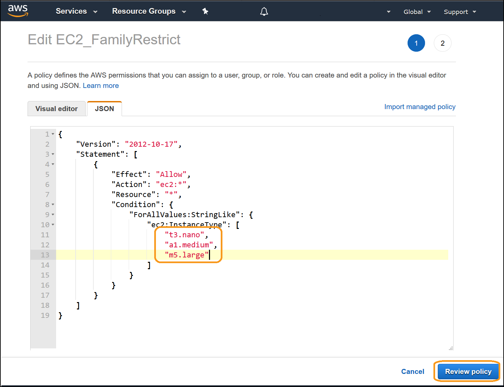

# Level 200: Cost and Usage Governance

## Introduction
 This hands-on lab will guide you through the steps to implement cost and usage governance. The skills you learn will help you control your cost and usage in alignment with your business requirements.
 

## Goals
- Create a Cost Optimization team to monitor usage, cost, and enforce policies
- Implement IAM Policies to control usage

## Prerequisites
- An AWS Account
- Completed all previous labs in the Cost Fundamentals series

## Permissions required
- [./Code/IAM_policy](./Code/IAM_policy.md) IAM policy required for this lab
- NOTE: There may be permission error messages during the lab, as the console may require additional privileges. These errors will not impact the lab, and we follow security best practices by implementing the minimum set of privileges required.
 
 

## [Start the Lab!](Lab_Guide.md)

 
  

## Best Practice Checklist 
- [ ] Create a cost optimizaion team, to manage cost optimization across your organization
- [ ] Create an IAM Policy to restrict EC2 usage by region
- [ ] Create an IAM Policy to restirct EC2 usage by family
- [ ] Extend an IAM Policy to restrict EC2 usage by instance size
- [ ] Create an IAM policy to restrict EBS Volume creation by volume type

***

## License
Licensed under the Apache 2.0 and MITnoAttr License.

Copyright 2018 Amazon.com, Inc. or its affiliates. All Rights Reserved.

Licensed under the Apache License, Version 2.0 (the "License"). You may not use this file except in compliance with the License. A copy of the License is located at

http://aws.amazon.com/apache2.0/

or in the "license" file accompanying this file. This file is distributed on an "AS IS" BASIS, WITHOUT WARRANTIES OR CONDITIONS OF ANY KIND, either express or implied. See the License for the specific language governing permissions and limitations under the License.
